# Koala-36M : A Large-scale Video Dataset Improving Consistency between Fine-grained Conditions and Video Content

Qiuheng Wang 1,3 \* Yukai Shi2,3\* Jiarong Ou3 Rui Chen3 Ke Lin3 Jiahao Wang3 3 Boyuan Jiang3 Haotian Yang3 Mingwu Zheng3 Xin Tao3 Fei Yang3† Pengfei Wan3 Di Zhang3 1 Shenzhen University 2 Tsinghua University Kuaishou Technology

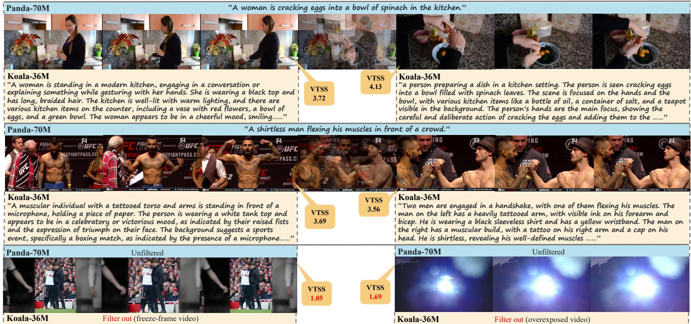  
Figure 1. Comparison between Koala-36M and Panda-70M. We propose a large-scale, high-quality dataset that significantly enhances the consistency between multiple conditions and video content. Koala-36M features more accurate temporal splitting, more detailed captions, and improved video filtering based on the proposed Video Training Suitability Score (VTSS).

## Abstract

With the continuous progress of visual generation technologies, the scale of video datasets has grown exponentially. The quality of these datasets plays a pivotal role in the performance of video generation models. We assert that temporal splitting, detailed captions, and video quality filtering are three crucial determinants of dataset quality. However, existing datasets exhibit various limitations in these areas. To address these challenges, we introduce Koala-36M , a large-scale, high-quality video dataset featuring accurate temporal splitting, detailed captions, and superior video quality. The essence of our approach lies in improving the consistency between fine-grained conditions and video content. Specifically, we employ a linear classifier on probability distributions to enhance the accuracy of transition detection, ensuring better temporal consistency. We then provide structured captions for the splitted videos, with an average length of 200 words, to improve text-video alignment. Additionally, we develop a Video Training Suitability Score (VTSS) that integrates multiple sub-metrics, allowing us to filter high-quality videos from the original corpus. Finally, we incorporate several metrics into the training process of the generation model, further refining the fine-grained conditions. Our experiments demonstrate the effectiveness of our data processing pipeline and the quality of the proposed Koala-36M dataset. Our dataset and code have been released at https://koala36m. github.io/.

## 1. Introduction

Generative AI, especially in video generation tasks, has recently captivated the attention of researchers. These tasks entail generating high - quality videos from textual descriptions or images. The quality of the datasets used for training is a decisive factor in the success of these models. Multiple open - source datasets, such as Panda - 70M[10], Mira-Data [14], OpenVid [22], and VidGen [27], have been introduced. Each of these datasets carefully selects data sources and applies diverse evaluation metrics for video filtering. Additionally, innovative methods, like the multi - modal caption model [10] or structured captions [14], have been utilized in the video captioning process.

Despite the success of the data processing pipelines introduced by previous datasets, we argue that the core challenge lies in establishing accurate and fine - grained conditioning for video data, which is crucial for both reducing the complexity of the training process and improving the quality of the generated outputs. To achieve this, we believe there are three key issues that need to be addressed:

First, the alignment between text and video semantics is essential. Unlike video question - answering tasks, where captions are primarily driven by specific question - based details, video generation requires captions that are directly tied to the visual content itself. Given the infinite granularity of visual signals, this demands captions that are rich and detailed. Moreover, raw video data often contains complex transitions, posing additional challenges in ensuring caption accuracy. Second, the effective evaluation and filtering of low - quality data remain underexplored. Low - quality video data, such as those with poor visual quality or excessive artificial effects, can impede the training process. However, accurately assessing and filtering such data presents an ongoing challenge. Existing methods typically rely on manually selected quality metrics and heuristic threshold - based filtering, which are often designed for other tasks and may not meet the specific requirements of video generation. Consequently, these approaches may not effectively guarantee the desired data quality for training.

Third, even with data filtering processes in place, the videos within the dataset still vary in quality, with each video potentially having different strengths and weaknesses (e.g., one video may have lower clarity but better aesthetic appeal). Training with such heterogeneous data in the same way may introduce ambiguity for the model, hampering its ability to learn effectively.

To address these issues, we present Koala-36M , a largescale high-quality video dataset with more accurate video splitting, detailed captions, better data filtering methods and metric conditions. As video content reaches considerable quality, the consistency between fine-grained conditions and video content determines the performance of generation models. Based on this crucial understanding, we propose a more sophisticated data processing pipeline. Since accurate video splitting leads to better temporal consistency, we first employ a linear classifier on probability distributions to enhance the accuracy of transition detection. Then we generate structured captions for the segmented video clips, with an average length of 200 words, to improve text-video alignment. Moreover, to prevent the accidental elimination of high-quality data during the filtering procedure, we train a network on human - curated datasets to predict the Video Training Suitability Score (VTSS). This network models the joint distribution of sub-metrics by taking videos and sub - metrics as inputs and outputs a single Video Training Suitability Score, which serves as the sole metric for data filtering. Additionally, we introduce data metrics as supplementary conditions (Metric Conditions) into the generation model during training. This enables the model to differentiate data of varying quality levels and further enhances the consistency between fine - grained conditions and video content, which results in better performance and controllability of the generation model.

To further validate the efficacy of Koala-36M and our data processing pipeline, we conduct training of video generation models on different datasets. Both the dataset benchmark and the performance of the video generation model demonstrate the advantage of the Koala-36M dataset. We perform more ablation studies to demonstrate effectiveness of our data processing pipeline.

Our contributions can be summarized as follows:

• We present a large-scale high-quality dataset called Koala-36M , with accurate video splitting, detailed captions and higher-quality video content.

• We propose a refined data processing pipeline to further improve the consistency between fine-grained conditions and video content, including transition detection methods, structured caption system, Video Training Suitability Score and metric conditions.

• Comprehensive experiments demonstrate the advantages of Koala-36M dataset and the effectiveness of our data processing pipeline.

## 2. Related Work

Recent progress in diffusion models has spurred the evolution of image generation models into video generation models. In the realm of text-to-video (T2V) generation, considerable efforts have been exerted to develop large-scale T2V models. These models are trained on extensive datasets, making use of traditional U-Net-based diffusion architectures [11, 12, 15, 38, 41] and Transformer - based (DiT) architectures [8, 9, 18, 19, 35]. The success of these video generation models is critically reliant on the quality of the video-text datasets.

## 2.1. Video datasets

While several video datasets [1, 5, 7, 24, 25, 29, 31, 36, 44] have been applied to tasks such as action recognition, video understanding, visual question answering (VQA), and video retrieval, there remains an urgent need for a high-quality, open-source dataset specifically tailored for training video generation models, providing rich video-text pairs. Datasets such as YouCook2 [44], VATEX [30], and ActivityNet [5] offer high-quality human caption annotations. Another set of datasets, including Miradata [14], VidGen-1M [27], and OpenVid-1M [22], automatically generate high-quality captions and filter data using manually selected thresholds on multiple dataset metrics.

However, these datasets are insufficient in size to support the training of large models. Datasets, including YT-Temporal-180M [40], HD-VILA-100M [37], ACAV [16], etc., contain hundreds of millions of video-text pairs, but their captions are automatically generated via speech recognition, leading to subpar quality. Panda70M [10], the largest publicly available video - text dataset, has gained popularity for video generation tasks owing to its scale and relatively good quality. Nevertheless, its quality still demands further enhancement. In particular, the captions in Panda - 70M frequently offer simplistic and incomplete descriptions of video content. Moreover, the frequent transitions in the training videos can cause semantic incoherence, potentially giving rise to undesirable or unpredictable transitions in the generated videos.

Table 1. Comparison of Koala-36M and pervious text-video datasets. Koala-36M is a video dataset that simultaneously possesses a large number of videos (over 10M) and high-quality finegrained captions (over 200 words). We propose structured captions and an expert model (Video Training Suitability Score) for accurate data filtering. ”TVL” and ”ATL” are abbreviations for ”Total Video Length” and ”Average Text Length”.
<table><tr><td>Dataset</td><td colspan="3">#VideosATL(words)TVL(hours)</td><td>Text</td><td>Filtering</td><td>Resolution</td></tr><tr><td>LSMDC [24]</td><td>118K</td><td>7.0</td><td>158</td><td>Manual</td><td>Sub-metrics</td><td>1080p</td></tr><tr><td>DiDeMo [1]</td><td>27K</td><td>8.0</td><td>87</td><td>Manual</td><td>Sub-metrics</td><td></td></tr><tr><td>YouCook2 [44]</td><td>14K</td><td>8.8</td><td>176</td><td>Manual</td><td>Sub-metrics</td><td></td></tr><tr><td>ActivityNet [5]</td><td>100K</td><td>13.5</td><td>849</td><td>Manual</td><td>Sub-metrics</td><td></td></tr><tr><td>MSR-VTT [36]</td><td>10K</td><td>9.3</td><td>40</td><td>Manual</td><td>Sub-metrics</td><td>240p</td></tr><tr><td>VATEX [30]</td><td>41K</td><td>15.2</td><td>~115</td><td>Manual</td><td>Sub-metrics</td><td></td></tr><tr><td>WebVid-10M [2]</td><td>10M</td><td>12.0</td><td>52K</td><td>Alt-Text</td><td>Sub-metrics</td><td>360p</td></tr><tr><td>HowTo100M [21]</td><td>136M</td><td>4.0</td><td>135K</td><td>ASR</td><td>Sub-metrics</td><td>240p</td></tr><tr><td>HD-VILA-100M [37] 103M</td><td></td><td>17.6</td><td>760.3K</td><td>ASR</td><td>Sub-metrics</td><td>720p</td></tr><tr><td>VidGen [27]</td><td>1M</td><td>89.3</td><td></td><td>Generated</td><td>Sub-metrics</td><td>720p</td></tr><tr><td>MiraData [14]</td><td>330K</td><td>318.0</td><td>16K</td><td>Generated &amp; Struct Sub-metrics</td><td></td><td>720p</td></tr><tr><td>Panda-70M [10]</td><td>70M</td><td>13.2</td><td>167K</td><td>Generated</td><td>Sub-metrics</td><td>720p</td></tr><tr><td>Koala-36M (Ours)</td><td>36M</td><td>202.1</td><td>172K</td><td>Generated &amp; StructExpert Model</td><td></td><td>720p</td></tr></table>

## 2.2. Video data curation

As models continuously expand in scale, effective data curation is of paramount importance [43], particularly in the formulation of a well-suited training dataset. This is crucial for enhancing model performance and improving training efficiency during both the pretraining and supervised fine-tuning phases. In the realm of large language models (LLMs), various data curation approaches have been proposed [20, 28, 34], including optimizations for data quantity, data quality, and domain composition. However, research on exploring data curation strategies within the video domain remains scarce. Stable Video Diffusion [3] offers a comprehensive review of the curation of large - scale video datasets, encompassing techniques such as video clipping, captioning, and filtering. Regrettably, the dataset is not open-source. In this study, we propose a novel data processing pipeline for video data and introduce a new video filtering metric. Distinct from traditional video quality assessment models [26, 32, 33, 42], which mainly concentrate on the aesthetic and technical aspects of a video, our approach places emphasis on the suitability of videos for training purposes.

## 3. Koala-36M Dataset

Koala-36M is a large-scale high-quality video dataset with accurate video splitting, detailed captions and higherquality video content. In summary, Koala-36M contains 36 million video clips with an average duration of 13.75 seconds and a resolution of 720p, each captioned by a text description averaging 202 words in length. We compare Koala-36M dataset with previous video datasets in Tab. 1. Koala-36M dataset simultaneously provides a large number of videos (over 10M) and high-quality fine-grained text captions (longer than 200 words), significantly improving the quality of large scale video datasets. Additionally, as shown in Fig. 2, we further compare Koala-36M with Panda-70M on a series of dataset metrics, such as aesthetic scores and clarity scores, demonstrating a significant improvement in consistency between fine-grained conditions and video content. Since these two datasets come from the same raw datasets, the superiority of Koala-36M dataset also prove the effectiveness of our data processing pipeline.

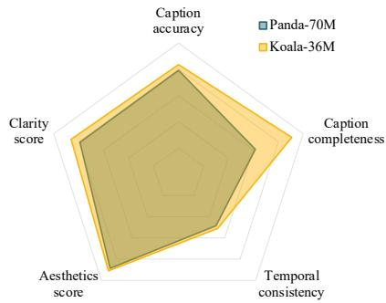  
Figure 2. Quantitative comparison with Panda-70M. Koala-36M has a significant improvement in the consistency between fine-grained conditions and video content.

## 4. Method

As shown in Fig. 3, we propose a refined data processing pipeline for Koala-36M dataset. Our pipeline aims to further improve the consistency between fine-grained conditions and video content. Our main contributions are highlighted in the red box of Fig. 3. Specifically, we start from the same raw data with Panda-70M [10] dataset. Firstly, in section 4.1, we propose a more precise and efficient transition detection approach for video segmentation. Subsequently, in section 4.2, we generate captions for the segmented videos, with an average length of 200 words, using our structured caption system. Next, in section 4.3, we train a Video Training Suitability Score (VTSS) for data filtering, aiming to prevent the inadvertent deletion of high - quality data. Finally, in section 4.4, we incorporate multiple data sub - metrics as Metric Conditions into the generation model to enrich the fine - grained conditions.

## 4.1. Video splitting

Splitting videos into temporal segments is crucial for creating video generation datasets. Transition-free video data enable more accurate alignment between text and video, while reducing the difficulty of model training and improving the temporal consistency of generated results. Existing video splitting techniques Pyscenedetect [6] typically detect transitions based on changes in image features between consecutive frames, relying on manually adjusted thresholds as criteria, but often overlook temporal information. As a result, these methods struggle to distinguish between gradual transitions and fast-motion scenes, leading to missed detections in the former and incorrect detections in the latter.

To tackle the aforementioned problems, we initially introduce a Color-Struct SVM (CSS) module. This module employs a learning-based strategy, enabling more precise detection of frame-to-frame changes compared to threshold-based methods. Subsequently, we utilize temporal smoothing and statistical features to distinguish between gradual transitions and fast-motion scenes.

We assume that transitions occur with a low probability at any given moment in the video. We treat image pairs from the same video source as negative examples and pairs from different video sources as positive examples. We select BGR histogram correlation to measure color distance and Canny Luminance SSIM to measure structural distance, which together measure inter-frame changes. For images $I _ { i }$ and $I _ { j }$ , the color distance $d _ { c o l o r }$ and structural distance $d _ { s t r u c t }$ are defined as follows:

$$
H _ { i } = \mathrm { H i s t o g r a m } ( b g r ( I _ { i } ) )\tag{1}
$$

$$
d _ { c o l o r } ( H _ { i } , H _ { j } ) = \frac { \sum _ { p } ( H _ { i } ( p ) - \bar { H } _ { i } ) ( H _ { j } ( p ) - \bar { H } _ { j } ) } { \sqrt { \sum _ { p } ( H _ { i } ( p ) - \bar { H } _ { i } ) ^ { 2 } ( H _ { j } ( p ) - \bar { H } _ { j } ) ^ { 2 } } }\tag{2}
$$

$$
E _ { i } = \operatorname* { m a x } ( \mathbf { G r a y } ( I _ { i } ) , \mathbf { C a n n y } ( \mathbf { G r a y } ( I _ { i } ) ) )\tag{3}
$$

$$
d _ { s t r u c t } ( E _ { i } , E _ { j } ) = \mathrm { S S I M } ( E _ { i } , E _ { j } )\tag{4}
$$

Then an SVM classifier is employed, using color distance $d _ { c o l o r }$ and structural distance $d _ { s t r u c t }$ as the relevant input features; see Eq. 1, Eq. 2, Eq. 3, Eq. 4 . Regarding temporal information, we hypothesize that video changes are relatively stable over time. By estimating a Gaussian distribution of changes from past frames, if the current frame’s change exceeds the 3σ confidence interval, we consider it a significant transition. This method enhances the differentiation between gradual transitions and fast-motion scenes without increasing computational load. Extensive experiments demonstrate the effectiveness of the transition detection method in A.

## 4.2. Video captioning

Detailed captions typically result in enhanced text - video consistency, which significantly influences the granularity of semantic responses. To obtain more detailed captions, we propose a structured caption system, which consists of: (1) the subject, (2) actions of the subject, (3) the environment in which the subject is located, (4) the visual language including style, composition, lighting, etc. (5) the camera language including camera movement, angles, focal length, shot sizes, etc. (6) world knowledge. We generate these aspects separately, and merge them as the final caption.

Similar to previous works [10, 14, 27], we first collect a caption dataset by using GPT-4V [23] to generate video captions based on our structured system. We then fine-tune a caption model based on LLaVA [17] for the entire dataset. Our experiments during fine-tuning show that training the vision encoder improves the accuracy of the caption. And a high-resolution vision encoder helps the caption model capture video details better. To alleviate the computationa burden caused by high-resolution inputs, we perform average pooling with a 2x2 kernel on the spatial dimensions of the tokens, ensuring minimal information loss. Notably, we implement a mixed training strategy involving both static images and dynamic videos, enabling the model to concurrently learn visual understanding in both static and dynamic scenarios. This also enhances data diversity, alleviating the issue of insufficient training samples when solely relying on video data.

Finally, we run our captioner on the whole dataset, and the distribution of caption lengths is shown in Fig. 4. Furthermore, we evaluate the quality of captions with caption accuracy and completeness. As shown in Fig. 2 and Tab. 1, our structured caption system significantly improve the quality of captions with better text-video consistency.

## 4.3. Data filtering

In the large-scale raw dataset, the quality of video content varies significantly. When the performance of the generation model hinges on videos with considerable content quality, it is both necessary and crucial to filter out low-quality data and retain high-quality data accurately. Traditional approaches typically utilize various sub-metrics to evaluate video quality and then manually set thresholds to filter the desired data. Since these sub-metrics are not completely orthogonal with each other, the video quality is actually a joint distribution of all sub-metrics, which means these thresholds should have implicit constraints with each other. However, existing methods neglect the joint distribution of sub-metrics, resulting in inaccurate thresholds. Meanwhile, since multiple thresholds need to be set, the cumulative effect of inaccurate threshold leads to larger deviations during filtering. Therefore, not only low-quality videos are not correctly filtered out in Fig. 1, but also high-quality videos are mistakenly deleted in Fig. 5. More analysis and experiments are shown in App. D.

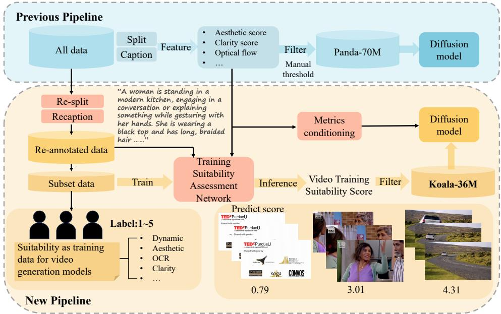

Figure 3. The proposed data processing pipeline. Compared with previous pipeline, we propose better splitting methods, structured caption system, training suitability assessment network and metrics conditioning in red box, improving the consistency between conditions and video content.  
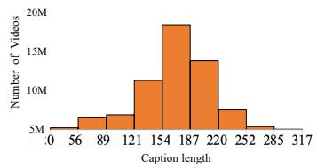  
Figure 4. Distribution of the caption length (in words) in Koala-36M dataset.

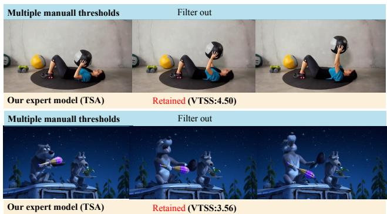  
Figure 5. The deleted high-quality data by inaccurate multiple manual thresholds.

To address this issue, we propose a Training Suitability Assessment Network (TSA) to model the joint distribution of sub-metrics. This network takes videos and sub-metrics as input, and outputs a single value called Video Training Suitability Score (VTSS) as the only metric to filter data. This score reflects whether a video is suitable for training purposes. Specifically, we first collect the training set from human evaluation based on a new criteria. Then we train the Training Suitability Assessment Network (TSA) and employ it to calculate VTSS for all videos. Finally, we set a single threshold for VTSS based on its distribution for filtering.

## 4.3.1. New criteria and human evaluation

We have defined a new annotation criterion that assigns a score reflecting whether a video is suitable as training data for video generation models. This criterion chiefly takes into account the following dimensions of video quality: Dynamic Quality: A high-quality video should exhibit good dynamics, which are evaluated based on two factors: the extent of subject movement and the temporal stability of the motion. The motion area in the video should cover more than 30% of the frame; otherwise, the score of the video will be decreased for insufficient dynamics. Temporal stability pertains the camera movement; non-professional videographers often produce videos with irregular and significant shaking. We decrease the scores of such videos to distinguish them from professional works. Static Quality: Each frame of a high-quality video should have rich subject details, reasonable composition, aesthetic appeal, clear and distinct subjects, and vividly saturated colors. Although this metric may involve some subjectivity, it is crucial for assessing the overall visual quality. Video Naturalness: We prefer videos that are natural and unprocessed. Special effects, transitions, subtitles, and logos can introduce biases in the original video distribution , making it harder for generation models to learn. Additionally, we consider the safety of the video content, rejecting videos with political, terrorist, violent, gory, or otherwise disturbing content. In order to reduce the bias between the labeled scores and the true scores, each video is labeled by 8 experts and subjected to a bias elimination process in the App B.

## 4.3.2. Training Suitability Assessment Network

As shown in Fig. 6, we propose a Training Suitability Assessment Network, which takes videos and sub-metrics as input, and outputs a single value called Video Training Suitability Score (VTSS). Aligned with the previously mentioned annotation criteria, our network is structured into dynamic and static branches. Furthermore, we maintain diverse data labels from conventional data filtering approaches and introduce this supplementary information to the network model as an additional branch. For the features of different branches, 3D Swin Transformer is employed as the backbone for the dynamic branch, while the ConvNext network for the static branch. To integrate the features from different branches, we propose a Weight Cross-Gating Block (WCGB) to incorporate the information from the label branch into the other two branches. Since the label branch inherently reflects various characteristics of the video, which are related to both dynamic and static features, we use label features to enhance the dynamic and static features. Given that different video labels focus on dynamic and static aspects to varying degrees, we learn a fusion weight to adjust the proportion of label features integrated with the two types of video features.

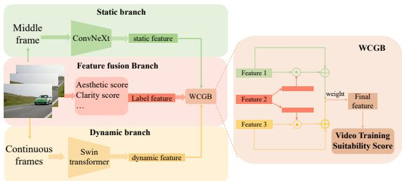  
Figure 6. Training Suitability Assessment Network.

After training Training Suitability Assessment Network on the human-aligned dataset, we employ it to predict Video Training Suitability Score (VTSS) for all videos, and obtain the score distribution as shown in Fig. 7. Since the VTSS distribution can roughly be divided into two Gaussian distributions, we simply chose the decomposition value 2.5 as the VTSS threshold. Based on this threshold, we filtered out a dataset containing a total of 36 million video clips with corresponding captions. We designate this dataset as Koala-36M , which is the final dataset we are presenting.

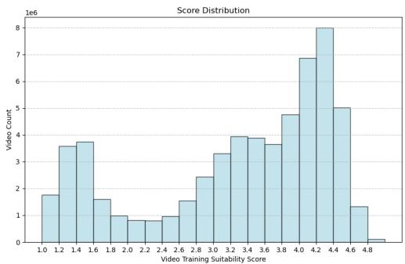  
Figure 7. The distribution of Video Training Suitability Score.

## 4.4. Metrics conditioning

In previous pipelines, data metrics are simply used for data filtering. Meanwhile, the quality of the filtered data still varied, making it difficult for the model to distinguish between high-quality and low-quality data. To address this issue, we propose a more fine-grained conditioning method to incorporate quality information of different videos into the generation model during the training phase, leading to better consistency between conditions and video content. During the inference stage, this method also enables fine-grained control over the generated videos.

Specifically, during video diffusion training, we first encode data metrics such as motion score, aesthetic score, and clarity score into frequency embeddings. Subsequently, frequency embeddings are passed through an MLP to obtain multiple embeddings, which are then directly added to the timestep embeddings and incorporated into the transformer block using Adaptive Layer Normalization (AdaLN). This method offers two main advantages. First, it does not increase the computational load of the diffusion model. Second, compared to adding conditions in captions like Opensora [39], it supports more precise control with higher sensitive to numerical scores, and posses a stronger ability to decouple control over different metrics. During the inference, we can set different feature scores, such as setting all scores to the highest value, to generate high-quality videos.

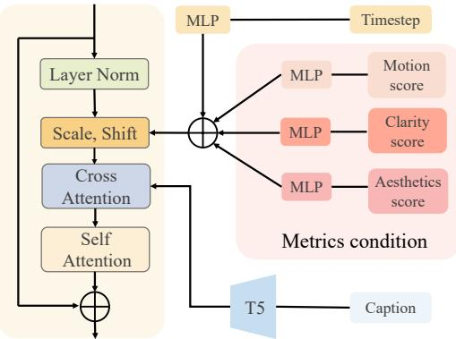  
Figure 8. The pipeline of metrics conditions.

Table 2. Quantitative results of text-to-video generation. We compare the performance of generation models trained on different datasets with VBench. The generation model trained on Koala-36M surpasses other models on both quality score and semantic score, with the highest total score.
<table><tr><td>VBench</td><td>Aesthetic Quality</td><td>Scene</td><td>Subject Consistency</td><td>Background Consistency</td><td>Temporal Flickering</td><td>Motion Smoothness</td><td>Dynamic Degree</td><td>Imaging Quality</td><td>Object Class</td><td>Multiple Objects</td></tr><tr><td>Panda-70M</td><td>0.3988</td><td>0.1106</td><td>0.8584</td><td>0.9435</td><td>0.9576</td><td>0.9742</td><td>0.7722</td><td>0.4250</td><td>0.3017</td><td>0.0223</td></tr><tr><td>Koala-w/o TSA</td><td>0.4808</td><td>0.2105</td><td>0.9335</td><td>0.9668</td><td>0.9857</td><td>0.9855</td><td>0.4222</td><td>0.5535</td><td>0.5453</td><td>0.1154</td></tr><tr><td>Koala-37M-manual</td><td>0.4683</td><td>0.2135</td><td>0.9388</td><td>0.9664</td><td>0.9810</td><td>0.9870</td><td>0.4028</td><td>0.5422</td><td>0.4858</td><td>0.1099</td></tr><tr><td>Koala-36M</td><td>0.4832</td><td>0.1994</td><td>0.9245</td><td>0.9613</td><td>0.9766</td><td>0.9851</td><td>0.5750</td><td>0.5585</td><td>0.4739</td><td>0.1145</td></tr><tr><td>Koala-w/o TSA (condition)</td><td>0.5272</td><td>0.3211</td><td>0.9162</td><td>0.9514</td><td>0.9210</td><td>0.9718</td><td>0.9833</td><td>0.5316</td><td>0.7734</td><td>0.2492</td></tr><tr><td>Koala-36M (condition)</td><td>0.5318</td><td>0.3163</td><td>0.9222</td><td>0.9554</td><td>0.9246</td><td>0.9768</td><td>0.9194</td><td>0.5344</td><td>0.7794</td><td>0.2953</td></tr><tr><td rowspan="2">VBench</td><td>Human</td><td></td><td>Spatial</td><td>Temporal</td><td>Appearance</td><td>Overall</td><td>Quality</td><td>Semantic</td><td>Total</td><td></td></tr><tr><td>Action</td><td>Color</td><td>Relationship</td><td>Style</td><td>Style</td><td>Consistency</td><td>Score</td><td>Score</td><td>Score</td><td></td></tr><tr><td>panda-70M</td><td>0.2400</td><td>0.5942</td><td>0.0482</td><td>0.1281</td><td>0.2014</td><td>0.1404</td><td>0.7343</td><td>0.3093</td><td>0.6493</td><td></td></tr><tr><td>Koala-w/o TSA</td><td>0.5180</td><td>0.8958</td><td>0.2168</td><td>0.1630</td><td>0.1971</td><td>0.1881</td><td>0.7758</td><td>0.4668</td><td>0.7140</td><td></td></tr><tr><td>Koala-37M-manual</td><td>0.4700</td><td>0.9128</td><td>0.1978</td><td>0.1589</td><td>0.2003</td><td>0.1893</td><td>0.7704</td><td>0.4548</td><td>0.7073</td><td></td></tr><tr><td>Koala-36M</td><td>0.4880</td><td>0.9172</td><td>0.1923</td><td>0.1571</td><td>0.1960</td><td>0.1850</td><td>0.7819</td><td>0.4504</td><td>0.7156</td><td></td></tr><tr><td>Koala-w/o TSA (condition)</td><td>0.8280</td><td>0.9106</td><td>0.2434</td><td>0.2039</td><td>0.2019</td><td>0.2277</td><td>0.7823</td><td>0.5874</td><td>0.7433</td><td></td></tr><tr><td>Koala-36M (condition)</td><td>0.8080</td><td>0.8960</td><td>0.2689</td><td>0.2045</td><td>0.2009</td><td>0.2279</td><td>0.7846</td><td>0.5915</td><td>0.7460</td><td></td></tr></table>

## 5. Experiments

## 5.1. Experiment Setting

To validate he superiority of Koala-36M dataset and the effectiveness of our data processing pipeline, we train the same generation model from scratch on different datasets for comparison. Our text-to-video base model is based on a Sora-like structure [4] with 3D-full attention transformer block. And each basic transformer block includes 2D selfattention, 3D self-attention, and text cross-attention. We use T5 for text embedding and 3D causal VAE for video compression. Since the training was done from scratch, we set the video duration to 2 seconds and the resolution to 256x256 for faster convergence. We train models on 80G A100 GPUs with a batch size of 32 and a learning rate of 0.0001. All models are trained on their respective datasets passing through 140M data samples in total. To evaluate the performance of generation models, we conduct a comprehensive evaluation on the public benchmark VBench [13]. Due to the domain gap between the captions provided by VBench and training set, we performed prompt expansion on the captions in VBench.

## 5.2. Quantitative Results

As shown in Tab. 2, we comprehensively evaluate models trained on Panda-70M and our dataset at the same step. The generation model trained on Koala-36M surpasses other models on both quality score and semantic score, with the highest total score. Furthermore, we visualize the VBench metrics comparison in Fig. 9. Koala-36M significantly improves the generation model’s performance on aesthetic quality, object class, multi-objects, human action, and color.

## 5.3. Qualitative Results

We visualize the generated videos on VBench’s prompts in Fig. 10. The generation model achieve the optimal performance on Koala-36M , with both the best video quality and text-video consistency. Koala-36M outperform the larger Panda-70M dataset with only 36M data, indicating that our data quality far exceeds that of Panda-70M. See G for more video generation results.

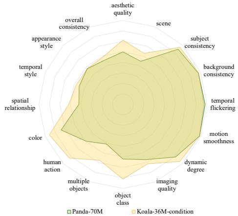  
Figure 9. Visualization of quantitative results of text-to-video generation. Koala-36M significantly improves the generation model’s performance on aesthetic quality, object class, multi objects, human action, and color.

## 5.4. Ablation Experiments

We conduct extensive ablation experiments to demonstrate the superiority of our dataset and the entire pipeline. Specifically, we performed ablation experiments on different data processing and training strategies, divided into the following groups: (1) Panda-70M: baseline. (2) Koala-w/o TSA: All 48M data without filtering after video splitting and captioning. (3) Koala-37M-manual: data filtered from all 48M data by manually multiple thresholds instead of VTSS. (4) Koala-36M: filtered dataset from Koala-w/o TSA using VTSS. (5) Koala-w/o TSA-condition: All 48M data without filtering but with metrics conditions. (6) Koala-36Mcondition: Koala-36M with metrics conditions.

Data Processing. Comparing the results of training from Panda-70M and Koala-w/o TSA in Tab. 2 and Fig. 10, we find that Koala-w/o TSA produce better results, especially in temporal quality, such as subject consistency, background consistency and temporal flickering. This indicates that our newly proposed re-splitting algorithm can more accurately segment transitions, reducing semantic inconsistencies between video segments. Additionally, our recaptioning algorithm provided more detailed video descriptions, making it easier for the model to learn the relationship between visual and textual information. To further demonstrate the superiority of our splitting and captioning methods, we conducted extensive experiments in the App. A.

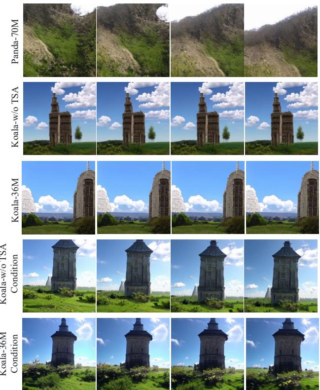

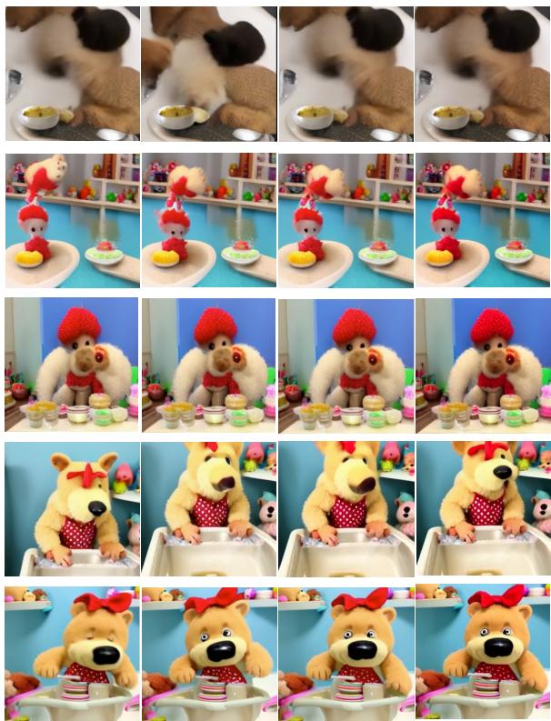  
Figure 10. Qualitative results of text-to-video generation. We train the same generation model from scratch on different datasets fo comparison. The generation model achieve the optimal performance on Koala-36M , with better video quality and text-video consistency.

Data Filtering. Comparing the results of training from Koala-w/o TSA and Koala-36M, Koala-w/o TSA-condition and Koala-36M-condition, we find that the results from the latter one perform better than that from the former datasets. This indicates that filtering out low-quality data and retaining high-quality data are necessary to prevent the model from learning biased distributions from low-quality data. In addition, comparing the results of training from Koala-37M-manual and Koala-36M, it can be concluded that our filtering method based on single VTSS results in better filtering performance, when more high-quality data and less low-quality data being retained. Extensive experiments of Training Suitability Assessment Network are in App. C.

Metrics conditions. Comparing the results of training from Koala-36M and Koala-36M-condition, the generation model shows significant improvements in video quality, when metrics conditions are injected into it. This indicates that guiding model training using sub-metrics is necessary, as it helps the model implicitly model the importance of different data. In addition, we compare our AdaLN-based injection method with text-encoder based method [39] in App. F Fig. 13. It can be discovered that our injection method has more precise control and stronger ability to decouple control over different metrics, when the style of videos transfer with the motion score.

## 6. Conclusion

In this paper, we present a large-scale high-quality dataset called Koala-36M , with accurate video splitting, detailed captions and higher quality video content. Koala-36M dataset is currently the only video dataset that simultaneously possesses a large number of videos (over 10M) and high-quality fine-grained text captions (longer than 200 words), significantly improving the quality of large scale video datasets. Additionally, we propose a refined data processing pipeline to further improve the consistency between fine-grained conditions and video content, including better transition detection method, structured caption system, and data filtering method and fine-grained conditioning.

Limitations. Despite all the strength above, Koala-36M is still insufficient to support the training of an extremely large video generation model with over 1B parameters. A larger-scale datasets need to be further collected and processed, which is remained as the future work.

## References

[1] Lisa Anne Hendricks, Oliver Wang, Eli Shechtman, Josef Sivic, Trevor Darrell, and Bryan Russell. Localizing moments in video with natural language. In Proceedings of the IEEE international conference on computer vision, pages 5803–5812, 2017. 2, 3

[2] Max Bain, Arsha Nagrani, Gul Varol, and Andrew Zisser-¨ man. Frozen in time: A joint video and image encoder for end-to-end retrieval. In Proceedings of the IEEE/CVF international conference on computer vision, pages 1728–1738, 2021. 3

[3] Andreas Blattmann, Tim Dockhorn, Sumith Kulal, Daniel Mendelevitch, Maciej Kilian, Dominik Lorenz, Yam Levi, Zion English, Vikram Voleti, Adam Letts, et al. Stable video diffusion: Scaling latent video diffusion models to large datasets. arXiv preprint arXiv:2311.15127, 2023. 3

[4] Tim Brooks, Bill Peebles, Connor Holmes, Will DePue, Yufei Guo, Li Jing, David Schnurr, Joe Taylor, Troy Luhman, Eric Luhman, Clarence Ng, Ricky Wang, and Aditya Ramesh. Video generation models as world simulators, 2024. 7

[5] Fabian Caba Heilbron, Victor Escorcia, Bernard Ghanem, and Juan Carlos Niebles. Activitynet: A large-scale video benchmark for human activity understanding. In Proceedings of the ieee conference on computer vision and pattern recognition, pages 961–970, 2015. 2, 3

[6] Brandon Castellano. Pyscenedetect. 4, 11

[7] Haoxin Chen, Menghan Xia, Yingqing He, Yong Zhang, Xiaodong Cun, Shaoshu Yang, Jinbo Xing, Yaofang Liu, Qifeng Chen, Xintao Wang, et al. Videocrafter1: Open diffusion models for high-quality video generation. arXiv preprint arXiv:2310.19512, 2023. 2

[8] Shoufa Chen, Mengmeng Xu, Jiawei Ren, Yuren Cong, Sen He, Yanping Xie, Animesh Sinha, Ping Luo, Tao Xiang, and Juan-Manuel Perez-Rua. Gentron: Delving deep into diffusion transformers for image and video generation. arXiv preprint arXiv:2312.04557, 2023. 2

[9] Shoufa Chen, Mengmeng Xu, Jiawei Ren, Yuren Cong, Sen He, Yanping Xie, Animesh Sinha, Ping Luo, Tao Xiang, and Juan-Manuel Perez-Rua. Gentron: Diffusion transformers for image and video generation. In Proceedings of the IEEE/CVF Conference on Computer Vision and Pattern Recognition, pages 6441–6451, 2024. 2

[10] Tsai-Shien Chen, Aliaksandr Siarohin, Willi Menapace, Ekaterina Deyneka, Hsiang-wei Chao, Byung Eun Jeon, Yuwei Fang, Hsin-Ying Lee, Jian Ren, Ming-Hsuan Yang, et al. Panda-70m: Captioning 70m videos with multiple cross-modality teachers. In Proceedings of the IEEE/CVF Conference on Computer Vision and Pattern Recognition, pages 13320–13331, 2024. 2, 3, 4

[11] Kevin Clark and Priyank Jaini. Text-to-image diffusion models are zero shot classifiers. Advances in Neural Information Processing Systems, 36, 2024. 2

[12] Songwei Ge, Seungjun Nah, Guilin Liu, Tyler Poon, Andrew Tao, Bryan Catanzaro, David Jacobs, Jia-Bin Huang, Ming-Yu Liu, and Yogesh Balaji. Preserve your own correlation: A noise prior for video diffusion models. In Proceedings

of the IEEE/CVF International Conference on Computer Vi sion, pages 22930–22941, 2023. 2

[13] Ziqi Huang, Yinan He, Jiashuo Yu, Fan Zhang, Chenyang Si, Yuming Jiang, Yuanhan Zhang, Tianxing Wu, Qingyang Jin, Nattapol Chanpaisit, et al. Vbench: Comprehensive benchmark suite for video generative models. arXiv preprint arXiv:2311.17982, 2023. 7

[14] Xuan Ju, Yiming Gao, Zhaoyang Zhang, Ziyang Yuan, Xintao Wang, Ailing Zeng, Yu Xiong, Qiang Xu, and Ying Shan. Miradata: A large-scale video dataset with long durations and structured captions. arXiv preprint arXiv:2407.06358, 2024. 2, 3, 4

[15] Levon Khachatryan, Andranik Movsisyan, Vahram Tadevosyan, Roberto Henschel, Zhangyang Wang, Shant Navasardyan, and Humphrey Shi. Text2video-zero: Textto-image diffusion models are zero-shot video generators. In Proceedings of the IEEE/CVF International Conference on Computer Vision, pages 15954–15964, 2023. 2

[16] Sangho Lee, Jiwan Chung, Youngjae Yu, Gunhee Kim, Thomas Breuel, Gal Chechik, and Yale Song. Acav100m: Automatic curation of large-scale datasets for audio-visual video representation learning. In Proceedings of the IEEE/CVF International Conference on Computer Vision, pages 10274–10284, 2021. 3

[17] Haotian Liu, Chunyuan Li, Qingyang Wu, and Yong Jae Lee. Visual instruction tuning, 2023. 4

[18] Haoyu Lu, Guoxing Yang, Nanyi Fei, Yuqi Huo, Zhiwu Lu, Ping Luo, and Mingyu Ding. Vdt: General-purpose video diffusion transformers via mask modeling. arXiv preprint arXiv:2305.13311, 2023. 2

[19] Xin Ma, Yaohui Wang, Gengyun Jia, Xinyuan Chen, Ziwei Liu, Yuan-Fang Li, Cunjian Chen, and Yu Qiao. Latte: Latent diffusion transformer for video generation. arXiv preprint arXiv:2401.03048, 2024. 2

[20] Adyasha Maharana, Prateek Yadav, and Mohit Bansal. D2 pruning: Message passing for balancing diversity and difficulty in data pruning. arXiv preprint arXiv:2310.07931, 2023. 3

[21] Antoine Miech, Dimitri Zhukov, Jean-Baptiste Alayrac, Makarand Tapaswi, Ivan Laptev, and Josef Sivic. Howto100m: Learning a text-video embedding by watching hundred million narrated video clips. In ICCV, 2019. 3

[22] Kepan Nan, Rui Xie, Penghao Zhou, Tiehan Fan, Zhenheng Yang, Zhijie Chen, Xiang Li, Jian Yang, and Ying Tai. Openvid-1m: A large-scale high-quality dataset for text-tovideo generation. arXiv preprint arXiv:2407.02371, 2024. 2, 3

[23] OpenAI. Gpt-4v(ision) system card, 2023. 4

[24] Anna Rohrbach, Marcus Rohrbach, Niket Tandon, and Bernt Schiele. A dataset for movie description. In Proceedings of the IEEE conference on computer vision and pattern recognition, pages 3202–3212, 2015. 2, 3

[25] Ramon Sanabria, Ozan Caglayan, Shruti Palaskar, Desmond Elliott, Lo¨ıc Barrault, Lucia Specia, and Florian Metze. How2: a large-scale dataset for multimodal language under standing. arXiv preprint arXiv:1811.00347, 2018. 2

[26] Wei Sun, Haoning Wu, Zicheng Zhang, Jun Jia, Zhichao Zhang, Linhan Cao, Qiubo Chen, Xiongkuo Min, Weisi

Lin, and Guangtao Zhai. Enhancing blind video quality assessment with rich quality-aware features. arXiv preprint arXiv:2405.08745, 2024. 3

[27] Zhiyu Tan, Xiaomeng Yang, Luozheng Qin, and Hao Li. Vidgen-1m: A large-scale dataset for text-to-video generation. arXiv preprint arXiv:2408.02629, 2024. 2, 3, 4

[28] Kushal Tirumala, Daniel Simig, Armen Aghajanyan, and Ari Morcos. D4: Improving llm pretraining via document deduplication and diversification. Advances in Neural Information Processing Systems, 36:53983–53995, 2023. 3

[29] Wenjing Wang, Huan Yang, Zixi Tuo, Huiguo He, Junchen Zhu, Jianlong Fu, and Jiaying Liu. Videofactory: Swap attention in spatiotemporal diffusions for text-to-video generation. arXiv preprint arXiv:2305.10874, 2023. 2

[30] Xin Wang, Jiawei Wu, Junkun Chen, Lei Li, Yuan-Fang Wang, and William Yang Wang. Vatex: A large-scale, highquality multilingual dataset for video-and-language research. In Proceedings of the IEEE/CVF international conference on computer vision, pages 4581–4591, 2019. 3

[31] Yi Wang, Yinan He, Yizhuo Li, Kunchang Li, Jiashuo Yu, Xin Ma, Xinhao Li, Guo Chen, Xinyuan Chen, Yaohui Wang, et al. Internvid: A large-scale video-text dataset for multimodal understanding and generation. arXiv preprint arXiv:2307.06942, 2023. 2

[32] Haoning Wu, Chaofeng Chen, Jingwen Hou, Liang Liao, Annan Wang, Wenxiu Sun, Qiong Yan, and Weisi Lin. Fastvqa: Efficient end-to-end video quality assessment with fragment sampling. In European conference on computer vision, pages 538–554. Springer, 2022. 3

[33] Haoning Wu, Erli Zhang, Liang Liao, Chaofeng Chen, Jingwen Hou, Annan Wang, Wenxiu Sun, Qiong Yan, and Weisi Lin. Exploring video quality assessment on user generated contents from aesthetic and technical perspectives. In Proceedings of the IEEE/CVF International Conference on Computer Vision, pages 20144–20154, 2023. 3

[34] Sang Michael Xie, Shibani Santurkar, Tengyu Ma, and Percy S Liang. Data selection for language models via importance resampling. Advances in Neural Information Processing Systems, 36:34201–34227, 2023. 3

[35] Zhen Xing, Qi Dai, Han Hu, Zuxuan Wu, and Yu-Gang Jiang. Simda: Simple diffusion adapter for efficient video generation. In Proceedings of the IEEE/CVF Conference on Computer Vision and Pattern Recognition, pages 7827– 7839, 2024. 2

[36] Jun Xu, Tao Mei, Ting Yao, and Yong Rui. Msr-vtt: A large video description dataset for bridging video and language. In Proceedings ofthe IEEE conference on computer vision and pattern recognition, pages 5288–5296, 2016. 2, 3

[37] Hongwei Xue, Tiankai Hang, Yanhong Zeng, Yuchong Sun, Bei Liu, Huan Yang, Jianlong Fu, and Baining Guo. Advancing high-resolution video-language representation with large-scale video transcriptions. In Proceedings of the IEEE/CVF Conference on Computer Vision and Pattern Recognition, pages 5036–5045, 2022. 3

[38] Sihyun Yu, Kihyuk Sohn, Subin Kim, and Jinwoo Shin. Video probabilistic diffusion models in projected latent space. In Proceedings ofthe IEEE/CVF conference on com-

puter vision and pattern recognition, pages 18456–18466, 2023. 2

[39] Zheng Zangwei, Peng Xiangyu, Li Shenggui, Liu Hongx ing, Zhou Yukun, Li Tianyi, Peng Xiangyu, Zheng Zangwei, Shen Chenhui, Young Tom, Wang Junjie, and Yu Chenfeng. Opensora, 2024. 6, 8

[40] Rowan Zellers, Ximing Lu, Jack Hessel, Youngjae Yu, Jae Sung Park, Jize Cao, Ali Farhadi, and Yejin Choi. Merlot: Multimodal neural script knowledge models. Advances in neural information processing systems, 34:23634–23651, 2021. 3

[41] Yan Zeng, Guoqiang Wei, Jiani Zheng, Jiaxin Zou, Yang Wei, Yuchen Zhang, and Hang Li. Make pixels dance: High dynamic video generation. In Proceedings of the IEEE/CVF Conference on Computer Vision and Pattern Recognition, pages 8850–8860, 2024. 2

[42] Kai Zhao, Kun Yuan, Ming Sun, and Xing Wen. Zoomvqa: Patches, frames and clips integration for video quality assessment. In Proceedings of the IEEE/CVF Conference on Computer Vision and Pattern Recognition, pages 1302– 1310, 2023. 3

[43] Daquan Zhou, Kai Wang, Jianyang Gu, Xiangyu Peng, Dongze Lian, Yifan Zhang, Yang You, and Jiashi Feng. Dataset quantization. In Proceedings of the IEEE/CVF In ternational Conference on Computer Vision, pages 17205– 17216, 2023. 3

[44] Luowei Zhou, Chenliang Xu, and Jason Corso. Towards automatic learning of procedures from web instructional videos. In Proceedings ofthe AAAI Conference on Artificial Intelligence, 2018. 2, 3