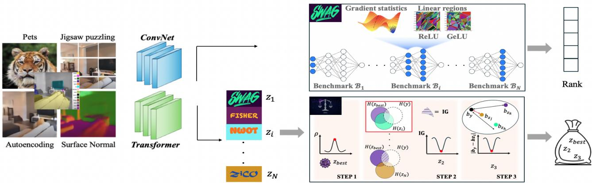
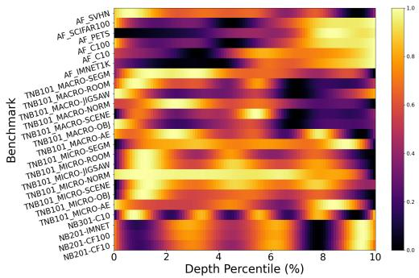
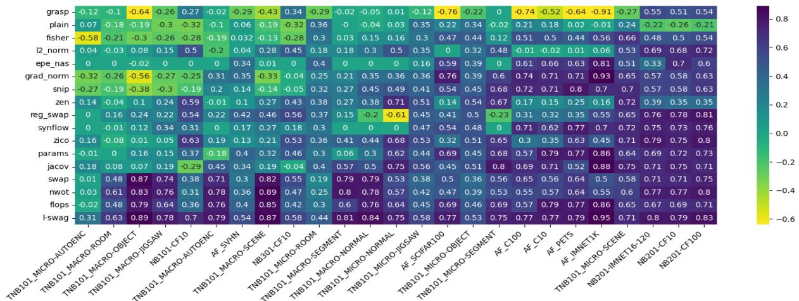
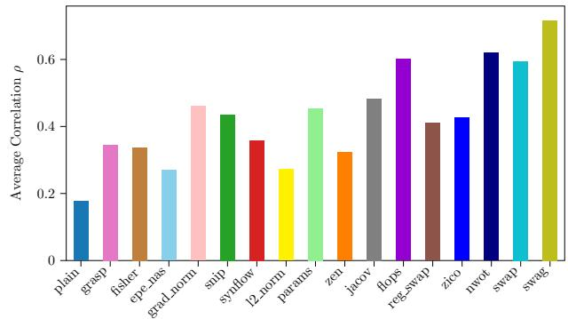

# L-SWAG: Layer-Sample Wise Activation with Gradients information for Zero-Shot NAS on Vision Transformers

Sofia Casarin1, Sergio Escalera2,3, Oswald Lanz1   
1Free University of Bozen-Bolzano, Bolzano, Italy 2Computer Vision Center, Barcelona, Spain 3Universitat de Barcelona, Barcelona, Spain

scasarin@unibz.it, sergio@maia.ub.es, lanz@inf.unibz.it

## Abstract

Training-free Neural Architecture Search (NAS) efficiently identifies high-performing neural networks using zero-cost (ZC) proxies. Unlike multi-shot and one-shot NAS approaches, ZC-NAS is both (i) time-efficient, eliminating the need for model training, and (ii) interpretable, with proxy designs often theoretically grounded. Despite rapid developments in thefield, current SOTA ZC proxies are typically constrained to well-established convolutional search spaces. With the rise of Large Language Models shaping the future of deep learning, this work extends ZC proxy applicability to Vision Transformers (ViTs). We present a new benchmark using the Autoformer search space evaluated on 6 distinct tasks and propose Layer-Sample Wise Activation with Gradients information (L-SWAG), a novel, generalizable metric that characterizes both convolutional and transformer architectures across 14 tasks. Additionally, previous works highlighted how different proxies contain complementary information, motivating the needfor a ML model to identify useful combinations. To further enhance ZC-NAS, we therefore introduce LIBRA-NAS (Low Information gain and Bias Re-Alignment), a method that strategically combines proxies to best represent a specific benchmark. Integrated into the NAS search, LIBRA-NAS outperforms evolution and gradient-based NAS techniques by identifying an architecture with a 17.0% test error on ImageNet1k in just 0.1 GPU days.

## 1. Introduction

Neural Architecture Search (NAS) optimizes neural networks for a given task and constraint replacing the costly trial and error design process [56]. Over the course of the years, it has gained attention for its ability to discover better performing and more efficient neural networks compared to hand-crafted ones [16, 29, 30, 37, 39, 45, 48]. With the advent of Large Language Models (LLM)s ruling the deep learning world with high accuracy, NAS is not seen anymore as a na¨ıve tool for boosting performance. It finds important applicability in real-world scenarios with hardwareaware models requiring pruning, different resource constraints, and memory footprint optimization [27].

Despite its advantages, the major drawback of NAS usually resides in the computationally demanding search process. The first proposed multi-shot NAS methods involved training multiple candidate networks, requiring up to 28 days on 800 GPUs [56]. Subsequent one-shot approaches accelerated NAS by sharing candidate operations through a super-network ([4, 5, 8, 12, 50, 52]). Weight-sharing ([6, 11, 17, 40]) further advanced by sharing also the parameters across different operations, improving memory efficiency. Although the differentiable process reduced optimization time to a few GPU hours for tasks like Cifar-10, full training of the super-network is still required. Predictorbased methods remove the training of neural networks, avoiding the main drawbacks of heavy time and GPU resource consumption. They achieve highly accurate performance estimation ([29, 32]), but still require training the predictor [15, 44] over a NAS benchmark obtained through a costly data collection step constituted of thousands of networks trained until convergence.

Zero-shot NAS methods therefore emerged with the promise of fully removing the data collection step by characterizing Deep Neural Networks (DNNs) through proxy metrics, an estimate of the performance of DNNs based on heuristic and theoretical results. This paper focuses on zero-shot NAS, which as pointed out in [27], brings two major advantages: (i) time efficiency, as model training is eliminated, and (ii) interpretability, as the design of a proxy metric is usually inspired by some theoretical analysis of DNNs which helps in understanding the reason for their success. Since the first proposed metric [2], many proxies have been introduced in the literature. They usually characterize neural networks under three principles:

(i) trainability ([25, 26, 54]), (ii) generalization [10, 18], and (iii) expressivity ([2, 28, 33, 36]). Most recent works often propose new metrics grounded in either theoretical frameworks [2, 7, 34] or heuristic approaches [33, 55]. This frequently results in a large variety of metrics that leave unclear the reasons for their effectiveness. Moreover, despite a few efforts [22], these proxies are often evaluated on different setups, hindering their true contribution and relations with respect to the state-of-the-art. Evaluation is typically performed on a few search spaces (e.g., NAS Bench201 [13]), which provides limited insight since most metrics show strong correlation results within these spaces.

Therefore, different from other studies, we first of all test all existing metrics under the same setup and include in our analysis the ViT search space. Our first goal is to expand the scope of applicability of proxy metrics, opening the road to nowadays topics, like video understanding, which could be addressed with ViTs. Our experiments reveal that in the ViT search space, many ZC-proxies struggle to outperform basic metrics like # Parameters. In response, we introduce the Layer Sample-Wise Activation with Gradients (L-SWAG) metric, which not only surpasses # Parameters on the ViT search space but also outperforms existing metrics across several benchmarks, including the challenging TransNasBench [14], where most other metrics fall short. To properly handle the different characteristics of search-spaces we developed Low Information Gain and Bias Re-alignment (LIBRA)-NAS, a novel ensemble algorithm. Observations indicate that certain search spaces may favor gradient-based metrics, while others are better suited to gradient-free ones. Some metrics tend to introduce a strong bias toward cell size, while others penalize networks that converge quickly. Additionally, different proxy metrics often contain complementary information highly dependent on the chosen benchmark [22]. This phenomenon motivates the need for a ML model that can identify effective combinations of proxy metrics based on the specific requirements of each benchmark. To summarize, our contributions are:

• We train and evaluate 2000 ViT architectures on six different tasks, and evaluate all existing ZC-proxy metrics on this new benchmark, adapting metrics formulated only for ReLU networks also to GeLU ones.

• We present L-SWAG metric, which captures a layer-wise trainability and expressivity of DNNs and positively correlates on the ViT search space, improving state-of-the-art Spearman ρ correlation on several benchmarks.

• We propose LIBRA, a new ensemble algorithm to be used when exceptionally high correlation, not currently attainable by a single proxy, is needed. LIBRA combines metrics based on complementary proxy information and on benchmark biases. In the NAS search, LIBRA beats previous RL and evolution methods finding an architecture with 17.0 % test error on ImageNet1k in 0.1 GPUdays.

## 2. Related works

Zero-shot NAS designs proxies that can rank architectures’ accuracy given the network at the initialization. They require only a single forward pass through the network, taking a few seconds [33], and do not involve parameters update nor gradient descent. Existing works usually focus on proxies related to (i) expressivity, reflected by the number of linear regions over the input space in ReLU networks (Sec. 2.2), ii) generalization and, (iii) trainability through gradient properties (Sec. 2.1). Recent works address a deeper understanding of existing proxies and propose new aggregation methods to get a more comprehensive characterization of DNNs through proxy combination (Sec. 2.3).

## 2.1. Gradient based proxies

Inspired by pruning-at-initialization techniques, [1] formulates a proxy that estimates each weight parameter’s importance by analyzing its gradient. GradSign [54] analyzes the sample-wise optimization landscape and defines a proxy for the upper bound of the loss. Fisher [42] uses approximated second-order gradients (i.e. empirical Fisher Information Matrix EFIM) at a random initialization point. Although it correlates well on certain search spaces where other measures fail (e.g. Tnb101-micro AE), the EFIM is a valid approximation only if the model’s parameters are a Maximum Likelihood Estimation, an invalid assumption at a random initialization point, as highlighted in [54]. SNIP [25] integrates the values of the parameters to gradients properties, GraSP [43] considers both the first order and the second order derivatives of the gradients, while JacobCov [31] leverages gradients over the input data instead of parameters. GSNR [41] proposes a proxy based on the gradient Signal to Noise Ratio (SNR) theoretically proved to be linked to generalization and convergence. ZiCO [26] characterizes network trainability, convergence, and generalization through the mean and the standard deviation of gradients. Our L-SWAG measure is strictly related to [26], but differently from ZiCO, we (i) discard the mean of gradients through theoretical (Sec. 3.1) and empirical motivations (Tab. 3) and (ii) provide a layer-wise formulation, showing (Fig. 2b) how specific layers statistics are more informative than others. Finally, (iii) our metric does not fail on the ViT search space. As shown in Fig. 3, we attribute the success to the inclusion in SWAG of an expressivity term.

## 2.2. Gradient-free proxies

Gradient-free proxies entirely remove backward propagation and focus on the expressivity or topology properties of DNNs represented as graphs. [33, 36] study the number of linear regions after ReLU activations. NWOT [33] computes the Hamming distance between binary codes (rows in a standard activation pattern) obtained from ReLU patterns and defines a metric “distinctive for DNNs that perform well”. Despite the empirical proof of correlation, NWOT struggles in search-spaces with lower accuracies. Zen-Score [28] is an almost ZC proxy metric. It measures expressivity through a few forward inferences on randomly initialized networks using random Gaussian inputs. As highlighted in [28], it is not mathematically defined on irregular search spaces as DARTS [30] and Randwire [47]. Finally, NAS-Graph [20] converts DNNs into graphs and uses the average degree of nodes as a proxy.

  
Figure 1. Our approach applies to different task types of architectures. L-SWAG takes as input a batch of images and a DNN, extracts the gradient statistics, and counts the # of linear regions in a layer-wise fashion. The relevant layers are identified una-tantum, before running the metric and are specific for each benchmark. L-SWAG outputs a rank of the architectures. LIBRA takes as input the pre-computed ZC proxy metrics for a given benchmark. It has three steps: (i) selects the best performing one according to their correlation $\rho .$ (ii) Computes the information we gain over the validation accuracy y given $z _ { b e s t }$ and each other $z _ { i } ,$ , and selects the z leading to the lowest validation accuracy. (iii) Select z3 with the closest bias to $y .$ LIBRA outputs the 3 identified metrics.

## 2.3. Metric aggregation methods

NAS-Bench-SuiteZero [22] evaluates for the first time many proxy metrics under a great variety of tasks through fair conditions and a unified codebase. We extend this effort by including recently proposed metrics ([23, 26, 36]) and a ViT search space over six different tasks. Nas-Bench-SuiteZero uses correlation analysis and information theory to identify complementary information and biases in each proxy. Differently, we propose a way of integrating metrics that does not involve a predictor (that cannot be considered zero-shot) and formulate a “bias matching” technique which we empirically show improves over the authors “bias mitigation”. Te-NAS [7] uses both the number of linear regions [19, 49] and the condition number of Neural Tangent Kernel (NTK) [21, 24]. However, not only calculating NTK is computationally demanding [35], but a recent work [34] proves how the hypothesis of NTK theory does not apply to modern DNNs. Therefore no foundations are available on why NTK at initialization should be used. Moreover, Te-NAS exploits the # of linear regions on what [36] calls a “standard activation pattern” which has proven to fail on input of large dimensions. T-CET [46] revisits existing metrics providing new theoretical insights to formulate a new proxy comprising compressibility, orthogonality and topology of neural networks. They integrate a layer-wise NWOT formulation into the SNR, offering a new interpretation of ZiCO’s σ component from a compressibility perspective. This approach helps explain why ZiCO’s theoretical foundations, developed for linear networks, hold for more complex nonlinear networks but does not address the need for ZiCO’s µ component. In this study, we show why $\mu$ should be discarded, giving theoretical and empirical proof. Differently from T-CET, we provide a clear heuristic to select the needed layers for σ computations. AZ-NAS [23] advocates for using an ensemble of proxies instead of a single one and introduces four proxies tackling: expressivity, trainability, progressivity, and complexity. In AZ-NAS a ViT search space is included in the experiments. However, the evaluation is done by integrating the proxy directly into the NAS search, which, in our view, does not adequately assess the effectiveness of the proxies. The ViT search space [9] is known to yield well-performing subnetworks, all achieving between the best accuracy and within 2% of the best accuracy. As a result, the ability of metrics to guide the search is difficult to evaluate, as random search also yields strong performance (cf. supp. material). In contrast, we also conduct a correlation analysis with the validation accuracies obtained by training 2,000 networks on each task.

## 3. Method

In this section, we describe the overall framework depicted in Fig. 1. Our first goal is to efficiently rank architectures on a ViT search-space, keeping strong performance and good generalization on commonly deployed search spaces. To achieve this we formulate L-SWAG, capturing trainability and expressivity for ReLU and GeLU networks (Sec. 3.1). We present its key components and show the benefits of a layer-wise formulation. Our second goal is to

design a ML model to properly combine existing metrics depending on the characteristics of the considered benchmark. To this aim, we introduce LIBRA-NAS (Sec. 3.2), which analyses complementary information and biases.

## 3.1. L-SWAG-Score

The design of our metric is motivated by three main findings mapped in the blue components:

$$
\mathrm { L - S W A G } = \overbrace { \sum _ { l = \hat { l } } ^ { \hat { L } } \log \left( \sum _ { w \in \boldsymbol { \theta } _ { l } } \frac { 1 } { \sqrt { \mathrm { V a r } ( | \nabla _ { w } \mathcal { L } ( \mathbf { X _ { i } } , \mathbf { y _ { i } } ; \boldsymbol { \Theta } ) | ) } } \right) } ^ { \boldsymbol { \Lambda } ^ { L } } \times \overbrace { \left| \hat { \mathbf { A } } _ { \mathcal { N } , \boldsymbol { \theta } } ^ { \hat { L } } \right| } ^ { \Psi _ { \mathcal { N } , \boldsymbol { \theta } } ^ { \hat { L } } }\tag{1}
$$

where Θ denotes the initial parameters, $\theta _ { l }$ the parameters of the $l ^ { t h }$ layer, w represents each element in $\theta _ { l } , \hat { L }$ an intermediate layer in the network with maximum depth $L , \mathbf { X _ { i } } , \mathbf { y } _ { i }$ the input batch and corresponding labels from the training set, and $\Psi _ { \mathcal { N } , \theta } ^ { \hat { L } }$ the component defined in Definition 2. The first finding is related to the formulation of Λ in Eq. (1) and to the presence of 1 instead of $\mu$ proposed by [26] at the numerator. We first analyzed ZiCO, which in essence, advocates for choosing a candidate that maximizes the expected gradient in each of its layers, while keeping variance low. This choice is motivated in [26] by Theorem 3.1, which proves a bound on the empirical error of a linear regressor. We argue that, while the latter principle is correct (further motivated by Theorem 3.3 and 3.5 in [26]), the former is not. Given a training set S with M samples:

$$
\begin{array} { c } { \mathbb { S } = \left\{ ( \pmb { x } _ { i } , y _ { i } ) \ | \ i = 1 , \ldots , M , \ \pmb { x } _ { i } \in \mathbb { R } ^ { d } , \ y _ { i } \in \mathbb { R } , \right. } \\ { \left. \lVert \pmb { x } _ { i } \rVert = 1 , \ \lvert y _ { i } \rvert \leq R , \ M > 1 \right\} } \end{array}\tag{2}
$$

with $R > 0$ and $| | \cdot | |$ denoting the L2-norm of a given vector, $\pmb { x } _ { i } \in \mathbb { R } ^ { d }$ the $i ^ { t h }$ input samples normalized by its L2-norm, and $y _ { i }$ the corresponding label. Let’s define a linear model $f = \pmb { a } ^ { T }$ x optimized with an MSE-based loss function $\mathcal { L } \colon$

$$
\operatorname* { m i n } _ { \pmb { a } } \sum _ { i } \mathcal { L } ( y _ { i } , f ( \pmb { x } _ { i } ; \pmb { a } ) ) = \operatorname* { m i n } _ { \pmb { a } } \sum _ { i } \frac { 1 } { 2 } ( \pmb { a } ^ { T } \pmb { x } _ { i } - y _ { i } ) ^ { 2 }\tag{3}
$$

where $\pmb { a } \in \mathbb { R } ^ { d }$ is the initial weight vector of $f .$ Let’s denote with $g ( \pmb { x } _ { i } )$ the gradient of $\mathcal { L }$ w.r.t $^ { a , }$ and as $g _ { j } ( \pmb { x } _ { i } )$ the j-th element of $g ( \pmb { x } _ { i } )$ . The mean value $\mu _ { j }$ and standard deviation $\sigma _ { j }$ of $g ( \pmb { x } _ { i } )$ are obtained as follows:

$$
\mu _ { j } = { \frac { 1 } { M } } \sum _ { i } ^ { M } g _ { j } ( \mathbf { x _ { i } } ) \quad \sigma _ { j } = { \sqrt { { \frac { 1 } { M } } \sum _ { i } ^ { M } ( g _ { j } ( \mathbf { x _ { i } } ) - \mu _ { j } ) ^ { 2 } } }\tag{4}
$$

Theorem 1. Given the linear regressor $f ( \pmb { a } , \pmb { x } )$ with trainable parameters $\pmb { a } = ( a _ { j } ) _ { j = 1 } ^ { M } , l e t g ( \pmb { x } _ { i } ) = ( g _ { j } ( \pmb { x } _ { i } ) ) _ { j = 1 } ^ { d }$ be the gradient of a w.r.t. to x , and $\begin{array} { r } { \hat { \pmb { a } } = \pmb { a } - \eta \sum _ { i } \bar { g } _ { j } ( \pmb { x } _ { i } ) } \end{array}$ the updated parameters with learning rate η. Denote $\mu _ { j } =$ $\begin{array} { r } { \frac { 1 } { M } \sum _ { i } g _ { j } ( { \pmb x } _ { i } ) , \sigma _ { j } = \sqrt { \sum _ { i } ( g _ { j } ( { \pmb x } _ { i } ) - \mu _ { j } ) ^ { 2 } } . } \end{array}$ . Then, for any η, the total training loss $\begin{array} { r } { \overline { { \mathscr { L } _ { f } } } ( X , \pmb { y } ; \hat { \pmb { a } } ) = \frac { 1 } { 2 } \sum _ { i } ( \hat { \pmb { a } } ^ { \top } \pmb { x } _ { i } - y _ { i } ) ^ { 2 } } \end{array}$ of f is bounded by:

$$
\mathcal { L } _ { f } ( X , y ; \hat { a } ) \leq \frac { 1 } { 2 } \left( M \sum _ { j = 1 } ^ { d } \big [ \sigma _ { j } ^ { 2 } + ( ( M \eta - 1 ) \mu _ { j } ) ^ { 2 } \big ] \right) .\tag{5}
$$

Proof. cf . supplementary material.

No other theorems in [26] support the need for $\mu$ for nonlinear networks, and as we show in Tab. 3 (and with an empirical validation of Th. 1 in supp. material) our formulation in Eq. (1) with 1 instead of $\mu$ benefits performance.

Layer contribution. Our summation in Eq. (1) starts with ˆl and ends with $\hat { L } _ { : }$ , two intermediate layers in the network. This differs from usual formulations [26, 54, 55] which usually treats equally the statistics of all layers in a network. However, previous studies already highlighted how not all layers bring equal contributions in terms of gradient statistics. In [38], the authors emphasize that “trained DNNs are more sensitive to weights in the lower (initial) layers.”. In [3] several experiments show a larger standard deviation of gradient for lower layers. In [55] the authors highlight how ZiCO has a “heavy reliance on the # of layers”. All these hints motivated us in analyzing the statistics of the gradients layer-wise, to answer the following question: Can we remove some layers from the statistic extraction? Are all layers of equal importance? Our approach simply consists of plotting the statistics of the gradients for 1000 randomly sampled DNNs at initialization. Fig. 2b reflects what is the mean intensity and standard deviation of the $\sigma _ { j }$ of the gradient through percentiles, where a percentile is obtained following this rule:

$$
\mathsf { \Sigma } \mathtt { p e r c \ = \ \mathrm { i n t } \left( \frac { 1 } { D } \star 1 0 0 / / \ \left( \frac { 1 0 0 } { P E R C \mathrm { \_ B I N S } } \right) \right) }\tag{6}
$$

with $l = 1 , \ldots , L .$ , and PERC BINS = 10, to properly average results of DNNs with different depths. We also checked the influence of depth by clustering networks based on $L ,$ as the influence of $\sigma _ { j }$ may vary, but we did not find significantly different behaviors (cf. S.M.). All benchmarks share the same behavior and report spikes on specific percentiles (see Fig. 2b, and S.M for all benchmark results). We found that by considering as ˆl and Lˆ the beginning and the end of spikes respectively, a huge improvement in terms of rank correlation is experienced. This can be visualized in Fig. 2a, where selecting only specific percentiles, large improvements, depicted by yellow regions, in the rank correlation are experienced. This layer-wise selection moreover speeds-up the metric calculation (see Tab. 3).

Expressivity. Inspired by [33, 36], we assess the expressivity of DNNs over a batch of input samples. To this aim, we deploy the cardinality of activation patterns of ReLU and, for the first time, of GeLU networks on a layer-wise partition.

Definition 1. (Sample-Wise Activation Patterns). Given a ReLU or GeLU deep neural network \protect \mathcal {N} , a set \theta of randomly initialized parameters, and a batch of inputs with S samples, the set of layer-wise sample-wise activation patterns

(a) Normalized Spearman ρ correlation for each selected percentile. Larger values occur in correspondence to the spikes of the σ statistics of the gradient in the below graph.  
8 TNB101MACRO − Autoenc   
TNB101 − Autoenc   
6   
log(σ)(Mean±Std) 4   
2   
0   
−2   
0 20 40 60 80 100   
Depth Percentile (%)  
(b) Average gradient statistics across 1000 networks sampled from the $\mathrm { \ A u - }$ toencoder Micro/Macro search spaces.  
Figure 2. Empirical motivation for our layer selection strategy.

$\hat { \mathbb { A } } _ { \mathcal { N } , \theta } ^ { \hat { L } }$ is defined asfollows:

$$
\hat { \mathbb { A } } _ { \mathcal { N } , \theta } ^ { \hat { L } } = \Big \{ \pmb { p } ^ { ( l ) } : \pmb { p } ^ { ( l ) } = \pmb { 1 } ( p _ { s } ^ { ( l ) } ) _ { s = 1 } ^ { S } , l \in \{ 1 , \dots , \hat { L } \} \Big \}\tag{7}
$$

where $p _ { s } ^ { ( l ) }$ denotes a single-post activation value from the $s ^ { t h }$ sample at the ${ { l } ^ { t h } }$ intermediate value. $\hat { L } \in { 1 , \dots , L }$ with L layers in the network.

$\mathbb { 1 } ( p _ { s } ^ { ( v ) } ) _ { s = 1 } ^ { S }$ is a vector containing binarised postactivation values across all samples in S. We can now define the layer-wise SWAP-Score:

Definition 2. Given a layer-wise SWAP set $\hat { \mathbb { A } } _ { \mathcal { N } , \theta } ^ { \hat { L } } ,$ the layerwise SWAP-Score \Psi of a network \protect \mathcal {N} with a set \theta of randomly initialized parameters is defined as the cardinality of the set:

$$
\Psi _ { N , \theta } ^ { \hat { L } } = \left| \hat { \mathbb { A } } _ { N , \theta } ^ { \hat { L } } \right|\tag{8}
$$

On a practical basis, layer-wise SWAP represents the “practical expressivity” of each layer. To summarize, L-SWAG combines through multiplication a layer-wise trainability measure $\Lambda ^ { \hat { L } }$ and an expressivity measure $\Psi _ { \mathcal { N } , \theta } ^ { \hat { L } } .$ The reason for multiplying and not adding them is deeply motivated in [46] and summarize in our supp. material. As we will show in Sec. 4, both components are needed to perform well on standard benchmarks, and on ViT search space.

## 3.2. LIBRA-NAS

This section introduces our Low Information gain and Bias Re-Alignment (LIBRA) (Algorithm 1) for NAS which we deploy to merge different proxies. Given a set of pre-

Algorithm 1: LIBRA   
1 Input: Set of proxies Z with their correlation ρ over   
benchmark B = (search space $s _ { i } ,$ dataset $\mathcal { D } _ { j } )$   
and $b _ { v a l } .$ , the bias of the validation accuracy on $B _ { i j }$   
2 Output: Subset $Z _ { \mathrm { l i b r a } }$ for $B _ { i j }$   
3 for each $\boldsymbol { B } _ { i j }$ do   
4 Select the proxy $z _ { k }$ with the highest correlation   
$\rho _ { b e s t } ;$   
5 Initialize empty lists, IG list and B list;   
6 for $z _ { h } \in \{ Z \backslash z _ { k } \}$ do   
7 if $\rho _ { b e s t } - 0 . 1 < \rho _ { h } \leq \rho _ { b e s t }$ then   
8 Compute Information Gain $\operatorname { I G } ( z _ { h } )$   
according to Eq. (9);   
9 Add $\operatorname { I G } ( z _ { h } )$ to IG list;   
10 $z _ { 1 } \gets z _ { k } ;$   
11 z2 ← arg min $I G { \bf \textmu } _ { - } l i s t ;$   
12 for $z _ { h } \in \{ Z \setminus \{ z _ { 1 } , z _ { 2 } \} \}$ do   
13 if $\rho _ { b e s t } - 0 . 1 < \rho _ { h } \leq \rho _ { b e s t }$ then   
14 Compute the bias $b _ { z _ { h } }$ for $z _ { h } ;$   
15 Add $| b _ { v a l } - b _ { z _ { h } } |$ to B list;   
16 z3 ← arg min $B \_ l i s t ;$

computed proxies Z and pre-computed bias values $b ,$ easily obtainable thanks to works like [22] and ours, LIBRA-NAS outputs three proxies which are useful combinations to boost the performance on a given benchmark $B _ { i j }$ . The bias, although in principle could be of any kind $e . g .$ # of convolutional layers, # of skip connection, etc., in our implementation is represented by the # of parameters. Each bias value is computed by checking the Pearson correlation between the rank induced by the validation accuracy/proxy metric considered, and the rank induced by the bias $( c f .$ supp material for values). Following the entropy and information gain definition provided [22], given a search space $s ,$ let Y be the uniform distribution of validation accuracies over $s ,$ and $y$ be a random sample from Y. Now let Z be the uniform distribution for the proxies and z a sample from it. Given the entropy function $H ( \cdot )$ the information gain between two proxies is obtained with:

$$
\begin{array} { r } { \mathbf { I G } ( z _ { j } ) = H ( y | z _ { i } ) - H ( y | z _ { i } , z _ { j } ) . } \end{array}\tag{9}
$$

The proposed algorithm selects the best proxy metric for the given $\boldsymbol { B } _ { i j }$ . Subsequently, among those performing in the specified range (0.1 in our case, empirically selected) it computes $\mathbf { I G } ( z _ { j } )$ and selects the one leading to the lowest information gain. Intuitively, IG represents the additional information gained about $y$ when $z _ { j }$ is disclosed, given that the values of $z _ { i }$ are already known. While the motivation for minimizing this value is largely heuristic, we suggest that minimizing (rather than maximizing) it yields optimal results. This approach can be thought of as analogous to “overfitting”, as we are selecting metrics that capture the same aspects of the search space. Then, the third metric is chosen among the top-performing ones sharing a similar bias the validation accuracy has. Other approaches mitigate the bias by removing it [22]. We rather show with ablations Tab. 4 it gives the best performance indulging the same bias the metric we are estimating has.

## 4. Experiments

We conduct the following experiments: (i) evaluation of Spearman $\rho$ correlation of L-SWAG on multiple NAS benchmarks, including the ViT search space 4.1, (ii) evaluation of LIBRA-NAS $\rho$ on state-of-the-art benchmarks and comparison with other proxy-merging methods, (iii) illustration of L-SWAG-based and LIBRA-based zero-shot NAS on Cifar-10 and ImageNet Sec. 4.2, (iv) ablations of each component for both contributions Sec. 4.3.

Experimental Settings. We compare L-SWAG with all metrics considered in [22] and with recent SOTA approaches ZiCO, SWAP and reg SWAP. LIBRA is evaluated against all existing, to the best of our knowledge, types of zero-shot merging techniques. Our codebase is based on NASBench-SuiteZero, and all experiments were run on a single RTX 3090Ti. The gradient statistics extraction takes 31 mins for 1000 ViTs with # params. ∈15-35M, on ImageNet with 224×224 resolution. The memory occupation is∼10 GB. After selecting the layers, the L-SWAG calculation takes ∼4 minutes. All main results are obtained on 1000 architectures using a batch of 64 for all benchmarks but TransBench-101, which for high memory usage required a batch of 32. Results for the whole search-space can be found in the supp. material.

Datasets. We evaluate our proxies across different tasks: NASBench-201 (Cifar-10, Cifar-100 and ImageNet16- 120), NASBench-101 [51] (Cifar-10), NASBench-301 [53] (Cifar-10), TransNAS-Bench-101 Micro and Macro [14] (Jijsaw, Object and Scene Classification, Autoencoder, Room Layout, Surface Normal, Semantic Segmentation). We chose these benchmarks following [22]. We reproduced all results as many works [7, 23, 26, 36, 46] did not run experiments on TransBench-101, NasBench-301 and NasBench-101. L-SWAG and all metrics are then also evaluated 2000 multiple times trained networks sampled from the Autoformer [9] Small search-space. These networks were trained on: ImageNet, Cifar10, Cifar100, Pets, SVHN, and Spherical-Cifar100. We included a ViT search space to expand the scope of applicability of proxy metrics (cf. supp. material for details on the training procedure for ViT architectures and full description of datasets).

## 4.1. L-SWAG Ranking Consistency

We show in Fig. 3 and Fig. 4 a quantitative comparison between L-SWAG and state-of-the-art ZC proxies. Fig. 3 details the Spearman’s $\rho$ correlation over every benchmark, while Fig. 4 highlights the average performance across benchmarks, proving the better performance consistency o L-SWAG with an average correlation of $\rho _ { l - s w a g } = 0 . 7 2$ over the second best $\rho _ { n w o t } = 0 . 6 2$ . All values were obtained selecting specific percentiles based on the principle illustrated in Sec. 3.1. We can see that L-SWAG achieves the best ranking consistency across several benchmarks, outperforming others by a large margin. In particular, we improve over tnb101 Macro jigsaw/normal, on nb101, nb301, on tnb101 Micro room/jigsaw. We also noticed however, that despite improving by a fair margin with respect to most ZC proxies on tnb101 micro autoencoder, our result still underperforms fisher in this complex task. Focusing on competitors strictly related to our measure, i.e. ZiCo and SWAP, a difference is experienced particularly on tnb101 Macro object/room/jigsaw, where ZiCO does not correlate, and on tnb101 Micro (for all tasks), where SWAP’s $\rho$ diminishes. In comparison to the second-best metric, NWOT (excluding FLOPs), we observe that NWOT’s performance drops significantly when shifting from a Macro to a Micro search space, whereas this drop is much less pronounced with L-SWAG. A similar trend is observed with SWAP, which is not surprising given the close relationship between these metrics. We suggest that NWOT’s decline in performance is due to its reliance solely on data separability and the assumption that this characteristic correlates with “wellperforming networks.” Within the Autoformer search space, L-SWAG is the only metric that consistently outperforms or matches the performance of the competitive, simple proxy of parameter/FLOP count. It also shows improvement over the more commonly used NB201 search space, though we consider this search space less informative, as most metrics perform well in it. When integrated into the NAS framework (Tab. 2), L-SWAG identifies better architectures than its competitors at significantly lower costs, regardless of the specific task or search space. This demonstrates the method’s adaptability across diverse network architectures.

## 4.2. Searching with LIBRA-NAS

We now evaluate the performance of other ensembling methods and compare them with LIBRA. As shown in Tab. 1, LIBRA outperforms other methods by a large margin in 13 out of 19 tasks. In four tasks, it achieves comparable performance to the competitive AZ-NAS, while in the less informative NB201 search space, AZ-NAS slightly surpasses LIBRA on CIFAR-10 and ImageNet16-120. We excluded the method introduced in [22] from our comparison, as it requires training a predictor with 100 networks and therefore does not qualify as a pure ZC proxy method. To search DNNs without training, we incorporate LIBRA into zero-shot search algorithms. Specifically, we apply a pruning-based algorithm [7] for the DARTS search space and an evolutionary algorithm for the Autoformer search space. When deployed in the NAS search, LIBRA outperforms training-based methods while significantly reducing search time. This is particularly evident on the more complex ImageNet task, where LIBRA identifies a network with 83% test accuracy in just two hours, compared to CIFAR-10, where gains are smaller but still notable.

Figure 3. Spearman rank correlation coefficient between ZC proxy values and validation accuracies. Results were obtained from 5 multiple runs. Rows and columns are ordered based on the mean scores.
<table><tr><td></td><td colspan="3">NB201</td><td>NB101 NB301</td><td></td><td colspan="6">TNB101-Micro</td><td colspan="6">TNB101-Macro</td></tr><tr><td></td><td>C10</td><td>C100</td><td>IN16-120</td><td>C10</td><td>C10</td><td>AE</td><td>Room</td><td>Obj.</td><td>Scene</td><td>Jig.</td><td>Norm. Segm.</td><td>AE</td><td></td><td>Room Obj.</td><td>Scene</td><td>Jig.</td><td>Norm.</td><td>Segm.</td></tr><tr><td>TE-NAS</td><td>0.70</td><td>0.67</td><td>0.64</td><td>0.12</td><td>0.37</td><td>-0.41</td><td>0.51</td><td>0.37</td><td>0.25</td><td>0.13</td><td>0.10</td><td>0.34</td><td>-0.55</td><td>0.05</td><td>0.13 0.28</td><td>0.65</td><td>0.61</td><td>0.03</td></tr><tr><td>T-CET</td><td>0.77</td><td>0.80</td><td>0.81</td><td>0.23</td><td>0.42</td><td>0.31</td><td>0.34</td><td>0.49</td><td>0.70</td><td>0.54</td><td>0.46</td><td>0.64</td><td>0.27</td><td>0.23</td><td>0.49 0.63</td><td>0.44</td><td>0.44</td><td>0.59</td></tr><tr><td>AZ-NAS</td><td>0.91</td><td>0.90</td><td>0.89</td><td>0.54</td><td>0.70</td><td>0.31</td><td>0.53</td><td>0.58</td><td>0.79</td><td>0.41 0.60</td><td>0.72</td><td>0.52</td><td>0.65</td><td>0.90</td><td>0.82</td><td>0.77</td><td>0.85</td><td>0.77</td></tr><tr><td>LIBRA (ours)</td><td>0.89</td><td>0.90</td><td>0.87</td><td>0.77</td><td>0.74</td><td>0.45</td><td>0.57</td><td>0.61</td><td>0.79</td><td>0.60 0.76</td><td>0.87</td><td>0.83</td><td>0.64</td><td>0.92</td><td>0.91</td><td>0.82</td><td>0.85</td><td>0.83</td></tr></table>

Table 1. Spearman ρ over different benchmarks on 1000 networks, obtained from multiple runs. All numbers were obtained in our experiments as in the original papers many experiments were run only for NB201, without specifing the # test architectures, or directly to search the architecture on specific search-spaces reporting thus only the found test accuracy.

  
Figure 4. Average Spearman ρ coefficient of ZC proxies across different search spaces.

## 4.3. Ablation

Influence of each L-SWAG component. In Tab. 3 we ablate every component on a variety of search-spaces. We did not limited the ablation on NB201, as each component of L-SWAG has a different impact strength depending on the considered benchmark. For example, the first block, which analyzes each component independently, highlights that removing the mean has a stronger impact on TNB101’s Micro and Macro search spaces. Meanwhile, considering an interval of layers and including the expressivity term $\mathrm { s i g \mathrm { - } }$ nificantly affects TNB101 Macro, with a smaller impact on TNB101 Micro. Comparing the last rows of the $1 ^ { s t }$ and 2nd blocks, we can observe how layer selection also improves consistently $\Psi \mathbf { s }$ correlation across all search spaces. Although NB201 is included for completeness, it provides limited insights aside from showing a steady gain when removing $\mu$ and selecting layers. Across search spaces, a general trend emerges: choosing specific layers for gradient statistics has a strong positive effect on the Macro search space, while layer selection in the computation of Ψ proves more beneficial for the Micro search space. Tab. 3

<table><tr><td> $\boldsymbol { B } _ { i j }$ </td><td>NAS Method</td><td>Search approach</td><td>Params (M)</td><td>Search Time (GPU days)</td><td>Test Error (%)</td></tr><tr><td rowspan="5">DARTS Cifar-10</td><td>PC-DARTS AmoebaNet-A</td><td>gradient</td><td>3.6</td><td>0.1</td><td>2.57</td></tr><tr><td></td><td>evolution</td><td>3.2</td><td>3150</td><td>3.34 2.89</td></tr><tr><td>ENAS</td><td>RL</td><td>4.6</td><td>0.5</td><td></td></tr><tr><td>SynFlow</td><td>TF</td><td>5.08</td><td>0.11</td><td>7.85</td></tr><tr><td>AZ-NAS SWAG</td><td>TF TF</td><td>4.1</td><td>0.4</td><td>2.55 2.47</td></tr><tr><td rowspan="5">DARTS</td><td>LIBRA</td><td>TF</td><td>3.6 3.1</td><td>0.01 0.08</td><td>2.45</td></tr><tr><td>PC-DARTS</td><td>gradient</td><td>5.3</td><td>3.8</td><td>24.2</td></tr><tr><td>AmoebaNet-C</td><td>evolution</td><td>6.4</td><td>3150</td><td>24.3</td></tr><tr><td>NASNet-A</td><td>RL</td><td>5.3</td><td>2000</td><td>26.0</td></tr><tr><td>SynFlow</td><td>TF</td><td>6.3</td><td>0.5</td><td>30.1</td></tr><tr><td rowspan="5"></td><td>AZ-NAS</td><td>TF</td><td>6.2</td><td>0.7</td><td>23.6</td></tr><tr><td>SWAG</td><td>TF</td><td></td><td>0.11</td><td>23.4</td></tr><tr><td>LIBRA</td><td></td><td>5.8</td><td></td><td>23.1</td></tr><tr><td>Autoformer</td><td>TF</td><td>5.7</td><td>0.3</td><td>18.3</td></tr><tr><td>AZ-NAS</td><td>evolution</td><td>22.9</td><td>24</td><td></td></tr><tr><td rowspan="4">AutoFormer Small IMNET1k</td><td></td><td>TF</td><td>23.8</td><td>0.07</td><td>17.8</td></tr><tr><td>TF-TAS</td><td>TF</td><td>23.9</td><td>0.5</td><td>18.1</td></tr><tr><td>SWAG</td><td>TF</td><td>23.7</td><td>0.05</td><td>17.8</td></tr><tr><td>LIBRA</td><td>TF</td><td>23.1</td><td>0.1</td><td>17.0</td></tr></table>

Table 2. Search results in DARTS and Autoformer searh space. TF = training free, RL = reinforcement learning, $B _ { i j } = \mathrm { b e n c h m a r k }$ for search-space i in dataset j.

<table><tr><td rowspan="2">noµ L Ψ</td><td rowspan="2"></td><td colspan="3">NB201</td><td colspan="3">Micro</td><td colspan="3">Macro</td></tr><tr><td>C10</td><td>C100</td><td>In16-120</td><td>AE</td><td>Jig.</td><td>Norm.</td><td>AE</td><td>Jig.</td><td>Norm.</td></tr><tr><td rowspan="4"> $\checkmark$ </td><td></td><td></td><td>0.75</td><td>0.80</td><td>0.78</td><td>0.16 0.53</td><td>0.68</td><td>0.19</td><td>0.05</td><td></td><td>0.53</td></tr><tr><td></td><td></td><td>0.78</td><td>0.81</td><td>0.79</td><td>0.19</td><td>0.54</td><td>0.68</td><td>0.20</td><td>0.40</td><td>0.64</td></tr><tr><td> $\checkmark$ </td><td></td><td>0.77</td><td>0.81</td><td>0.79</td><td>0.18</td><td>0.53</td><td>0.69</td><td>0.24</td><td>0.32</td><td>0.61</td></tr><tr><td></td><td>V</td><td>0.71</td><td>0.75</td><td>0.71</td><td>0.01</td><td>0.38</td><td>0.53</td><td>0.71</td><td>0.74</td><td>0.79</td></tr><tr><td>√  $\checkmark$ </td><td> $\checkmark$ </td><td></td><td>0.79</td><td>0.82</td><td>0.80</td><td>0.28</td><td>0.56</td><td>0.73</td><td>0.37</td><td>0.56</td><td>0.80</td></tr><tr><td></td><td></td><td>√</td><td>0.79</td><td>0.82</td><td>0.80</td><td>0.27</td><td>0.55</td><td>0.71</td><td>0.74</td><td>0.75</td><td>0.81</td></tr><tr><td></td><td>√</td><td>√</td><td>0.79</td><td>0.77</td><td>0.75</td><td>0.11</td><td>0.45</td><td>0.55</td><td>0.76</td><td>0.76</td><td>0.82</td></tr><tr><td></td><td>√</td><td>√</td><td>0.79</td><td>0.83</td><td>0.80</td><td>0.31</td><td>0.58</td><td>0.75</td><td>0.79</td><td>0.78</td><td>0.84</td></tr></table>

Table 3. Ablation study for each component of L-SWAG. The tick on $ { \mathbf { \tilde { \Delta } } } _ { \mathrm { n o } \ \mu }  { \mathbf { \vec { \Delta } } } $ denotes not having the mean of gradients, which is the proof for the conclusion we drew with Theorem 1, Lˆ ablates selecting percentiles, Ψ ablates the expressivity term. The row with no ticks stands for $\log ( { \frac { \mu } { \sigma } } )$ for all layers up to depth L.

ablates the presence of the Lˆ found according to our method (Sec. 3.1), but we obviously ablated different values for ${ \hat { L } } .$ A visual summary is depicted in Fig. 2a, which describes the evolution of the $\rho$ correlation depending on the selected percentile (cf. supp. material for full quantitative results).

LIBRA ablation study. Tab. 4a presents a comparison of methods for combining the first two metrics, while Tab. 4b evaluates the impact of adding a third metric, $z _ { 3 } ,$ , selected via bias matching. Various approaches were tested for selecting $z _ { 1 }$ and $z _ { 2 }$ , based on patterns observed in Fig. 3. For instance, using gradient-free ZC proxies yields a clear advantage on TNB101-Macro, whereas gradientbased metrics perform slightly better on TNB101-Micro. We assessed whether categorizing ZC proxies by type produced larger gains compared to minimizing IG Eq. (9). Additionally, we compared these strategies with IG maximization and random selection. Selecting z2 according to the LIBRA strategy consistently outperformed other methods, with the performance margin varying by benchmark. For NB301, where no specific metric type is favored, this margin is notably larger, while it narrows in search spaces that favor either gradient-free or gradient-based proxies. Lastly,

we tested methods for selecting $z _ { 3 }$ , finding bias matching to be the most effective, followed by bias minimization.
<table><tr><td> $\boldsymbol { B } _ { i j }$ </td><td> $\overline { { 2 \nabla } }$  free</td><td> $\overline { { 2 \nabla } }$  based</td><td> $\boldsymbol { \nabla }$   $\overline { { \tau _ { \mathrm { \scriptsize ~ f r e e + } } \nabla } }$  based</td><td>2 random</td><td>best + max IG</td><td>best + min IG</td></tr><tr><td> $\mathrm { N B } 2 0 1 _ { \mathrm { I n l } 6 - 1 2 0 }$ </td><td>0.77</td><td>0.80</td><td>0.86</td><td>0.62</td><td>0.64</td><td>0.86</td></tr><tr><td> $\mathrm { N B } 3 0 1 _ { \mathrm { C 1 0 } }$ </td><td>0.63</td><td>0.53</td><td>0.56</td><td>0.57</td><td>0.53</td><td>0.71</td></tr><tr><td> $\mathbf { M i c r o } _ { \mathrm { s c e n e } }$ </td><td>0.73</td><td>0.73</td><td>0.74</td><td>0.41</td><td>0.62</td><td>0.77</td></tr><tr><td> $\mathbf { M a c r o } _ { \mathrm { s c e n e } }$ </td><td>0.89</td><td>0.15</td><td>0.22</td><td>0.45</td><td>0.60</td><td>0.90</td></tr></table>

(a) 1st column combines 2 best gradient free metrics, the $2 ^ { n d }$ two best gradient based, $3 ^ { r d }$ a gradient based and a gradient free with high ρ on the $\bar { B } _ { i , j } . 4 ^ { t h }$ random samples two metrics. Details on the selected proxies are provided in the supp. material.
<table><tr><td></td><td>w/o b</td><td>w/ random z3</td><td>w/ b minimization w/ b matching</td><td></td></tr><tr><td> $\mathrm { N B } 2 0 1 _ { \mathrm { I n l } 6 - 1 2 0 }$ </td><td>0.86</td><td>0.85</td><td>0.85</td><td>0.87</td></tr><tr><td> $\mathrm { N B } 3 0 1 _ { \mathrm { C l 0 } }$ </td><td>0.71</td><td>0.44</td><td>0.71</td><td>0.74</td></tr><tr><td> $\mathbf { M i c r o } _ { \mathrm { s c e n c } }$ </td><td>0.77</td><td>0.72</td><td>0.79</td><td>0.79</td></tr><tr><td> $\mathbf { M a c r o } _ { \mathrm { s c e n e } }$ </td><td>0.90</td><td>0.20</td><td>0.87</td><td>0.91</td></tr></table>

(b) Ablations on the inclusion of the bias. The $2 ^ { n d }$ column chooses $z _ { 3 }$ randomly, $3 ^ { r d }$ column chooses $z _ { 3 }$ among well-performing ones, and minimizes its bias, $4 ^ { t h }$ column, deployed in LIBRA, selects $z _ { 3 }$ accoding to Algorithm 1.

## Table 4. LIBRA component ablations.

## 5. Conclusions

We proposed L-SWAG, a new ZC-proxy capturing expressivity and trainability of DNNs for ConvNets and ViT, and LIBRA-NAS, a new ensemble algorithm to properly combine proxy metrics on a given benchmark. To this aim, we built a new benchmark composed of 2000 trained ViT models on six different tasks, and adapted previously introduced SOTA metrics to properly work on GeLU networks. To motivate the need of L-SWAG we evaluated all previously introduced ZC-proxies, under the same setup, on all benchmarks including our new Autoformer search space. We showed how L-SWAG achieves the best ranking consistency across several benchmarks. To motivate the need of LIBRA-NAS, we compared with other ML metricaggregation methods and integrated LIBRA in the NAS search. In just 0.1 GPU days, LIBRA finds an architecture with a 17.0 % test error on ImageNet1k, outperforming evolution and gradient-based NAS competitors.

Limitations and Future work. Our work makes progress towards expanding ZC-proxies to the ViT search space and toward providing a ML algorithm for combination of proxies. However, there are still some limitations. First, our LIBRA evaluation is limited to an empirical analysis. Second, future work may extend L-SWAG to work on the video domain and for different input modalities.

## Acknowledgement

This work has been partially supported by the project IN2814 of Free University of Bozen-Bolzano, by the Spanish project PID2022-136436NB-I00 and by ICREA under the ICREA Academia programme.

## References

[1] Mohamed S. Abdelfattah, Abhinav Mehrotra, Łukasz Dudziak, and Nicholas D. Lane. Zero-cost proxies for lightweight nas. In International Conference on Learning Representations (ICLR), 2021. 2

[2] Kanika Bhardwaj, Ge Li, and Radu Marculescu. How does topology influence gradient propagation and model performance of deep networks with densenet-type skip connections? In IEEE Conference on Computer Vision and Pattern Recognition (CVPR), virtual, 2021. Computer Vision Foundation / IEEE. 1, 2

[3] Johan Bjorck, Carla Pedro Gomes, and Bart Selman. Understanding batch normalization. In Neural Information Processing Systems, 2018. 4

[4] Han Cai, Ligeng Zhu, and Song Han. Proxylessnas: Direct neural architecture search on target task and hardware. In International Conference on Learning Representations, 2019. 1

[5] Han Cai, Chuang Gan, Tiark Wang, Zhekai Zhang, and Song Han. Once-for-all: Train one network and specialize it for efficient deployment. In International Conference on Learning Representations, 2020. 1

[6] Wuyang Chen, Xinyu Gong, Xianming Liu, Qian Zhang, Yingyan Li, and Zhangyang Wang. Fasterseg: Searching for faster real-time semantic segmentation. In International Conference on Learning Representations, 2020. 1

[7] Wei Chen, Xinxin Gong, and Zhiyuan Wang. Neural architecture search on imagenet in four gpu hours: A theoretically inspired perspective. In International Conference on Learning Representations (ICLR), 2021. 2, 3, 6, 7

[8] Xin Chen, Lingxi Xie, Jun Wu, and Qi Tian. Progressive differentiable architecture search: Bridging the depth gap between search and evaluation. In Proceedings of the IEEE/CVF International Conference on Computer Vision, pages 1294–1303, 2019. 1

[9] Xiang Chen, Yiming Wu, Zhiqiang Liu, Ying Wei, Wuyang Zhuang, Shih Yan, Ying Zheng, Zhiqiang Yang, Wenqi Zhang, and Liying Xie. Autoformer: Searching transformers for visual recognition. In Proceedings of the IEEE/CVF International Conference on Computer Vision (ICCV), pages 1771–1780, 2021. 3, 6

[10] Lucas Chizat, Emmanuel Oyallon, and Francis R. Bach. On lazy training in differentiable programming. In Advances in Neural Information Processing Systems 32: Annual Conference on Neural Information Processing Systems (NeurIPS 2019), pages 2933–2943, Vancouver, BC, Canada, 2019. 2

[11] Xiangxiang Chu, Bo Zhang, and Ruijun Xu. Fairnas: Rethinking evaluation fairness of weight sharing neural architecture search. In Proceedings of the IEEE/CVF International Conference on Computer Vision, pages 12239–12248, 2021. 1

[12] Xuanyi Dong and Yi Yang. Searching for a robust neural architecture in four gpu hours. In Proceedings of the IEEE/CVF Conference on Computer Vision and Pattern Recognition, pages 1761–1770, 2019. 1

[13] Ximing Dong and Yiming Yang. Nas-bench-201: Extending

the scope of reproducible neural architecture search. arXiv preprint arXiv:2001.00326, 2020. 2

[14] Yawen Duan, Xin Chen, Hang Xu, Zewei Chen, Xiaodan Liang, Tong Zhang, and Zhenguo Li. Transnas-bench-101: Improving transferability and generalizability of cross-task neural architecture search. In Proceedings of the IEEE/CVF Conference on Computer Vision and Pattern Recognition, pages 5251–5260, 2021. 2, 6

[15] Łukasz Dudziak, Thomas Chau, Mohamed S. Abdelfattah, Royson Lee, Hyeji Kim, and Nicholas D. Lane. Brp-nas: prediction-based nas using gcns. In Proceedings of the 34th International Conference on Neural Information Processing Systems, Red Hook, NY, USA, 2020. Curran Associates Inc. 1

[16] Thomas Elsken, Jan Hendrik Metzen, and Frank Hutter. Neural architecture search: A survey. The Journal of Ma chine Learning Research, 2019. 1

[17] Zichao Guo, Xiangyu Zhang, Haoyuan Mu, Wen Heng, Zechun Liu, Yichen Wei, and Jian Sun. Single path oneshot neural architecture search with uniform sampling. In European Conference on Computer Vision, pages 544–560. Springer, 2020. 1

[18] Hyeonjeong Ha, Minseon Kim, and Sung Ju Hwang. Gen eralizable lightweight proxy for robust nas against diverse perturbations. In Advances in Neural Information Processing Systems 36: Annual Conference on Neural Information Processing Systems (NeurIPS 2024), 2024. 2

[19] Boris Hanin and David Rolnick. Complexity of linear regions in deep networks. In Proceedings of the Inter national Conference on Machine Learning (ICML), pages 2596–2604, 2019. 3

[20] Zhenhan Huang, Tejaswini Pedapati, Pin-Yu Chen, Chun heng Jiang, and Jianxi Gao. Graph is all you need? lightweight data-agnostic neural architecture search without training, 2024. 3

[21] Arthur Jacot, Franck Gabriel, and Clement Hongler. Neu-´ ral tangent kernel: Convergence and generalization in neural networks. In Advances in Neural Information Processing Systems (NeurIPS), 2018. 3

[22] Arjun Krishnakumar, Colin White, Arber Zela, Renbo Tu, Mahmoud Safari, and Frank Hutter. NAS-bench-suite-zero: Accelerating research on zero cost proxies. In Thirtysixth Conference on Neural Information Processing Systems Datasets and Benchmarks Track, 2022. 2, 3, 5, 6

[23] Junghyup Lee and Bumsub Ham. Az-nas: Assembling zerocost proxies for network architecture search. In Proceedings of the IEEE/CVF Conference on Computer Vision and Pattern Recognition (CVPR), 2024. 3, 6

[24] Jaehoon Lee, Lechao Xiao, Samuel Schoenholz, Yasaman Bahri, Roman Novak, Jascha Sohl-Dickstein, and Jeffrey Pennington. Wide neural networks of any depth evolve as linear models under gradient descent. In Advances in Neural Information Processing Systems (NeurIPS), 2019. 3

[25] Namhoon Lee, Thalaiyasingam Ajanthan, and Philip Torr. SNIP: Single-shot network pruning based on connection sensitivity. In International Conference on Learning Represen tations (ICLR), 2019. 2

[26] Guihong Li, Yuedong Yang, Kartikeya Bhardwaj, and Radu Marculescu. Zico: Zero-shot NAS via inverse coefficient of variation on gradients. In ICLR. OpenReview.net, 2023. 2, 3, 4, 6

[27] Guihong Li, Duc Hoang, Kartikeya Bhardwaj, Ming Lin, Zhangyang Wang, and Radu Marculescu. Zero-shot neural architecture search: Challenges, solutions, and opportunities. IEEE Transactions on Pattern Analysis and Machine Intelligence, 46(12):7618–7635, 2024. 1

[28] Min Lin, Peng Wang, Zhiwei Sun, Haoyu Chen, Xiaogang Sun, Qiang Qian, Huchuan Li, and Rong Jin. Zen-nas: A zero-shot nas for high-performance image recognition. In Proceedings of the IEEE/CVF International Conference on Computer Vision (ICCV), pages 347–356, 2021. 2, 3

[29] Chenxi Liu, Barret Zoph, Maxim Neumann, Jonathon Shlens, Wei Hua, Li-Jia Li, Li Fei-Fei, Alan Yuille, Jonathan Huang, and Kevin Murphy. Progressive neural architecture search. In Proceedings of the European Conference on Computer Vision (ECCV), 2018. 1

[30] Hanxiao Liu, Karen Simonyan, and Yiming Yang. Darts: Differentiable architecture search. arXiv preprint arXiv:1806.09055, 2018. 1, 3

[31] Vitor Lopes, Sina Alirezazadeh, and Luis A. Alexandre. Epenas: Efficient performance estimation without training for neural architecture search. In International Conference on Artificial Neural Networks. Springer, 2021. 2

[32] Renqian Luo, Fei Tian, Tao Qin, Enhong Chen, and Tie-Yan Liu. Neural architecture optimization. In Advances in Neural Information Processing Systems (NeurIPS), pages 7816– 7827, 2018. 1

[33] James Mellor, James Turner, Amos Storkey, and Emma J. Crowley. Neural architecture search without training. In International Conference on Machine Learning (ICML), pages 7588–7598. PMLR, 2021. 2, 4

[34] Jisoo Mok, Byunggook Na, Ji-Hoon Kim, Dongyoon Han, and Sungroh Yoon. Demystifying the neural tangent kernel from a practical perspective: Can it be trusted for neural architecture search without training? In 2022 IEEE/CVF Conference on Computer Vision and Pattern Recognition (CVPR), pages 11851–11860, 2022. 2, 3

[35] Xuefei Ning, Changcheng Tang, Wenshuo Li, Zixuan Zhou, Shuang Liang, Huazhong Yang, and Yu Wang. Evaluating efficient performance estimators of neural architectures. In Advances in Neural Information Processing Systems (NeurIPS), pages 12265–12277, 2021. 3

[36] Yameng Peng, Andy Song, Haytham M. Fayek, Vic Ciesielski, and Xiaojun Chang. SWAP-NAS: Sample-wise activation patterns for ultra-fast NAS. In The Twelfth International Conference on Learning Representations, 2024. 2, 3, 4, 6

[37] Hieu Pham, Melody Guan, Barret Zoph, Quoc V Le, and Jeffrey Dean. Efficient neural architecture search via parameter sharing. In International Conference on Machine Learning, pages 4095–4104. PMLR, 2018. 1

[38] Maithra Raghu, Ben Poole, Jon Kleinberg, Surya Ganguli, and Jascha Sohl-Dickstein. On the expressive power of deep neural networks. In Proceedings of the 34th International Conference on Machine Learning, pages 2847–2854. PMLR, 2017. 4

[39] Esteban Real, Alok Aggarwal, Yanping Huang, and Quoc V Le. Large-scale evolution of image classifiers. In Interna tional Conference on Machine Learning. PMLR, 2017. 1

[40] Dimitrios Stamoulis, Xiaohan Ding, Di Wang, Dionysios Lymberopoulos, Bodhi Priyantha, Han Shi, and Diana Marculescu. Single-path nas: Designing hardware-efficient convnets in less than 4 hours. arXiv preprint arXiv:1904.02877, 2019. 1

[41] Zihao Sun, Yu Sun, Longxing Yang, Shun Lu, Jilin Mei, Wenxiao Zhao, and Yu Hu. Unleashing the power of gradient signal-to-noise ratio for zero-shot nas. In Proceedings ofthe IEEE/CVF International Conference on Computer Vi sion (ICCV), 2023. 2

[42] Lucas Theis, Iryna Korshunova, Ali Tejani, and Ferenc Huszar. Faster gaze prediction with dense networks and ´ fisher pruning. CoRR, abs/1801.05787, 2018. 2

[43] Chaoqi Wang, Guodong Zhang, and Roger B. Grosse. Pick ing winning tickets before training by preserving gradient flow. In International Conference on Learning Representa tions (ICLR). OpenReview.net, 2020. 2

[44] Wei Wen, Hanxiao Liu, Hai Li, Yiran Chen, Gabriel Bender, and Pieter-Jan Kindermans. Neural predictor for neural architecture search. arXiv preprint arXiv:1912.00848, 2019. 1

[45] Bichen Wu, Xiaoliang Dai, Peizhao Zhang, Yanghan Wang, Fei Sun, Yiming Wu, Yuandong Tian, and Peter Vajda. Fbnet: Hardware-aware efficient convnet design via differentiable neural architecture search. In Proceedings of the IEEE/CVF Conference on Computer Vision and Pattern Recognition, 2019. 1

[46] Lichuan Xiang, Rosco Hunter, Minghao Xu, Łukasz Dudziak, and Hongkai Wen. Exploiting network compressibility and topology in zero-cost NAS. In AutoML Conference 2023, 2023. 3, 5, 6

[47] Saining Xie, Alexander Kirillov, Ross Girshick, and Kaiming He. Exploring randomly wired neural networks for image recognition. In Proceedings of the IEEE/CVF International Conference on Computer Vision (ICCV), pages 1284– 1293, 2019. 3

[48] Sirui Xie, Hehui Zheng, Chenxi Liu, and Liang Lin. Snas: Stochastic neural architecture search. In International Con ference on Learning Representations, 2019. 1

[49] Huan Xiong, Lei Huang, Mengyang Yu, Li Liu, Fan Zhu, and Ling Shao. On the number of linear regions of convolutional neural networks. In Proceedings of the International Conference on Machine Learning (ICML), pages 10514–10523, 2020. 3

[50] Yuhui Xu, Lingxi Xie, Xiaopeng Zhang, Xin Chen, Guo-Jun Qi, Qi Tian, and Hui Xiong. Pc-darts: Partial channel connections for memory-efficient architecture search. arXiv preprint arXiv:1907.05737, 2019. 1

[51] Chris Ying, Aaron Klein, Esteban Real, Eric Christiansen, Kevin P. Murphy, and Frank Hutter. Nas-bench-101: To wards reproducible neural architecture search. In International Conference on Machine Learning, 2019. 6

[52] Arber Zela, Thomas Elsken, Tilak Saikia, Yahya Marrakchi, Thomas Brox, and Frank Hutter. Understanding and ro-

bustifying differentiable architecture search. arXiv preprint arXiv:1909.09656, 2019. 1

[53] Arber Zela, Julien Siems, Lucas Zimmer, Jovita Lukasik, Margret Keuper, and Frank Hutter. Surrogate nas benchmarks: Going beyond the limited search spaces of tabular nas benchmarks, 2022. 6

[54] Zheng Zhang and Zhijian Jia. GradSign: Model performance inference with theoretical insights. In International Conference on Learning Representations (ICLR), 2022. 2, 4

[55] Fangqin Zhou, Mert Kilickaya, Joaquin Vanschoren, and Ran Piao. Hytas: A hyperspectral image transformer architecture search benchmark and analysis. In Proceedings ofthe European Conference on Computer Vision (ECCV), 2024. 2, 4

[56] Barret Zoph and Quoc V. Le. Neural architecture search with reinforcement learning. In ICLR. OpenReview.net, 2017. 1