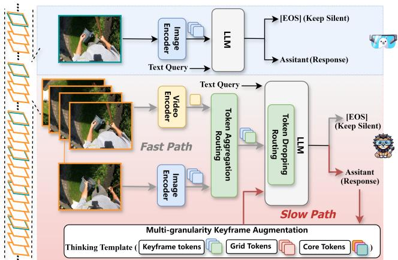
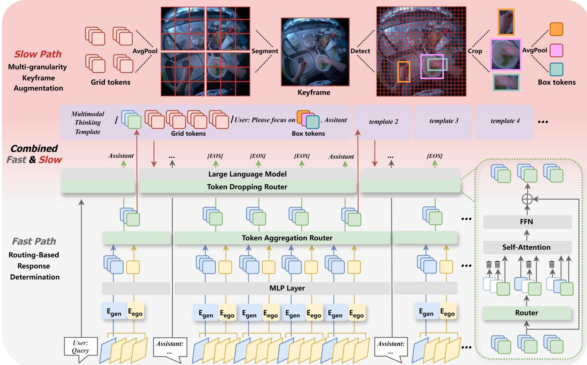
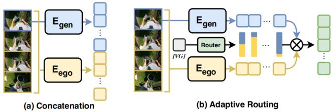
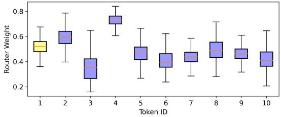
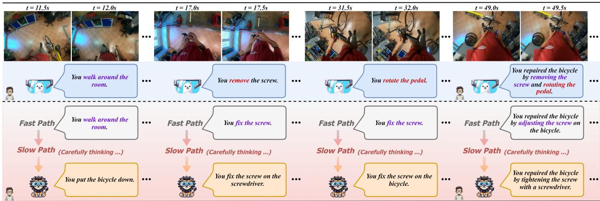

# LION-FS: Fast & Slow Video-Language Thinker as Online Video Assistant

Wei Li, Bing Hu, Rui Shao\*, Leyang Shen, Liqiang Nie Harbin Institute of Technology, Shenzhen

liwei2024@stu.hit.edu.cn shaorui@hit.edu.cn https://github.com/JiuTian-VL/LION-FS

## Abstract

First-person video assistants are highly anticipated to enhance our daily lives through online video dialogue. However, existing online video assistants often sacrifice assistant efficacy for real-time efficiency by processing lowframe-rate videos with coarse-grained visual features. To overcome the trade-off between efficacy and efficiency, we propose “Fast & Slow Video-Language Thinker” as onLIne videO assistaNt, LION-FS, achieving real-time, proactive, temporally accurate, and contextually precise responses. LION-FS adopts a two-stage optimization strategy: 1) Fast Path: Routing-Based Response Determination evaluates frame-by-frame whether an immediate response is necessary. To enhance response determination accuracy and handle higher frame-rate inputs efficiently, we employ Token Aggregation Routing to dynamically fuse spatiotemporal features without increasing token numbers, while utilizing Token Dropping Routing to eliminate redundant features, and 2) Slow Path: Multi-granularity Keyframe Augmentation optimizes keyframes during response generation. To provide comprehensive and detailed responses beyond atomic actions constrained by training data, fine-grained spatial features and human-environment interaction features are extracted through multi-granular pooling. They are further integrated into a meticulously designed multimodal Thinking Template to guide more precise response generation. Comprehensive evaluations of online video tasks demonstrate that LION-FS achieves state-ofthe-art efficacy and efficiency.

## 1. Introduction

In current popular smart glasses [13, 34, 54] or headmounted devices [35, 41], although most integrate AI applications such as voice assistant [1, 2, 53] and gesture recognition [20, 26], online video assistant [5, 59] have yet to see mature implementation. A primary challenge is that online video assistants require continuous reception of first-person perspective video streams. Additionally, they must have the ability to handle user queries in real-time and proactively provide professional responses or guidance. This imposes high demands on both efficacy and efficiency.

  
Figure 1. Comparison between LIVE [5] and LION-FS LIVE processes low-frame-rate videos using coarse-grained image tokens, resulting in suboptimal accuracy in response. LION-FS, by efficiently handling high-frame-rate videos through Fast-Path dynamical spatiotemporal fusion and Slow-Path multi-granular keyframe augmentation, significantly enhances response determination accuracy and content precision.

Although existing video understanding works [16, 21, 24, 33, 50, 69] achieve high performance in offline scenarios for tasks like video question answering [11, 51, 70, 72], captioning [18, 61, 63], and spatiotemporal localization [3, 7, 39, 56], they are unsuitable for the online paradigm of video assistant. VideoLLM-online [5] is a pioneering work that introduces the video streaming dialogue framework LIVE to video assistant, as shown in Figure 1. LIVE continuously receives incoming video streams, autonomously determines response timing based on user queries, and provides concise responses. Despite its innovation, LIVE has significant limitations: 1) Limited accuracy in response determination. LIVE’s visual encoding is restricted to low frame-rate image features, which hinders the ability of Multimodal Large Language Models (MLLMs) to learn and capture inter-frame temporal relationships effectively. 2) Lack of precision in responses. By retaining a fixed and limited number of tokens for all video frames without leveraging the unique characteristics of the first-person perspective, LIVE fails to capture adaptive and detailed egocentric visual information. This inadequate extraction of vi sual information leads to suboptimal video-language fusion and thus generates imprecise responses. 3) Inefficiency in training and inference. LIVE expands tokens for all frames to enhance efficacy, but this minimal expansion proves insufficient. Token expansion is not required during the relatively simple response determination phase; instead, substantial token expansion is necessary only for keyframes during response generation.

To address these challenges, as shown in Figure 1, we propose “Fast & Slow Video-Language Thinker” as onLIne videO assistaNt, LION-FS, which integrates a fast-slow reasoning approach to simulate human thinking and response processes. LION-FS uses a Fast & Slow two-path optimization scheme, combining fine-tuning with trainingfree methods, to significantly improve both efficacy and efficiency. 1) Fast Path process for Routing-Based Response Determination. To improve the accuracy of response determination, we incorporate not only the extensive visual knowledge from general-purpose encoders but also two additional information components: (i) denser temporal features and (ii) first-person perspective features. To this end, we design a Token Aggregation Routing module. It adaptively aggregates video features extracted by a first-person video encoder from high-frame-rate videos. It also combines these with image features extracted by a general-purpose third-person encoder from low-frame-rate videos. This approach effectively consolidates the advantages of these distinct feature types without increasing the token numbers. To further enhance the efficiency of determination, a Token Dropping Routing module is introduced to adaptively discard redundant tokens, thereby sparsify ing the decoding computations within the LLM. 2) Slow Path for Multi-Granularity Keyframe Augmentation. To enhance response precision, we define the current frame where a response is determined as keyframe and apply multi-granularity augmentation on it: (i) Global uniform augmentation for Grid Tokens: the keyframe is divided into multiple grids, which are pooled at the same granularity as original frames and sequentially concatenated to form Grid Tokens (fine-grained spatial features); (ii) Local adaptive augmentation for Box Tokens: we detect hands and interacting objects within the keyframe, and select tokens within bounding boxes from the patch tokens, followed by pooling to obtain Box Tokens (local features of action occurrence). Finally, these augmented tokens are integrated into a designed Thinking Template, serving as a multimodal prompt to guide more precise and fine-grained response generation.

We summarize our contributions as follows:

• We propose LION-FS, an innovative online video assistant that mimics human cognitive processes by employing fast thinking for simple response determination and slow thinking for complex response generation.

• We develop a Fast & Slow framework combining finetuning with training-free methods. Fast Path improves response determination via routing-based token aggregation and dropping; Slow Path enhances response precision using multi-granularity keyframe augmentation.

• Comprehensive evaluations on the Ego4D and Ego-Exo4D datasets reveal that LION-FS achieves optimal performance and efficiency, outperforming existing methods in online first-person video dialogue tasks.

## 2. Related Works

Online Visual Dialogue. Existing research in visual understanding [24, 33, 36, 50, 57, 64, 69] primarily focuses on enabling the input of complete images or videos into Multimodal Large Language Models (MLLMs) [23, 29, 30, 65, 66, 74] for offline text-based multi-turn dialogues. While some works [8, 22, 25, 31, 58] have extended this dialogue paradigm to interleaved text and images, and some online video understanding methods [38, 70, 73] have advanced the processing of continuous video streams, they still fall short of enabling online video dialogue. In particular, these methods fail to provide real-time, proactive responses within video streams. Videollm-online [5] introduces a new paradigm for online video dialogue, establishing the foundational LIVE framework for video assistants. However, LIVE still faces challenges in accurate response determination, precision response generation, as well as a balanced trade-off between efficacy and efficiency.

The Fast and Slow Concept. Originating from Daniel Kahneman’s “Thinking, Fast and Slow” [10], which distinguishes between two cognitive systems: the fast, intuitive“System 1” and the deliberate, rational“System 2” [11, 44, 52, 55]. Many works have utilized the “Fast and Slow” mechanism, such as SlowFast-LLaVA [62], which performs pooling at different granularities on videos with varying frame rates to enrich features. FaST [52] selectively activates “System 2” for complex visual queries to enhance detailed image understanding. SLOWFAST-VGEN [17] leverages a slow-fast learning loop for action-driven long video generation. Inspired by these works and dual-path approaches [4, 48, 67], we apply the “Fast and Slow” mechanism to our online video assistant, decoupling simple response determination from complex response generation to enhance efficacy and efficiency.

Routing-Based Modeling. The Mixture of Experts mechanism [4, 9, 19, 49] is widely adopted in multimodal learning [6, 27, 28, 45–47] within current large multimodal language models. It explores routing schemes between expert networks across different knowledge domains, selecting specific experts based on task types. Mixture-of-Depths mechanism [32, 40, 59] investigates routing schemes for tokens involved in computation within transformer layers, reducing excessive computational overhead. We apply and enhance these two mechanisms in online video dialogue, enabling dynamic aggregation of diverse visual tokens while adaptively discarding redundant visual tokens.

  
Figure 2. The whole framework of LION-FS. Fast Path enables high-frame-rate video stream reception, allowing real-time determination of whether a response is required. $E _ { g e n }$ (SigLIP [68]) extracts general spatial features from 2 FPS frames, while $E _ { e g o }$ (EgoVLPv2 [37]) captures first-person temporal features from 8 FPS frames. These are temporally aligned, weighted through the Token Aggregation Router, and then filtered for redundancy by the Token Dropping Router. Slow Path enhances keyframes with rich information, performing multi granularity augmentation that includes fine-grained global tokens (Grid Tokens) and action-related local tokens (Box Tokens), which are injected into the Multimodal Thinking Template to guide the assistant in generating more precise responses.

## 3. LION-FS

The whole framework of LION-FS is shown in Figure 2. It divides the online video dialogue into Fast Path and Slow Path for response determination and generation, respectively. This decoupling strategy aligns with human dialogue processes and excels in both efficacy and efficiency.

## 3.1. Online Video Dialogue Modeling

The online video dialogue task requires the assistant to engage with users through continuously updating video streams. For each incoming frame, the assistant first determines whether an immediate response is appropriate. If a response is warranted, it generates an answer autoregressively based on the preceding video context.

We adopt a training approach aligned with LIVE [5], where the objective consists of two components: a streaming loss and a standard language modeling (LM) loss, corresponding to response determination and response generation, respectively. The combined loss is formulated as:

$$
\mathrm { L o s s } = \frac { 1 } { N } \sum _ { j = 1 } ^ { N } ( \underbrace { - w s _ { j } \log P _ { j } ^ { \scriptscriptstyle { [ \mathrm { E O S } ] } } } _ { \mathrm { S t r e a m i n g L o s s } } \underbrace { - l _ { j + 1 } \log P _ { j } ^ { \scriptscriptstyle { [ \mathrm { T x t } ] } _ { j + 1 } } } _ { \mathrm { L M L o s s } } )\tag{1}
$$

Here, $P _ { j } ^ { [ \mathrm { E O S } ] }$ represents the probability that the LLM predicts the End-Of-Sequence (EOS) token1 at the j-th token. $P _ { j } ^ { [ \mathrm { T x t } ] _ { j + 1 } }$ denotes probability of autoregressively predicting the (j+1)-th text token within the response. The weightbalancing parameter w has a default value of 1. The binary condition coefficients $s _ { j }$ and $l _ { j + 1 }$ , consistent with the LIVE setting, take the value of 1 during response determination and generation, respectively.

## 3.2. Fast Path: Routing-Based Response Determination

To capture temporal information from high-frame-rate video streams and mitigate the mismatch between firstperson tasks and third-person pre-trained visual features, we propose Token Aggregation Router and Token Dropping Router as the Fast Path. This framework adaptively aggregates distinct features while discarding redundant ones, as illustrated in the Fast Path of Figure 2.

Dual Encoding with Token Aggregation Router. Current online VideoLLMs [5, 59] utilize a general image encoder to process video frames separately and rely solely on the LLM to interpret videos with frame-rate downsampled features, which presents two significant limitations. Firstly, the frame-by-frame processing approach significantly limits the frame rate due to the computational complexity of LLM. This limitation makes it difficult to capture inter-frame variations in perspective and action, particularly in the downsampled feature maps. Secondly, since general image encoders are trained on third-person images, they cannot understand first-person scenes effectively due to the perspective discrepancy.

To address these limitations, we introduce an additional video encoder pre-trained on egocentric data to process video frames in groups at a higher rate. Such a groupby-group encoding approach captures fine-grained temporal information while ensuring real-time video processing and enriching visual features with first-person knowledge. Moreover, prior studies [21, 60, 71] have shown that general image encoders possess rich visual knowledge and strong generalization capabilities, which are indispensable. Therefore, we propose a Dual Encoding with Token Aggregation Router that temporally aligns the two types of visual features, adaptively and efficiently leveraging both encoders.

Specifically, we employ EgoVLPv2 [37] as the video encoder $E _ { e g o }$ to process 8 FPS video streams by grouping every 4 frames. Meanwhile, we use SigLIP [68] as the image encoder $E _ { g e n }$ to process 2 FPS video streams. Each 0.5-second segment of video is encoded into two sequences containing either 1 or 10 tokens (including 1 CLS token and 3×3 pooled tokens). The process is formulated as follows:

$$
\operatorname { \mathrm { [ F r m } } _ { s } \operatorname { \mathrm { ] } } _ { i } = E _ { g e n } ( \operatorname { \mathrm { F r m } } _ { i } ) ,\tag{2}
$$

$$
[ \mathrm { F r m } _ { t } ] _ { i } = E _ { e g o } ( \mathrm { F r m } _ { i } , \mathrm { F r m } _ { i } ^ { 0 } , \mathrm { F r m } _ { i } ^ { 1 } , \mathrm { F r m } _ { i } ^ { 2 } )\tag{3}
$$

where $\left[ \operatorname { F r m } _ { s } \right] _ { i }$ and $\left[ \ F \pmb { \Upsilon } \mathbf { m } _ { t } \right] _ { i }$ represent the general image tokens from $E _ { g e n }$ and the first-person group tokens from $E _ { e g o } ,$ respectively. Frmi denotes the frame sampled at 2 FPS, while $\mathrm { F r m } _ { i } ^ { 0 }$ , Frm1i , and Frm $\boldsymbol { \mathrm { 1 } } _ { i } ^ { 2 }$ are frames uniformly sampled from 8 FPS frames surrounding $\mathrm { F r m } _ { i }$

  
Figure 3. Different Token Aggregation Strategies: (a) Concatenate tokens along the sequence dimension. (b) Aggregate tokens based on adaptive weights generated by the router to perform customized routing. It can achieve visual information aggregation without increasing token numbers.

As shown in Figure 3(a), simply concatenating $[ \operatorname { F r m } _ { s } ]$ i and [Frm ] provides a straightforward approach to enriching visual information. However, it increases the token sequence length, negatively impacting the LLM’s decoding efficiency. To further balance efficacy and efficiency, as shown in Figure 3(b), we propose the adaptive routing method to aggregates $\left[ \operatorname { F r m } _ { s } \right]$ and $\left[ \ F \mathbf { r m } _ { t } \right] _ { i }$ adaptively based on weights generated by the Token Aggregation Router. Specifically, we consider that a large-scale pretraining allows SigLIP to effectively and comprehensively capture both visual information and frame-to-frame variations. It can be utilized as strong guidance for customized routing. Based on this consideration, the CLS token from $\left[ \operatorname { F r m } _ { s } \right]$ i is used as Visual Guidance [VG] as the condition of the router. The whole process can be formulated as follows:

$$
G _ { f } \big ( \mathrm { [ \nabla \mathsf { U } G ] } \big ) = \mathrm { S o f t M a x } \big ( W _ { 2 } \big ( \sigma \big ( W _ { 1 } \mathrm { [ \nabla \mathsf { G } ] } + b _ { 1 } \big ) \big ) + b _ { 2 } \big ) ,
$$

$$
[ \mathrm { F r m } ] _ { i } = G _ { f } \big ( [ \mathrm { V G } ] \big ) _ { 0 } \times [ \mathrm { F r m } _ { s } ] _ { i } + G _ { f } \big ( [ \mathrm { V G } ] \big ) _ { 1 } \times [ \mathrm { F r m } _ { t } ] _ { i }\tag{4}
$$

(5)

Through the router $G _ { f }$ , we generate adaptive aggregation weights for both types of visual features based on [VG], resulting in $\left[ \mathrm { F r m } \right] _ { : }$ i. Ultimately, $\left[ \mathsf { F r m } \right]$ i achieves the adaptive fusion of third-person general spatial features with firstperson dense temporal features, significantly enhancing visual information without increasing output token numbers.

Sparse Decoding with Token Dropping Router. In addition to aggregating temporal and egocentric vision features, the online assistant has to be efficient enough to accept realtime video frames.

Although the Routing-Based Image-Video Dual Encoding framework enriches diverse visual information, visual feature redundancy remains inevitable. This redundancy arises from two main reasons: (i) we use average pooling tokens overall patch tokens for each frame, while in firstperson scenes, the focus is typically on interaction areas between individuals and the environment; (ii) minimal variation between some consecutive frames leads to repeated, highly similar visual tokens. Therefore, we adopt the following routing strategy to drop redundant tokens:

$$
\begin{array} { r } { [ \mathrm { F r m } ] _ { ( i , n ) } ^ { l + 1 } = \left\{ { r } _ { ( i , n ) } ^ { l } f _ { i } ( \tilde { X } ^ { l } ) + [ \mathrm { F r m } ] _ { ( i , n ) } ^ { l } , \right. \left. \mathrm { i f } \ r _ { ( i , n ) } ^ { l } > P _ { \beta } ^ { l } ( 6 ) \right. } \\ { [ \mathrm { F r m } ] _ { ( i , n ) } ^ { l } , \left. \qquad \mathrm { i f } \ r _ { ( i , n ) } ^ { l } < P _ { \beta } ^ { l } ( 6 ) \right. } \end{array}
$$

where $0 \leq n \leq 9$ indicates that redundant tokens can be selectively discarded from the 10 tokens of each frame. $r _ { ( i , n ) } ^ { l } = \dot { w } _ { \theta } ^ { T } \left[ \mathrm { F r m } \right] _ { ( i , n ) } ^ { l }$ represents the routing weight scalar generated via linear projection for each token at the $l -$ th transformer layer. Only tokens with weights exceeding $P _ { \beta } ^ { l }$ are retained at this layer. $\beta$ denotes the userdefined proportion of discarded tokens relative to the total number of visual tokens, and $P _ { \beta } ^ { l }$ is the β-th percentile of the routing weight set $r ^ { l }$ at layer $l . \quad f _ { i }$ represents the self-attention and FFN operations at the current layer, meaning that only the top-k weighted visual tokens, filtered by their routing weights, participate in the interleaved vision-text dialogue through $f _ { i } ,$ defined as $\tilde { X } ^ { l } =$ Interleaved $' [ \mathrm { F r m } ] _ { ( i , \mathrm { t o p } - \mathbf { k } [ 0 : 1 0 ] ) } ^ { l } , [ \mathrm { T x t } ] _ { j } ^ { l } ) \ | \ \forall i , j )$

Through the proposed Routing-Based Fast Path, we achieve a fourfold increase in frame rate compared to LIVE for real-time video streaming, while enriching dense temporal information and leveraging pre-trained first-person features, resulting in more accurate and efficient response determination.

## 3.3. Slow Path: Multi-granularity Keyframe Augmentation

In the Fast Path, we treat each frame equally to enable accurate and efficient response determination. However, representing a frame with only 10 tokens tends to lose fine-grained visual information, which degenerates videolanguage fusion and thus affects precise response generation. Additionally, adding fine-grained features to all frames is impractical, as it would significantly impact the assistant’s efficiency, making real-time video streaming infeasible. Therefore, we propose a training-free Slow Path for multi-granularity keyframe augmentation. We define the current frame, at which response is determined, as the keyframe, serving as a transition point for events or actions in the video. We apply both global uniform augmentation and local adaptive augmentation to these keyframes, resulting in Grid tokens and Box tokens.

Global uniform augmentation for Grid Tokens. To supplement global fine-grained tokens and fully leverage the 10-token representation per frame established by Fast Path, we apply a unified grid-based strategy to all keyframes. Specifically, each keyframe is divided into four uniform grids, with each grid subjected to the same 3×3 pooling operation used for non-keyframes. In addition, inter-frame separators are introduced to delineate pooled features between grids, resulting in a transformation from 1×6×6 to 4×3×3 pooled tokens. This process enables each keyframe to be treated as four distinct sub-frames that are sequentially input to the LLM, thereby enhancing the granularity of information captured in a train-free manner, while ensuring that fine-grained spatial details from each region are preserved and effectively represented.

Local adaptive augmentation for Box Tokens. In firstperson scenarios, video assistants predominantly focus on interaction regions between humans and the environment, which are critical for capturing actions and events. To achieve this, we introduce box tokens to direct the assistant’s attention toward these key regions through object localization. Specifically, (i) Faster R-CNN [42] is employed to detect hand positions, followed by refining the bounding boxes of objects interacting with the hands by minimizing the distance and squared error between hand and object anchor boxes [12, 43], along with NMS optimization. (ii) Based on these bounding box coordinates, we identify the corresponding tokens from the unpooled 576 patch tokens and perform global pooling within each bounding box to derive single-token representations for hands and objects, collectively forming the box tokens.

After performing multi-granularity keyframe augmentation, we obtained the Grid Tokens and Box Tokens for each keyframe. We integrated these tokens into the interleaved frame-text dialogue, constructing a Multimodal Thinking Template, as depicted in Figure 2. The specific format is as follows: “Stream: [Frame Tokens] [Grid Tokens] User: Please focus on [Box Tokens]. Assistant: ”. The process is summarized as follows: when the Slow Path receives a response indication (predicting “Assistant:”) from the Fast Path, the current frame is deemed a keyframe. Multi-granularity augmentation is then applied to this keyframe to generate the Multimodal Thinking Template, which serves as a customized multimodal prompt, replacing “Assistant:”. This seamless insertion of a Multimodal Thinking Template into online video dialogues enriches multi-granularity visual information in a training-free manner. It allows responses to move beyond the limited brief atomic action descriptions in the training data, thus improving the precision of the responses.

## 4. Experience

## 4.1. Experimental Settings

All experiments can be completed using 80G A800 GPU. Please refer to Appendix for implementation details and training details.

Datasets. In an online setting, we validated the effectiveness of our proposed LION-FS model using the egocentric video datasets, Ego4D and Ego-Exo4D. Ego4D Narration Stream Benchmark [14]: According to VideoLLMonline [5], we use dense Ego4D timestamped-narrations to create a streaming dataset, aiming to generate narrations in a timely manner, akin to those produced by human annotators in Ego4D. Ego-Exo4D Benchmark [15]: Ego-Exo4D is a multiview, temporally aligned video dataset including first-person view. We perform the same operations on this dataset as with Ego4D. Due to its smaller scale compared to Ego4D, we use it for ablation experiments to quickly evaluate the effectiveness of different model modules.

Table 1. Main Results. “†” indicates that the comparison model was not trained on the evaluation dataset, and we retrained it for a fair comparison. Since the code for VideoLLM-MOD has not been released, the experimental results were reproduced based on its paper. “\*” indicates that the experimental data comes from the results reported in the original paper, where our model was trained and evaluated using the same experimental settings. The experimental results show that LION-FS outperforms existing comparison methods on most metrics, demonstrating its strong ability on video-stream online dialogue tasks.
<table><tr><td>Method</td><td>LL-PPL↓ TimeDiff ↓</td><td>Fluency ↑</td><td>LM-Correctness ↑</td></tr><tr><td colspan="4">Ego-Exo4D Narration Validation</td></tr><tr><td>VideoLLM-online† [5]</td><td>2.24 0.78</td><td>33.7%</td><td>44.8%</td></tr><tr><td>VideoLLM-MoD† [59]</td><td>2.12 0.82</td><td>33.8%</td><td>45.3%</td></tr><tr><td>LION-FS</td><td>2.04 0.74</td><td>36.5%</td><td>48.2%</td></tr><tr><td colspan="4">Ego4D Narration Validation</td></tr><tr><td>VideoLLM-online* [5]</td><td>2.40 2.04</td><td>45.3%</td><td>49.0%</td></tr><tr><td>VideoLLM-MoD* [59]</td><td>2.41 2.04</td><td>45.2%</td><td>48.9%</td></tr><tr><td>LION-FS</td><td>2.09 2.15</td><td>46.1%</td><td>52.4%</td></tr></table>

Table 2. Ablation Study on Token Aggregation Router. $E _ { \mathrm { g e n } }$ and $E _ { \mathrm { e g o } }$ represent the number of tokens from SigLIP and EgoVLPv2, respectively, while “Fusion” denotes the token count obtained through the fusion strategy. The results indicate adaptive routing aggregation improves visual integration and captures temporal-spatial correlations, significantly boosting model efficacy.
<table><tr><td rowspan="2">Method Aggregation strategy</td><td colspan="3">Token Number</td><td colspan="4">Ego-Exo4D Narration Validation</td></tr><tr><td> $E _ { \mathrm { g e n } }$ </td><td> $E _ { \mathrm { e g o } }$ </td><td>Fusion</td><td>LL-PPL↓</td><td>TimeDiff ↓</td><td>Fluency ↑</td><td>LM-Correctness ↑</td></tr><tr><td></td><td>10</td><td></td><td>10</td><td>2.24</td><td>0.78</td><td>33.7%</td><td>44.8%</td></tr><tr><td></td><td>=</td><td>10</td><td>10</td><td>2.29</td><td>1.05</td><td>36.8%</td><td>47.8%</td></tr><tr><td rowspan="3">Concatenation</td><td>10</td><td>10</td><td>20</td><td>2.25</td><td>1.65</td><td>27.7%</td><td>45.8%</td></tr><tr><td>10</td><td>1</td><td>11</td><td>2.29</td><td>0.71</td><td>35.8%</td><td>45.2%</td></tr><tr><td>1</td><td>10</td><td>11</td><td>2.42</td><td>1.07</td><td>37.1%</td><td>47.6%</td></tr><tr><td rowspan="3">Addition</td><td>10</td><td>10</td><td>10</td><td>2.25</td><td>0.75</td><td>34.7%</td><td>44.7%</td></tr><tr><td>10</td><td>1</td><td>10</td><td>2.18</td><td>0.71</td><td>36.2%</td><td>46.9%</td></tr><tr><td>1</td><td>10</td><td>10</td><td>2.38</td><td>1.05</td><td>33.8%</td><td>45.0%</td></tr><tr><td>Learnable Weighting</td><td>10</td><td>10</td><td>10</td><td>2.35</td><td>0.74</td><td>34.7%</td><td>45.6%</td></tr><tr><td>Adaptive Routing</td><td>10</td><td>10</td><td>10</td><td>2.25</td><td>0.67</td><td>38.1%</td><td>48.0%</td></tr></table>

Evaluation metrics. For the online benchmarking, following the setup of VideoLLM-online [5], we use Language Modeling Perplexity (LM-PPL) and LM-Correctness to evaluate the language modeling capability of our LION-FS model at specific timestamps. To assess the model’s temporal alignment ability, we use Time Difference (TimeDiff) and Fluency to comprehensively measure the quality of language modeling and temporal effectiveness.

## 4.2. Main Results

We compare our method with existing video streaming dialogue methods [5, 59] on the Ego4D and Ego-Exo4D narration stream benchmark, the results of which are summarised in Table 1. LION-FS consistently outperforms other methods, particularly in Fluency and LM-Correctness metrics, showcasing its advanced capabilities in language modeling and temporal alignment. While it slightly underperforms on TimeDiff in Ego4D Narration Validation, due to the short average response length of 6.73 words. In contrast, it outperforms all metrics in the Ego-Exo4D Narration Validation (10.96 words), highlighting its focus on balancing response determination and generation. Additionally, LION-FS can process video streams at a higher frame rate (four times that of [5, 59]), achieving greater efficiency. The dual advantages in efficacy and efficiency are brought by the novel fast & slow two-path optimization scheme.

## 4.3. Ablation Study

## 4.3.1 Analysis on Token Aggregation Router

Table 2 presents the ablation study results on visual token aggregation strategies. Experiments show that SigLIP outperforms EgoVLPv2 in LL-PPL and TimeDiff, while EgoVLPv2 excels in Fluency and LM-Correctness. These findings highlight the limitations of using on a single visual encoder, as it cannot provide comprehensive visual information. Features from two different encoders can complement each other, offering a more complete representation.

To aggregate features from two encoders, we first simply concatenate different features to provide the model with rich visual information. However, this approach cannot achieve consistent improvement while impacting the LLM’s decoding efficiency due to the increase in the token length. Then, we attempt to directly add the visual tokens from different encoders to prevent the token length increase. We separately perform the $^ { 6 6 } 1 0 { + } 1 0 ^ { 3 }$ (where each token is added individually) and $^ {  } 1 0 + 1 / 1 + 1 0 ^ { \ ' }$ (where the CLS token from one encoder is added to the CLS token from the other encoder) aggregation strategies. It is evident that the experimental results of $^ {  } 1 0 + 1 / 1 + 1 0 ^ { \ ' }$ outperform those of “10 + $1 0 ^ { \circ }$ in most metrics, leading us to believe that different visual tokens require different addition strategies. Based on these findings, we propose the Token Aggregation Router, which assigns adaptive weights to each token guided by Visual Guidance [VG]. Table 4 shows that using the CLS token from SigLIP as [VG] outperforms the CLS token from EgoVLPv2 or their combination. The experimental results demonstrate that the adaptive routing method surpasses all other strategies across most evaluation metrics.

Table 3. Ablation Study on Token Dropping Router. “No Dropping” represents the best result of Adaptive Routing Aggregation without using the Token Dropping Router. “Random Dropping” refers to adding a non-trainable Token Dropping Router on top of Adaptive Routing Aggregation. β indicates the dropout rate of visual tokens. The Dropping Layers experiment was conducted under the condition of $\beta =$ 0.5, while the Dropping Ratio experiment was performed under the “Interleaved Layers” setting. The experimental results show that the “Interleaved Layers $\because \xi \beta = 0 . 5$ routing configuration strikes a good balance between model performance and efficiency.
<table><tr><td rowspan="2">Method Dropping strategy</td><td colspan="4">Ego-Exo4D Narration Validation</td><td rowspan="2">FLOPs</td><td rowspan="2">Training Cost &amp; Speedup</td></tr><tr><td> $\mathbf { L L - P P L } \downarrow$ </td><td>TimeDiff↓</td><td>Fluency ↑</td><td>LM-Correctness ↑</td></tr><tr><td>No Dropping</td><td>2.25</td><td>0.67</td><td>38.1%</td><td>48.0%</td><td>61.44T</td><td>6.4h&amp; n/a</td></tr><tr><td>Random Dropping</td><td>15.48</td><td>1.93</td><td>20.7%</td><td>30.3%</td><td></td><td></td></tr><tr><td colspan="7">Dropping Layers</td></tr><tr><td>All Layers</td><td>2.18</td><td>0.80</td><td>34.1%</td><td>45.5%</td><td>41.39T</td><td>5.0h &amp; 1.28 ×</td></tr><tr><td>Deep Layers</td><td>2.15</td><td>0.77</td><td>35.6%</td><td>46.4%</td><td>48.89T</td><td>5.4h &amp; 1.18 ×</td></tr><tr><td>Interleaved Layers</td><td>2.16</td><td>0.74</td><td>36.5%</td><td>47.0%</td><td>51.40T</td><td>5.7h &amp; 1.12 ×</td></tr><tr><td>Interleaved &amp; Deep Layers</td><td>2.13</td><td>0.80</td><td>33.9%</td><td>45.1%</td><td>45.14T</td><td>5.3h &amp; 1.21 ×</td></tr><tr><td colspan="7">Dropping Ratio</td></tr><tr><td> $\overline { { \beta = 0 . 2 } }$ </td><td>2.21</td><td>0.73</td><td>36.5%</td><td>46.7%</td><td>57.44T</td><td>6.0h &amp; 1.05×</td></tr><tr><td> $\beta = 0 . 5$ </td><td>2.16</td><td>0.74</td><td>36.5%</td><td>47.0%</td><td>51.40T</td><td>5.7h &amp; 1.12 ×</td></tr><tr><td> $\beta = 0 . 8$ </td><td>2.28</td><td>1.10</td><td>35.9%</td><td>46.8%</td><td>45.37T</td><td>5.4h &amp; 1.18 ×</td></tr></table>

Table 4. Ablation Study on Adaptive Routing for Visual Guidance [VG] Selection. The results demonstrate that the CLS token proposed by SigLIP, with its rich knowledge and generalization ability, most effectively optimizes the weights between visual tokens, achieving superior efficacy.
<table><tr><td>[VG] Source</td><td>LL-PPL ↓</td><td>TimeDiff ↓</td><td>Fluency ↑</td><td>LM-Correctness ↑</td></tr><tr><td>SigLIP</td><td>2.25</td><td>0.64</td><td>38.1%</td><td>48.0%</td></tr><tr><td>EgoVLPv2</td><td>2.45</td><td>0.70</td><td>38.1%</td><td>47.7%</td></tr><tr><td>SigLIP &amp; EgoVLPv2</td><td>2.40</td><td>1.08</td><td>37.8%</td><td>47.7%</td></tr></table>

Visualization of Routing Outcomes. We visualize the routing outcomes of the token aggregation router. As shown in Figure 4, the weights assigned by the router exhibit a notable discrepancy across different token positions. Furthermore, there are subtle variations within the same token position to fit each input frame. These observations suggest that the router can adaptively adjust aggregation weights for optimal visual feature aggregation.

  
Figure 4. Boxplot Visualization of token aggregation routing outcomes. We select the weights of $E _ { g e n }$ for analysis. The Token 1 is the CLS token, highlighted in yellow.

## 4.3.2 Analysis on Token Dropping Router

Table 3 presents the results of an ablation study on various settings of the redundant token drop router. The random dropping method causes significant performance degradation across all metrics, highlighting the importance of a learnable dropping router. We investigate the effect of placing token dropping router at different points in the model. “All Layers” and “Interleaved Layers” refer to inserting token dropping router in every Transformer layer and in every other layer, respectively, while “Deep Layers” refer to placing token dropping router in the last two-thirds of the layers. The results show that using token dropping router results in minimal efficacy loss while reducing training time. We examine the impact of varying token dropping rates on both model efficacy and efficiency. The results demonstrate that even with fewer visual tokens, LION-FS achieves satisfactory efficacy, highlighting the importance of the token dropping router’s visual selection capability and revealing the significant redundancy present in video data.

## 4.3.3 Analysis on Multi-granularity Augmentation

To investigate the effectiveness of Multi-Granularity keyframe augmentation, we conducted ablation studies on its two main components: Grid Tokens and Box Tokens. We use language modeling capability metrics — LL-PPL and LM-Correctness — to measure the response precision improvements. As shown in Table 5, comparing Fine-grained Tokens (1×6×6), Grid Tokens (4×3×3), and the Baseline, we observe that incorporating more comprehensive visual information into the keyframes significantly enhances the model’s language modeling efficacy. Furthermore, the use of the 4×3×3 input pattern aligns the input structure of the keyframes with that of the training mode, resulting in further efficacy gains. Furthermore, inserting Local Adaptive Augmentation multimodal prompts only at the keyframe locations provides a significant boost to LION-FS’s language modeling capability. When combining Grid Tokens with Box Tokens, the Multi-Granularity Augmentation approach effectively integrates the strengths of both strategies. This combination outperforms the existing model on both the LL-PPL and LM-Correctness metrics, demonstrating that Multi-Granularity Augmentation delivers richer, higher-quality visual information for the language model.

  
represents the questions posed by the user, such as the request “Please narrate the video in real-time” at 0.0s and “How did I repair the bicycle?” at 49.0s. Purple highlights indicate imprecise responses, while red highlights denote incorrect responses. LION-FS achieves progressive improvements in response precision through the integration of Fast Path and Slow Path mechanisms.

Table 5. Ablation Study on Multi-granularity Keyframe Augmentation. The Baseline represents the best result of Fast-Path. “FG tokens” refers to Fine-Grained Tokens. Experimental results show that combining Grid Tokens with Box Tokens provides the model with richer, high-quality visual information, thereby enhancing its language modeling capabilities.
<table><tr><td>Method</td><td>LL-PPL↓</td><td>Correctness ↑</td></tr><tr><td>Baseline (w/o Augmentation)</td><td>2.16</td><td>47.0%</td></tr><tr><td>+ FG Tokens (1×6×6)</td><td>2.07</td><td>47.3%</td></tr><tr><td>+ Grid Tokens (4×3×3)</td><td>2.04</td><td>47.8%</td></tr><tr><td>+ Box Tokens</td><td>2.06</td><td>47.6%</td></tr><tr><td>+ FG Tokens (1 ×6×6) &amp; Box Tokens</td><td>2.06</td><td>47.3%</td></tr><tr><td>+ Grid Tokens (4×3×3) &amp; Box Tokens</td><td>2.04</td><td>48.2%</td></tr></table>

Qualitative Analysis We present several examples to validate the responses’ quality improvement brought by Multi-Granularity Augmentation. As shown in Figure 5, compared to LIVE [5], LION-FS’s Fast-Path improves the accuracy of responses, and incorporating Multi-granularity Augmentation enables the model to generate answers with richer, more fine-grained information. For example, at 49.0s, in response to the user’s question, “How did I repair the bicycle?”, LIVE incorrectly responds, “You repaired the bicycle by removing the screw and rotating the pedal.” In contrast, Fast-Path correctly reflects that the user repaired the bicycle by “adjusting the screw.” Adding Multigranularity Augmentation further enriches the Fast-Path response, providing more detailed information.

## 5. Conclusion

In this paper, we introduce LION-FS, a novel framework for online video assistant that addresses the critical challenges of both efficacy and efficiency. LION-FS employs a Fast & Slow optimization scheme, decoupling “intuitive” response determination from “deliberative” response generation. To handle higher-frame-rate video streams and enhance response accuracy, the Fast Path dynamically integrates general image features with first-person video features via the Token Aggregation Router, while adaptively eliminating redundancies through the Token Dropping Router. To improve the precision of response generation, the Slow Path leverages multi-granularity augmentation of keyframes, incorporating global uniform augmentation with fine-grained pooling and local adaptive augmentation focused on areas of human-environment interaction.

## 6. Acknowledgement

This study is supported by National Natural Science Foundation of China (Grant No. 62306090, No. 62236003) , Natural Science Foundation of Guangdong Province of China (Grant No. 2024A1515010147) and Shenzhen Science and Technology Program (KQTD20240729102207002).

## References

[1] Amazon. Amazon alexa. In https://alexa.amazon.com/, 2024. 1

[2] Apple. Hololens 2. In https://www.apple.com/siri/, 2024. 1

[3] Leonard Barmann and Alex Waibel. Where did i leave my¨ keys?-episodic-memory-based question answering on egocentric videos. In Proceedings ofthe IEEE/CVF Conference on Computer Vision and Pattern Recognition, pages 1560– 1568, 2022. 1

[4] Gongwei Chen, Leyang Shen, Rui Shao, Xiang Deng, and Liqiang Nie. Lion: Empowering multimodal large language model with dual-level visual knowledge. In Proceedings of the IEEE/CVF Conference on Computer Vision and Pattern Recognition, pages 26540–26550, 2024. 2

[5] Joya Chen, Zhaoyang Lv, Shiwei Wu, Kevin Qinghong Lin, Chenan Song, Difei Gao, Jia-Wei Liu, Ziteng Gao, Dongxing Mao, and Mike Zheng Shou. Videollm-online: Online video large language model for streaming video. In Proceedings of the IEEE/CVF Conference on Computer Vision and Pattern Recognition, pages 18407–18418, 2024. 1, 2, 3, 4, 5, 6, 8

[6] Jingxuan Chen, Derek Yuen, Bin Xie, Yuhao Yang, Gongwei Chen, Zhihao Wu, Li Yixing, Xurui Zhou, Weiwen Liu, Shuai Wang, et al. Spa-bench: A comprehensive benchmark for smartphone agent evaluation. In ICLR, 2025. 2

[7] Qirui Chen, Shangzhe Di, and Weidi Xie. Grounded multihop videoqa in long-form egocentric videos. arXiv preprint arXiv:2408.14469, 2024. 1

[8] Wei Chen, Lin Li, Yongqi Yang, Bin Wen, Fan Yang, Tingting Gao, Yu Wu, and Long Chen. Comm: A coherent interleaved image-text dataset for multimodal understanding and generation. arXiv preprint arXiv:2406.10462, 2024. 2

[9] Damai Dai, Chengqi Deng, Chenggang Zhao, RX Xu, Huazuo Gao, Deli Chen, Jiashi Li, Wangding Zeng, Xingkai Yu, Y Wu, et al. Deepseekmoe: Towards ultimate expert specialization in mixture-of-experts language models. arXiv preprint arXiv:2401.06066, 2024. 2

[10] Kahneman Daniel. Thinking, fast and slow. In Book, 2017. 2

[11] Hao Fei, Shengqiong Wu, Wei Ji, Hanwang Zhang, Meishan Zhang, Mong-Li Lee, and Wynne Hsu. Video-of-thought: Step-by-step video reasoning from perception to cognition. In Forty-first International Conference on Machine Learning, 2024. 1, 2

[12] Georgia Gkioxari, Ross Girshick, Piotr Dollar, and Kaiming´ He. Detecting and recognizing human-object interactions. In Proceedings of the IEEE conference on computer vision and pattern recognition, pages 8359–8367, 2018. 5

[13] Google. Google glass. In https://google.com/glass/, 2024. 1

[14] Kristen Grauman, Andrew Westbury, Eugene Byrne, Zachary Chavis, Antonino Furnari, Rohit Girdhar, Jackson Hamburger, Hao Jiang, Miao Liu, Xingyu Liu, Miguel Martin, Tushar Nagarajan, Ilija Radosavovic, Santhosh Kumar Ramakrishnan, Fiona Ryan, Jayant Sharma, Michael Wray, Mengmeng Xu, Eric Zhongcong Xu, Chen Zhao, Siddhant Bansal, Dhruv Batra, Vincent Cartillier, Sean Crane, Tien Do, Morrie Doulaty, Akshay Erapalli, Christoph Feichtenhofer, Adriano Fragomeni, Qichen Fu, Abrham Gebrese-

lasie, Cristina Gonzalez, James Hillis, Xuhua Huang, Yifei´ Huang, Wenqi Jia, Weslie Khoo, Jachym Kol´ ar, Satwik Kot-´ tur, Anurag Kumar, Federico Landini, Chao Li, Yanghao Li, Zhenqiang Li, Karttikeya Mangalam, Raghava Modhugu, Jonathan Munro, Tullie Murrell, Takumi Nishiyasu, Will Price, Paola Ruiz Puentes, Merey Ramazanova, Leda Sari, Kiran Somasundaram, Audrey Southerland, Yusuke Sugano, Ruijie Tao, Minh Vo, Yuchen Wang, Xindi Wu, Takuma Yagi, Ziwei Zhao, Yunyi Zhu, Pablo Arbelaez, David Cran-´ dall, Dima Damen, Giovanni Maria Farinella, Christian Fuegen, Bernard Ghanem, Vamsi Krishna Ithapu, C. V. Jawahar, Hanbyul Joo, Kris Kitani, Haizhou Li, Richard A. Newcombe, Aude Oliva, Hyun Soo Park, James M. Rehg, Yoichi Sato, Jianbo Shi, Mike Zheng Shou, Antonio Torralba, Lorenzo Torresani, Mingfei Yan, and Jitendra Malik. Ego4d: Around the world in 3,000 hours of egocentric video. In Proceedings of the IEEE/CVF Conference on Computer Vision and Pattern Recognition, pages 18973–18990, 2022. 5

[15] Kristen Grauman, Andrew Westbury, Lorenzo Torresani, Kris Kitani, Jitendra Malik, Triantafyllos Afouras, Kumar Ashutosh, Vijay Baiyya, Siddhant Bansal, Bikram Boote, Eugene Byrne, Zachary Chavis, Joya Chen, Feng Cheng, Fu-Jen Chu, Sean Crane, Avijit Dasgupta, Jing Dong, Mar´ıa Escobar, Cristhian Forigua, Abrham Gebreselasie, Sanjay Haresh, Jing Huang, Md Mohaiminul Islam, Suyog Dutt Jain, Rawal Khirodkar, Devansh Kukreja, Kevin J. Liang, Jia-Wei Liu, Sagnik Majumder, Yongsen Mao, Miguel Martin, Effrosyni Mavroudi, Tushar Nagarajan, Francesco Ragusa, Santhosh Kumar Ramakrishnan, Luigi Seminara, Arjun Somayazulu, Yale Song, Shan Su, Zihui Xue, Edward Zhang, Jinxu Zhang, Angela Castillo, Changan Chen, Xinzhu Fu, Ryosuke Furuta, Cristina Gonzalez, Prince´ Gupta, Jiabo Hu, Yifei Huang, Yiming Huang, Weslie Khoo, et al. Ego-exo4d: Understanding skilled human activity from first-and third-person perspectives. In Proceedings of the IEEE/CVF Conference on Computer Vision and Pattern Recognition, pages 19383–19400, 2024. 6

[16] Bo He, Hengduo Li, Young Kyun Jang, Menglin Jia, Xuefei Cao, Ashish Shah, Abhinav Shrivastava, and Ser-Nam Lim. Ma-lmm: Memory-augmented large multimodal model for long-term video understanding. In Proceedings of the IEEE/CVF Conference on Computer Vision and Pattern Recognition, pages 13504–13514, 2024. 1

[17] Yining Hong, Beide Liu, Maxine Wu, Yuanhao Zhai, Kai Wei Chang, Lingjie Li, Kevin Lin, Chung-Ching Lin, Jian feng Wang, Zhengyuan Yang, et al. Slowfast-vgen: Slowfast learning for action-driven long video generation. arXiv preprint arXiv:2410.23277, 2024. 2

[18] Vladimir Iashin and Esa Rahtu. Multi-modal dense video captioning. In Proceedings of the IEEE/CVF conference on computer vision and pattern recognition workshops, pages 958–959, 2020. 1

[19] Robert A Jacobs, Michael I Jordan, Steven J Nowlan, and Geoffrey E Hinton. Adaptive mixtures of local experts. Neu ral computation, 3(1):79–87, 1991. 2

[20] Jaewook Lee, Jun Wang, Elizabeth Brown, Liam Chu, Sebastian S Rodriguez, and Jon E Froehlich. Gazepointar: A

context-aware multimodal voice assistant for pronoun disambiguation in wearable augmented reality. In Proceedings of the CHI Conference on Human Factors in Computing Systems, pages 1–20, 2024. 1

[21] Bo Li, Yuanhan Zhang, Dong Guo, Renrui Zhang, Feng Li, Hao Zhang, Kaichen Zhang, Yanwei Li, Ziwei Liu, and Chunyuan Li. Llava-onevision: Easy visual task transfer. arXiv preprint arXiv:2408.03326, 2024. 1, 4

[22] Feng Li, Renrui Zhang, Hao Zhang, Yuanhan Zhang, Bo Li, Wei Li, Zejun Ma, and Chunyuan Li. Llava-next-interleave: Tackling multi-image, video, and 3d in large multimodal models. arXiv preprint arXiv:2407.07895, 2024. 2

[23] Junnan Li, Dongxu Li, Silvio Savarese, and Steven Hoi. Blip-2: Bootstrapping language-image pre-training with frozen image encoders and large language models. In International conference on machine learning, pages 19730– 19742. PMLR, 2023. 2

[24] KunChang Li, Yinan He, Yi Wang, Yizhuo Li, Wenhai Wang, Ping Luo, Yali Wang, Limin Wang, and Yu Qiao. Videochat: Chat-centric video understanding. arXiv preprint arXiv:2305.06355, 2023. 1, 2

[25] Qingyun Li, Zhe Chen, Weiyun Wang, Wenhai Wang, Shenglong Ye, Zhenjiang Jin, Guanzhou Chen, Yinan He, Zhangwei Gao, Erfei Cui, et al. Omnicorpus: An unified multimodal corpus of 10 billion-level images interleaved with text. arXiv preprint arXiv:2406.08418, 2024. 2

[26] Zisu Li, Chen Liang, Yuntao Wang, Yue Qin, Chun Yu, Yukang Yan, Mingming Fan, and Yuanchun Shi. Enabling voice-accompanying hand-to-face gesture recognition with cross-device sensing. In Proceedings of the 2023 CHI Conference on Human Factors in Computing Systems, pages 1– 17, 2023. 1

[27] Zaijing Li, Yuquan Xie, Rui Shao, Gongwei Chen, Dongmei Jiang, and Liqiang Nie. Optimus-1: Hybrid multimodal memory empowered agents excel in long-horizon tasks. Advances in neural information processing systems, 37:49881– 49913, 2025. 2

[28] Zaijing Li, Yuquan Xie, Rui Shao, Gongwei Chen, Dongmei Jiang, and Liqiang Nie. Optimus-2: Multimodal minecraft agent with goal-observation-action conditioned policy. arXiv preprint arXiv:2502.19902, 2025. 2

[29] Haotian Liu, Chunyuan Li, Yuheng Li, and Yong Jae Lee. Improved baselines with visual instruction tuning. In Proceedings of the IEEE/CVF Conference on Computer Vision and Pattern Recognition, pages 26296–26306, 2024. 2

[30] Haotian Liu, Chunyuan Li, Qingyang Wu, and Yong Jae Lee. Visual instruction tuning. Advances in neural information processing systems, 36, 2024. 2

[31] Ziyu Liu, Tao Chu, Yuhang Zang, Xilin Wei, Xiaoyi Dong, Pan Zhang, Zijian Liang, Yuanjun Xiong, Yu Qiao, Dahua Lin, et al. Mmdu: A multi-turn multi-image dialog understanding benchmark and instruction-tuning dataset for lvlms. arXiv preprint arXiv:2406.11833, 2024. 2

[32] Yaxin Luo, Gen Luo, Jiayi Ji, Yiyi Zhou, Xiaoshuai Sun, Zhiqiang Shen, and Rongrong Ji. Gamma-mod: Exploring mixture-of-depth adaptation for multimodal large language models. arXiv preprint arXiv:2410.13859, 2024. 3

[33] Muhammad Maaz, Hanoona Rasheed, Salman Khan, and Fahad Shahbaz Khan. Video-chatgpt: Towards detailed video understanding via large vision and language models. arXiv preprint arXiv:2306.05424, 2023. 1, 2

[34] Meta. Meta smart glasses. In https://www.meta.com/smart glasses/, 2024. 1

[35] Microsoft. Hololens 2. In https://www.microsoft.com/hololens, 2024. 1

[36] Vishvak Murahari, Dhruv Batra, Devi Parikh, and Abhishek Das. Large-scale pretraining for visual dialog: A simple state-of-the-art baseline. In European Conference on Com puter Vision, pages 336–352. Springer, 2020. 2

[37] Shraman Pramanick, Yale Song, Sayan Nag, Kevin Qinghong Lin, Hardik Shah, Mike Zheng Shou, Rama Chellappa, and Pengchuan Zhang. Egovlpv2: Egocentric video-language pre-training with fusion in the backbone. In Proceedings of the IEEE/CVF International Conference on Computer Vision, pages 5285–5297, 2023. 3, 4

[38] Rui Qian, Xiaoyi Dong, Pan Zhang, Yuhang Zang, Shuan grui Ding, Dahua Lin, and Jiaqi Wang. Streaming long video understanding with large language models. arXiv preprint arXiv:2405.16009, 2024. 2

[39] Santhosh Kumar Ramakrishnan, Ziad Al-Halah, and Kristen Grauman. Naq: Leveraging narrations as queries to supervise episodic memory. In Proceedings of the IEEE/CVF Conference on Computer Vision and Pattern Recognition, pages 6694–6703, 2023. 1

[40] David Raposo, Sam Ritter, Blake Richards, Timothy Lillicrap, Peter Conway Humphreys, and Adam Santoro. Mixture-of-depths: Dynamically allocating compute in transformer-based language models. arXiv preprin arXiv:2404.02258, 2024. 3

[41] RealWear. Realwear hmt-1. In https://support.realwear.com/knowledge/ realwear-hmt 1-product-overview, 2024. 1

[42] Shaoqing Ren, Kaiming He, Ross Girshick, and Jian Sun. Faster r-cnn: Towards real-time object detection with region proposal networks. IEEE transactions on pattern analysis and machine intelligence, 39(6):1137–1149, 2016. 5

[43] Dandan Shan, Jiaqi Geng, Michelle Shu, and David F Fouhey. Understanding human hands in contact at internet scale. In Proceedings of the IEEE/CVF conference on computer vision and pattern recognition, pages 9869–9878, 2020. 5

[44] Hao Shao, Shengju Qian, Han Xiao, Guanglu Song, Zhuofan Zong, Letian Wang, Yu Liu, and Hongsheng Li. Visual cot: Unleashing chain-of-thought reasoning in multi-modal language models. arXiv preprint arXiv:2403.16999, 2024. 2

[45] Rui Shao, Xiangyuan Lan, Jiawei Li, and Pong C Yuen. Multi-adversarial discriminative deep domain generalization for face presentation attack detection. In Proceedings of the IEEE/CVF conference on computer vision and pattern recognition, pages 10023–10031, 2019. 2

[46] Rui Shao, Tianxing Wu, and Ziwei Liu. Detecting and grounding multi-modal media manipulation. In Proceedings of the IEEE/CVF Conference on Computer Vision and Pattern Recognition, pages 6904–6913, 2023.

[47] Rui Shao, Tianxing Wu, Jianlong Wu, Liqiang Nie, and Ziwei Liu. Detecting and grounding multi-modal media manipulation and beyond. IEEE Transactions on Pattern Analysis and Machine Intelligence, 2024. 2

[48] Rui Shao, Tianxing Wu, Liqiang Nie, and Ziwei Liu. Deepfake-adapter: Dual-level adapter for deepfake detection. International Journal ofComputer Vision, 2025. 2

[49] Leyang Shen, Gongwei Chen, Rui Shao, Weili Guan, and Liqiang Nie. Mome: Mixture of multimodal experts for generalist multimodal large language models. arXiv preprint arXiv:2407.12709, 2024. 2

[50] Enxin Song, Wenhao Chai, Guanhong Wang, Yucheng Zhang, Haoyang Zhou, Feiyang Wu, Haozhe Chi, Xun Guo, Tian Ye, Yanting Zhang, et al. Moviechat: From dense token to sparse memory for long video understanding. In Proceedings of the IEEE/CVF Conference on Computer Vision and Pattern Recognition, pages 18221–18232, 2024. 1, 2

[51] Enxin Song, Wenhao Chai, Tian Ye, Jenq-Neng Hwang, Xi Li, and Gaoang Wang. Moviechat+: Question-aware sparse memory for long video question answering. arXiv preprint arXiv:2404.17176, 2024. 1

[52] Guangyan Sun, Mingyu Jin, Zhenting Wang, Cheng-Long Wang, Siqi Ma, Qifan Wang, Ying Nian Wu, Yongfeng Zhang, and Dongfang Liu. Visual agents as fast and slow thinkers. arXiv preprint arXiv:2408.08862, 2024. 2

[53] Changli Tang, Wenyi Yu, Guangzhi Sun, Xianzhao Chen, Tian Tan, Wei Li, Lu Lu, Zejun Ma, and Chao Zhang. Salmonn: Towards generic hearing abilities for large language models. arXiv preprint arXiv:2310.13289, 2023. 1

[54] Vuzix. Vuzix blade. https://www.vuzix.com/products/vuzix-blade-2-smartglasses, 2024. 1

[55] Boshi Wang, Sewon Min, Xiang Deng, Jiaming Shen, You Wu, Luke Zettlemoyer, and Huan Sun. Towards understanding chain-of-thought prompting: An empirical study of what matters. arXiv preprint arXiv:2212.10001, 2022. 2

[56] Hengyi Wang, Haizhou Shi, Shiwei Tan, Weiyi Qin, Wenyuan Wang, Tunyu Zhang, Akshay Nambi, Tanuja Ganu, and Hao Wang. Multimodal needle in a haystack: Benchmarking long-context capability of multimodal large language models. arXiv preprint arXiv:2406.11230, 2024. 1

[57] Yue Wang, Shafiq Joty, Michael R Lyu, Irwin King, Caiming Xiong, and Steven CH Hoi. Vd-bert: A unified vision and dialog transformer with bert. arXiv preprint arXiv:2004.13278, 2020. 2

[58] Chenfei Wu, Shengming Yin, Weizhen Qi, Xiaodong Wang, Zecheng Tang, and Nan Duan. Visual chatgpt: Talking, drawing and editing with visual foundation models. arXiv preprint arXiv:2303.04671, 2023. 2

[59] Shiwei Wu, Joya Chen, Kevin Qinghong Lin, Qimeng Wang, Yan Gao, Qianli Xu, Tong Xu, Yao Hu, Enhong Chen, and Mike Zheng Shou. Videollm-mod: Efficient video-language streaming with mixture-of-depths vision computation. arXiv preprint arXiv:2408.16730, 2024. 1, 3, 4, 6

[60] Wenhao Wu. Freeva: Offline mllm as training-free video assistant. arXiv preprint arXiv:2405.07798, 2024. 4

[61] Jilan Xu, Yifei Huang, Junlin Hou, Guo Chen, Yuejie Zhang, Rui Feng, and Weidi Xie. Retrieval-augmented egocentric

video captioning. In Proceedings of the IEEE/CVF Con ference on Computer Vision and Pattern Recognition, pages 13525–13536, 2024. 1

[62] Mingze Xu, Mingfei Gao, Zhe Gan, Hong-You Chen, Zhengfeng Lai, Haiming Gang, Kai Kang, and Afshin Dehghan. Slowfast-llava: A strong training-free baseline for video large language models. arXiv preprint arXiv:2407.15841, 2024. 2

[63] Antoine Yang, Arsha Nagrani, Paul Hongsuck Seo, Antoine Miech, Jordi Pont-Tuset, Ivan Laptev, Josef Sivic, and Cordelia Schmid. Vid2seq: Large-scale pretraining of a visual language model for dense video captioning. In Proceedings of the IEEE/CVF Conference on Computer Vision and Pattern Recognition, pages 10714–10726, 2023. 1

[64] Zhewei Yao, Xiaoxia Wu, Conglong Li, Minjia Zhang, Heyang Qin, Olatunji Ruwase, Ammar Ahmad Awan, Samyam Rajbhandari, and Yuxiong He. Deepspeed visualchat: Multi-round multi-image interleave chat via multi-modal causal attention. arXiv preprint arXiv:2309.14327, 2023. 2

[65] Jiabo Ye, Haiyang Xu, Haowei Liu, Anwen Hu, Ming Yan, Qi Qian, Ji Zhang, Fei Huang, and Jingren Zhou. mplug-owl3: Towards long image-sequence understanding in multi-modal large language models. arXiv preprint arXiv:2408.04840, 2024. 2

[66] Qinghao Ye, Haiyang Xu, Jiabo Ye, Ming Yan, Anwen Hu, Haowei Liu, Qi Qian, Ji Zhang, and Fei Huang. mplug-owl2: Revolutionizing multi-modal large language model with modality collaboration. In Proceedings of the IEEE/CVF Conference on Computer Vision and Pattern Recognition, pages 13040–13051, 2024. 2

[67] Qilang Ye, Zitong Yu, Rui Shao, Xinyu Xie, Philip Torr, and Xiaochun Cao. Cat: Enhancing multimodal large language model to answer questions in dynamic audio-visual scenarios. In European Conference on Computer Vision, pages 146–164. Springer, 2024. 2

[68] Xiaohua Zhai, Basil Mustafa, Alexander Kolesnikov, and Lucas Beyer. Sigmoid loss for language image pre-training. In Proceedings of the IEEE/CVF International Conference on Computer Vision, pages 11975–11986, 2023. 3, 4

[69] Hang Zhang, Xin Li, and Lidong Bing. Video-llama: An instruction-tuned audio-visual language model for video understanding. arXiv preprint arXiv:2306.02858, 2023. 1, 2

[70] Haoji Zhang, Yiqin Wang, Yansong Tang, Yong Liu, Jiash Feng, Jifeng Dai, and Xiaojie Jin. Flash-vstream: Memory based real-time understanding for long video streams. arXiv preprint arXiv:2406.08085, 2024. 1, 2

[71] Peiyuan Zhang, Kaichen Zhang, Bo Li, Guangtao Zeng, Jingkang Yang, Yuanhan Zhang, Ziyue Wang, Haoran Tan, Chunyuan Li, and Ziwei Liu. Long context transfer from language to vision. arXiv preprint arXiv:2406.16852, 2024. 4

[72] Yaoyao Zhong, Junbin Xiao, Wei Ji, Yicong Li, Weihong Deng, and Tat-Seng Chua. Video question answering: Datasets, algorithms and challenges. arXiv preprint arXiv:2203.01225, 2022. 1

[73] Xingyi Zhou, Anurag Arnab, Shyamal Buch, Shen Yan, Austin Myers, Xuehan Xiong, Arsha Nagrani, and Cordelia

Schmid. Streaming dense video captioning. In Proceedings of the IEEE/CVF Conference on Computer Vision and Pattern Recognition, pages 18243–18252, 2024. 2

[74] Deyao Zhu, Jun Chen, Xiaoqian Shen, Xiang Li, and Mohamed Elhoseiny. Minigpt-4: Enhancing vision-language understanding with advanced large language models. arXiv preprint arXiv:2304.10592, 2023. 2