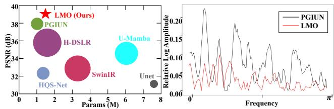
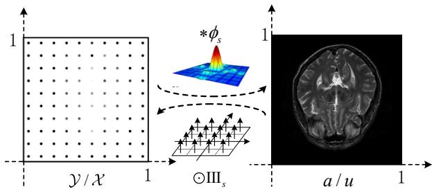
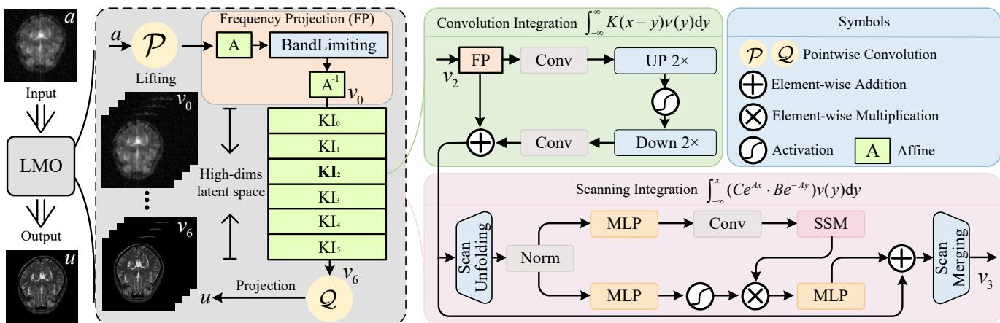
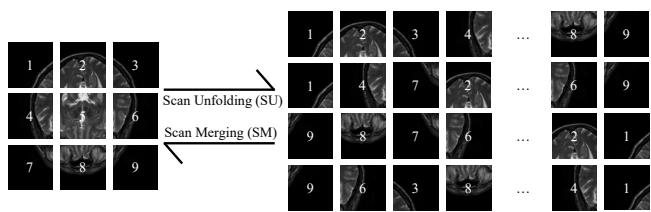
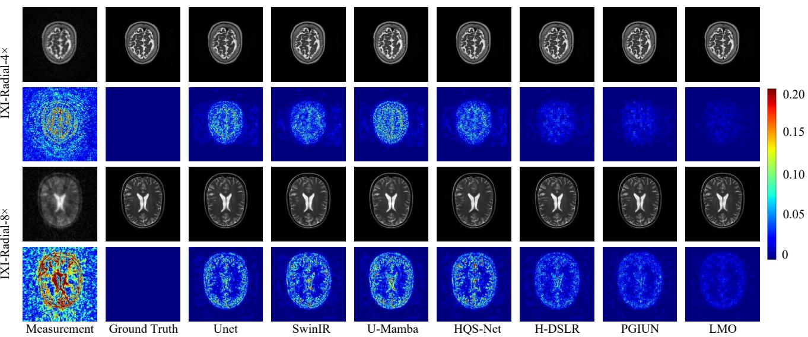

# LMO: Linear Mamba Operator for MRI Reconstruction

Wei Li<sup>1\*</sup>, Jiawei Jiang<sup>1\*</sup>, Jie Wu<sup>1</sup>, Kaihao Yu<sup>1</sup>, Jianwei Zheng<sup>1†</sup> <sup>1</sup>Zhejiang University of Technology, Hangzhou, Zhejiang

## Abstract

Interpretability and consistency have long been crucialfactors in MRI reconstruction. While interpretability has been significantly innovated with the emerging deep unfolding networks, current solutions still suffer from inconsistency issues and produce inferior anatomical structures. Especially in out-of-distribution cases, e.g., when the acceleration rate (AR) varies, the generalization performance is often catastrophic. To counteract the dilemma, we propose an innovative Linear Mamba Operator (LMO) to ensure consistency and generalization, while still enjoying desirable interpretability. Theoretically, we argue that mapping between function spaces, rather than between signal instances, provides a solid foundation of high generalization. Technically, LMO achieves a good balance between global integration facilitated by a state space model that scans the whole function domain, and local integration engaged with an appealing property of continuousdiscrete equivalence. On that basis, learning holistic features can be guaranteed, tapping the potential of maximizing data consistency. Quantitative and qualitative results demonstrate that LMO significantly outperforms other state-of-the-arts. More importantly, LMO is the unique model that, with AR changed, achieves retraining performance without retraining steps. Codes are available at https://github.com/ZhengJianwei2/LMO.

## 1. Introduction

As a dual-free technology, i.e., radiation-free and invasivefree, Magnetic Resonance Imaging (MRI) has become the most effective diagnostic tool for diseases of the brain [41], spinal cord [30], and tumors [24] in modern biomedical science. However, due to hardware limitations, high-quality imaging often requires long scanning times, which may cause discomfort to the patient. A common approach to MRI acceleration is recovering high-quality images from undersampled k-space data, with Compressed Sensing (CS) [31] being the most widely used technique. Unfortunately, although CS has significantly sped up MRI acquisition, undersampled k-space data may suffer from the issue of aliasing error, as it violates the Nyquist theorem. The presence of aliasing artifacts greatly impacts the clinical diagnosis, which is unacceptable in the life and health sciences. To that end, developing new algorithms with excellent data consistency remains an urgent topic.

  
Figure 1. (Left) Comparisons on PSNR and Params/GFLOPs. (Right) Relative log amplitudes of spectral feature maps between the reconstructed image and the Ground Truth.

In common practice, manually added priors such as sparsity [35], total variation (TV) [23], Laplacian [43] and Curvature [59] are used to assist in the reconstruction of the originated signal. Despite excellent performance demonstrated in certain applications, these manually designed priors are often empirically established, which may not entirely capture the complexity of actual MRI data. The approach of jointing multiple priors is considered as palliative, yet introduces additional challenges of tricky model selection and heavy computational burden.

In contrast, deep learning methods capture the implicit knowledge in a data-driven fashion, rather than assuming some explicit priors on MRIs. To date, massive network architectures have been shifted into the accomplishment of MRI reconstruction task, such as convolutional neural networks (CNNs) [47, 54], UNet [14], transformer [10, 11], and Mamba [15, 34, 63], all of which are capable of establishing complex mappings between paired inputs and outputs. However, despite the appealing performance, there are still some notable drawbacks. First, these methods are not specifically tailored for MRI acceleration. Adapting general frameworks that have succeeded in other fields to specific medical applications may not be entirely appropriate. Second, the lack of interpretability is also a significant issue, as a purely deep network is generally known as a black box.

Deep Unrolling Networks (DUNs) [5, 46] and Neural Operators (NOs) [25, 26, 39] are two of the most promising directions to enforce the network architecture with better interpretability. DUNs frame the MRI acceleration problem as an optimization task, embedding domain-specific knowledge directly into network architecture. The representative approaches [16, 52] not only promote interpretability by making the process more transparent but also achieve acceptable performance by leveraging the inherent structure of the MRI data. However, DUNs also have their own suffering. To the best of our knowledge, current unrolling methods typically operate in the original signal space, limiting their ability to capture the intrinsic features of complex signals. Besides, approaches that focus on learning frequency information often fall short in capturing local details, since the k-space, where the original measurements are taken, corresponds to the global spatial domain. Last but not least, the generalizability of such algorithms often leaves much to be desired. NOs, on the other hand, are wellsuited to address these issues. By integral computation in a high-dimensional space, neural operators naturally learn richer features of input functions. More importantly, NOs learn mappings between continuous spaces [22], rather than instances, with the potential for high generalization being maintained. Representatively, NOs based on Fourier [25] and transformer [9, 26] enable the capture of long-range dependencies, yet with relatively heavier complexities of $O ( n \log n )$ and $O ( n ^ { 2 } )$ , respectively. In contrast, based on the convolutions, CNO [39] with $O ( n )$ time complexity is effective in learning localized and fine-grained features. Unfortunately, to date, NOs have never been used for MRI acceleration. In this study, we attempt to fill this gap by innovating a Mamba-based NO variant, which enjoys merits of both holistic feature learning and linear complexity. Some initial results are given in Fig. 1, in which the radius of the circle denotes the metric of GFLOPs. Evidently, other competitors lag behind LMO by a large margin.

Note that despite the advantages of Mamba in $O ( n )$ computational complexity and long-range dependency [62], the absence of a suitable integral form has plagued its naive use in the context of operator learning. We argue that this limited use of the state space model for operator learning stands in complete contrast to the fact that Mambas and their variants are extensively used architectures in visual community [55]. Given their innate globality and computational efficiency, we believe it could be very advantageous to bring Mamba into the reckoning for operator learning. The practical contributions are threefold.

• We individually propose two integral forms, i.e., scanning integration (SI) and convolution integration (CI), to capture both the global and local function features. More importantly, holistic information is achieved with a computational complexity of only $O ( n )$ , tapping the potential for attractive consistency under high efficiency.

• By feeding the two newly elaborated integrations into traditional NO architecture, we then propose an innovative Linear Mamba Operator (LMO), which performs network mapping entirely in bandlimited function spaces, hence enjoying superior generalization, as k-space is a special case of bandlimited function spaces.

• Theoretically, all the computations involved are rooted in solid mathematical deduction, enabling the final model with high interpretability. Empirically, extensive experiments on single- and multi-coil reconstructions demonstrate that LMO outperforms current state-of-the-art both numerically and visually. Codes are available.

Hence, we offer a new NO-based MRI reconstruction model incorporating more holistic features, with favorable properties in theory and excellent performance in practice.

## 2. Related Work

## 2.1. MRI Acceleration

MRI is a non-invasive medical imaging technique that generates detailed images of the internal tissues using magnetic fields and radio waves. Due to the relatively slow imaging speed of MRI, extensive research has been devoted to accelerating the imaging process to enhance its clinical efficiency, among which compressed sensing, deep learning, and deep unrolling networks have drawn the most intensive attention. Compressed sensing [61] seeks to promote reconstruction speed by minimizing data inconsistency during MRI scans. A variety of compressed sensing methods have been introduced, such as sparse regularization [58], low rankness [21, 36], non-local similarity [49] and edge sharpness [18]. Although these handcrafted priors have delivered exceptional performance in specific scenarios, they are usually developed through experience that may not fully capture the complexities of actual MRI data, leading to poor generalization [4]. Recently, deep learning methods have also demonstrated promising results in MRI acceleration. Jethi et al. [14] designed a dual-encoder UNet to capture multi-scale features, yet is still trapped in issues of restricted receptive fields and sensitivity to input variations. The advent of transformers [6, 29, 51, 56] has significantly alleviated these limitations, holding the ability for global modeling with a certain sacrifice of more computational resources. Recently, Ma et al. [34] introduced the U-Mamba architecture, marrying the advantage of multi-scale learning with linear complexity, yet the generalization is still limited. Following the DUN branch, HQS-Net [53] is a pioneering work that utilizes the half-quadratic splitting (HQS) algorithm to process highly undersampled k-space MRI data. Similarly, Jiang et al. [17] innovatively employed a parallel dualdomain update mechanism within a first-order optimizer, setting state-of-the-art scores in in-distribution cases. To further enhance generalization performance, H-DSLR [38] employs a single pre-trained CNN, which adapts to different datasets by functioning as various linear annihilation filterbanks. Overall, current techniques have shown promising results in accelerating MRI reconstruction. However, most of them enjoy part of the practical demands in facilitating clinical diagnosis, leaving much room for improvement.

  
Figure 2. Discrete representation $\mathcal { \boldsymbol { y } } / \mathcal { X }$ and continuous function $a / u$ are related to each other via convolution with ideal interpolation filter $\phi _ { s }$ and pointwise multiplication with Dirac comb III<sub>s</sub>.

## 2.2. Neural Operator

By combining linear integral operators with non-linear activation functions, neural operators [25, 60] were initially proposed for the solving of partial differential equations. The combination allows neural operators to fit mappings between arbitrary function spaces [13], thus achieving promising generalization capabilities. With the booming technology, researchers have moved beyond the vanilla integral forms, engineering new kernels and the concerned operators, such as Oformer [26] using attention-based integral and CNO [39] based on the convolutional integral. Moreover, these days have witnessed the shift of the NO paradigm into the computer vision field. For example, SRNO [48], FNOSeg3D [50], and FNO have been successfully mitigated into image super-resolution, 3D medical segmentation, and pattern classification [19], respectively, knocking out most of the traditional solutions. These successful cases have also inspired us to employ NOs for MRI acceleration.

## 3. Methodology

## 3.1. Problem Setting

Fast MRI reconstruction is considered to recover the target image $\mathcal { X } ~ \in ~ \mathbb { R } ^ { H \times W \times 1 }$ from the undersampled measurement $\mathcal { V } \in \mathbb { R } ^ { H \times W \times 1 }$ . Additionally, we can define Y and X as discrete representations of vector-valued functions $a \ : \ \Omega \ \to \ \mathbb { R } ^ { 1 } , u \ : \ \Omega \ \to \ \mathbb { R } ^ { 1 }$ in Sobolev spaces $\mathcal { A }$ and U respectively, where Ω represents a 2-dimensional bounded domain. As illustrated in Fig. 2, given a discrete grid $y [ y ]$ and a sampling rate s, the Whittaker–Shannon interpolation formula [44] states that the continuous representation $a ( y )$ is obtained by convolving $y [ y ]$ with an ideal interpolation filter $\phi _ { s }$ . This is expressed as $a ( y ) =$ $( \phi _ { s } * \mathcal { V } ) ( y )$ , where $\phi _ { s } ( y ) ~ = ~ \operatorname { s i n c } ( s y _ { 0 } ) \cdot \operatorname { s i n c } ( s y _ { 1 } )$ and sinc $\begin{array} { r } { ( s y _ { i } ) = \frac { \sin ( \pi s y _ { i } ) } { \pi s y _ { i } } , i = 1 , 2 . } \end{array}$ . The filter $\phi _ { s }$ has a bandlimit of $s / 2$ along the horizontal and vertical dimensions, ensuring that the continuous signal $a ( y )$ captures all representable frequencies at the sampling rate $s .$ To convert from the continuous to the discrete domain, $a ( y )$ is sampled at the grid points of $y [ y ]$ , offset by half the sample spacing to lie at the “pixel centers”. This is represented by pointwise multiplication with a two-dimensional Dirac comb $\begin{array} { r } { \operatorname { I I I } _ { s } ( y ) = \sum _ { Y \in \mathbb { Z } ^ { 2 } } \delta \big ( y - ( Y + \frac { 1 } { 2 } ) / s \big ) } \end{array}$ , where Y represents the position indices of sampling points on the integer grid. Similarly, we can achieve the conversion between the continuous function u and its discrete representation $\mathcal { X } .$

Now, the core purpose here involves learning a mapping between two infinite-dimensional continuous spaces via discrete representations of input-output functions, i.e., $\mathcal { G } ^ { \dagger } : \mathcal { A }  \mathcal { U }$ . Generally, the problem concerned can be formally delineated as follows. By constructing a parametric map $\mathcal { G } _ { \theta } : \mathcal { A }  \mathcal { U } _ { \theta }$ , the practice would be to build an approximation of $\mathcal { G } ^ { \dagger }$ from data pairs $( a _ { i } , u _ { i } ) _ { i = 1 } ^ { N } \in \mathcal { A } \times \mathcal { U } .$ with θ in the finite-dimensional space $\mathbb { R } ^ { p }$ . The practical learning of $\mathcal { G } _ { \theta }$ can be naturally addressed through the empirical-risk minimization problem, such as

$$
\begin{array} { r l } & { \displaystyle \underset { \theta \in \mathbb { R } ^ { p } } { \operatorname* { m i n } } \mathbb { E } \| \mathcal { G } ^ { \dag } ( a ) - \mathcal { G } _ { \theta } ( a ) \| _ { \mathcal { U } } ^ { 2 } } \\ & { \approx \displaystyle \operatorname* { m i n } _ { \theta \in \mathbb { R } ^ { p } } \frac { 1 } { N } \sum _ { i = 1 } ^ { N } \| \mathcal { G } ^ { \dag } ( a _ { i } ) - \mathcal { G } _ { \theta } ( a _ { i } ) \| _ { \mathcal { U } } ^ { 2 } , \quad a \in \mathcal { A } . } \end{array}\tag{1}
$$

Considering that the bandlimited function space B, as a subspace of the Sobolev space A and U, facilitates to achieve equivalence between the underlying operator and its discrete representations more easily [2]. Therefore, we select subspace B instead of the original A and U. In this respect, we elaborate the space of bandlimited functions defined by

$$
\mathcal { B } _ { w } ( \Omega ) = \{ f \in L ^ { 2 } ( \Omega ) : \operatorname { s u p p } \widehat { f } \subseteq [ - w , w ] ^ { 2 } \} ,\tag{2}
$$

in which $w > 0$ denotes the frequency bound and $\widehat { f }$ represents the Fourier transform of $f .$ Note that if a bandlimited function can approximate the original function with arbitrary precision (depending on w), then a bandlimited operator mapping between bandlimited functions can also approximate the original operator with arbitrary precision [3, 39]. In other words, for any $\varepsilon > 0$ , there exist a w and a continuous operator $\mathcal { G } _ { \theta } : B _ { w } ( \Omega )  B _ { w } ( \Omega )$ such that $\| \mathcal { G } ^ { \dagger } - \mathcal { G } _ { \theta } \| < \varepsilon$ , with ∥·∥ pertaining to the corresponding operator norm. In addition, let $P _ { w }$ denote a certain frequency projection (FP), as shown in $\mathrm { F i g } . 3 , P _ { w } ( g )$ is capable of discarding the high-frequency components higher than frequency w, where $g \in { \mathcal { A } } ( \Omega )$ is any function in that space. As the underlying operator maps between spaces of bandlimited functions, the operator approximation architecture should be designed in a manner that preserves this structure. That is to say, it implies that our network architecture should be equivalent to the operator handling bandlimited functions when processing discrete versions of bandlimited functions, which we refer to as continuous-discrete equivalence (CDE) in MRI reconstruction. To that end, a Linear Mamba Operator for MRI Reconstruction is engineered to approximate the operator ${ \mathcal { G } } _ { \theta } .$ . Following the standard paradigm adopted by existing NOs [12, 60], our practical approach is similarly based on a compositional mapping:

  
Figure 3. The overall architecture of LMO. The core ingredient lies in the joint scanning and convolution integration.

$$
\mathcal G _ { \boldsymbol \theta } : = \mathcal Q \circ \eta _ { t - 1 } ( W _ { t - 1 } + { \boldsymbol K } _ { t - 1 } ) \circ \cdot \cdot \cdot \circ \eta _ { 0 } ( W _ { 0 } + { \boldsymbol K } _ { 0 } ) \circ \mathcal P ,\tag{3}
$$

where

$$
\mathcal { P } : \left\{ a \in \mathcal { B } _ { w } ( \Omega , \mathbb { R } ^ { 1 } ) \right\} \to \left\{ v _ { 0 } \in \mathcal { B } _ { w } ( \Omega , \mathbb { R } ^ { d _ { 0 } } ) \right\} ,\tag{4a}
$$

$$
\mathcal { Q } : \left\{ v _ { t } \in \mathcal { B } _ { w } ( \Omega , \mathbb { R } ^ { d _ { t } } ) \right\} \to \left\{ u \in \mathcal { B } _ { w } ( \Omega , \mathbb { R } ^ { 1 } ) \right\} ,\tag{4b}
$$

are the lifting and projection mappings respectively, $W _ { t } \in$ $\mathbb { R } ^ { d _ { t + 1 } \times d _ { t } }$ are linear operators in a matrix form, η<sub>t</sub> are activation functions. It is worth noting that all these operations are performed locally or pointwisely, adhering to the principle of discretization invariance [19] to some extent. The general formulation of the kernel integral operator $\mathcal { K } _ { t } : \{ v _ { t } : \Omega \  \ \mathbb { R } ^ { d _ { t } } \} \  \ \{ v _ { t + 1 } : \Omega \  \ \mathbb { R } ^ { d _ { t + 1 } } \}$ is parameterized by α as follows:

$$
( K _ { t } ( v _ { t } ) ; \alpha ) ( x ) = \int _ { \Omega } K _ { t } ( x , y , v _ { t } ( x ) , v _ { t } ( y ) ) v _ { t } ( y ) \mathrm { d } y ,\tag{5}
$$

in which the parameter of kernel $K _ { t }$ is learnt from given data and $x , y \in \Omega$ . For example, transformer-based neural operators $[ 2 6 , 4 8 ]$ use attention mechanisms as its primary operation, while FNO [25, 32] relies on global convolution.

In this work, a new integral form sequentially jointing scanning integration that captures long-range dependencies and convolution integration that learns local bias is crafted, ensuring a holistic feature learning.

## 3.2. Scanning Integration

Building on the scheme in FNO [25, 27], we initially assume that $\mathcal { K } _ { t } : \mathbb { R } ^ { \Omega } \times \mathbb { R } ^ { \Omega }  \mathbb { R } ^ { d _ { t + 1 } \times d _ { t } }$ is primarily influenced by the input pair $( x , y )$ , with minimal dependence on the spatial variables $( v _ { t } ( x ) , v _ { t } ( y ) )$ . Then, we let

$$
K _ { t } ( x , y ) = C e ^ { A x } \cdot B e ^ { - A y } ,\tag{6}
$$

where A, B, and C are temporarily constant parameters, as for an easier deduction purpose. To further ensure a possible employment of the scanning pattern used in Mamba [62], we set the integration interval to $y \in ( - \infty , x )$ rather than the entire definition domain Ω and omit the subscript t from Eq. (5) hereafter, which is originally used to denote the number of iterations during integration flow. Hence, Eq. (5) can be rewritten as follows.

$$
( K ( v ) ; \alpha ) ( x ) = \int _ { - \infty } ^ { x } ( C e ^ { A x } \cdot B e ^ { - A y } ) v ( y ) \mathrm { d } y .\tag{7}
$$

It is evident that $C e ^ { A x }$ does not depend on the integration variable y, allowing Eq. (7) to be reformulated as:

$$
( K ( v ) ; \alpha ) ( x ) = C h ( x ) ,\tag{8}
$$

with $\begin{array} { r } { h ( x ) = e ^ { A x } \int _ { - \infty } ^ { x } B ( e ^ { - A y } ) v ( y ) \mathrm { d } y } \end{array}$ . Additionally, by applying a straightforward differentiation with respect to x, we can obtain the following equation.

$$
\begin{array} { r } { h ^ { \prime } ( x ) = A h ( x ) + B v ( x ) , } \end{array}\tag{9}
$$

which together with Eq. (8) leads to

$$
\begin{array} { c } { { h ^ { \prime } ( x ) = A h ( x ) + B v ( x ) , } } \\ { { ( K ( v ) ) ( x ) = C h ( x ) . } } \end{array}\tag{10}
$$

By now, we have seamlessly married the computation of kernel integral in Eq. (5) with a State Space Model (SSM) [8, 55]. Inspired by the theory of continuous systems, the objective of Eq. (10) is to transform a 2-dimensional function $v ( x )$ to $( \kappa ( \boldsymbol { v } ) ) ( \boldsymbol { x } )$ through the hidden space $h ( x )$ Within this context, A serves as the evolution parameter, while B and C act as the projection parameters. To incorporate $\operatorname { E q . }$ (10) into deep learning paradigm, a discretization process is first required. Note this transformation is crucial to align the model with the sampling rate of the underlying signal embodied in the input data, enabling computationally efficient operations. In contrast to the Monte Carlo approximation commonly applied in traditional integrals, our method utilizes the zero-order hold (ZOH) technique, which can be formally defined as follows.

$$
\begin{array} { l } { \bar { \mathbf { A } } = \exp ( \Delta A ) , } \\ { \bar { \mathbf { B } } = ( \Delta A ) ^ { - 1 } \left( \exp ( \Delta A ) - \mathbf { I } \right) \cdot \Delta B , } \end{array}\tag{11}
$$

where $\Delta$ is a timescale parameter converting continuous parameters A and B into their discrete counterparts A<sup>¯</sup> and B<sup>¯</sup> . Therefore, the discrete representation of Eq. (10) can be formulated as follows.

$$
\begin{array} { c } { h ( x _ { k } ) = \bar { \mathbf { A } } h ( x _ { k - 1 } ) + \bar { \mathbf { B } } v ( x _ { k } ) , } \\ { ( K ( v ) ) ( x _ { k } ) = C h ( x _ { k } ) . } \end{array}\tag{12}
$$

The detailed derivations from Eq. (10) to Eq. (12) can be found in the supplementary material. Our objective is to perform the integration of the 2-dimensional function using a scanning approach, efficiently capturing global information with $O ( n )$ complexity. In Eq. $( 1 2 ) , h ( x _ { k } )$ , representing the hidden space, encapsulates relevant information about the integrated points before x. Therefore, the output can be obtained through global convolution [20, 42]:

$$
\begin{array} { r l } & { \bar { \mathbf { K } } = ( C \bar { \mathbf { B } } , C \bar { \mathbf { A } } \bar { \mathbf { B } } , . . . , C \bar { \mathbf { A } } ^ { ( s - 1 ) } \bar { \mathbf { B } } ) , } \\ & { ( K ( v ) ) ( x ) ( x _ { s } ) = v ( x _ { s } ) * \bar { \mathbf { K } } , } \end{array}\tag{13}
$$

where $\bar { \bf K } \in \mathbb { R } ^ { s }$ represents a structured convolution kernel and s is the sampling rate of input v. The pseudo-code for the Scanning Integration is presented in Algorithm 1.

## 3.3. Convolution Integration

While scanning integration benefits from a global receptive field, we believe that incorporating local convolution integration could further enhance the capture of more holistic features. To commence with, the convolution integration for $\mathcal { K } : \mathcal { B } _ { w } ( \Omega ) \to \mathcal { B } _ { w } ( \Omega )$ is defined as:

$$
\begin{array} { r l r } {  { ( \mathcal { K } ( v ) ; \alpha ) ( x ) = \int _ { \Omega } K ( x - y ) v ( y ) \mathrm { d } y } } \\ & { } & { \approx \displaystyle \sum _ { i , j = 1 } ^ { k } \kappa _ { i j } v ( x - y _ { i j } ) } \end{array}\tag{14}
$$

  
Figure 4. The scan unfolding and scan merging operation integrates pixels from four directions with $O ( n )$ complexity.

where $v \in B _ { w } ,$ κ is a discrete kernel with size $k \in \mathbb N$ and $v ( x - y _ { i j } )$ represents the value of function v at position x shifted by $y _ { i j }$ . Thus, the convolution operator can be intuitively parameterized in physical space, deviating far from the treatments of Fourier transformation and then followed by matrix multiplication, as in FNO [25, 28]. Additionally, since our convolution operates within a bandlimited function space [39], it cleverly avoids the challenge faced by conventional convolutions as discussed in [33]: that as resolution increases, a standard convolutional layer converges to a pointwise operator.

## 3.4. Linear Mamba Operator

With continuous functions as inputs/outputs, the concerns can be organized into an operator architecture, as given in Fig. 3. The input function, represented as $a \in B _ { w } ( \Omega , \mathbb { R } ^ { 1 } )$ is initially lifted and then processed through a Frequency Projection module and a sequence of kernel integration (KI) layers. Recall that the kernel integration consists of two main layers, i.e., scanning integration (Eq. 10) and convolution integration (Eq. 14). Overall, integration is employed functionally to learn mappings between continuous spaces.

The form of convolution integration is as Eq. (14), which is defined using a finite sum, with each term $v ( x - y _ { i j } )$ being regarded as a translation of $v .$ . Since $v \in B _ { w } ( \bar { \Omega } , \mathbb { R } ^ { d } )$ the translation is still in $B _ { w } ( \Omega , \mathbb { R } ^ { d } )$ [39]. Actions such as multiplying by a finite number of constant coefficients $\kappa _ { i j }$ and taking the sum will not cause the function to escape from this space. From another perspective, if the functions in $B _ { w } ( \Omega , \mathbb { R } ^ { d } )$ have certain properties, such as smoothness and rapid decay, then the weighted sum and movement in convolution will not change the basic properties of the function. Therefore, we present the commutative diagram of the convolution integration:

$$
\begin{array} { r l } & { \mathcal { B } _ { w } ( \Omega , \mathbb { R } ^ { d } ) \xrightarrow { C I } \mathcal { B } _ { w } ( \Omega , \mathbb { R } ^ { d } ) } \\ & { \quad \quad \phi _ { s } \bigg \uparrow } \\ & { \quad \quad \ell ^ { 2 } ( \mathbb { Z } ^ { 2 } ) \xrightarrow { \sum k v } \ell ^ { 2 } ( \mathbb { Z } ^ { 2 } ) } \end{array}
$$

where $\displaystyle \sum$ κv is an abbreviated expression form of $\begin{array} { r } { \sum _ { i , j = 1 } ^ { k } \kappa _ { i j } v ( x - y _ { i j } ) } \end{array}$ . Accordingly, the output of scanning integration (also known as SSM) can be defined as a global convolution integral like Eq. (13). Similar to the defined convolution integral, such a global integral is a well-defined operator from $B _ { w } ( \Omega , \mathbb { R } ^ { d } )$ to itself,

$$
\begin{array} { r l } & { \mathcal { B } _ { w } ( \Omega , \mathbb { R } ^ { d } ) \xrightarrow { S S M / S I } \mathcal { B } _ { w } ( \Omega , \mathbb { R } ^ { d } ) } \\ & { \quad \quad \phi _ { s } \bigg \uparrow } \\ & { \quad \quad \ell ^ { 2 } ( \mathbb { Z } ^ { 2 } ) \xrightarrow { \bar { \mathbf { K } } v } \quad \quad \quad \ell ^ { 2 } ( \mathbb { Z } ^ { 2 } ) } \end{array}
$$

where $\bar { \bf K }$ is global convolution kernel in Eq. (13). Practically, the constant parameters A, B, and C in Eq. (8) are better learned from the data, allowing attractive model adaptability. This together with the shifted integral interval, as shown in Eq. (7), enables scan operation within the state space. Finally, as illustrated in Fig. 4, we choose to unfold sampling points into sequences along with rows and columns and then proceed with scanning along four different directions. These sequences are then processed by the SSM block for kernel integration, ensuring that information from multiple directions is thoroughly scanned, thereby capturing a diverse range of function features. Subsequently, the sequences from the four directions are merged to reconstruct the output function. In summary, the above content provides the implementation of the discretized structure of the underlying continuous operator, demonstrating that our algorithm conforms to the continuous-discrete equivalence.

## 3.5. Complexity Analysis of Kernel Integral

Scanning Integration: given a discrete counterpart $v \in$ $R ^ { H \times W \times \bar { D } }$ of a 2-dimensional continuous function, one can reshape it to get $v \in R ^ { n \times D }$ with $n \ = \ H \times W$ . Now, we assume the sequence dimensions of $\Delta , A , B , C$ are all D. As outlined in step 1 of Algorithm 1, the complexity of generating three learnable projections is $O ( 3 n D ^ { 2 } )$ . The discretization steps 2 and 3 involve four matrix multiplications, which cost $O ( 4 n D ^ { 2 } )$ . Step 4, which implements the state space model, has a complexity of $O ( n )$ complexity [7]. In summary, the computations of Algorithm 1 are all linear with the sequence length, $\mathrm { i . e . , } O ( n )$ . Convolution Integration: The local convolution operator is defined by Eq. (14). Evaluating each point involves $k ^ { 2 }$ multiplications. So the time complexity is $O ( n k ^ { 2 } ) \Rightarrow O ( n )$

Due to space constraints, the running efficiency comparisons can be found in the supplementary materials (SM).

## 4. Experiments

In this section, we conduct extensive experiments on opensourced datasets to evaluate the performance of our proposal. The experimental settings are as follows.

Datasets: For evaluating single-channel MRI, two datasets were employed to assess the clinical efficacy of the proposed method: the IXI dataset<sup>\*</sup>, comprising 578 registered T2 images, and the knee fastMRI dataset[57].

```latex
Algorithm 1 Scanning Integration
Input:v(x), a funtion with shape [sampling points (n),
dimension (D)]
Parameters: A, an evolution parameter; ∆, a timescale
parameter; B and $C ,$ projection parameters
Linear Projection Layer: Linear(·)
Output: $v ^ { \prime } ( x ) ~ = ~ ( K ( v ) ) ( x )$ , a function with shape
[sampling points (n), dimension (D)]
1: ∆, B, C = Linear(v), Linear(v), Linear(v). $I / O ( 3 n D ^ { 2 } )$
2: $\bar { \mathbf { A } } = \exp ( \Delta A ) . / / O ( n D ^ { 2 } )$
3: $\bar { \bf B } = \left( \Delta A \right) ^ { - 1 } \left( \exp ( \Delta A ) - { \bf I } \right) \cdot \Delta B . \mathrm { \ } / / O ( 3 n D ^ { 2 } )$
4: $v ^ { \prime } ( x ) = S S M ( \bar { \bf A } , \bar { \bf B } , C ) ( v ( X ) ) ,$ X is a discrete se
quence that contains $x _ { 1 } , x _ { 2 } , \cdot \cdot \cdot , x _ { N } . / { / O } ( n )$
4.1: $h ( x _ { k } ) = \bar { \bf A } h ( x _ { k - 1 } ) + \bar { \bf B } v ( x _ { k } ) ^ { - }$
4.2: $v ^ { \prime } ( x _ { k } ) = C h ( x _ { k } )$
4.3: $v ^ { \prime } ( x ) { \overset { \cdot } { = } } [ v ^ { \prime } ( x _ { 1 } ) , v ^ { \prime } ( x _ { 2 } ) , \cdot \cdot \cdot , v ^ { \prime } ( x _ { N } ) ]$
return $( \boldsymbol { K } ( \boldsymbol { v } ) ) ( \boldsymbol { x } ) = \boldsymbol { v } ^ { \prime } ( \boldsymbol { x } )$
```

For multi-channel MRI evaluation, a brain dataset [1] is employed, which includes fully sampled multi-coil images from five volunteers. Coil sensitivity maps are estimated using ESPIRiT [45] from the central k-space region of each slice. More details about the dataset can be found in the SM.

Competing methods: Six previously reported state-ofthe-art methods are selected, comprising of three deep unfolding methods including HQS-Net [53], H-DSLR [37], and PGIUN [17], as well as three purely deep learningbased methods including Unet [57], SwinIR [29] and U-Mamba [40]. For all competitors, the parameter configurations suggested by the original authors are employed for a fair comparison.

For further details on the experimental implementation, please refer to the SM.

## 4.1. Results and Analysis

Signal Recovery for Single-Coil and Multi-Coil MRI. Table 1 presents the average results of 10 runs for IXI and fastMRI datasets, in which the best and second-best performers are highlighted in different colors. Our first observation is that LMO consistently ranks first. Yet with some marginal lead in partial cells, we believe that the rolling victory is sufficient to demonstrate our advantages over others. Specifically, under a ×4 radial acceleration, LMO achieves a PSNR result of 48.16dB, outperforming others by a large margin. In contrast, Unet, SwinIR, and U-Mamba exhibit relatively unsatisfactory performance, possibly stemming from their disregard for data consistency in network design. Overall, these results verify the positive roles of our employed mechanisms, such as scanning integration and convolution integration. Taking Fig. 1 into account, while HQS-Net and PGIUN lag behind our model consistently in these cases, they enjoy relatively fewer parameters. Besides, while H-DSLR outperforms others except PGIUN and LMO, it suffers from the heaviest model burden. For better fairness, experiments with comparable parameters are also conducted. In practice, we change the number of internal operations, e.g., unrolling stages for PGIUN and convolutions for H-DSLR, until a similar quantity of parameters is reached. The results are shown in Table 2. Evidently, LMO again scores the highest, leading PGIUN, H-DSLR, and HQS-Net by 0.83dB, 1.97dB, and 9.44dB, respectively.

<table><tr><td rowspan="3">AR</td><td rowspan="3">Methods</td><td colspan="6">IXI (Brain)</td><td colspan="6">fastMRI (Knee)</td></tr><tr><td colspan="2">Random</td><td colspan="2">Radial</td><td colspan="2">Equispaced</td><td colspan="2">Random</td><td colspan="2">Radial</td><td colspan="2">Equispaced</td></tr><tr><td colspan="2">PSNR SSIM</td><td colspan="2">PSNR SSIM</td><td colspan="2">PSNR SSIM</td><td colspan="2">PSNR SSIM</td><td colspan="2">PSNR SSIM</td><td colspan="2">PSNR SSIM</td></tr><tr><td rowspan="8">×4</td><td rowspan="8">Unet SwinIR</td><td>31.28</td><td>0.954</td><td>34.03</td><td>0.935</td><td></td><td>30.22</td><td>0.946</td><td>27.96</td><td>0.811</td><td>28.69 0.830</td><td>27.26</td><td>0.780</td></tr><tr><td>32.51</td><td>0.962</td><td>35.57</td><td>0.940</td><td>31.30</td><td>0.951</td><td>28.45</td><td>0.822</td><td>29.50</td><td>0.840</td><td>28.12</td><td>0.794</td></tr><tr><td>U-Mamba</td><td>32.10</td><td>0.958</td><td>34.03</td><td>0.930</td><td>30.92</td><td>0.945</td><td>28.17</td><td>0.813</td><td>28.93</td><td>0.833</td><td>27.57 0.782</td></tr><tr><td>HQS-Net</td><td>32.49</td><td>0.948</td><td>35.14</td><td>0.969</td><td>30.34</td><td>0.942</td><td>28.57</td><td>0.819</td><td>29.32</td><td>0.839 27.82</td><td>0.787</td></tr><tr><td>H-DSLR</td><td>36.01</td><td>0.982</td><td>45.31</td><td>0.994</td><td>33.65</td><td>0.968</td><td>29.04 0.834</td><td>30.23</td><td>0.866</td><td>28.25</td><td>0.799</td></tr><tr><td>PGIUN</td><td>37.98</td><td>0.985</td><td>47.09</td><td>0.994</td><td>35.51</td><td>0.978</td><td>30.02</td><td>0.850</td><td>30.98</td><td>0.876</td><td>28.55 0.809</td></tr><tr><td>LMO (Ours)</td><td>39.14</td><td>0.986</td><td>48.16 0.996</td><td>35.70</td><td>0.980</td><td>30.17</td><td>0.853</td><td>31.11</td><td>0.883</td><td>28.65</td><td>0.832</td></tr><tr><td colspan="2">Unet</td><td>29.06 0.932</td><td>29.86</td><td>0.890</td><td>27.91</td><td>0.922</td><td>26.38</td><td>0.754</td><td>26.42</td><td>0.723</td><td>26.21</td><td>0.745</td></tr><tr><td rowspan="7">×8</td><td>SwinIR</td><td>30.13</td><td>0.947</td><td>29.79</td><td>0.891</td><td>28.54</td><td>0.925</td><td>27.41</td><td>0.768</td><td>27.88</td><td>0.742</td><td>27.26</td><td>0.752</td></tr><tr><td>U-Mamba</td><td>29.88</td><td>0.935</td><td>29.31</td><td>0.879</td><td>28.06</td><td>0.923</td><td>26.89</td><td>0.758</td><td>27.75</td><td>0.765</td><td>26.89</td><td>0.748</td></tr><tr><td>HQS-Net</td><td>28.70</td><td>0.923</td><td>29.02</td><td>0.921</td><td>27.40</td><td>0.909</td><td>26.64</td><td>0.755</td><td>27.82</td><td>0.764</td><td>26.42</td><td>0.747</td></tr><tr><td>H-DSLR</td><td>31.96</td><td>0.955</td><td>34.50</td><td>0.971</td><td>29.80</td><td>0.938</td><td>27.04</td><td>0.762</td><td>27.28</td><td>0.741</td><td>26.84</td><td>0.752</td></tr><tr><td>PGIUN</td><td>34.15</td><td>0.970</td><td>36.21</td><td>0.980</td><td>31.74</td><td>0.957</td><td>27.83</td><td>0.783</td><td>28.01</td><td>0.791</td><td>27.41</td><td>0.768</td></tr><tr><td>LMO (Ours)</td><td>34.26</td><td>0.971</td><td>36.53</td><td>0.983</td><td>31.80</td><td>0.960</td><td>27.88</td><td>0.808</td><td>28.29</td><td>0.837</td><td>27.51</td><td>0.787</td></tr><tr><td></td><td></td><td></td><td></td><td></td><td></td><td></td><td></td><td></td><td></td><td></td><td></td><td></td></tr></table>

Table 1. The numerical results under three masks as well as ×4 and ×8 ARs.

<table><tr><td>Methods</td><td>PSNR</td><td>SSIM</td><td>FLOPs (G)</td><td>Params (M)</td></tr><tr><td rowspan="3">HQS-Net H-DSLR PGIUN</td><td>38.7219.6%</td><td>0.9831.3%</td><td>116.68 0.0%</td><td>1.78 0.0%</td></tr><tr><td>46.194.1%</td><td>0.994 0.2%</td><td>295.52▲ 153.8%</td><td>1.79▲ 0.6%</td></tr><tr><td>47.331.7%</td><td>0.995v0.1%</td><td>115.38v0.9%</td><td>1.78 0.0%</td></tr><tr><td>LMO (Ours)</td><td>48.16</td><td>0.996</td><td>116.44</td><td>1.78</td></tr></table>

Table 2. Comparisons of HQS-Net, H-DSLR, PGIUN, and LMO under comparable parameters (IXI-Radial-×4).
<table><tr><td rowspan="2">AR</td><td rowspan="2">Methods</td><td colspan="2">Multi-coil Reconstructions</td></tr><tr><td>PSNR</td><td>SSIM</td></tr><tr><td>×6</td><td>Unet SwinIR U-Mamba HQS-Net H-DSLR PGIUN LMO (Ours)</td><td>32.3722.0% 32.2822.2% 32.8021.0% 35.5114.5% 38.09 8.3% 40.33V2.9% 41.52</td><td>0.9227.2% 0.88710.8% 0.9316.3% 0.9474.7% 0.9633.1% 0.989▼0.5%</td></tr></table>

Table 3. The numerical results on multi-coil reconstructions.

<table><tr><td rowspan="2">SG</td><td colspan="2">LMO</td><td colspan="2">PGIUN</td><td colspan="2">H-DSLR</td></tr><tr><td>PSNR</td><td>SSIM</td><td>PSNR</td><td>SSIM</td><td>PSNR</td><td>SSIM</td></tr><tr><td>×4 to ×4</td><td>48.16</td><td>0.996</td><td>47.09</td><td>0.994</td><td>45.31</td><td>0.994</td></tr><tr><td>×4 to ×6</td><td>43.76</td><td>0.989</td><td>41.06</td><td>0.982</td><td>29.80</td><td>0.835</td></tr><tr><td>×4 to ×8</td><td>30.25</td><td>0.860</td><td>28.31</td><td>0.826</td><td>24.10</td><td>0.746</td></tr><tr><td>×8 to ×4</td><td>43.50</td><td>0.988</td><td>29.80</td><td>0.941</td><td>29.20</td><td>0.754</td></tr><tr><td>×8 to ×6</td><td>41.98</td><td>0.985</td><td>32.58</td><td>0.963</td><td>31.50</td><td>0.850</td></tr><tr><td>×8 to ×8</td><td>36.53</td><td>0.983</td><td>36.21</td><td>0.980</td><td>34.50</td><td>0.971</td></tr></table>

Table 4. Generalization comparisons across various scales. Bold and italic denote different performance trends (IXI-Radial).

Comparisons of target contrast and the error maps concerned are given in Fig. 5. The texture of the error serves as an indicator of the efficacy of the restoration, with a smoother and bluer surface indicating a better reconstruction. As evidenced, given the input that suffers substantial aliasing artifacts and lacks anatomical details, most of the selected methods are qualified for recovering a clear MR image. Yet comparatively, it is evident that from the error maps, LMO is capable of recovering more details and exhibiting fewer visible artifacts, surpassing all the other competitors. The improvement in visual quality can again be attributed to the employment of global scanning integration and local convolution integration.

To transition from a single-coil to a multi-coil scenario, it is necessary to use coil sensitivity maps that weight the signals from 12 different positions, reducing artifacts and noise [1]. Given this operation, the proposed LMO is readily available for multi-coil reconstruction, with the representative results from ×6 accelerate rate of random masks given in Table 3. As shown, LMO again consistently outperforms other competing models by a large margin. For refer-

IXI-Radial-4×

IXI-Radial-8×

  
Figure 5. Visual results and error maps on IXI dataset with radial mask ×4 and radial mask ×8 ARs.

ence, the SM include a visual comparison of multi-coil reconstructions performed under identical conditions. As evidenced, LMO has delivered strong stability and reliability in both single- and multi-coil MRI acceleration. We attribute this to the neural operator architecture that performs mapping between bandlimited function spaces, as they maintain consistency with the physical sampling constraints of k-space, while the neural operator provides generalization to handle different sampling constraints.

Generalization Analysis. Taking PGIUN and H-DSLR as competing baselines, the experimental results of scale generalization (SG) with the radial mask are given in Table 4. Representatively, the symbol ‘×4 to ×8’ denotes the case of training at a ×4 scale and testing at a ×8 scale. Notably, LMO is the only algorithm that shows improved performance when trained at a scale of 8 and generalized to lower scales. We attribute this to the advantage of LMO which mappings between function spaces, rather than the typical instance-to-instance mappings. This also empirically demonstrates that our proposal enjoys continuous-discrete equivalence with the underlying continuous operator.

Ablation Experiments. To affirm the benefit of combining both global and local information, Table 5 discloses results pertaining to the ablation of Scanning and Convolution integration. Based on our final configuration, the scanning integration is replaced with convolution integral, thus obtaining baseline 1 with pure local terms. Similarly, we can also obtain baseline 3, which holds pure scanning integration. To ensure a fair comparison, the parameters of all three competitors are configured at the same level. As expected, due to the lack of partial information, the performance of pure convolution integration (CI) and pure scanning integration (SI) drops by 13.48dB and 7.71dB, respectively. In terms of efficiency, while baseline 1 enjoys fewer Params and FLOPs in this case, it cannot be ensured in practice since more network layers are often needed for a larger receptive field. Due to space limitations, we have placed more ablation experiments in SM.

<table><tr><td>Config</td><td>PSNR</td><td>SSIM</td><td>Params (M)</td><td>FLOPs (G)</td></tr><tr><td>1. Pure CI</td><td>34.6828.0%</td><td>0.80719.0%</td><td>1.74 2.2%</td><td>89.66 23.0%</td></tr><tr><td>2. CI+SI *</td><td>48.16</td><td>0.996</td><td>1.78</td><td>116.44</td></tr><tr><td>3. Pure SI</td><td>40.4516.0%</td><td>0.89610.0%</td><td>1.81▲1.7%</td><td>138.56▲19.0%</td></tr></table>

Table 5. The ablation results by using different forms of kernel integrals. \* indicates our default choice.

## 5. Conclusion

In conclusion, this study presents a novel Linear Mamba Operator for MRI reconstruction (LMO), enjoying both theoretical support and empirical evidence, hence effectively addressing the limitations, such as weak consistency or poor interpretability, of traditional or deep learning methods. Specifically, by integrating the scanning and convolution integral layers, our proposal ensures both global and local feature extraction, significantly enhancing the reconstruction quality. More importantly, due to the nature of learning mappings between high-dimensional continuous functions, LMO enjoys a high generalization in cases of different acceleration rates, which is a challenging issue for most current methods. Extensive experiments conducted on single- and multi- coil MRI recovery both demonstrate that our proposed method outperforms existing state-of-the-art methods in both quantitative and qualitative metrics. Future work will focus on exploring the applicability of LMO to other medical imaging modalities, thus broadening its impact on the medical field.

## Acknowledgements

This work was supported in part by the Key Program of Natural Science Foundation of Zhejiang Province under Grant LZ24F030012, the National Natural Science Foundation of China under Grant 62276232, Zhejiang Students’ Technology and Innovation Program under Grant 2024R403B071, and the China Postdoctoral Science Foundation under grant ZY24211190002.

## References

[1] Hemant K Aggarwal, Merry P Mani, and Mathews Jacob. Modl: Model-based deep learning architecture for inverse problems. IEEE Transactions on Medical Imaging, 38(2): 394–405, 2018. 6, 7

[2] Francesca Bartolucci, Emmanuel de Bezenac, Bogdan´ Raonic, Roberto Molinaro, Siddhartha Mishra, and Rima´ Alaifari. Are neural operators really neural operators? frame theory meets operator learning. SAM Research Report, 2023, 2023. 3

[3] Francesca Bartolucci, Emmanuel de Bezenac, Bogdan´ Raonic, Roberto Molinaro, Siddhartha Mishra, and Rima Alaifari. Representation equivalent neural operators: a framework for alias-free operator learning. Advances in Neural Information Processing Systems, 36, 2024. 3

[4] Jiacheng Chen, Jiawei Jiang, Fei Wu, and Jianwei Zheng. Null space matters: Range-null decomposition for consistent multi-contrast mri reconstruction. In Proceedings of the AAAI Conference on Artificial Intelligence, pages 1081– 1090, 2024. 2

[5] Zhile Chen, Yuhui Quan, and Hui Ji. Unsupervised deep unrolling networks for phase unwrapping. In Proceedings of the IEEE/CVF Conference on Computer Vision and Pattern Recognition, pages 25182–25192, 2024. 2

[6] Yuchao Feng, Honghui Xu, Jiawei Jiang, Hao Liu, and Jianwei Zheng. Icif-net: Intra-scale cross-interaction and interscale feature fusion network for bitemporal remote sensing images change detection. IEEE Transactions on Geoscience and Remote Sensing, 60:1–13, 2022. 2

[7] Albert Gu and Tri Dao. Mamba: Linear-time sequence modeling with selective state spaces. arXiv preprint arXiv:2312.00752, 2023. 6

[8] Albert Gu, Karan Goel, and Christopher Re. Efficiently mod eling long sequences with structured state spaces. In International Conference on Learning Representations, 2021. 5

[9] Yubin Gu, Honghui Xu, Yueqian Quan, Wanjun Chen, and Jianwei Zheng. Orsi salient object detection via bidimensional attention and full-stage semantic guidance. IEEE Transactions on Geoscience and Remote Sensing, 61:1–13, 2023. 2

[10] Yubin Gu, Siting Chen, Xiaoshuai Sun, Jiayi Ji, Yiyi Zhou, and Rongrong Ji. Optical remote sensing image salient object detection via bidirectional cross-attention and attention restoration. Pattern Recognition, page 111478, 2025. 1

[11] Pengfei Guo, Yiqun Mei, Jinyuan Zhou, Shanshan Jiang, and Vishal M Patel. Reconformer: Accelerated mri reconstruc-

tion using recurrent transformer. IEEE Transactions on Medical Imaging, 2023. 1

[12] Zhongkai Hao, Zhengyi Wang, Hang Su, Chengyang Ying, Yinpeng Dong, Songming Liu, Ze Cheng, Jian Song, and Jun Zhu. Gnot: A general neural operator transformer for operator learning. In International Conference on Machine Learning, pages 12556–12569. PMLR, 2023. 4

[13] Kurt Hornik, Maxwell Stinchcombe, and Halbert White. Multilayer feedforward networks are universal approxima tors. Neural Networks, 2(5):359–366, 1989. 3

[14] Amrit Kumar Jethi, Balamurali Murugesan, Keerthi Ram, and Mohanasankar Sivaprakasam. Dual-encoder-unet for fast mri reconstruction. In 2020 IEEE 17th International Symposium on Biomedical Imaging Workshops (ISBI Work shops), pages 1–4. IEEE, 2020. 1, 2

[15] Zexin Ji, Beiji Zou, Xiaoyan Kui, Pierre Vera, and Su Ruan. Deform-mamba network for mri super-resolution. In International Conference on Medical Image Computing and Computer-Assisted Intervention, pages 242–252. Springer, 2024. 1

[16] Jiawei Jiang, Jiacheng Chen, Honghui Xu, Yuchao Feng, and Jianwei Zheng. Ga-hqs: Mri reconstruction via a generically accelerated unfolding approach. In 2023 IEEE International Conference on Multimedia and Expo (ICME), pages 186– 191. IEEE, 2023. 2

[17] Jiawei Jiang, Zihan He, Yueqian Quan, Jie Wu, and Jianwei Zheng. Pgiun: Physics-guided implicit unrolling network for accelerated mri. IEEE Transactions on Computational Imaging, 2024. 2, 6

[18] Min Jiang, Fuhao Zhai, and Jun Kong. A novel deep learning model ddu-net using edge features to enhance brain tu mor segmentation on mr images. Artificial Intelligence in Medicine, 121:102180, 2021. 2

[19] Samira Kabri, Tim Roith, Daniel Tenbrinck, and Martin Burger. Resolution-invariant image classification based on fourier neural operators. In International Conference on Scale Space and Variational Methods in Computer Vision, pages 236–249. Springer, 2023. 3, 4

[20] Yoshinobu Kawahara. Dynamic mode decomposition with reproducing kernels for koopman spectral analysis. Advances in neural information processing systems, 29, 2016. 5

[21] Ziwen Ke, Wenqi Huang, Zhuo-Xu Cui, Jing Cheng, Sen Jia, Haifeng Wang, Xin Liu, Hairong Zheng, Leslie Ying, Yanjie Zhu, et al. Learned low-rank priors in dynamic mr imaging. IEEE Transactions on Medical Imaging, 40(12):3698–3710, 2021. 2

[22] Nikola Kovachki, Zongyi Li, Burigede Liu, Kamyar Azizzadenesheli, Kaushik Bhattacharya, Andrew Stuart, and Anima Anandkumar. Neural operator: Learning maps between function spaces with applications to pdes. Journal of Ma chine Learning Research, 24(89):1–97, 2023. 2

[23] Peng Li, Wengu Chen, and Michael K Ng. Compressive total variation for image reconstruction and restoration. Comput ers & Mathematics with Applications, 80(5):874–893, 2020. 1

[24] Xiaodong Li, Yunkai Bao, Zhuheng Li, Peihong Teng, Lina Ma, Hua Zhang, Guifeng Liu, and Zhenxin Wang. Employing antagonistic cxc motif chemokine receptor 4 antagonistic peptide functionalized nagdf4 nanodots for magnetic resonance imaging-guided biotherapy of breast cancer. Scientific Reports, 14(1):15764, 2024. 1

[25] Zongyi Li, Nikola Borislavov Kovachki, Kamyar Azizzadenesheli, Kaushik Bhattacharya, Andrew Stuart, Anima Anandkumar, et al. Fourier neural operator for parametric partial differential equations. In International Conference on Learning Representations, 2020. 2, 3, 4, 5

[26] Zijie Li, Kazem Meidani, and Amir Barati Farimani. Transformer for partial differential equations’ operator learning. Transactions on Machine Learning Research, 2022. 2, 3, 4

[27] Zongyi Li, Daniel Zhengyu Huang, Burigede Liu, and Anima Anandkumar. Fourier neural operator with learned deformations for pdes on general geometries. Journal of Machine Learning Research, 24(388):1–26, 2023. 4

[28] Zongyi Li, Nikola Kovachki, Chris Choy, Boyi Li, Jean Kossaifi, Shourya Otta, Mohammad Amin Nabian, Maximilian Stadler, Christian Hundt, Kamyar Azizzadenesheli, et al. Geometry-informed neural operator for large-scale 3d pdes. Advances in Neural Information Processing Systems, 36, 2024. 5

[29] Jingyun Liang, Jiezhang Cao, Guolei Sun, Kai Zhang, Luc Van Gool, and Radu Timofte. Swinir: Image restoration using swin transformer. In Proceedings of the IEEE/CVF International Conference on Computer Vision, pages 1833–1844, 2021. 2, 6

[30] Wei-Jie Liao, Bo-Lin Sun, Jia-Bao Wu, Ning Zhang, Rong-Ping Zhou, Shan-Hu Huang, Zhi-Li Liu, and Jia-Ming Liu. Role of magnetic resonance imaging features in diagnosing and localization of disc rupture related to cervical spinal cord injury without radiographic abnormalities. Spinal Cord, 61 (6):323–329, 2023. 1

[31] Jingshuai Liu, Chen Qin, and Mehrdad Yaghoobi. Highfidelity mri reconstruction using adaptive spatial attention selection and deep data consistency prior. IEEE Transactions on Computational Imaging, 9:298–313, 2023. 1

[32] Ning Liu, Siavash Jafarzadeh, and Yue Yu. Domain agnostic fourier neural operators. Advances in Neural Information Processing Systems, 36, 2024. 4

[33] Miguel Liu-Schiaffini, Julius Berner, Boris Bonev, Thorsten Kurth, Kamyar Azizzadenesheli, and Anima Anandkumar. Neural operators with localized integral and differential kernels. In Forty-first International Conference on Machine Learning, 2024. 5

[34] Jun Ma, Feifei Li, and Bo Wang. U-mamba: Enhancing long-range dependency for biomedical image segmentation. arXiv preprint arXiv:2401.04722, 2024. 1, 2

[35] Marko Panic, Jan Aelterman, Vladimir Crnojevi´ c, and Alek-´ sandra Pizurica. Sparse recovery in magnetic resonanceˇ imaging with a markov random field prior. IEEE Transactions on Medical Imaging, 36(10):2104–2115, 2017. 1

[36] Jiangjun Peng, Yao Wang, Hongying Zhang, Jianjun Wang, and Deyu Meng. Exact decomposition of joint low rankness and local smoothness plus sparse matrices. IEEE Transac-

tions on Pattern Analysis and Machine Intelligence, 45(5): 5766–5781, 2022. 2

[37] Aniket Pramanik, Hemant Kumar Aggarwal, and Mathews Jacob. Deep generalization of structured low-rank algorithms (deep-slr). IEEE Transactions on Medical Imaging, 39(12):4186–4197, 2020. 6

[38] Aniket Pramanik, Hemant Kumar Aggarwal, and Mathews Jacob. Deep generalization of structured low-rank algorithms (deep-slr). IEEE Transactions on Medical Imaging, 39(12):4186–4197, 2020. 3

[39] Bogdan Raonic, Roberto Molinaro, Tim De Ryck, Tobias Rohner, Francesca Bartolucci, Rima Alaifari, Siddhartha Mishra, and Emmanuel de Bezenac. Convolutional neural´ operators for robust and accurate learning of pdes. Advances in Neural Information Processing Systems, 36, 2024. 2, 3, 5

[40] Jiacheng Ruan and Suncheng Xiang. Vm-unet: Vision mamba unet for medical image segmentation. arXiv preprint arXiv:2402.02491, 2024. 6

[41] Mariam Saad, Isaac V Manzanera Esteve, Adam G Evans, Huseyin Karagoz, Tigran Kesayan, Krista Brooks-Horrar, Saikat Sengupta, Ryan Robison, Brian Johnson, Richard Dortch, et al. Preoperative visualization of the greater occipital nerve with magnetic resonance imaging in candidates for occipital nerve decompression for headaches. Scientific Reports, 14(1):15248, 2024. 1

[42] Yousef Saad. Analysis of some krylov subspace approximations to the matrix exponential operator. SIAM Journal on Numerical Analysis, 29(1):209–228, 1992. 5

[43] Mrinmoy Sandilya and SR Nirmala. Compressed sensing mri reconstruction using convolutional dictionary learning and laplacian prior. In IOT with Smart Systems: Proceedings ofICTIS 2021, Volume 2, pages 661–669. Springer, 2022. 1

[44] Claude Elwood Shannon. Communication in the presence of noise. Proceedings ofthe IRE, 37(1):10–21, 1949. 3

[45] Martin Uecker, Peng Lai, Mark J Murphy, Patrick Virtue, Michael Elad, John M Pauly, Shreyas S Vasanawala, and Michael Lustig. Espirit—an eigenvalue approach to autocalibrating parallel mri: where sense meets grappa. Magnetic Resonance in Medicine, 71(3):990–1001, 2014. 6

[46] Kaidong Wang, Xiuwu Liao, Jun Li, Deyu Meng, and Yao Wang. Hyperspectral image super-resolution via knowledgedriven deep unrolling and transformer embedded convolutional recurrent neural network. IEEE Transactions on Image Processing, 2023. 2

[47] Yueze Wang, Yanwei Pang, and Chuan Tong. Dsmenet: Detail and structure mutually enhancing network for undersampled mri reconstruction. Computers in Biology and Medicine, 154:106204, 2023. 1

[48] Min Wei and Xuesong Zhang. Super-resolution neural operator. In Proceedings of the IEEE/CVF Conference on Computer Vision and Pattern Recognition, pages 18247–18256, 2023. 3, 4

[49] Yu-Hui Wen, Lin Gao, Hongbo Fu, Fang-Lue Zhang, Shihong Xia, and Yong-Jin Liu. Motif-gcns with local and nonlocal temporal blocks for skeleton-based action recognition. IEEE Transactions on Pattern Analysis and Machine Intelligence, 45(2):2009–2023, 2022. 2

[50] Ken CL Wong, Hongzhi Wang, and Tanveer Syeda-Mahmood. Fnoseg3d: Resolution-robust 3d image segmentation with fourier neural operator. In 2023 IEEE 20th International Symposium on Biomedical Imaging (ISBI), pages 1–5. IEEE, 2023. 3

[51] Jie Wu, Yuchao Feng, Honghui Xu, Chuanmeng Zhu, and Jianwei Zheng. Syformer: structure-guided synergism transformer for large-portion image inpainting. In Proceedings of the AAAI conference on artificial intelligence, pages 6021– 6029, 2024. 2

[52] Jingfen Xie, Jian Zhang, Yongbing Zhang, and Xiangyang Ji. Puert: Probabilistic under-sampling and explicable reconstruction network for cs-mri. IEEE Journal of Selected Topics in Signal Processing, 16(4):737–749, 2022. 2

[53] Bingyu Xin, Timothy Phan, Leon Axel, and Dimitris Metaxas. Learned half-quadratic splitting network for mr image reconstruction. In International Conference on Medical Imaging with Deep Learning, pages 1403–1412. PMLR, 2022. 2, 6

[54] Honghui Xu, Chuangjie Fang, Yilin Ge, Yubin Gu, and Jianwei Zheng. Cascade-transform-based tensor nuclear norm for hyperspectral image super-resolution. IEEE Transactions on Geoscience and Remote Sensing, 2024. 1

[55] Rui Xu, Shu Yang, Yihui Wang, Bo Du, and Hao Chen. A survey on vision mamba: Models, applications and challenges. arXiv preprint arXiv:2404.18861, 2024. 2, 5

[56] Syed Waqas Zamir, Aditya Arora, Salman Khan, Munawar Hayat, Fahad Shahbaz Khan, and Ming-Hsuan Yang. Restormer: Efficient transformer for high-resolution image restoration. In Proceedings of the IEEE/CVF Conference on Computer Vision and Pattern Recognition, pages 5728– 5739, 2022. 2

[57] Jure Zbontar, Florian Knoll, Anuroop Sriram, Tullie Murrell, Zhengnan Huang, Matthew J Muckley, Aaron Defazio, Ruben Stern, Patricia Johnson, Mary Bruno, et al. fastmri: An open dataset and benchmarks for accelerated mri. arXiv preprint arXiv:1811.08839, 2018. 6

[58] Mingli Zhang, Mingyan Zhang, Fan Zhang, Ahmad Chaddad, and Alan Evans. Robust brain mr image compressive sensing via re-weighted total variation and sparse regression. Magnetic Resonance Imaging, 85:271–286, 2022. 2

[59] Xuemin Zhang, Jianwei Ma, and Hao Zhang. Curvatureregularized manifold for seismic data interpolation. Geophysics, 88(1):WA37–WA53, 2023. 1

[60] Jianwei Zheng, Wei Li, Ni Xu, Junwei Zhu, and Xiaoqin Zhang. Alias-free mamba neural operator. Advances in Neural Information Processing Systems, 37:52962–52995, 2024. 3, 4

[61] Shenglong Zhou and Geoffrey Ye Li. Federated learning via inexact admm. IEEE Transactions on Pattern Analysis and Machine Intelligence, 45(8):9699–9708, 2023. 2

[62] Lianghui Zhu, Bencheng Liao, Qian Zhang, Xinlong Wang, Wenyu Liu, and Xinggang Wang. Vision mamba: Efficient visual representation learning with bidirectional state space model. arXiv preprint arXiv:2401.09417, 2024. 2, 4

[63] Jing Zou, Lanqing Liu, Qi Chen, Shujun Wang, Xiaohan Xing, and Jing Qin. Mmr-mamba: Multi-contrast mri re-