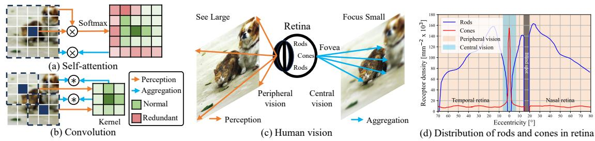
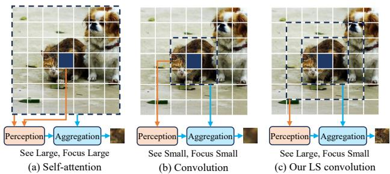
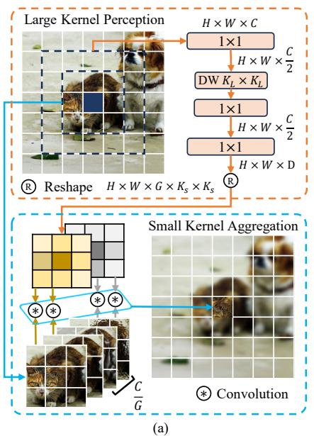
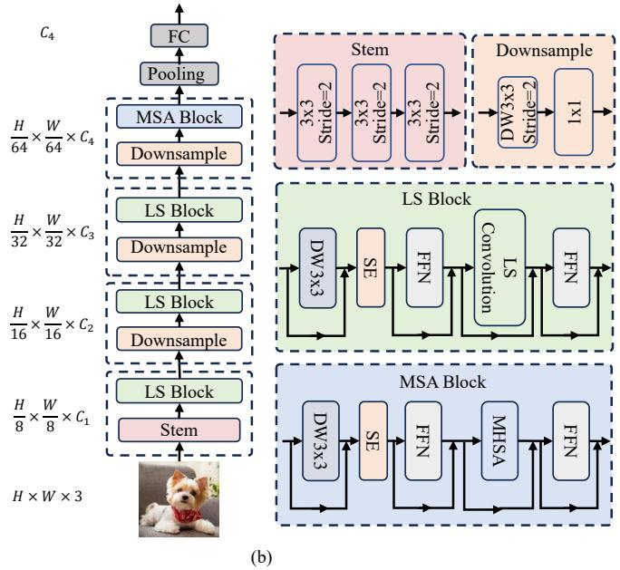

# LSNet: See Large, Focus Small

Ao Wang1 Hui Chen2\* Zijia Lin1 Jungong Han3 Guiguang Ding1 1School of Software, Tsinghua University 2BNRist, Tsinghua University 3Department of Automation, Tsinghua University

wanga24@mails.tsinghua.edu.cn jichenhui2012@gmail.com linzijia07@tsinghua.org.cn jungonghan77@gmail.com dinggg@tsinghua.edu.cn

## Abstract

Vision network designs, including Convolutional Neural Networks and Vision Transformers, have significantly advanced thefield ofcomputer vision. Yet, their complex computations pose challenges for practical deployments, particularly in real-time applications. To tackle this issue, researchers have explored various lightweight and efficient network designs. However, existing lightweight models predominantly leverage self-attention mechanisms and convolutions for token mixing. This dependence brings limitations in effectiveness and efficiency in the perception and aggregation processes of lightweight networks, hindering the balance between performance and efficiency under limited computational budgets. In this paper, we draw inspiration from the dynamic heteroscale vision ability inherent in the efficient human vision system and propose a “See Large, Focus Small” strategy for lightweight vision network design. We introduce LS (Large-Small) convolution, which combines large-kernel perception and smallkernel aggregation. It can efficiently capture a wide range of perceptual information and achieve precise feature aggregation for dynamic and complex visual representations, thus enabling proficient processing of visual information. Based on LS convolution, we present LSNet, a new family of lightweight models. Extensive experiments demonstrate that LSNet achieves superior performance and efficiency over existing lightweight networks in various vision tasks. Codes and models are available at https: //github.com/jameslahm/lsnet.

## 1. Introduction

Vision network designs have consistently been a focal point of research in the field of computer vision [17, 22, 24, 50, 51, 96], where two prominent network architectures, i.e., Convolutional Neural Networks (CNNs) [24, 29, 38, 39, 51] and Vision Transformers (ViTs) [17, 50, 63, 74, 88, 93], have significantly pushed the boundaries in various computer vision tasks [3, 4, 23, 70, 82, 84, 92]. However, both of them have traditionally been computationally expensive, presenting remarkable challenges for their practical deployments, especially for real-time applications [44, 49].

Recently, researchers have been actively exploring the lightweight and efficient designs of vision networks [7, 34, 55, 57, 60, 76] for practical applications. Despite effective, these lightweight models typically rely on certain basic modules, such as self-attention mechanism [17, 77, 86] and convolution [38, 39], for token mixing [73]. This reliance poses challenges regarding the efficiency and effectiveness of the underlying perception and aggregation processes within lightweight networks, often compromising the architectural expressiveness or inference speed.

Essentially, contextual perception and aggregation are core processes for token mixing [19, 73, 91], facilitating spatial information fusion. Perception models contextua relationships among tokens, while aggregation integrates token features based on corresponding relationships. In existing lightweight models, two dominant token mixing approaches, self-attention and convolution, employ distinct perception and aggregation processes. Specifically, selfattention employs global perception through holistic feature interaction and global aggregation via weighted sum of all features. Convolution uses the relative positional relationships among tokens for perception and aggregates features with static kernel weights. However, as shown in Fig. 1.(a) and (b), both approaches have limitations. (1) Self-attention often introduces excessive attention to regions lacking significant interconnections, leading to less critical aggregation, e.g., in less informative background [46, 65]. Besides, its perception and aggregation share the same mixing scope. The expansion of context in self-attention and its variants [19, 33, 49] comes at the expense of notable computational complexity. These hinder lightweight models from pursuing high representational ability under low computational budgets. (2) In convolution, the relationships among tokens modeled by the perception, i.e., the aggregation weights, are determined by the fixed kernel weights. Consequently, while efficient, convolution lacks sensitivity to varying contextual neighborhoods. This imposes constraints on the expressiveness of lightweight models, especially considering that the model capabilities of lightweight networks are inherently limited. Given these, exploring a token mixing way for lightweight models with more effective and efficient perception and aggregation processes under limited computational costs is imperative.

  
Figure 1. The mechanism of self attention (a) and convolution (b). (c) shows that the human vision system can “See Large” through the peripheral vision, and “Focus Small” through the central vision. (d) shows the distribution of rods and cones depending on the eccentricit from the fovea of the human eye. They contribute to the formation of extensive peripheral vision and focal central vision.

To this end, we first thoroughly inspect the intuitions underlying the processes of perception and aggregation. We discover that they align closely with the phenomenon of dynamic heteroscale vision ability in the efficient human vision system. Specifically, as shown in Fig. 1.(c), the human vision system follows dual-step mechanism: (1) The broad overview of the scene is firstly captured through the peripheral vision’s large-field perception [62, 69], i.e., “See Large”. (2) Subsequently, attention can be directed towards specific elements of the scene, enabling a detailed comprehension facilitated by the central vision’s small-field aggregation [59, 69], i.e., “Focus Small”. Such characteristic arises from distinct spatial distribution and vision abilities of two types of photoreceptor cells in the retina [36, 62], i.e., rod cells and cone cells, as shown in Fig. 1.(d). Rod cells are widely distributed in the peripheral regions of retina [59] and produce relatively unsharp images with limited spatial detail [78]. However, they exhibit broad responses across the visible spectrum and contribute to large-field peripheral vision in conjunction with cone cells in the retina periphery [72], allowing “See Large”. Furthermore, cone cells are primarily concentrated in the fovea, a small area for central vision [87]. The fovea contains a high density of cone cells, which constitute the sharpest region capable of capturing fine details and complex features [35, 75, 78], enabling “Focus Small”. Guided by efficient large-field perception of the peripheral photoreceptor cells, the fovea can effectively focus on precise imaging of subtle features via small-field aggregation [62]. This “See Large, Focus Small” approach empowers the human vision system to process visual information swiftly and proficiently [78], thereby facilitating accurate and efficient visual comprehension.

These inspections motivate us to design effective and efficient vision networks with the ability to perceive large fields and aggregate small fields. To this end, we first propose a novel operation, Large-Small (LS) convolution, which aims to emulate the “See Large, Focus Small” strategy observed in human vision system, thereby extracting discriminative visual patterns. Generally, LS convolution employs a large-kernel static convolution for largefield perception and a small-kernel dynamic convolution for small-field aggregation. Rather than simply combining large-kernel and small-kernel convolutions, it firstly leverages broad contextual information captured by large-kernel depth-wise convolution to model the spatial relationships. Then, parameterized by them, a small-kernel dynamic convolution operation with group mechanism is constructed to fuse features within highly related visual field. In this way, large-kernel static convolution well perceive the enlarged neighborhood information, leading to improved relationship modeling, like the peripheral vision system. Furthermore, benefiting from this, small-kernel dynamic convolution can adaptively aggregate the intricate visual features in small surroundings, enabling detailed visual understanding like the central vision system. Meanwhile, we delicately design LS convolution efficiently with depth-wise convolution and group mechanism. The aggregation scope is limited in a small region. These well ensure the low complexity of both perception and aggregation processes. Consequently, our LS convolution prioritizes both the performance and efficiency, enabling lightweight models to fully harness the representational capability under low computational costs.

We consider LS convolution as the fundamental operation of token mixing and integrate it with other common architecture designs to form a LS block. Building upon the LS block, we present a new family of lightweight models, dubbed LSNet. Extensive experiments demonstrate that LSNet achieves superior performance and efficiency compared with existing state-of-the-art lightweight models in various vision tasks [11, 47, 99]. We hope that LSNet can serve as a strong baseline and inspire further advancements in the field of lightweight and efficient models.

## 2. Related Work

Efficient CNNs. CNNs have emerged as the fundamental network architecture in various vision tasks [2, 15, 16, 52, 66, 79] over the past decade. To facilitate their practical applications, researchers have devoted significant efforts to designing lightweight and efficient networks [12, 13, 30, 31, 53, 71, 81]. For example, MobileNet [31] and Xception [8] proposes architectures utilizing depth-wise separable convolutions. MobileNetV2 [67] introduces inverted residual blocks with linear bottleneck for improving efficiency. ShuffleNet [98] and ShuffleNetV2 [53] incorporate channel shuffling and channel split operations to enhance group information exchange. Hardware-aware neural architecture search (NAS) has also been explored to obtain compact vision networks [30, 71]. Meanwhile, considering the limited receptive field, some works have explored enhancing lightweight CNNs’ capability for modeling long-range dependencies [34, 61, 95]. For example, ParC-Net [95] introduces position aware circular convolution to boast a global receptive field. AFFNet [34] presents adaptive frequency filtering for global convolution via a circular padding.

Efficient ViTs. Later, since the inception of Vision Transformer [17], transformer-based architectures have gained significant popularity in the field of computer vision. ViTs have been adapted to diverse vision tasks and shown superior performance [18, 97]. Meanwhile, efforts have been made to enhance the efficiency, resulting in lightweight ViTs for practical deployments [44, 58, 76, 80]. For example, MobileViT [57] combines MobileNet blocks and MHSA blocks, achieving a hybrid architecture. EdgeViT [60] proposes the integration of self-attention and convolutions to achieve cost-effective information exchange. Besides, to alleviate the inference bottleneck, EfficientFormer [44] presents a dimension-consistent design paradigm that enhances the latency and performance tradeoff. FastViT [76] introduces structural re-parameterization and large-kernel convolutions to enhance hybrid ViTs.

Efficient Token Mixing. CNNs and ViTs adopt different token mixing ways, i.e., convolution and self-attention, respectively, along with distinct perception and aggregation processes. Based on them, to develop lightweight vision networks, researchers have explored different efficient token mixing ways for spatial information exchange. For example, for convolution, Involution [41] leverages MLP for perception to derive the aggregation weights conditioned on single pixel. CondConv [90] proposes per-example routing with global context to linearly combining multiple convolution kernels. For self-attention, EdgeNeXt [55] presents split depth-wise transpose attention (SDTA) to mix multiscale features. PVTv2 [85] employs linear spatial reduction attention (LSRA) to achieve linear computational complexity for the attention layer. EfficientViT [49] designs the cascaded group attention to enhance capability efficiently.

  
Figure 2. Comparison of self-attention, convolution, and LS conv.

## 3. Methodology

## 3.1. Revisiting Self-Attention and Convolution

Self-attention and convolution are two prominent token mixing ways [93] for modeling visual features in existing lightweight networks. For an input image, given its feature map $\boldsymbol { X } \in \mathbb { R } ^ { H \times W \times C }$ where $H \times W$ is the spatial resolution and C is the number of channels, token mixing generates the feature representation $y _ { i } \in \mathbb { R } ^ { C }$ for each token $x _ { i } \in \mathbb { R } ^ { C }$ based on its contextual region $\mathcal { N } ( x _ { i } )$ by:

$$
y _ { i } = \mathcal { A } ( \mathcal { P } ( x _ { i } , \mathcal { N } ( x _ { i } ) ) , \mathcal { N } ( x _ { i } ) ) ,\tag{1}
$$

where $\mathcal { P }$ denotes perception, involving extracting contextual information and capturing the relationships among tokens, and A denotes aggregation, integrating the features based on the outcome of perception and enabling the incorporation of information from other tokens.

In self-attention, its perception $\mathcal { P } _ { a t t n }$ obtains the attention scores between $x _ { i }$ and $\dot { X }$ through the pairwise correlations after softmax normalization. Its aggregation $\mathcal { A } _ { a t t n }$ weights the features of X by attention scores to obtain $y _ { i } .$ As shown in Fig. 2.(a), the process can be summarized as:

$$
y _ { i } = \mathcal { A } _ { a t t n } ( \mathcal { P } _ { a t t n } ( x _ { i } , X ) , X ) = \mathcal { P } _ { a t t n } ( x _ { i } , X ) ( X W _ { v } ) ;\tag{2}
$$

$$
\mathcal { P } _ { a t t n } ( x _ { i } , X ) = \operatorname { s o f t m a x } ( ( x _ { i } W _ { q } ) ( X W _ { k } ) ^ { T } ) ,\tag{3}
$$

where $W _ { q } , \ W _ { k }$ and $W _ { v }$ are the projection matrices. It can be observed that $\mathcal { P } _ { a t t r }$ and $\mathcal { A } _ { a t t n }$ involve redundant attention and excessive aggregation in less informative regions [46, 65], limiting the efficacy of lightweight models. Moreover, they operate at the same contextual scale for $x _ { i }$ Such a homoscale property leads to the notable computational complexity when increasing the mixing scope ${ \mathcal { N } } ( x _ { i } )$ imposing challenges in expanding the perception context under low computational budgets. Thus, self-attention and its variants in existing lightweight models [19, 49] struggle to achieve an optimal balance between representation capability and efficiency with limited computation cost [34].

For convolution with the kernel size of K, the contextual region is the neighborhood of size $K \times K$ centered around $x _ { i }$ , denoted as $\mathcal { N } _ { K } ( \boldsymbol { x } _ { i } )$ . The perception $\mathcal { P } _ { c o n v }$ utilizes the relative positions between $x _ { i }$ and $\mathcal { N } _ { K } ( \boldsymbol { x } _ { i } )$ ) to derive the aggregation weights. For each $x _ { j } \in \mathcal { N } _ { K } ( x _ { i } )$ , its aggregation weight is the value at the corresponding relative position in the fixed convolutional kernel weights $W _ { c o n v }$ . The aggregation $A _ { c o n v }$ then leverages the weights to convolve the features in $\mathcal { N } _ { K } ( \boldsymbol { x } _ { i } )$ . As shown in Fig. 2.(b), the whole process can be formulated as:

$$
y _ { i } = \mathcal { A } _ { c o n v } ( \mathcal { P } _ { c o n v } ( x _ { i } , \mathcal { N } _ { K } ( x _ { i } ) ) , \mathcal { N } _ { K } ( x _ { i } ) )
$$

$$
= \mathcal { P } _ { c o n v } ( x _ { i } , \mathcal { N } _ { K } ( x _ { i } ) ) \circledast \mathcal { N } _ { K } ( x _ { i } ) ;\tag{4}
$$

$$
\mathcal { P } _ { c o n v } \left( x _ { i } , \mathcal { N } _ { K } ( x _ { i } ) \right) = W _ { c o n v } ,\tag{5}
$$

where $\circledast$ denotes the convolution operation. It can be observed that the token mixing scope in convolution is determined by kernel size K which is usually small for lightweight models, thus resulting in a limited perception range. Besides, the relationships among tokens modeled by the perception $\mathcal { P } _ { c o n v } , i . e .$ ., the aggregation weights, depend only on the relative positions and thus are shared and fixed for all tokens. It prevents tokens from adapting to their related context, restricting the expressive ability. Such limitation becomes particularly pronounced considering the inherently small modeling capability of lightweight networks.

## 3.2. LS (Large-Small) Convolution

Inspired by dynamic heteroscale vision ability exhibited by human vision system [59, 62, 72], we introduce a novel “See Large, Focus Small” strategy for the perception and aggregation processes, aiming for efficient and effective token mixing in lightweight models, as shown in Fig. 2.(c). Our approach enables the effective collection of comprehensive contextual information and modeling of the relationships by large-field perception. It further facilitates detailed visual representations through efficient fusion in highly related surroundings by small-field aggregation. Specifically, for token $x _ { i } .$ , with the contextual regions of perception and aggregation as $\mathcal { N } _ { P } ( x _ { i } )$ and $\textstyle { \mathcal { N } } _ { A } ( x _ { i } )$ , respectively, where $\mathcal { N } _ { P } ( x _ { i } )$ encompasses a larger spatial extent compared with $\mathcal { N } _ { A } ( x _ { i } )$ , the process can be formulated as:

$$
y _ { i } = \mathcal { A } ( \mathcal { P } ( x _ { i } , \mathcal { N } _ { P } ( x _ { i } ) ) , \mathcal { N } _ { A } ( x _ { i } ) ) .\tag{6}
$$

It can be observed that (1) The perception $\mathcal { P }$ and aggregation A involves different contextual scopes, $i . e . , \mathcal { N } _ { P } ( x _ { i } )$ and $\textstyle { \mathcal { N } } _ { A } ( x _ { i } )$ , respectively, allowing for utilizing heteroscale contextual information and capturing both the overall context and fine-grained details. (2) For the perception with a large spatial extent, cost-effective operations, such as large-kernel depth-wise convolution, can be employed. The perception context can thus be enlarged with minimal overhead. (3) For the aggregation with a small surrounding region, we can adopt adaptive weighted feature summation. Due to the limited range of aggregation, the efficiency can be guaranteed with low computation cost and the less important aggregation in self-attention can be mitigated.

Based on these, we present a novel LS (Large-Small) convolution. As shown in Fig. 3.(a), for each token, it introduces two steps: (1) Large-kernel perception $\mathcal { P } _ { l s }$ models the neighborhood relationships with the enlarged receptive field through large-kernel static convolutions. (2) Small-kernel aggregation $\boldsymbol { A } _ { l s }$ adaptively integrates the surrounding features through small-kernel dynamic convolution.

Large-Kernel Perception (LKP) adopts the design of a large-kernel bottleneck block. Given visual feature map $X \in \mathbb { R } ^ { H \times W \times C }$ , we initially utilize the point-wise convolution $( \mathrm { P W } )$ to project the tokens into a lower channel dimension, $i . e . , \frac { C } { 2 }$ by default, to reduce the computational cost and make the model lightweight as possible. For $x _ { i } ,$ , we then employ large-kernel depth-wise convolution (DW) with the kernel size of $K _ { L } \times K _ { L }$ to efficiently capture large-field spatial contextual information of $\mathcal { N } _ { K _ { L } } ( x _ { i } )$ , where $\mathcal { N } _ { K _ { L } } ( x _ { i } )$ denotes the surroundings of size $K _ { L } \times K _ { L }$ centered around $x _ { i }$ . The large-kernel DW can well expand the receptive field and enhance the context perception capability under minimal cost. We then leverage point-wise convolutions (PW) to model the spatial relationships among tokens, $i . e .$ , generating the context-adaptive weights $W \in \mathbb { R } ^ { H \times W \times D }$ for the aggregation step. The whole process can be formulated as:

$$
\begin{array} { r l } & { { \boldsymbol { w } } _ { i } = { \mathcal { P } } _ { l s } ( x _ { i } , { \mathcal { N } } _ { K _ { L } } ( x _ { i } ) ) } \\ & { \quad = \mathrm { P W } ( \mathrm { D W } _ { K _ { L } \times K _ { L } } ( \mathrm { P W } ( { \mathcal { N } } _ { K _ { L } } ( x _ { i } ) ) ) ) , } \end{array}\tag{7}
$$

where $w _ { i } \in \mathbb { R } ^ { D }$ is the generated weights for $x _ { i }$

Small-Kernel Aggregation (SKA) employs the design of grouped dynamic convolutions. For the visual feature map $\boldsymbol { X } \overset { \bullet } { \in } \mathbb { R } ^ { \pmb { \check { H } } \times \boldsymbol { W } \times \boldsymbol { C } }$ , we divide its channels into $G$ groups. Each group containing $\frac { C } { G }$ channels and the channels in the same group share the aggregation weights, to reduce the memory overhead and computational cost for lightweight models. For each $x _ { i }$ , we reshape its corresponding weights $w _ { i } ~ \in ~ \mathbb { R } ^ { D }$ generated by large-kernel perception to obtain $w _ { i } ^ { * } \in \mathbb { R } ^ { G \times \bar { K } _ { S } \times K _ { S } }$ , where $K _ { S } \times K _ { S }$ is the small kernel size. We then leverage $\boldsymbol { w } _ { i } ^ { * }$ to aggregate its highly related context of $\mathcal { N } _ { K _ { S } } ( x _ { i } )$ , where $\mathcal { N } _ { K _ { S } } ( x _ { i } )$ represents the neighborhood of size $K _ { S } \times K _ { S }$ centered around $x _ { i }$ . Specifically, we denote the c-th channel of $x _ { i } \mathrm { a s } x _ { i c } ,$ , which belongs to the g-th channel group. We obtain its aggregated feature representation $y _ { i c }$ through the convolution operation between $\mathcal { N } _ { K _ { S } } ( x _ { i c } )$ and $w _ { i g } ^ { * } \bar { \in } \mathbb { R } ^ { K _ { S } \times K _ { S } }$ . In this way, the adaptive fine-grained features can be effectively represented, making model sensitive to dynamic and complex changes in diverse contexts. The whole process can be formulated as:

$$
y _ { i c } = \mathcal { A } _ { l s } ( w _ { i g } ^ { * } , \mathcal { N } _ { K _ { S } } ( x _ { i c } ) ) = w _ { i g } ^ { * } \circledast \mathcal { N } _ { K _ { S } } ( x _ { i c } ) .\tag{8}
$$

In contrast to simply combining large-kernel with smallkernel conv, and other dynamic convs, our LKP utilizes enriched large-field visual perception to guide adaptive feature fusion within highly related context by SKA. This enables more discriminative representations for intricate visual information. Thus, LS conv shows superiority over them, as shown in Tab. 6 and Tab. 7. We also present the comparisons from mathematical perspectives in supplementary.

  
Figure 3. (a) The illustration of our proposed LS convolution. (b) The illustration of our proposed LSNet. LSNet has four stages with $\begin{array} { r } { \frac { H } { 8 } \times \frac { W } { 8 } , \frac { \dot { H } } { 1 6 } \times \frac { W } { 1 6 } , \frac { H } { 3 2 } \times \frac { W } { 3 2 } } \end{array}$ , and $\begin{array} { r } { \frac { H } { 6 4 } \times \frac { W } { 6 4 } } \end{array}$ resolutions respectively, where H and W denote the width and height of the input image. C represents the channel dimension. The norm layer and nonlinearity are omitted for simplicity.

Complexity Analysis. The computation of LS convolution mainly consists of three parts: point-wise convolutions in $\mathcal { P } _ { l s } ,$ depth-wise convolution with kernel size of $K _ { L }$ in $P _ { l s } ,$ and convolution aggregation with kernel size of $K _ { S }$ in $A _ { l s } .$ . Their corresponding computations are $\begin{array} { r } { \mathcal { O } ( \frac { 3 H W C ^ { 2 } } { 4 } + \frac { H W C D } { 2 } ) , \mathcal { O } ( \frac { H W \dot { C } K _ { L } ^ { 2 } } { 2 } ) } \end{array}$ , and $\mathcal { O } ( H W C K _ { S } ^ { 2 } )$ , respectively. Therefore, the total amount is $\mathcal { O } ( \frac { H W C } { 4 } ( 3 C +$ $2 K _ { L } ^ { 2 } + ( 2 G + 4 ) K _ { S } ^ { 2 } ) )$ ), enjoying the linear computational complexity with respect to the input resolution.

## 3.3. LSNet: Large-Small Network

Using LS convolution as the primary operation, we present the basic block, i.e., LS block, and the lightweight model design, i.e., LSNet, as shown in Fig. 3.(b).

LS Block leverages LS convolution to perform effective token mixing. Skip connection is adopted to facilitate model optimization. Besides, we utilize the extra depthwise convolution and SE layer [32] to enhance model capability by introducing more local inductive bias [10, 49]. Feed forward network (FFN) is adopted for channel mixing.

LSNet utilizes overlapping patch embedding [89] to project the input image into the visual feature map. For downsampling, we leverage the depth-wise and point-wise convolution to reduce the spatial resolution and modulate the channel dimension, respectively. Besides, we stack LS blocks in the top three stages. In the last stage, we adopt the MSA block to capture long-range dependencies due to the small resolution, following [57, 76]. MSA block incorporates multi-head self-attention (MHSA), and we utilize the same depth-wise convolution and SE layer to introduce more local structural information like LS block.

We build three LSNet variants for different computational budgets. The LSNet with tiny size (LSNet-T), small size (LSNet-S), and base size (LSNet-B) has 0.3G, 0.5G, and 1.3G FLOPs, respectively. Following [21, 49], we employ more blocks in late stages, due to that processing on early stages with higher resolution is more time consuming. We empirically use $K _ { L } = 7 , K _ { S } = 3$ , and $\begin{array} { r } { G = \frac { C } { 8 } } \end{array}$ for all model variants by default, following [13, 51]. The architectural details can be found in the supplementary.

## 4. Experiments

## 4.1. Image Classification

We conduct experiments on ImageNet-1K [11] under the same training recipe as [34, 49, 60] to assess the performance of LSNet on the image classification task.

As shown in Tab. 1, we note that LSNet consistently achieves state-of-the-art performance across various computational costs. Besides, it shows the best trade-offs between accuracy and inference speed. For example, our LSNet-B outperforms the advanced AFFNet by 0.5% top-1 accuracy with a nearly 3× faster inference speed. It also surpasses RepViT-M1.1 and FastViT-T12 with 0.9% and 1.2% top-1 accuracies with higher efficiency, respectively. For smaller models, our LSNet also obtains superior performance with lower computation costs. Specifically, LSNet-S outperforms UniRepLKNet-A and FasterNet-T1 significantly by 0.8% and 1.6% top-1 accuracies, respectively, along with higher throughput. Compared with StarNet-S1 and EfficientViT-M3, LSNet-T also improves the top-1 accuracy by 1.4% and 1.5%, respectively. These results well show the effectiveness and efficiency of our LSNet models.

Table 1. Classification results on ImageNet-1K. The throughput is tested on a Nvidia RTX3090 with maximum power-of-two batch size that fits in memory, following [34, 49]. \* denotes the results with distillation using the RegNetY-16GF [64] with 82.9% top-1 accuracy as the teacher model. EFormer denotes EfficientFormer.
<table><tr><td>Model</td><td>Params (M)</td><td>FLOPs (G)</td><td>Throughput (img/s)</td><td>Top-1 (%)</td></tr><tr><td>EdgeNeXt-XXS [55]</td><td>1.3</td><td>0.3</td><td>5089</td><td>71.2</td></tr><tr><td>FasterNet-T0 [5]</td><td>3.9</td><td>0.3</td><td>14467</td><td>71.9</td></tr><tr><td>ShuffleNetV2 [53]</td><td>3.5</td><td>0.3</td><td>9593</td><td>72.6</td></tr><tr><td>AFFNet-ET [34]</td><td>1.4</td><td>0.4</td><td>2877</td><td>73.0</td></tr><tr><td>EfficientViT-M3 [49]</td><td>6.9</td><td>0.3</td><td>14613</td><td>73.4</td></tr><tr><td>StarNet-S1 [54]</td><td>2.9</td><td>0.4</td><td>5034</td><td>73.5</td></tr><tr><td>LSNet-T</td><td>11.4</td><td>0.3</td><td>14708</td><td>74.9</td></tr><tr><td>LSNet-T*</td><td>11.4</td><td>0.3</td><td>14708</td><td>76.1</td></tr><tr><td>EdgeNeXt-XS [55]</td><td>2.3</td><td>0.5</td><td>3118</td><td>75.0</td></tr><tr><td>PVT-Tiny [84]</td><td>13.2</td><td>1.9</td><td>2125</td><td>75.1</td></tr><tr><td>MobileNetV3-L [30]</td><td>5.4</td><td>0.2</td><td>7921</td><td>75.2</td></tr><tr><td>FastViT-T8 [76]</td><td>3.6</td><td>0.7</td><td>3909</td><td>75.6</td></tr><tr><td>EFormerV2-S0* [45]</td><td>3.5</td><td>0.4</td><td>1329</td><td>75.7</td></tr><tr><td>FasterNet-T1 [5]</td><td>7.6</td><td>0.9</td><td>8660</td><td>76.2</td></tr><tr><td>UniRepLKNet-A [14]</td><td>4.4</td><td>0.6</td><td>3931</td><td>77.0</td></tr><tr><td>EfficientNet-B0 [71]</td><td>5.3</td><td>0.4</td><td>4481</td><td>77.1</td></tr><tr><td>PoolFormer-S12 [93]</td><td>12.0</td><td>1.8</td><td>2769</td><td>77.2</td></tr><tr><td>SHViT-S3 [94]</td><td>14.2</td><td>0.6</td><td>8993</td><td>77.4</td></tr><tr><td>RepViT-M0.9 [81]</td><td>5.1</td><td>0.8</td><td>4817</td><td>77.4</td></tr><tr><td>LSNet-S</td><td>16.1</td><td>0.5</td><td>9023</td><td>77.8</td></tr><tr><td>LSNet-S*</td><td>16.1</td><td>0.5</td><td>9023</td><td>79.0</td></tr><tr><td>EdgeViT-XS [60]</td><td>6.7</td><td>1.1</td><td>2751</td><td>77.5</td></tr><tr><td>SwiftFormer-S* [68]</td><td>6.1</td><td>1.0</td><td>3376</td><td>78.5</td></tr><tr><td>UniRepLKNet-F [14]</td><td>6.2</td><td>0.9</td><td>3209</td><td>78.6</td></tr><tr><td>FastViT-T12 [76]</td><td>6.8</td><td>1.4</td><td>2586</td><td>79.1</td></tr><tr><td>EFormer-L1* [44]</td><td>12.3</td><td>1.3</td><td>3280</td><td>79.2</td></tr><tr><td>EdgeNeXt-S [55]</td><td>5.6</td><td>1.3</td><td>2128</td><td>79.4</td></tr><tr><td>RepViT-M1.1 [81]</td><td>8.2</td><td>1.3</td><td>3604</td><td>79.4</td></tr><tr><td>PVT-Small [84]</td><td>24.5</td><td>3.8</td><td>1160</td><td>79.8</td></tr><tr><td>AFFNet [34]</td><td>5.5</td><td>1.5</td><td>1355</td><td>79.8</td></tr><tr><td>LSNet-B</td><td>23.2</td><td>1.3</td><td>3996</td><td>80.3</td></tr><tr><td>LSNet-B*</td><td>23.2</td><td>1.3</td><td>3996</td><td>81.6</td></tr></table>

## 4.2. Downstream Tasks

Object Detection and Instance Segmentation. We evaluate LSNet on object detection and instance segmentation tasks to verify its transferability. Following [49, 60], we integrate LSNet into RetinaNet [48] and Mask R-CNN [25] and conduct experiments on COCO-2017 [47]. As shown in Tab. 2, our LSNet consistently shows superior performance compared with competitor models. Specifically, in the RetinaNet framework for object detection, LSNet-T outperforms StarNet-S1 by 0.6 AP and $1 . 3 \mathrm { A P } _ { 5 0 }$ under notably less computational cost. For large models, our LSNet-B also surpasses PoolFormer-S12 and PVT-Tiny with considerable margins of 3.0 AP and 2.5 AP, respectively. When integrated into the Mask R-CNN framework for object detection and instance segmentation, LSNet-S obtains the favorable improvements of $0 . 5 \mathrm { A P } ^ { b }$ and $2 . 5 \mathrm { A P } ^ { b }$ over SHViT-S3 and EfficientViT-M5, respectively. Compared with RepViT-M1.1, LSNet-B also achieves 1.0 higher APb and 0.6 higher APm, demonstrating the superiority in transferring.

Semantic Segmentation. We evaluate LSNet on the semantic segmentation task by conducting experiments on ADE20K [99]. Following [44, 60], we incorporate LSNet in the Semantic FPN [37] segmentation model. As shown in Tab. 3, LSNet performs clearly better in all comparisons across different model scales. It can achieve superior performance under low computational costs. Specifically, LSNet-T significantly outperforms VAN-B0 by 1.6 mIoU, and it also achieves 2.9 higher mIoU over PVTv2-B0. For larger models, LSNet-S obtains the improvements of 0.4 mIoU and 1.0 mIoU over the advanced RepViT-M1.1 and SHViT-S3, respectively, with lower computational complexity. Additionally, LSNet-B surpasses SwiftFormer-L1 and FastViT-SA24 by margins of 1.6 and 2.0 mIoUs respectively. These results further show the efficacy of LSNet.

## 4.3. Robustness Evaluation

We conduct robustness evaluation for LSNet on various benchmarks, including ImageNet-C [26], ImageNet-A [28], ImageNet-R [27], and ImageNet-Sketch [83]. Following [51, 56, 76], we report mean corruption error (lower is better) for ImageNet-C and top-1 accuracies for other datasets. As shown in Table 4, LSNet shows strong domain generalization capabilities and promising robustness to corruptions, achieving state-of-the-art performance. For example, compared with UniRepLKNet-A, LSNet-B exhibits a 1.3 mCE reduction on ImageNet-C, along with top-1 accuracy gains of 1.2%, 1.5%, and 1.5% on ImageNet-A, ImageNet-R, and ImageNet-Sketch, respectively. LSNet-T also outperforms StarNet-S1 significantly by 2.2% and 3.7% on ImageNet-A and ImageNet-Sketch, respectively, highlighting the robust generalization ability.

## 4.4. Model Analyses

We conduct experiments to analyze the design elements in LSNet on ImageNet-1K. Following [21, 49], all models are trained for 100 epochs for limitations in training time and computation resource. LSNet-T is employed for analyses, with $K _ { L } = 7 , K _ { S } = 3$ and $C / G = 8$ , by default.

Effectiveness of LS convolution. We analyze the effectiveness of our proposed LS convolution by first comparing it with “w/o LS conv.”, in which all LS convolutions are replaced with identity functions. As shown in Tab. 5, our LS convolution improves 2.3% top-1 accuracy with only

Table 2. Object detection and instance segmentation results on COCO. $\mathsf { A P } ^ { \mathrm { b } }$ and $\mathbf { A P } ^ { \mathrm { m } }$ indicate bounding box AP and mask AP, respectively. Following common convention [76], FLOPs (G) of backbone is measured on image crops of 512×512.
<table><tr><td rowspan="2">Backbone</td><td rowspan="2"> $\mathrm { F L O P s }$ </td><td colspan="6">RetinaNet</td><td colspan="6">Mask R-CNN</td></tr><tr><td>AP</td><td> $\mathrm { A P _ { 5 0 } }$ </td><td> $\mathrm { A P _ { 7 5 } }$ </td><td> $\mathsf { A P } _ { S }$ </td><td> $\mathsf { A P } _ { M }$ </td><td> $\mathsf { A P } _ { L }$ </td><td> $\mathsf { A P } ^ { \mathrm { b } }$ </td><td> $\mathrm { \sf A P _ { 5 0 } ^ { b } }$ </td><td> $\mathsf { A P } _ { 7 5 } ^ { \mathrm { b } }$ </td><td> $\mathbf { A P } ^ { \mathrm { m } }$ </td><td> $\mathsf { A P } _ { 5 0 } ^ { \mathrm { m } }$ </td><td> $\mathsf { A P } _ { 7 5 } ^ { \mathrm { m } }$ </td></tr><tr><td>MobileNetV2 [67]</td><td>1.6</td><td>28.3</td><td>46.7</td><td>29.3</td><td>14.8</td><td>30.7</td><td>38.1</td><td>29.6</td><td>48.3</td><td>31.5</td><td>27.2</td><td>45.2</td><td>28.6</td></tr><tr><td>MobileNetV3 [30]</td><td>1.1</td><td>29.9</td><td>49.3</td><td>30.8</td><td>14.9</td><td>33.3</td><td>41.1</td><td>29.2</td><td>48.6</td><td>30.3</td><td>27.1</td><td>45.5</td><td>28.2</td></tr><tr><td>FairNAS-C [9]</td><td>1.7</td><td>31.2</td><td>50.8</td><td>32.7</td><td>16.3</td><td>34.4</td><td>42.3</td><td>31.8</td><td>51.2</td><td>33.8</td><td>29.4</td><td>48.3</td><td>31.0</td></tr><tr><td>EfficientViT-M4 [49]</td><td>1.6</td><td>32.7</td><td>52.2</td><td>34.1</td><td>17.6</td><td>35.3</td><td>46.0</td><td>32.8</td><td>54.4</td><td>34.5</td><td>31.0</td><td>51.2</td><td>32.2</td></tr><tr><td>StarNet-S1 [54]</td><td>2.2</td><td>33.6</td><td>53.3</td><td>35.1</td><td>18.3</td><td>36.0</td><td>47.0</td><td>33.8</td><td>56.1</td><td>35.5</td><td>31.9</td><td>52.9</td><td>33.4</td></tr><tr><td>LSNet-T</td><td>1.5</td><td>34.2</td><td>54.6</td><td>35.2</td><td>17.8</td><td>37.1</td><td>48.5</td><td>35.0</td><td>57.0</td><td>37.3</td><td>32.7</td><td>53.8</td><td>34.3</td></tr><tr><td>ResNet18 [24]</td><td>9.5</td><td>31.8</td><td>49.6</td><td>33.6</td><td>16.3</td><td>34.3</td><td>43.2</td><td>34.0</td><td>54.0</td><td>36.7</td><td>31.2</td><td>51.0</td><td>32.7</td></tr><tr><td>DFvT-T [20]</td><td>6.9</td><td></td><td></td><td></td><td></td><td></td><td></td><td>34.8</td><td>56.9</td><td>37.0</td><td>32.6</td><td>53.7</td><td>34.5</td></tr><tr><td>EfficientViT-M5 [49]</td><td>2.8</td><td>34.3</td><td>54.2</td><td>36.1</td><td>18.0</td><td>36.9</td><td>48.2</td><td>34.9</td><td>57.0</td><td>37.0</td><td>32.8</td><td>53.7</td><td>34.6</td></tr><tr><td>SHViT-S3 [94]</td><td>3.0</td><td>36.1</td><td>56.6</td><td>38.0</td><td>19.9</td><td>39.1</td><td>50.8</td><td>36.9</td><td>59.4</td><td>39.6</td><td>34.4</td><td>56.3</td><td>36.1</td></tr><tr><td>LSNet-S</td><td>2.6</td><td>36.7</td><td>57.2</td><td>38.6</td><td>20.0</td><td>39.7</td><td>51.8</td><td>37.4</td><td>59.9</td><td>39.8</td><td>34.8</td><td>56.8</td><td>36.6</td></tr><tr><td>ResNet50 [24]</td><td>21.4</td><td>36.3</td><td>55.3</td><td>38.6</td><td>19.3</td><td>40.0</td><td>48.8</td><td>38.0</td><td>58.6</td><td>41.4</td><td>34.4</td><td>55.1</td><td>36.7</td></tr><tr><td>PVT-Tiny [84]</td><td>11.8</td><td>36.7</td><td>56.9</td><td>38.9</td><td>22.6</td><td>38.8</td><td>50.0</td><td>36.7</td><td>59.2</td><td>39.3</td><td>35.1</td><td>56.7</td><td>37.3</td></tr><tr><td>PoolFormer-S12 [93]</td><td>9.5</td><td>36.2</td><td>56.2</td><td>38.2</td><td>20.8</td><td>39.1</td><td>48.0</td><td>37.3</td><td>59.0</td><td>40.1</td><td>34.6</td><td>55.8</td><td>36.9</td></tr><tr><td>FasterNet-S [5]</td><td>23.8</td><td></td><td></td><td>一</td><td></td><td></td><td></td><td>39.9</td><td>61.2</td><td>43.6</td><td>36.9</td><td>58.1</td><td>39.7</td></tr><tr><td>FastViT-SA12 [76]</td><td>7.7</td><td></td><td></td><td></td><td></td><td></td><td></td><td>38.9</td><td>60.5</td><td>42.2</td><td>35.9</td><td>57.6</td><td>38.1</td></tr><tr><td>RepViT-M1.1 [81]</td><td>7.0</td><td></td><td></td><td></td><td></td><td></td><td></td><td>39.8</td><td>61.9</td><td>43.5</td><td>37.2</td><td>58.8</td><td>40.1</td></tr><tr><td>LSNet-B</td><td>6.2</td><td>39.2</td><td>60.0</td><td>41.5</td><td>22.1</td><td>43.0</td><td>52.9</td><td>40.8</td><td>63.4</td><td>44.0</td><td>37.8</td><td>60.5</td><td>40.1</td></tr></table>

Table 3. Semantic segmentation on ADE20K. Following [76], FLOPs (G) of backbone are measured on image crops of 512×512.
<table><tr><td rowspan=1 colspan=1>Backbone</td><td rowspan=1 colspan=1>FLOPs</td><td rowspan=1 colspan=1>mIoU</td></tr><tr><td rowspan=1 colspan=1>StarNet-S1</td><td rowspan=1 colspan=1>2.2</td><td rowspan=1 colspan=1>36.0</td></tr><tr><td rowspan=1 colspan=1>MobileNetV3</td><td rowspan=1 colspan=1>1.1</td><td rowspan=1 colspan=1>37.0</td></tr><tr><td rowspan=1 colspan=1>PVTv2-B0</td><td rowspan=1 colspan=1>3.8</td><td rowspan=1 colspan=1>37.2</td></tr><tr><td rowspan=1 colspan=1>VAN-B0</td><td rowspan=1 colspan=1>4.5</td><td rowspan=1 colspan=1>38.5</td></tr><tr><td rowspan=1 colspan=1>LSNet-T</td><td rowspan=1 colspan=1>1.5</td><td rowspan=1 colspan=1>40.1</td></tr><tr><td rowspan=1 colspan=1>EdgeViT-XXS</td><td rowspan=1 colspan=1>3.2</td><td rowspan=1 colspan=1>39.7</td></tr><tr><td rowspan=1 colspan=1>SHViT-S3</td><td rowspan=1 colspan=1>3.0</td><td rowspan=1 colspan=1>40.0</td></tr><tr><td rowspan=1 colspan=1>FastViT-SA12</td><td rowspan=1 colspan=1>7.7</td><td rowspan=1 colspan=1>38.0</td></tr><tr><td rowspan=1 colspan=1>RepViT-M1.1</td><td rowspan=1 colspan=1>7.0</td><td rowspan=1 colspan=1>40.6</td></tr><tr><td rowspan=1 colspan=1>LSNet-S</td><td rowspan=1 colspan=1>2.6</td><td rowspan=1 colspan=1>41.0</td></tr></table>

<table><tr><td rowspan=1 colspan=1>Backbone</td><td rowspan=1 colspan=1>|FLOPs</td><td rowspan=1 colspan=1>mIoU</td></tr><tr><td rowspan=1 colspan=1>EFormer-L1</td><td rowspan=1 colspan=1>6.8</td><td rowspan=1 colspan=1>38.9</td></tr><tr><td rowspan=1 colspan=1>PVT-Small</td><td rowspan=1 colspan=1>23.1</td><td rowspan=1 colspan=1>39.8</td></tr><tr><td rowspan=1 colspan=1>PoolFormer-S24</td><td rowspan=1 colspan=1>17.8</td><td rowspan=1 colspan=1>40.3</td></tr><tr><td rowspan=1 colspan=1>FastViT-SA24</td><td rowspan=1 colspan=1>15.0</td><td rowspan=1 colspan=1>41.0</td></tr><tr><td rowspan=1 colspan=1>EdgeViT-XS</td><td rowspan=1 colspan=1>6.3</td><td rowspan=1 colspan=1>41.4</td></tr><tr><td rowspan=1 colspan=1>SwiftFormer-L1</td><td rowspan=1 colspan=1>8.3</td><td rowspan=1 colspan=1>41.4</td></tr><tr><td rowspan=1 colspan=1>Swin-T</td><td rowspan=1 colspan=1>25.6</td><td rowspan=1 colspan=1>41.5</td></tr><tr><td rowspan=1 colspan=1>EFormerV2-S2</td><td rowspan=1 colspan=1>7.3</td><td rowspan=1 colspan=1>42.4</td></tr><tr><td rowspan=1 colspan=1>PVTv2-B1</td><td rowspan=1 colspan=1>12.8</td><td rowspan=1 colspan=1>42.5</td></tr><tr><td rowspan=1 colspan=1>LSNet-B</td><td rowspan=1 colspan=1>6.2</td><td rowspan=1 colspan=1>43.0</td></tr></table>

0.02G FLOPs increase compared with “w/o LS conv.”. Furthermore, we compare our LS convolution with other effective token mixing methods by directly replacing all LS convolutions with others. As shown in Tab. 5, LS convolution achieves superior performance with low computational costs. By employing other methods, the top-1 accuracy consistently decreases. Compared with (S)W-SA [50], SDTA [55], and LSRA [85], LS convolution obtains improvements of 0.8%, 1.0%, and 1.1% top-1 accuracies, respectively, with fewer FLOPs. Besides, LS convolution outperforms RepMixer [76] and CGA [49] by 1.9% and 1.1% top-1 accuracies, respectively. Meanwhile, we compare our LS convolution with other dynamic convolutions by simply replacing the LS convolution. As shown in Tab. $^ { 6 , }$ thanks to incorporating large-field perception and small-field aggregation, LS convolution exhibits superiority in terms of accuracy and efficiency compared with other methods. For example, LS convolution surpasses CondConv [90] and DY-Conv [6] by considerable margins of 1.8% and 1.6% top-1 accuracies, respectively, well showing the effectiveness.

Table 4. Robustness evaluation results on benchmark datasets, where we report mCE for ImageNet-C and top-1 accuracies for ImageNet-A, ImageNet-R, and ImageNet-Sketch.
<table><tr><td>Model</td><td>FLOPs</td><td> $\mathbf { C } \left( { \downarrow } \right)$ </td><td>A</td><td>R</td><td>SK</td></tr><tr><td>FasterNet-T0 [5]</td><td>0.3</td><td>89.8</td><td>2.3</td><td>28.6</td><td>16.3</td></tr><tr><td>EdgeNeXt-XXS [55]</td><td>0.3</td><td>94.6</td><td>3.6</td><td>29.5</td><td>18.5</td></tr><tr><td>EfficientViT-M3 [49]</td><td>0.3</td><td>71.1</td><td>5.2</td><td>36.1</td><td>23.4</td></tr><tr><td>StarNet-S1 [54]</td><td>0.4</td><td>77.5</td><td>4.5</td><td>34.1</td><td>21.8</td></tr><tr><td>LSNet-T FastViT-T8 [76]</td><td>0.3</td><td>68.2</td><td>6.7 6.9</td><td>38.5</td><td>25.5</td></tr><tr><td>PVTv2-B0 [85]</td><td>0.7 0.6</td><td>72.1 75.4</td><td>4.2</td><td>36.8 34.2</td><td>25.5 21.5</td></tr><tr><td>EdgeNeXt-XS [55] UniRepLKNet-A [14]</td><td>0.5 0.6</td><td>88.4 67.0</td><td>6.3 8.4</td><td>32.5 37.9</td><td>22.0</td></tr><tr><td>LSNet-S</td><td>0.5</td><td>65.7</td><td>9.6</td><td>39.4</td><td>26.0 27.5</td></tr><tr><td>PVT-Tiny [84]</td><td>1.9</td><td></td><td></td><td></td><td></td></tr><tr><td>PoolFormer-S12 [93]</td><td>1.8</td><td>79.6</td><td>7.9</td><td>33.9</td><td>21.5</td></tr><tr><td>FasterNet-T2 [5]</td><td></td><td>67.7</td><td>6.9</td><td>37.7</td><td>25.2</td></tr><tr><td></td><td>1.9</td><td>70.8</td><td>8.7</td><td>40.5</td><td>27.2</td></tr><tr><td>EdgeNeXt-S [55]</td><td>1.3</td><td>72.1</td><td>11.9</td><td>40.1</td><td>28.8</td></tr><tr><td>PVTv2-B1 [85]</td><td>2.1</td><td>62.2</td><td>14.6</td><td>41.8</td><td>28.9</td></tr><tr><td>FastViT-T12 [76]</td><td>1.4</td><td>64.3</td><td>14.0</td><td>39.9</td><td>27.6</td></tr><tr><td>LSNet-B</td><td>1.3</td><td>59.3</td><td>17.3</td><td>43.1</td><td>30.7</td></tr></table>

Importance of large-kernel perception. We verify the effect of large-kernel perception (LKP) by first comparing it with “w/o $\mathrm { L K P ^ { \prime } }$ , in which we remove the large-kernel depth-wise convolution in the LKP. As shown in Tab. 7, we can observe that the top-1 accuracy is significantly reduced by 1.1% in the absence of the large-field perception. We further investigate the impact of the large-kernel size, $i . e . , K _ { L }$ ， in the LKP. As shown in Tab. 7, the model performance continues to increase as the kernel size grows larger, showing the benefit of capturing contextual information with a large receptive field. Besides, the top-1 accuracy reaches a saturation point around a kernel size of 7, which is similar to the observations in previous works [51].

Table 5. Superiority of LS conv.
<table><tr><td></td><td>FLOPs</td><td>Top-1</td></tr><tr><td>w/o LS conv.</td><td>0.29</td><td>69.3</td></tr><tr><td>LS conv.</td><td>0.31</td><td>71.6</td></tr><tr><td>(S)W-SA [50]</td><td>0.36</td><td>70.8</td></tr><tr><td>SDTA [55]</td><td>0.37</td><td>70.6</td></tr><tr><td>LSRA [85]</td><td>0.37</td><td>70.5</td></tr><tr><td>RepMixer [76]</td><td>0.29</td><td>69.7</td></tr><tr><td>CGA [49]</td><td>0.32</td><td>70.5</td></tr><tr><td>AFF [34]</td><td>0.30</td><td>69.5</td></tr></table>

Table 6. Comparing other conv.
<table><tr><td></td><td>FLOPs</td><td> $\mathrm { T o p - } 1$ </td></tr><tr><td>LS conv.</td><td>0.31</td><td>71.6</td></tr><tr><td>CondConv [90]</td><td>0.29</td><td>69.8</td></tr><tr><td>DY-Conv [6]</td><td>0.29</td><td>70.0</td></tr><tr><td>Involution [41]</td><td>0.31</td><td>70.3</td></tr><tr><td>DCD [42]</td><td>0.29</td><td>69.8</td></tr><tr><td>CoT [43]</td><td>0.37</td><td>71.1</td></tr><tr><td>ODConv [40]</td><td>0.29</td><td>70.0</td></tr></table>

Table 8. Other designs.

Table 7. LKP and SKA.
<table><tr><td>FLOPs</td><td>Top-1</td></tr><tr><td>LSNet-T 0.31</td><td>71.6</td></tr><tr><td>w/o LKP 0.31</td><td>70.5</td></tr><tr><td> $K _ { L } = 3$  0.31</td><td>70.9</td></tr><tr><td> $K _ { L } = 5$  0.31</td><td>71.2</td></tr><tr><td> $K _ { L } = 9$  0.32</td><td>71.5</td></tr><tr><td>w/o SKA</td><td>0.31 70.1</td></tr><tr><td> $K _ { S } = 1$  0.30</td><td>69.6</td></tr><tr><td> $K _ { S } = 5$ </td><td>0.34 71.6</td></tr></table>

<table><tr><td>FLOPs</td><td>Top-1</td></tr><tr><td>LSNet-T 0.31</td><td>71.6</td></tr><tr><td> $C / G = 1$  0.38</td><td>71.7</td></tr><tr><td> $C / G = 4$  0.33</td><td>71.6</td></tr><tr><td> $C / G = 1 6$  0.31</td><td>71.3</td></tr><tr><td> $C / G = 3 2$  0.31</td><td>70.9</td></tr><tr><td>w/o DW</td><td>0.31 71.1</td></tr><tr><td>w/o SE 0.31</td><td>71.3</td></tr></table>

Importance of small-kernel aggregation. We show the importance of small-kernel aggregation (SKA) by first comparing it with “w/o SKA”, in which we leverage a static depth-wise convolution with the kernel size of $K _ { S } \times K _ { S }$ to directly process the outcome of LKP as the output. Note that “w/o SKA” is the combination of large-kernel and small-kernel convolutions. Tab. 7 presents the comparison results. We can observe that our LS convolution significantly outperforms “w/o SKA” by 1.5% top-1 accuracy. It highlights the superiority of our LS convolution over the simple combination of large-kernel and small-kernel convolutions. Additionally, we inspect the impact of the contextual scope of aggregation, i.e., $\mathcal { N } _ { K _ { S } } ( x _ { i } )$ , by adopting different $K _ { S }$ in the SKA. As shown in Tab. 7, we can achieve the optimal trade-off between accuracy and computational costs under the $K _ { S }$ of 3. It demonstrates the efficacy of adaptive aggregation in highly related surroundings.

Impact of the number of groups. We inspect the impact of different numbers of groups, i.e., G, in LS conv. As G increases, the number of channels with shared aggregation weights, $i . e . , \frac { C } { G } ,$ decreases, with higher computational costs. As shown in Tab. 8, as $\frac { C } { G }$ increases from 1 to 32, the top-1 accuracy decreases from 71.7% to 70.9%, along with the reduced computation complexity. It shows the benefit of performing different aggregation ways for varying channels, due to that they usually encode different representation subspaces and diverse semantic attributes [1]. Besides, we can observe that $\textstyle { \frac { C } { G } } = 8$ achieves the best balance.

Table 9. Generalization ability of LS convolution on other architectures. We simply replace 3×3 convolution and self-attention with LS convolution for ResNet and DeiT, respectively.
<table><tr><td>Model</td><td>LS conv.</td><td>FLOPs (G)</td><td>Top-1 (%)</td></tr><tr><td>ResNet50</td><td>X</td><td>4.1</td><td>78.8</td></tr><tr><td>ResNet50</td><td>√</td><td>2.6</td><td>80.7</td></tr><tr><td>DeiT-T</td><td>X</td><td>1.3</td><td>72.2</td></tr><tr><td>DeiT-T</td><td>√</td><td>0.9</td><td>73.0</td></tr></table>

Impact of extra DW and SE layers. We verify the effect of the extra depth-wise convolution and SE layer by removing them separately, which are denoted as “w/o DW” and “w/o SE”, respectively. In Tab. 8, they decrease the top-1 accuracy by 0.5% and 0.3%, respectively, showing the efficacy of introducing more local structural information.

Generalization of LS convolution to other architectures. We show the generalization of LS convolution by transferring it to other vision networks. Specifically, we conduct experiments on two widely recognized architectures, i.e., ResNet [24] and DeiT [74], by simply replacing their all 3×3 convolution, and self-attention with LS convolution, respectively. All models are trained under the same settings for 300 epochs. As shown in Tab. 9, incorporating LS convolution into ResNet50, and DeiT-T significantly improves their top-1 accuracies by 1.9%, and 0.8%, respectively, which showcases its good generalization capability.

## 5. Conclusion

In this work, we present LSNet, a novel family of lightweight vision networks that integrates the “See Large, Focus Small” strategy inspired by the human vision system. LSNet incorporates LS convolution, a new operation that combines large-kernel perception and small-kernel aggregation, enabling efficient and accurate processing of visual information. Extensive experiments demonstrate that LSNet achieves state-of-the-art performance and efficiency trade-offs. It shows the superiority over others across diverse tasks. We hope that LSNet can serve as a strong baseline and inspire further advancements in the development of lightweight and efficient vision networks.

## 6. Acknowledgments

This work was supported by Beijing Natural Science Foundation (Nos. L223023, L247026), National Natural Science Foundation of China (Nos. 62271281, 62441235, 62021002), and the Key R & D Program of Xinjiang, China (2022B01006).

## References

[1] David Bau, Jun-Yan Zhu, Hendrik Strobelt, Agata Lapedriza, Bolei Zhou, and Antonio Torralba. Understanding the role of individual units in a deep neural network. Proceedings ofthe National Academy ofSciences, 117(48):30071–30078, 2020. 8

[2] Daniel Bolya, Chong Zhou, Fanyi Xiao, and Yong Jae Lee. Yolact: Real-time instance segmentation. In Proceedings of the IEEE/CVF international conference on computer vision, pages 9157–9166, 2019. 3

[3] Hui Chen, Guiguang Ding, Zijia Lin, Sicheng Zhao, and Jungong Han. Show, observe and tell: Attribute-driven attention model for image captioning. In IJCAI, pages 606–612, 2018. 1

[4] Hui Chen, Guiguang Ding, Xudong Liu, Zijia Lin, Ji Liu, and Jungong Han. Imram: Iterative matching with recurrent attention memory for cross-modal image-text retrieval. In Proceedings ofthe IEEE/CVF conference on computer vision and pattern recognition, pages 12655–12663, 2020. 1

[5] Jierun Chen, Shiu-hong Kao, Hao He, Weipeng Zhuo, Song Wen, Chul-Ho Lee, and S-H Gary Chan. Run, don’t walk: Chasing higher flops for faster neural networks. In Proceedings of the IEEE/CVF Conference on Computer Vision and Pattern Recognition, pages 12021–12031, 2023. 6, 7

[6] Yinpeng Chen, Xiyang Dai, Mengchen Liu, Dongdong Chen, Lu Yuan, and Zicheng Liu. Dynamic convolution: Attention over convolution kernels. In Proceedings of the IEEE/CVF conference on computer vision and pattern recognition, pages 11030–11039, 2020. 7, 8

[7] Yinpeng Chen, Xiyang Dai, Dongdong Chen, Mengchen Liu, Xiaoyi Dong, Lu Yuan, and Zicheng Liu. Mobileformer: Bridging mobilenet and transformer. In Proceedings of the IEEE/CVF Conference on Computer Vision and Pattern Recognition, pages 5270–5279, 2022. 1

[8] Franc¸ois Chollet. Xception: Deep learning with depthwise separable convolutions. In Proceedings of the IEEE conference on computer vision and pattern recognition, pages 1251–1258, 2017. 3

[9] Xiangxiang Chu, Bo Zhang, and Ruijun Xu. Fairnas: Rethinking evaluation fairness of weight sharing neural architecture search. In Proceedings of the IEEE/CVF International Conference on computer vision, pages 12239–12248, 2021. 7

[10] Zihang Dai, Hanxiao Liu, Quoc V Le, and Mingxing Tan. Coatnet: Marrying convolution and attention for all data sizes. Advances in neural information processing systems, 34:3965–3977, 2021. 5

[11] Jia Deng, Wei Dong, Richard Socher, Li-Jia Li, Kai Li, and Li Fei-Fei. Imagenet: A large-scale hierarchical image database. In 2009 IEEE conference on computer vision and pattern recognition, pages 248–255. Ieee, 2009. 2, 5

[12] Xiaohan Ding, Yuchen Guo, Guiguang Ding, and Jungong Han. Acnet: Strengthening the kernel skeletons for powerful cnn via asymmetric convolution blocks. In Proceedings of the IEEE/CVF international conference on computer vision, pages 1911–1920, 2019. 3

[13] Xiaohan Ding, Xiangyu Zhang, Ningning Ma, Jungong Han, Guiguang Ding, and Jian Sun. Repvgg: Making vgg-style convnets great again. In Proceedings of the IEEE/CVF con ference on computer vision and pattern recognition, pages 13733–13742, 2021. 3, 5

[14] Xiaohan Ding, Yiyuan Zhang, Yixiao Ge, Sijie Zhao, Lin Song, Xiangyu Yue, and Ying Shan. Unireplknet: A universal perception large-kernel convnet for audio video point cloud time-series and image recognition. In Proceedings of the IEEE/CVF Conference on Computer Vision and Pattern Recognition, pages 5513–5524, 2024. 6, 7

[15] Zixuan Ding, Ao Wang, Hui Chen, Qiang Zhang, Pengzhang Liu, Yongjun Bao, Weipeng Yan, and Jungong Han. Exploring structured semantic prior for multi label recognition with incomplete labels. In Proceedings of the IEEE/CVF Conference on Computer Vision and Pattern Recognition, pages 3398–3407, 2023. 3

[16] Chao Dong, Chen Change Loy, Kaiming He, and Xiaoou Tang. Image super-resolution using deep convolutional networks. IEEE transactions on pattern analysis and machine intelligence, 38(2):295–307, 2015. 3

[17] Alexey Dosovitskiy, Lucas Beyer, Alexander Kolesnikov, Dirk Weissenborn, Xiaohua Zhai, Thomas Unterthiner, Mostafa Dehghani, Matthias Minderer, Georg Heigold, Sylvain Gelly, et al. An image is worth 16x16 words: Transformers for image recognition at scale. arXiv preprint arXiv:2010.11929, 2020. 1, 3

[18] Patrick Esser, Robin Rombach, and Bjorn Ommer. Taming transformers for high-resolution image synthesis. In Proceedings of the IEEE/CVF conference on computer vision and pattern recognition, pages 12873–12883, 2021. 3

[19] Qihang Fan, Huaibo Huang, Xiaoqiang Zhou, and Ran He. Lightweight vision transformer with bidirectional interaction. Advances in Neural Information Processing Systems, 36, 2024. 1, 3

[20] Li Gao, Dong Nie, Bo Li, and Xiaofeng Ren. Doubly-fused vit: Fuse information from vision transformer doubly with local representation. In European Conference on Computer Vision, pages 744–761. Springer, 2022. 7

[21] Benjamin Graham, Alaaeldin El-Nouby, Hugo Touvron, Pierre Stock, Armand Joulin, Herve J´ egou, and Matthijs´ Douze. Levit: a vision transformer in convnet’s clothing for faster inference. In Proceedings of the IEEE/CVF interna tional conference on computer vision, pages 12259–12269, 2021. 5, 6

[22] Kai Han, Yunhe Wang, Hanting Chen, Xinghao Chen, Jianyuan Guo, Zhenhua Liu, Yehui Tang, An Xiao, Chunjing Xu, Yixing Xu, et al. A survey on vision transformer. IEEE transactions on pattern analysis and machine intelli gence, 45(1):87–110, 2022. 1

[23] Kaiming He, Xiangyu Zhang, Shaoqing Ren, and Jian Sun. Spatial pyramid pooling in deep convolutional networks for visual recognition. IEEE transactions on pattern analysis and machine intelligence, 37(9):1904–1916, 2015. 1

[24] Kaiming He, Xiangyu Zhang, Shaoqing Ren, and Jian Sun. Deep residual learning for image recognition. In Proceed ings of the IEEE conference on computer vision and pattern recognition, pages 770–778, 2016. 1, 7, 8

[25] Kaiming He, Georgia Gkioxari, Piotr Dollar, and Ross Gir-´ shick. Mask r-cnn. In Proceedings ofthe IEEE international conference on computer vision, pages 2961–2969, 2017. 6

[26] Dan Hendrycks and Thomas Dietterich. Benchmarking neural network robustness to common corruptions and perturbations. arXiv preprint arXiv:1903.12261, 2019. 6

[27] Dan Hendrycks, Steven Basart, Norman Mu, Saurav Kadavath, Frank Wang, Evan Dorundo, Rahul Desai, Tyler Zhu, Samyak Parajuli, Mike Guo, et al. The many faces of robustness: A critical analysis of out-of-distribution generalization. In Proceedings of the IEEE/CVF International Conference on Computer Vision, pages 8340–8349, 2021. 6

[28] Dan Hendrycks, Kevin Zhao, Steven Basart, Jacob Steinhardt, and Dawn Song. Natural adversarial examples. In Proceedings of the IEEE/CVF Conference on Computer Vision and Pattern Recognition, pages 15262–15271, 2021. 6

[29] Qibin Hou, Cheng-Ze Lu, Ming-Ming Cheng, and Jiashi Feng. Conv2former: A simple transformer-style convnet for visual recognition. IEEE Transactions on Pattern Analysis and Machine Intelligence, 2024. 1

[30] Andrew Howard, Mark Sandler, Grace Chu, Liang-Chieh Chen, Bo Chen, Mingxing Tan, Weijun Wang, Yukun Zhu, Ruoming Pang, Vijay Vasudevan, et al. Searching for mobilenetv3. In Proceedings of the IEEE/CVF international conference on computer vision, pages 1314–1324, 2019. 3, 6, 7

[31] Andrew G Howard, Menglong Zhu, Bo Chen, Dmitry Kalenichenko, Weijun Wang, Tobias Weyand, Marco Andreetto, and Hartwig Adam. Mobilenets: Efficient convolutional neural networks for mobile vision applications. arXiv preprint arXiv:1704.04861, 2017. 3

[32] Jie Hu, Li Shen, and Gang Sun. Squeeze-and-excitation networks. In Proceedings of the IEEE conference on computer vision and pattern recognition, pages 7132–7141, 2018. 5

[33] Tao Huang, Lang Huang, Shan You, Fei Wang, Chen Qian, and Chang Xu. Lightvit: Towards light-weight convolutionfree vision transformers. arXiv preprint arXiv:2207.05557, 2022. 1

[34] Zhipeng Huang, Zhizheng Zhang, Cuiling Lan, Zheng-Jun Zha, Yan Lu, and Baining Guo. Adaptive frequency filters as efficient global token mixers. In Proceedings of the IEEE/CVF International Conference on Computer Vision, pages 6049–6059, 2023. 1, 3, 5, 6, 8

[35] Jost B. Jonas, Ulrike Schneider, and Gottfried O. H. Naumann. Count and density of human retinal photoreceptors. Graefe’s Archivefor Clinical and Experimental Ophthalmology, 230(6):505–510, 1992. 2

[36] Jeong-Sik Kim and Seung-Woo Lee. Peripheral dimming: A new low-power technology for oled display based on gaze tracking. IEEE Access, 8:209064–209073, 2020. 2

[37] Alexander Kirillov, Ross Girshick, Kaiming He, and Piotr Dollar. Panoptic feature pyramid networks. In´ Proceedings ofthe IEEE/CVF conference on computer vision and pattern recognition, pages 6399–6408, 2019. 6

[38] Alex Krizhevsky, Ilya Sutskever, and Geoffrey E Hinton. Imagenet classification with deep convolutional neural networks. Advances in neural information processing systems, 25, 2012. 1

[39] Yann LeCun, Leon Bottou, Yoshua Bengio, and Patrick ´ Haffner. Gradient-based learning applied to document recognition. Proceedings of the IEEE, 86(11):2278–2324, 1998. 1

[40] Chao Li, Aojun Zhou, and Anbang Yao. Omni-dimensional dynamic convolution. arXiv preprint arXiv:2209.07947, 2022. 8

[41] Duo Li, Jie Hu, Changhu Wang, Xiangtai Li, Qi She, Lei Zhu, Tong Zhang, and Qifeng Chen. Involution: Inverting the inherence of convolution for visual recognition. In Pro ceedings of the IEEE/CVF Conference on Computer Vision and Pattern Recognition, pages 12321–12330, 2021. 3, 8

[42] Yunsheng Li, Yinpeng Chen, Xiyang Dai, Mengchen Liu, Dongdong Chen, Ye Yu, Lu Yuan, Zicheng Liu, Mei Chen, and Nuno Vasconcelos. Revisiting dynamic convolution via matrix decomposition. arXiv preprint arXiv:2103.08756, 2021. 8

[43] Yehao Li, Ting Yao, Yingwei Pan, and Tao Mei. Contextual transformer networks for visual recognition. IEEE Transac tions on Pattern Analysis and Machine Intelligence, 45(2): 1489–1500, 2022. 8

[44] Yanyu Li, Geng Yuan, Yang Wen, Ju Hu, Georgios Evangelidis, Sergey Tulyakov, Yanzhi Wang, and Jian Ren. Efficientformer: Vision transformers at mobilenet speed. Advances in Neural Information Processing Systems, 35: 12934–12949, 2022. 1, 3, 6

[45] Yanyu Li, Ju Hu, Yang Wen, Georgios Evangelidis, Kamyar Salahi, Yanzhi Wang, Sergey Tulyakov, and Jian Ren. Rethinking vision transformers for mobilenet size and speed. In Proceedings of the IEEE/CVF International Conference on Computer Vision, pages 16889–16900, 2023. 6

[46] Youwei Liang, Chongjian Ge, Zhan Tong, Yibing Song, Jue Wang, and Pengtao Xie. Not all patches are what you need: Expediting vision transformers via token reorganizations. arXiv preprint arXiv:2202.07800, 2022. 1, 3

[47] Tsung-Yi Lin, Michael Maire, Serge Belongie, James Hays, Pietro Perona, Deva Ramanan, Piotr Dollar, and C Lawrence´ Zitnick. Microsoft coco: Common objects in context. In Computer Vision–ECCV 2014: 13th European Conference, Zurich, Switzerland, September 6-12, 2014, Proceedings, Part V 13, pages 740–755. Springer, 2014. 2, 6

[48] Tsung-Yi Lin, Priya Goyal, Ross Girshick, Kaiming He, and Piotr Dollar. Focal loss for dense object detection. In´ Pro ceedings of the IEEE international conference on computer vision, pages 2980–2988, 2017. 6

[49] Xinyu Liu, Houwen Peng, Ningxin Zheng, Yuqing Yang, Han Hu, and Yixuan Yuan. Efficientvit: Memory efficient vision transformer with cascaded group attention. In Proceedings of the IEEE/CVF Conference on Computer Vision and Pattern Recognition, pages 14420–14430, 2023. 1, 3, 5, 6, 7, 8

[50] Ze Liu, Yutong Lin, Yue Cao, Han Hu, Yixuan Wei, Zheng Zhang, Stephen Lin, and Baining Guo. Swin transformer: Hierarchical vision transformer using shifted windows. In Proceedings of the IEEE/CVF international conference on computer vision, pages 10012–10022, 2021. 1, 7, 8

[51] Zhuang Liu, Hanzi Mao, Chao-Yuan Wu, Christoph Feicht enhofer, Trevor Darrell, and Saining Xie. A convnet for the

2020s. In Proceedings of the IEEE/CVF conference on computer vision and pattern recognition, pages 11976–11986, 2022. 1, 5, 6, 8

[52] Jonathan Long, Evan Shelhamer, and Trevor Darrell. Fully convolutional networks for semantic segmentation. In Proceedings ofthe IEEE conference on computer vision andpattern recognition, pages 3431–3440, 2015. 3

[53] Ningning Ma, Xiangyu Zhang, Hai-Tao Zheng, and Jian Sun. Shufflenet v2: Practical guidelines for efficient cnn architecture design. In Proceedings of the European conference on computer vision (ECCV), pages 116–131, 2018. 3, 6

[54] Xu Ma, Xiyang Dai, Yue Bai, Yizhou Wang, and Yun Fu. Rewrite the stars. In Proceedings of the IEEE/CVF Conference on Computer Vision and Pattern Recognition, pages 5694–5703, 2024. 6, 7

[55] Muhammad Maaz, Abdelrahman Shaker, Hisham Cholakkal, Salman Khan, Syed Waqas Zamir, Rao Muhammad Anwer, and Fahad Shahbaz Khan. Edgenext: efficiently amalgamated cnn-transformer architecture for mobile vision applications. In European Conference on Computer Vision, pages 3–20. Springer, 2022. 1, 3, 6, 7, 8

[56] Xiaofeng Mao, Gege Qi, Yuefeng Chen, Xiaodan Li, Ranjie Duan, Shaokai Ye, Yuan He, and Hui Xue. Towards robust vision transformer. In Proceedings of the IEEE/CVF conference on Computer Vision and Pattern Recognition, pages 12042–12051, 2022. 6

[57] Sachin Mehta and Mohammad Rastegari. Mobilevit: lightweight, general-purpose, and mobile-friendly vision transformer. arXiv preprint arXiv:2110.02178, 2021. 1, 3, 5

[58] Sachin Mehta and Mohammad Rastegari. Separable selfattention for mobile vision transformers. arXiv preprint arXiv:2206.02680, 2022. 3

[59] G. Østerberg. Topography ofthe Layer ofRods and Cones in the Human Retina. A. Busck, 1935. 2, 4

[60] Junting Pan, Adrian Bulat, Fuwen Tan, Xiatian Zhu, Lukasz Dudziak, Hongsheng Li, Georgios Tzimiropoulos, and Brais Martinez. Edgevits: Competing light-weight cnns on mobile devices with vision transformers. In European Conference on Computer Vision, pages 294–311. Springer, 2022. 1, 3, 5, 6

[61] Chao Peng, Xiangyu Zhang, Gang Yu, Guiming Luo, and Jian Sun. Large kernel matters–improve semantic segmentation by global convolutional network. In Proceedings of the IEEE conference on computer vision and pattern recognition, pages 4353–4361, 2017. 3

[62] Dale Purves, George J Augustine, David Fitzpatrick, Lawrence C Katz, Anthony-Samuel LaMantia, James O Mc-Namara, and S Mark Williams. Anatomical distribution of rods and cones. In Neuroscience. 2nd edition. Sinauer Associates, 2001. 2, 4

[63] Shengju Qian, Yi Zhu, Wenbo Li, Mu Li, and Jiaya Jia. What makes for good tokenizers in vision transformer? IEEE Transactions on Pattern Analysis and Machine Intelligence, 45(11):13011–13023, 2022. 1

[64] Ilija Radosavovic, Raj Prateek Kosaraju, Ross Girshick, Kaiming He, and Piotr Dollar. Designing network design´ spaces. In Proceedings ofthe IEEE/CVF conference on com-

puter vision and pattern recognition, pages 10428–10436, 2020. 6

[65] Yongming Rao, Wenliang Zhao, Benlin Liu, Jiwen Lu, Jie Zhou, and Cho-Jui Hsieh. Dynamicvit: Efficient vision transformers with dynamic token sparsification. Advances in neural information processing systems, 34:13937–13949, 2021. 1, 3

[66] Joseph Redmon, Santosh Divvala, Ross Girshick, and Ali Farhadi. You only look once: Unified, real-time object de tection. In Proceedings of the IEEE conference on computer vision and pattern recognition, pages 779–788, 2016. 3

[67] Mark Sandler, Andrew Howard, Menglong Zhu, Andrey Zhmoginov, and Liang-Chieh Chen. Mobilenetv2: Inverted residuals and linear bottlenecks. In Proceedings of the IEEE conference on computer vision and pattern recognition, pages 4510–4520, 2018. 3, 7

[68] Abdelrahman Shaker, Muhammad Maaz, Hanoona Rasheed, Salman Khan, Ming-Hsuan Yang, and Fahad Shahbaz Khan. Swiftformer: Efficient additive attention for transformerbased real-time mobile vision applications. arXiv preprint arXiv:2303.15446, 2023. 6

[69] Emma E. M. Stewart, Matteo Valsecchi, and Alexander C. Schutz. A review of interactions between peripheral and¨ foveal vision. Journal of Vision, page 2, 2020. 2

[70] Weixuan Sun, Zhen Qin, Hui Deng, Jianyuan Wang, Yi Zhang, Kaihao Zhang, Nick Barnes, Stan Birchfield, Ling peng Kong, and Yiran Zhong. Vicinity vision transformer. IEEE Transactions on Pattern Analysis and Machine Intelli gence, 45(10):12635–12649, 2023. 1

[71] Mingxing Tan and Quoc Le. Efficientnet: Rethinking model scaling for convolutional neural networks. In International conference on machine learning, pages 6105–6114. PMLR, 2019. 3, 6

[72] Alexandra Tikidji-Hamburyan, Katja Reinhard, Riccardo Storchi, Johannes Dietter, Hartwig Seitter, Katherine E. Davis, Saad Idrees, Marion Mutter, Lauren Walmsley, Robert A. Bedford, Marius Ueffing, Petri Ala-Laurila, Timothy M. Brown, Robert J. Lucas, and Thomas A. Munch. Rods¨ progressively escape saturation to drive visual responses in daylight conditions. Nature Communications, 8(1), 2017. 2, 4

[73] Ilya O Tolstikhin, Neil Houlsby, Alexander Kolesnikov, Lucas Beyer, Xiaohua Zhai, Thomas Unterthiner, Jessica Yung, Andreas Steiner, Daniel Keysers, Jakob Uszkoreit, et al. Mlp-mixer: An all-mlp architecture for vision. Advances in neural information processing systems, 34:24261–24272, 2021. 1

[74] Hugo Touvron, Matthieu Cord, Matthijs Douze, Francisco Massa, Alexandre Sablayrolles, and Herve J´ egou. Training´ data-efficient image transformers & distillation through attention. In International conference on machine learning, pages 10347–10357. PMLR, 2021. 1, 8

[75] Vipin Tyagi. Understanding digital image processing, 2018. 2

[76] Pavan Kumar Anasosalu Vasu, James Gabriel, Jeff Zhu, Oncel Tuzel, and Anurag Ranjan. Fastvit: A fast hybrid vision transformer using structural reparameterization. In Proceed

ings of the IEEE/CVF International Conference on Com puter Vision, pages 5785–5795, 2023. 1, 3, 5, 6, 7, 8

[77] Ashish Vaswani, Noam Shazeer, Niki Parmar, Jakob Uszkoreit, Llion Jones, Aidan N Gomez, Łukasz Kaiser, and Illia Polosukhin. Attention is all you need. Advances in neural information processing systems, 30, 2017. 1

[78] Brian A Wandell. Foundations of vision. Sinauer Associates, 1995. 2

[79] Ao Wang, Hui Chen, Zijia Lin, Zixuan Ding, Pengzhang Liu, Yongjun Bao, Weipeng Yan, and Guiguang Ding. Hierarchical prompt learning using clip for multi-label classification with single positive labels. In Proceedings of the 31st ACM International Conference on Multimedia, pages 5594–5604, 2023. 3

[80] Ao Wang, Hui Chen, Zijia Lin, Sicheng Zhao, Jungong Han, and Guiguang Ding. Cait: Triple-win compression towards high accuracy, fast inference, and favorable transferability for vits. arXiv preprint arXiv:2309.15755, 2023. 3

[81] Ao Wang, Hui Chen, Zijia Lin, Jungong Han, and Guiguang Ding. Repvit: Revisiting mobile cnn from vit perspective. In Proceedings of the IEEE/CVF Conference on Computer Vision and Pattern Recognition, pages 15909–15920, 2024. 3, 6, 7

[82] Ao Wang, Hui Chen, Lihao Liu, Kai Chen, Zijia Lin, Jungong Han, and Guiguang Ding. Yolov10: Real-time endto-end object detection. arXiv preprint arXiv:2405.14458, 2024. 1

[83] Haohan Wang, Songwei Ge, Zachary Lipton, and Eric P Xing. Learning robust global representations by penalizing local predictive power. Advances in Neural Information Processing Systems, 32, 2019. 6

[84] Wenhai Wang, Enze Xie, Xiang Li, Deng-Ping Fan, Kaitao Song, Ding Liang, Tong Lu, Ping Luo, and Ling Shao. Pyramid vision transformer: A versatile backbone for dense prediction without convolutions. In Proceedings of the IEEE/CVF international conference on computer vision, pages 568–578, 2021. 1, 6, 7

[85] Wenhai Wang, Enze Xie, Xiang Li, Deng-Ping Fan, Kaitao Song, Ding Liang, Tong Lu, Ping Luo, and Ling Shao. Pvt v2: Improved baselines with pyramid vision transformer. Computational Visual Media, 8(3):415–424, 2022. 3, 7, 8

[86] Xiaolong Wang, Ross Girshick, Abhinav Gupta, and Kaiming He. Non-local neural networks. In Proceedings of the IEEE conference on computer vision and pattern recognition, pages 7794–7803, 2018. 1

[87] E M Wells-Gray, S S Choi, A Bries, and N Doble. Variation in rod and cone density from the fovea to the mid-periphery in healthy human retinas using adaptive optics scanning laser ophthalmoscopy. Eye, 30(8):1135–1143, 2016. 2

[88] Yu-Huan Wu, Yun Liu, Xin Zhan, and Ming-Ming Cheng. P2t: Pyramid pooling transformer for scene understanding. IEEE transactions on pattern analysis and machine intelligence, 45(11):12760–12771, 2022. 1

[89] Tete Xiao, Mannat Singh, Eric Mintun, Trevor Darrell, Piotr Dollar, and Ross Girshick. Early convolutions help trans-´ formers see better. Advances in neural information processing systems, 34:30392–30400, 2021. 5

[90] Brandon Yang, Gabriel Bender, Quoc V Le, and Jiquan Ngiam. Condconv: Conditionally parameterized convolutions for efficient inference. Advances in neural information processing systems, 32, 2019. 3, 7, 8

[91] Jianwei Yang, Chunyuan Li, Xiyang Dai, and Jianfeng Gao. Focal modulation networks. Advances in Neural Information Processing Systems, 35:4203–4217, 2022. 1

[92] Ting Yao, Yehao Li, Yingwei Pan, Yu Wang, Xiao-Ping Zhang, and Tao Mei. Dual vision transformer. IEEE transactions on pattern analysis and machine intelligence, 45(9): 10870–10882, 2023. 1

[93] Weihao Yu, Mi Luo, Pan Zhou, Chenyang Si, Yichen Zhou, Xinchao Wang, Jiashi Feng, and Shuicheng Yan. Metaformer is actually what you need for vision. In Proceedings of the IEEE/CVF conference on computer vision and pattern recognition, pages 10819–10829, 2022. 1, 3, 6, 7

[94] Seokju Yun and Youngmin Ro. Shvit: Single-head vision transformer with memory efficient macro design. In Proceedings of the IEEE/CVF Conference on Computer Vision and Pattern Recognition, pages 5756–5767, 2024. 6, 7

[95] Haokui Zhang, Wenze Hu, and Xiaoyu Wang. Parc-net: Po sition aware circular convolution with merits from convnets and transformer. In European Conference on Computer Vi sion, pages 613–630. Springer, 2022. 3

[96] Qiming Zhang, Jing Zhang, Yufei Xu, and Dacheng Tao. Vision transformer with quadrangle attention. IEEE Transac tions on Pattern Analysis and Machine Intelligence, 2024. 1

[97] Wenqiang Zhang, Zilong Huang, Guozhong Luo, Tao Chen, Xinggang Wang, Wenyu Liu, Gang Yu, and Chunhua Shen. Topformer: Token pyramid transformer for mobile semantic segmentation. In Proceedings of the IEEE/CVF Conference on Computer Vision and Pattern Recognition, pages 12083– 12093, 2022. 3

[98] Xiangyu Zhang, Xinyu Zhou, Mengxiao Lin, and Jian Sun. Shufflenet: An extremely efficient convolutional neural network for mobile devices. In Proceedings of the IEEE con ference on computer vision and pattern recognition, pages 6848–6856, 2018. 3

[99] Bolei Zhou, Hang Zhao, Xavier Puig, Sanja Fidler, Adela Barriuso, and Antonio Torralba. Scene parsing through ade20k dataset. In Proceedings of the IEEE conference on computer vision and pattern recognition, pages 633–641, 2017. 2, 6