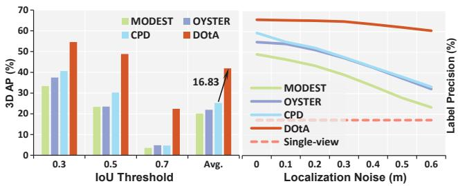
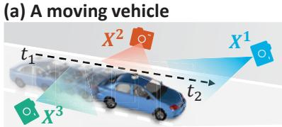
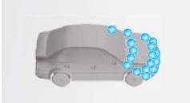
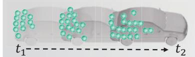
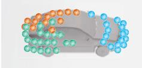
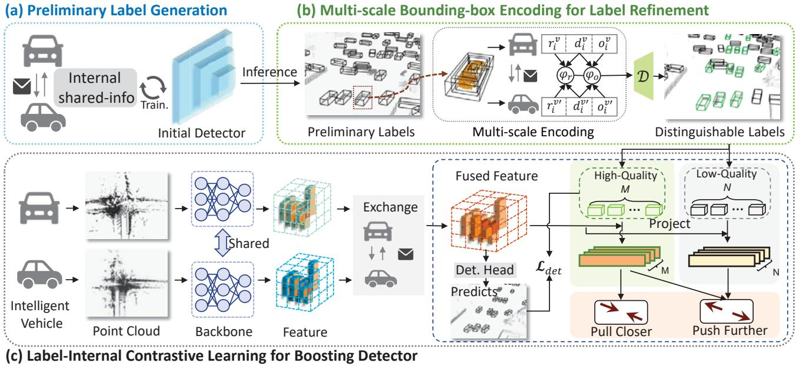
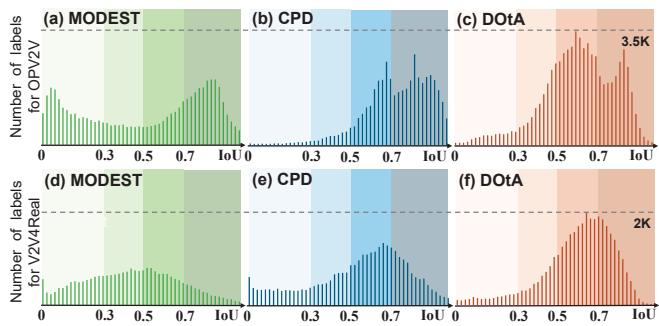
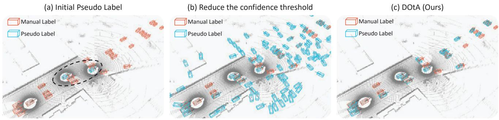

# Learning to Detect Objects from Multi-Agent LiDAR Scans without Manual Labels

Qiming Xia1, 2 Wenkai Lin1,2 Haoen Xiang1,2 Xun Huang1,2 Siheng Chen³ Zhen Dong4 Cheng Wang1,2 Chenglu Wen1,2\*

1Fujian Key Laboratory of Sensing and Computing for Smart Cities, Xiamen University, China 2Key Laboratory of Multimedia Trusted Perception and Efficient Computing, Ministry of Education of China, Xiamen University, China 3Shanghai Jiao Tong University, China 4Wuhan University, China

## Abstract

Unsupervised 3D object detection serves as an important solution for offline 3D object annotation. However, due to the data sparsity and limited views, the clusteringbased label fitting in unsupervised object detection often generates low-quality pseudo-labels. Multi-agent collaborative dataset, which involves the sharing of complementary observations among agents, holds the potential to break through this bottleneck. In this paper, we introduce a novel unsupervised method that learns to Detect Objects from Multi-Agent LiDAR scans, termed DOtA, without using labels from external. DOtA first uses the internally shared ego-pose and ego-shape of collaborative agents to initialize the detector, leveraging the generalization performance of neural networks to infer preliminary labels. Subsequently, DOtA uses the complementary observations between agents to perform multi-scale encoding on preliminary labels, then decodes high-quality and low-quality labels. These labels are further used as prompts to guide a correct feature learning process, thereby enhancing the performance of the unsupervised object detection task. Extensive experiments on the V2V4Real and OPV2V datasets show that our DOtA outperforms state-of-the-art unsupervised 3D object detection methods. Additionally, we also validate the effectiveness of the DOtA labels under various collaborative perception frameworks. The code is available at https://github.com/xmuqimingxia/DOtA.

## 1. Introduction

Learning-based 3D object perception, a key autonomous driving task, has recently seen rapid development in both the industrial and academic fields. A critical component of it is the offline 3D object automatic annotation, which generates accurate labels for unlabeled data [8]. Depending on the specific requirements, there are many different offline schemes. Among them, one extreme emphasizes raising the upper bound of label quality, which uses a pre-trained detector and information from future frames [8, 28, 33, 59] to infer accurate labels. However, this strategy relies on costly manual labeling to pre-train a powerful detector [20, 34, 42, 68], which is too expensive to scale up. Other solutions, abandoning manual labeling, leverage common-sense information to generate labels from the point cloud distribution [27, 43, 63, 66]. However, due to the data sparsity and limited views of LiDAR scans, the distribution of foreground points is often incomplete, especially for moving objects (Fig. 2 (b,c)), severely impacting the performance of these unsupervised methods.

  
Figure 1. Comparison of the performance of various methods under multi-view synchronous observation. (a) On the left, Our DOtA achieves best performance on the real-world collaborative V2V4Real [56] dataset (more details are in Tab. 2). (b) On the right, we adhere to the localization noise parameters established in Where2comm[10], and conducted experiments on the simulation dataset OPV2V [55] to assess the robustness of our approach against realistic localization noise. DOtA is more robust to the localization noise than previous SOTAs.

In this paper, we propose a novel orthogonal approach of improving unsupervised 3D object detection by exploring the potential of multi-agent collaboration. We assume that multi-agents are conducting synchronized observations from multi-view within the same scene, with each agent sharing their pose and shape with the others. This would bring two outstanding benefits: i) synchronized observations from multi-view of multi-agent are adept at significantly completing the missing point cloud distribution (Fig. 2 (d)); ii) from the unlabeled shared information (egopose & ego-shape), we can obtain bounding box descriptions of the agents at no cost, and this subtle signal can support training a weak initial detector and generate preliminary labels. This compensates for the shortcomings of traditional unsupervised label generation methods that rely heavily on the complete distribution of foreground points [66].

(b) View of $X ^ { 1 }$ at $t _ { 2 }$  
  
(d) Multi-view at t2

(c) View of X³ from t1 to t2  

  
Figure 2. (a) A toy example demonstrating a moving vehicle under multi-agent observation. (b) The instance structure is incomplete under single-view observation in the current frame; (c) Historical frame from a single-view cannot complete missing information; (d) Multi-view observation for a moving vehicle.

However, unlabeled synchronized observation data also brings two new challenges to the unsupervised 3D object detection task: i) the initial detector trained with shared information cannot ensure label quality due to a large number of false positives, as shown in Tab. 1; ii) communication delays and localization noise of agents disrupt the alignment of synchronized observation [12, 56], significantly degrading the performance of traditional unsupervised object detection algorithms (Fig. 1). Therefore, agents need a more robust way to utilize synchronized observation to generate high-quality labels.

Following this design rationale, we propose an unsupervised 3D detection method that learns to Detect Objects from Multi-Agent LiDAR scans, termed DOtA. It includes three parts: i) preliminary label generation, which pretrained the initial detector with shared information to infer labels; ii) preliminary label refinement, which emphasizes the consistency of local point cloud multi-scale distribution across multi-view to eliminate false positive labels; and iii) label-internal contrastive learning, which uses refined labels as cues to encourage correct feature learning and suppress erroneous feature learning. Compared with traditional unsupervised 3D object detection methods[43, 66], DOtA designs a novel label refinement and detector training scheme.

The effectiveness of our design is verified both on a realworld dataset, V2V4Real [56], and a simulation dataset, OPV2V [55]. As shown in Fig. 1, our DOtA outperformed the previous SOTA unsupervised methods average performances by 16.83% on the real-world V2V4Real dataset; meanwhile, we conducted simulations of realistic localization noise on the OPV2V dataset, and the labels inferred by DOtA demonstrated the strongest robustness. The main contributions of this paper are as follows:

• We introduce the first unsupervised 3D object detection method (DOtA) derived from multi-agent LiDAR scans. DOtA does not rely on external labels; instead, it only leverages unlabeled internally shared information among the agents.

• We design a multi-scale bounding-box encoding module that leverages the complementary observation shared among multiple agents to discern high-quality labels from preliminary labels.

• We propose a label-internal contrastive learning method, which takes the discernible preliminary labels as prompts, encouraging positive predictions while reducing the occurrence of false positives.

## 2. Related Work

## 2.1. Multi-agent collaborative perception

Collaborative perception [10, 11, 18, 19, 24–26, 38, 48, 53, 55, 57, 64] is an emerging application of multi-agent communication systems in perception tasks. It enables different agents to share complementary perception information, expanding their view and eliminating blind spots. Currently, collaborative perception systems have made significant progress in improving perception performance [53, 54] and robustness on practical issues, such as communication bandwidth constraints [13], pose error [26, 35] and latency [16, 40]. However, the cost of annotating collaborative perception datasets is extremely high. Compared to traditional single-agent perception datasets, the annotation cost of collaborative perception increases linearly with the number of agents [56]. This significantly hinders the progress of collaborative perception algorithms on real-world data. To address this problem, we propose an unsupervised method to avoid manual labeling by only using internally shared information in collaborative communication, thus releasing data annotation costs.

## 2.2. Unsupervised 3D object detection

In the field of single-agent 3D object detection, researchers are increasingly turning their attention to discovering 3D objects without manual annotation. MODEST [63] first incorporates common-sense information [3-5, 14], using the ephemerality of repeatedly scanned point clouds to identify moving objects in the scene. Building on this foundation, many unsupervised methods [2, 27, 30, 43, 66] explore additional constraints to generate higher-quality pseudolabels. At the same time, some methods [17, 39] begin to explore unsupervised 3D object detection based on multimodal data. However, constrained by a single viewpoint and the sparsity of point clouds, existing unsupervised object detection methods struggle to model objects, particularly those that are in motion. To break through this bottleneck, DOtA attempts to conduct research on 3D object detection without manual annotation using a multi-view observational collaborative dataset.

  
Figure 3. The overview of proposed DOtA. (a) The initial detector, pre-trained with shared information, infer preliminary labels. (b) Multiscale transformations are utilized to encode contextual information for preliminary labels, with the discriminator D integrating the encoded information from various agents to distinguish between high-quality and low-quality labels. (c) Distinguishable labels serve as prompts, and Label-Internal Contrastive Learning (LICL) is leveraged to guide the learning of correct features while suppressing the learning of erroneous ones.

## 2.3. Label-efficient 3D object detection

In addition, label-efficient 3D object detection methods consider the detection task from the view of weak supervision, exploring the use of low-cost manual annotation to approach the performance of full supervision. In this context, weakly supervised, semi-supervised, and sparsely supervised approaches are representative of efficient labeling schemes [50]. The weakly supervised object detection methods [29, 41, 61, 65] select more lightweight manual annotation, such as clicks, instead of bounding box annotations. The semi-supervised methods [23, 32, 36, 37, 44, 62, 67] retain annotations for only a subset of frames to train an initial detector, and then employ a teacher-student network to continuously enhance the detection performance of the student model. Existing sparsely supervised methods [22, 46, 47] further reduce the number of labeled instances, retaining only one labeled instance per annotated frame. The success of sparsely supervised setting demonstrates that sparse supervision within a scene could support the initialization of detectors. However, in sparse supervision, the instances labeled per frame are random, endowing the labeled instances with diversity. In contrast, the transmitters of shared information among multiple agents are constant, leading to a lack of diversity in the information and thus making the initial detector prone to overfitting to the agents themselves (Fig. 5(a)). This motivates us to design an effective 3D object detection framework based on shared information.

## 3. Method

Problem definition. We start by defining the task of training a detector only from unlabeled collaborative driving data, using multi-agent vehicles equipped with synchronized sensors (in particular, LiDAR which provides 3D point clouds, and GPS/INS which provides accurate estimates of vehicle position and orientation). Such a data collection scheme is practical and annotator-free, making it ideal for cooperative systems where multiple vehicles function together in the same area to gather data collaboratively. Our method automates the annotation of this data, simplifying the workflow and increasing the system's efficiency. Overview. The pipeline of our DOtA framework is illustrated in Fig. 3. (1) Preliminary Label Generation; (2) Multi-scale Bounding-box Encoding (MBE) for label filtering; (3) Label-Internal Contrastive Learning (LICL). We detail the designs as follows.

<table><tr><td>δ</td><td>Recall</td><td>Precision</td><td>δ</td><td>Recall</td><td>Precision</td></tr><tr><td>0.10</td><td>14.45</td><td>91.93</td><td>0.04</td><td>20.94</td><td>59.70</td></tr><tr><td>0.08</td><td>15.61</td><td>89.69</td><td>0.02</td><td>29.59</td><td>23.03</td></tr><tr><td>0.06</td><td>17.54</td><td>82.34</td><td>0.01</td><td>47.59</td><td>10.22</td></tr></table>

Table 1. The potential of initial detector. Utilizing a lower confidence threshold, $e . g . , \delta = 0 . 0 1$ , could result in a label set with a higher recall rate. However, due to the increase in false positive predictions, the precision of the labels declines markedly. Noiseridden labels hinder the training of effective detectors, underscoring the motivation behind the development of DOtA.

## 3.1. Preliminary Label Generation

The key idea of DOtA is to utilize the internal shared information of multiple agents and the generalization ability of neural network to obtain a high-recall and high-precision pseudo-label set. To validate the feasibility of this perspective, we conduct a preliminary analysis. Specifically, we utilize unlabeled shared information to describe the bounding boxes of agents, and then follow the AttFuse [55] to train the initial detector with these boxes. Finally, we analyze the inference results of the detector.

Tab. 1 shows the recall and precision of the initial labels inferred by initial detector with different confidence score thresholds δ on the OPV2V [55] dataset. It is clear to see that the detector is capable of inferring lots of objects in the scene, $e . g .$ , achieving a recall rate of 47.95% at a confidence threshold of 0.01. This results show the potential of the initial-detector only trained with shared information. However, during training, due to the absence of positional and shape information of other traffic participants, the detector mistakenly treats other traffic participants as background, leading to an over-fit on agent information. Meanwhile, with the reduction of $\delta ,$ there is a surge in false positive labels—a significant decrease in precision (more detail in Fig. 5). This motivates us to design DOtA, a novel framework that effectively expands more valuable information from the shared data, thereby supporting the training of a well-performed detector.

## 3.2. Multi-scale Bounding-box Encoding for Label Filtering

As noted in Tab. 1, in order to maintain a high recall rate, we need to use a lower confidence threshold to preserve the initial labels. However, among the retained labels, there is a large number of false positives. To tackle this issue, we introduce the Multi-scale Bounding-box Encoding (MBE) module. The key idea is to leverage multi-scale and multiview observation to assess whether the instance points included in the labels adhere to the objective laws of the physical world, thereby retaining high-quality labels.

Bounding-Box Multi-scale Scaling. Existing unsupervised label filtering methods [27, 43] typically consider only the point cloud distribution within the bounding box to evaluate the generated labels. However, the contextual information of the labels is equally crucial. Therefore, for each 3D bounding-box label, $b _ { i } = \left( x _ { i } , y _ { i } , z _ { i } , h _ { i } , w _ { i } , l _ { i } , \theta _ { i } \right)$ we slightly scale on it to create new 3D boxes $\left\{ b _ { i } ^ { e \pm } = ( x _ { i } , y _ { i } , z _ { i } , h _ { i } , w _ { i } ( 1 \pm \eta _ { e } ) , l _ { i } ( 1 \pm \eta _ { e } ) , \theta _ { i } ) \right\}$ to encode the additional information from its context, where $\eta _ { e }$ is a constant value for enlarging and reducing the size of box. Subsequently, we use the following three context encoding strategies for multi-scale bounding boxes.

Strategy-1. Collision Probability Encoding. Inspired by [58], we assume normal traffic participants will not collide with others, meaning there are no points nearby. Therefore, for the enlarged box $b _ { i } ^ { e + }$ , we assess the collision probability of the label $b _ { i }$ by examining the ratio of point clouds added within the expanded region. A higher ratio indicates a higher probability of collision, suggesting the label is a false positive. For the view of each agent $X ^ { v }$ , the increase ratio of $b _ { i } ^ { e + }$ is

$$
r _ { i } ^ { v } = ( \left| P _ { i } ^ { e + } \right| - \left| P _ { i } \right| ) / \left| P _ { i } \right|\tag{1}
$$

where $| P _ { i } ^ { e + } | , | P _ { i }$ are the numbers of points in $b _ { i } ^ { e + }$ and $b _ { i } .$

Strategy-2. Boundary Alignment Encoding. Due to the nature of LiDAR sensing, the edges of the inner-points should align with the boundaries of the label. To determine the edges, we employ the Qhull [1] algorithm to obtain the convex hull on the interior points, using it as a reference for the edge points. Therefore, we slightly shrink the label, and we assess the degree of alignment by calculating the ratio that the convex hull falls within the reduced area. A lower ratio indicates a worse alignment of the label, suggesting the label is low-quality. For the view of each agent $X ^ { v }$ , the occupancy ratio of $b _ { i } ^ { e - }$ is

$$
o _ { i } ^ { v } = ( \vert Q _ { i } \vert - \left. Q _ { i } ^ { e - } \right. ) / \left. Q _ { i } \right.\tag{2}
$$

where $\left| Q _ { i } ^ { e - } \right|$ and $| Q _ { i } |$ are the numbers of convex hull in $b _ { i } ^ { e - }$ and $b _ { i }$ 。

Strategy-3. Information Confidence Encoding. For Li-DAR scanning, the point cloud is dense near and sparse far away, hence the agents closer to the label provide more information. Therefore, we describe the confidence of information based on the Euclidean distance between the label $b _ { i }$ and the agent $X _ { v }$

$$
d _ { i } ^ { v } = 1 / [ ( x _ { v } - x _ { i } ) ^ { 2 } + ( y _ { v } - y _ { i } ) ^ { 2 } ]\tag{3}
$$

where $( x _ { v } , y _ { v } )$ is the 2D center of the agent $X ^ { V }$ . The larger the encoded $d _ { i } ^ { v }$ , the higher the confidence.

We perform MBE from the view of each agent, resulting in: $\{ [ r _ { i } ^ { \overline { { v } } } , o _ { i } ^ { v } , d _ { i } ^ { v } ] \mid v = 1 , . . . , V \}$ , where V is the number of agents. And then, by combining the encoded information relayed by all agents, we design a label discriminator:

$$
\mathcal { D } = \left\{ \begin{array} { l l } { c o n d i t i o n _ { 1 } : } & { \left( \sum _ { v = 1 } ^ { V } r _ { i } ^ { v } \times \frac { d _ { i } ^ { v } } { \sum _ { v ^ { \prime } = 1 } ^ { V } d _ { i } ^ { v ^ { \prime } } } \right) < \varphi _ { r } } \\ { c o n d i t i o n _ { 2 } : } & { \left( \sum _ { v = 1 } ^ { V } o _ { i } ^ { v } \times \frac { d _ { i } ^ { v } } { \sum _ { v ^ { \prime } = 1 } ^ { V } d _ { i } ^ { v ^ { \prime } } } \right) > \varphi _ { o } } \end{array} \right.\tag{4}
$$

where $\varphi _ { r }$ and $\varphi _ { o }$ indicate the collision tolerance and alignment tolerance, respectively. A label is assigned as highquality if it simultaneously meets the two conditions of the discriminator; otherwise, it is considered a low-quality label. Only high-quality labels will be directly used as supervisory signals to participate in the training of the classification and regression modules of the detection model.

## 3.3. Label-Internal Contrastive Learning

By combining information from multiple agents, we obtain distinguishable labels. However, low-quality labels are also the outcomes of the detector, mapping the erroneous feature learning from the previous round. To correct this misguided feature learning and to emphasize the correct ones from the previous round, we propose a Label-Internal Contrastive Learning (LICL) module. The key idea is to introduce contrastive learning [9], using historical predictions as cues to enhance current feature learning capabilities.

We firstly extract local feature for each promising label $\{ b _ { i } = ( x _ { i } , y _ { i } , z _ { i } , h _ { i } , w _ { i } , l _ { i } , \theta _ { i } ) \}$ by leveraging the correlation between the resolution of the feature map $( W \times$ $H )$ and the range of the original scene point cloud $( [ x _ { m i n } : x _ { m a x } , y _ { m i n } : y _ { m a x } ] )$

$$
i n d e x _ { i } = \left( \lfloor \frac { x _ { i } - x _ { m i n } } { x _ { m a x } - x _ { m i n } } \rfloor \times W , \lfloor \frac { y _ { i } - y _ { m i n } } { y _ { m a x } - y _ { m i n } } \rfloor \times H \right) .\tag{5}
$$

where indexi represents the position index of the region corresponding to $b _ { i }$ in the feature map. Based on the MBE module, according to the quality of the label $b _ { i }$ , we further identify the local feature $F \left( i n d e x _ { i } \right)$ into positive feature $f _ { p o s }$ and negative feature $f _ { n e g }$

For all high-quality labels $\{ b _ { p o s } ^ { m } , m = 1 , . . . , M \}$ and low-quality labels $\left\{ b _ { n e g } ^ { n } , n = 1 , . . . , N \right\}$ we can generate corresponding sets of positive features $\{ f _ { p o s } ^ { m } , m = 1 , . . . , M \}$ and negative features $\{ f _ { n e g } ^ { n } , n = 1 , . . . , N \}$ . Following existing efforts [46, 51], we apply the InfoNCE [31] loss to pull closer between positive features and to push positive and negative features further apart within the feature space.

$$
\mathcal { L } _ { L I C L } = \frac { - 1 } { M } \sum _ { m = 0 } ^ { M } l o g \frac { e x p \left( \sum _ { i = 0 } ^ { M } \left( f _ { p o s } ^ { m } \cdot f _ { p o s } ^ { i } \right) / \tau \right) } { \sum _ { n = 0 } ^ { N } e x p \left( \sum _ { i = 0 } ^ { M } \left( f _ { p o s } ^ { i } \cdot f _ { n e g } ^ { n } \right) / \tau \right) } .\tag{6}
$$

where $\tau$ is a temperature scaling parameter [45]. The LICL module utilizes high-quality and low-quality labels as prompts to encourage correct feature learning from the previous round and suppress erroneous feature learning. It is worth noting that this module is only involved in the model training to enhance the feature learning of the backbone and does not participate in the inference phase.

## 3.4. Training Losses

Following previous collaborative perception methods [10, 60], we utilize the smooth absolute error loss for regression, denoted as $\mathcal { L } _ { r e g }$ , and the focal loss [21] for classification, denoted as $\mathcal { L } _ { c l s }$ . In total, our proposed DOtA framework defines the comprehensive objective function as follows:

$$
\mathcal { L } _ { t o t a l } = \alpha \mathcal { L } _ { r e g } + \beta \mathcal { L } _ { c l s } + \gamma \mathcal { L } _ { L I C L } .\tag{7}
$$

where α and $\beta$ are empirically set to 1 according to [55], hyper-parameter γ balances the task of detection and feature learning. We conduct the ablation study for γ in section 4.5.

## 4. Experiments

## 4.1. Datasets and Evaluation Metrics

We conduct experiments with two different datasets: V2V4Real dataset [56] and OPV2V dataset [55]. To the best of our knowledge, these two are representative collaborative perception datasets, one of which is a real dataset collected from large-scale real-world scenarios, and the other is a virtual dataset collected based on simulation emulators [6, 52]. We validate the effectiveness of DOtA on both types of datasets. To ensure a fair comparison, we utilized the official evaluation metric: the Average Precision (AP) under Intersection over Union (IoU) 0.3, 0.5 and 0.7.

## 4.2. Implementation Details

Training Details. In multi-agent collaborative perception systems, each agent transmits its pose data. Concurrently, details of the collaborating vehicles, including their types, are pre-registered [56]. Consequently, we could easily obtain the internal shared-info of each agent vehicle $X ^ { v }$ in the scene without manual labeling: $( x _ { v } , y _ { v } , z _ { v } , h _ { v } , w _ { v } , l _ { v } , \theta _ { v } )$ During the initialization phase of the detector, we directly utilize these internal shared-info from the agents as supervision. In the design of the discriminator D, the collision tolerance parameter $\varphi _ { r }$ is set to 0.1, and the alignment tolerance parameter $\varphi _ { o }$ is set to 0.7. Additionally, scaling factor $\eta _ { e } = [ 0 . 5 , 0 . 2 ]$

<table><tr><td rowspan="2">Methods</td><td rowspan="2">Reference</td><td rowspan="2">Common sense</td><td rowspan="2">Internal shared-info</td><td colspan="3">V2V4real [56]</td><td colspan="3">OPV2V [55]</td></tr><tr><td>AP@0.3</td><td>AP@0.5</td><td>AP@0.7</td><td>AP@0.3</td><td>AP@0.5</td><td>AP@0.7</td></tr><tr><td rowspan="2">DBSCAN [7]</td><td>KDD 1996</td><td>√</td><td></td><td>9.26</td><td>4.39</td><td>0.43</td><td>29.49</td><td>22.24</td><td>9.38</td></tr><tr><td></td><td>√</td><td> $\checkmark$ </td><td>14.59</td><td>7.57</td><td>0.88</td><td>32.31</td><td>24.43</td><td>11.63</td></tr><tr><td rowspan="2">MODEST [63]</td><td>CVPR 2022</td><td> $\overline { { \checkmark } }$ </td><td></td><td>24.13</td><td>12.55</td><td>1.83</td><td>46.61</td><td>34.27</td><td>14.96</td></tr><tr><td></td><td> $\checkmark$ </td><td> $\checkmark$ </td><td>33.44</td><td>23.32</td><td>3.60</td><td>50.83</td><td>43.43</td><td>20.58</td></tr><tr><td rowspan="2">OYSTER [66]</td><td>CVPR 2023</td><td> $\overline { { \checkmark } }$ </td><td></td><td>16.61</td><td>7.47</td><td>0.36</td><td>51.92</td><td>47.27</td><td>20.18</td></tr><tr><td></td><td> $\checkmark$ </td><td> $\checkmark$ </td><td>37.50</td><td>23.52</td><td>4.84</td><td>56.58</td><td>49.01</td><td>24.34</td></tr><tr><td rowspan="2">CPD [43]</td><td>CVPR 2024</td><td> $\overline { { \checkmark } }$ </td><td> $\checkmark$ </td><td>35.55</td><td>27.06 30.27</td><td>3.76 4.73</td><td>54.83</td><td>48.34</td><td>23.56</td></tr><tr><td></td><td> $\checkmark$ </td><td></td><td>40.67</td><td></td><td></td><td>59.17</td><td>50.49</td><td>27.72</td></tr><tr><td>DOtA (Ours)</td><td></td><td></td><td> $\checkmark$ </td><td>54.60</td><td>48.84</td><td>22.41</td><td>66.14</td><td>52.37</td><td>24.57</td></tr></table>

Table 2. Comparison with unsupervised methods on OPV2V dataset [55] and V2V4Real dataset [56]. All methods are based on Att-Fuse [55]. We report the results of Average Precision (AP) under Intersectionover-Union (IoU) 0.3, 0.5 and 0.7. The best performance are highlighted in bold.

Baseline Details. We are the first to develop a method for training collaborative detectors only with internal sharedinfo, and there are no previously published baselines for comparison. To validate the effectiveness of DOtA, we chose to compare it with works [43, 63, 66] that are also without manual labels. To ensure a fair comparison, we adopt widely used PointPillars [15] as basic detector. Furthermore, we also pass internal shared-info to previous unsupervised methods, enhancing their detection capabilities.

## 4.3. Main Results

Comparison with unsupervised methods. We compare the proposed DOtA with the most advanced unsupervised methods [7, 43, 63, 66]. For a fair comparison, all methods adopt PointPillars [15] as the backbone and AttFuse [55] as the fusion strategy. Tab. 2 shows a performance comparison of two public datasets.

For the V2V4Real dataset [56], since the data is collected from real-world scenarios, there is noise present in the data due to communication delays and localization errors. This noise prevents the early-fused point clouds from aligning well in 3D space. Therefore, to ensure label quality, we employ a late-fusion strategy to generate labels for the baseline unsupervised methods [7, 43, 63, 66]. The experimental results on V2V4Real are shown on the left side of Tab. 2. Relying solely on internally shared information, our DOtA surpasses previous methods at all IoU thresholds. Additionally, traditional unsupervised schemes are susceptible to noise in real-world data, leading to a significant reduction in detector performance at the 0.7 IoU threshold. In contrast, our method does not rely on cluster-based bounding box fitting strategies. Still, it leverages the generalized performance of neural networks to expand labels, thus exhibiting greater robustness against these noises.

For the OPV2V dataset [55], to capitalize on the strengths of collaborative perception datasets and to achieve optimal performance with traditional unsupervised methods [7, 43, 63, 66], we use early-fusion point clouds as the input for these methods. Notably, to reduce computational load, DOtA adopts an intermediate-fusion approach by using individual agent point clouds as input separately, ultimately only merging the encoded information. The experimental results on OPV2V are shown in the right side of Tab. 2. Our DOt A surpasses the performance of all previous unsupervised methods at IoU thresholds of 0.3 and 0.5, without relying on common-sense information. Compared to the previously best-performing method CPD, our approach lags slightly under the IoU threshold of 0.7. This is due to the fact that OPV2V is a simulation dataset with less internal noise, which is more conducive to the performance of traditional unsupervised methods.

Validation with different collaborative methods. We select three classic collaborative perception object detection methods, AttFuse [55], V2X-VIT [54], and Where2Comm [10], as baselines. Then, we train the baseline detection models with the internal shared-info and the full manual labeling, separately. The results are reported in Tab. 3. Due to the limited amount of information in the internally shared-info, the performance of the detector directly trained in this manner is relatively poor. We combine a self-training scheme, commonly used in unsupervised strategies [43, 63], into our baseline method, which results in a certain improvement in performance. However, such self-training methods struggle to strictly control label quality, hence the performance of the detector still lags significantly behind that of a fully supervised detector. By adding our MBE and LICL to the three baseline methods, our DOtA pipeline achieved an average performance improvement of 32.61% and 35.35% on two datasets, respectively. This further narrows the gap with fully supervised methods.

Results of Multi-Class Detection. As shown in Tab 4, we compare our DOtA with unsupervised methods on V2X-Real dataset [49]. V2X-Real is a real-world multi-class 3D detection cooperative perception dataset. Following mainstream strategies [43], we use size priors to classify classagnostic labels. Benefiting from the effective utilization of collaborative data, DOtA achieves the optimal performance.

<table><tr><td>Methods</td><td>Manual Labels</td><td>Internal shared-info</td><td colspan="2">V2V4real [56] AP@0.3 AP@0.5</td><td colspan="2">OPV2V [55] AP@0.3 AP@0.5</td></tr><tr><td>AttFuse [55]</td><td>√</td><td></td><td>71.35</td><td>63.15</td><td>85.50</td><td>83.21</td></tr><tr><td>AttFuse [55] AttFuse [55] + self-training [22]</td><td></td><td>√ √</td><td>11.15 20.38</td><td>10.62</td><td>11.75</td><td>11.55</td></tr><tr><td>DOtA based AttFuse</td><td></td><td>√</td><td>54.60</td><td>16.47 48.84</td><td>30.02 66.14</td><td>18.18 52.37</td></tr><tr><td>V2X-ViT [54]</td><td>√</td><td></td><td>72.10</td><td>62.87</td><td>85.99</td><td>84.13</td></tr><tr><td>V2X-ViT [54]</td><td></td><td>√</td><td>12.26</td><td></td><td></td><td></td></tr><tr><td></td><td></td><td></td><td></td><td>11.98</td><td>7.81</td><td>7.75</td></tr><tr><td>V2X-ViT [54]+self-training [22]</td><td></td><td>√</td><td>18.43</td><td>14.30</td><td>33.05</td><td>19.77</td></tr><tr><td>DOtA based V2X-ViT</td><td></td><td>√</td><td>61.90</td><td>54.45</td><td>64.33</td><td>46.06</td></tr><tr><td>Where2Comm [10]</td><td>√</td><td></td><td>74.02</td><td>66.80</td><td>87.03</td><td>84.40</td></tr><tr><td>Where2Comm [10]</td><td></td><td>√</td><td>11.82</td><td>6.89</td><td>7.61</td><td>7.31</td></tr><tr><td>Where2Comm [10]+self-training [22]</td><td></td><td>√</td><td>20.04</td><td>13.53</td><td>31.88</td><td>20.14</td></tr><tr><td>DOtA based Where2Comm</td><td></td><td>√</td><td>51.55</td><td>43.96</td><td>66.62</td><td>53.23</td></tr></table>

Table 3. Verification on different collaborative methods with full manual labels and internal shared-info on OPV2V dataset [55] and V2V4Real dataset [56]. We report the results of Average Precision (AP) under Intersectionover-Union (IoU) 0.3 and 0.5. The best performance only with internal shared-info are highlighted in bold.

<table><tr><td rowspan="2">Method</td><td colspan="2">Car</td><td colspan="2">Ped.</td><td colspan="2">Truck</td></tr><tr><td> $\mathrm { A p } @ 0 . 3$ </td><td> $\mathrm { A p } @ 0 . 5$ </td><td> $\mathrm { A p } @ 0 . 3$ </td><td> $\mathrm { A p } @ 0 . 5$ </td><td> $\mathrm { A p } @ 0 . 3$ </td><td>Ap@0.5</td></tr><tr><td>CPD</td><td>27.56</td><td>20.67</td><td>11.37</td><td>7.52</td><td>13.32</td><td>10.88</td></tr><tr><td>LISO</td><td>26.89</td><td>20.38</td><td>9.03</td><td>5.42</td><td>14.33</td><td>11.62</td></tr><tr><td>DOtA</td><td>34.27</td><td>26.96</td><td>14.33</td><td>10.25</td><td>17.67</td><td>14.56</td></tr></table>

Table 4. Comparison of unsupervised methods on V2X-Real [49]

  
Figure 4. The IoU distribution between pseudo-labels and ground truth is presented, where figures (a), (b), and (c) correspond to OPV2V, and figures (d), (e), and (f) correspond to V2V4Real.

## 4.4. Label Quality Analysis

To verify the labels generated by DOtA, we use the groundtruth as a reference to analyze recall and precision on OPV2V [55] and V2V4Real [56] datasets. As shown in Tab. 5, the label quality of DOt A significantly surpasses that of previous unsupervised methods. Because the initial labels of DOtA are generated based on the generalization of neural networks, they have stronger noise resistance than traditional unsupervised methods based on clustering fitting. Therefore, on real datasets, the label quality of DOtA is more robust. To understand the sources of this improvement, we examined the IoU between the pseudo-labels and ground truth, and compared the IoU distributions in Fig. 4. From the figure, it can be observed that DOtA maintains a similar IoU distribution on both synthetic and real-world datasets.

<table><tr><td rowspan="2">Method</td><td colspan="2">V2V4Real [56]</td><td colspan="2">OPV2V [55]</td></tr><tr><td>Recall IoU @0.3/0.5</td><td>Precision IoU @0.3/0.5</td><td>Recall IoU @0.3/0.5</td><td>Precision IoU @0.3/0.5</td></tr><tr><td>DBSCAN [7]</td><td>32.75/19.59</td><td>4.20/2.51</td><td>47.16/39.54</td><td>14.11/11.83</td></tr><tr><td>MODEST [63]</td><td>31.33/19.00</td><td>13.43/8.14</td><td>37.06/31.01</td><td>58.52/48.96</td></tr><tr><td>OYSTER [66]</td><td>41.05/29.32</td><td>22.04/15.74</td><td>48.35/43.72</td><td>60.69/54.89</td></tr><tr><td>CPD [43]</td><td>40.52/32.15</td><td>20.75/16.46</td><td>48.30/45.80</td><td>59.31/56.23</td></tr><tr><td>DOtA (Ours)</td><td>52.31/43.91</td><td>71.97/60.42</td><td>62.60/51.87</td><td>79.34/65.74</td></tr></table>

Table 5. The comparison of label quality on OPV2V [55] and V2V4Real [56] datasets.

## 4.5. Ablation Study

Effect of multi-scale bounding-box encoding. The first through seventh rows of Tab. 6 report the effects of Multiscale Bounding-box Encoding (MBE). MBE encompasses three distinct strategies: Collision Probability Encoding (CPE), Boundary Alignment Encoding (BAE), and Information Confidence Encoding (ICE). We perform ablation studies on them sequentially. In the $1 ^ { s t }$ row of Tab. 6, we report the performance of the AttFuse [55] with self-training as our baseline. In the $2 ^ { n d }$ row, we add CPE to filter labels, resulting in a significant performance improvement. This demonstrates that the CPE module eliminates a large number of false positives and enhances the accuracy of the labels. In the $3 ^ { r d }$ row, we use only BAE to filter labels, which also brings about a certain performance improvement. By combining CPE and BAE, our DOtA further improves the performance. Taking into account the varying contributions of each agent, we proposed the ICE. The results in rows $5 ^ { t h } , 6 ^ { t h }$ , and $7 ^ { t h }$ demonstrate that the ICE module can assign an appropriate degree of contribution to each agent, ultimately producing the highest quality labels.

  
Figure 5. Visualization of the label filtering process of DOtA on the OPV2V train split.

<table><tr><td rowspan="2">ID</td><td colspan="3">MBE</td><td rowspan="2">LICL</td><td colspan="2">OPV2V [55]</td></tr><tr><td>CPE</td><td>BAE</td><td>ICE</td><td></td><td>AP@0.3 AP@0.5</td></tr><tr><td>1</td><td></td><td></td><td></td><td></td><td>30.02</td><td>18.18</td></tr><tr><td>2</td><td>√</td><td></td><td></td><td></td><td>55.62</td><td>40.01</td></tr><tr><td>3</td><td></td><td>√</td><td></td><td></td><td>43.28</td><td>24.79</td></tr><tr><td>4</td><td>√</td><td>√</td><td></td><td></td><td>58.75</td><td>43.27</td></tr><tr><td>5</td><td>√</td><td></td><td>√</td><td></td><td>57.63</td><td>40.98</td></tr><tr><td>6</td><td></td><td>√</td><td>√</td><td></td><td>48.56</td><td>26.34</td></tr><tr><td>7</td><td>√</td><td>√</td><td>√</td><td></td><td>60.96</td><td>45.77</td></tr><tr><td>8</td><td>√</td><td>√</td><td>√</td><td>」</td><td>66.14</td><td>52.37</td></tr></table>

Table 6. Effects of the different components on our designed DOtA network.

Effect of label-internal contrastive learning. As shown in the $7 ^ { t h }$ and $8 ^ { t h }$ rows from Tab. 6, whether the use of labelinternal contrastive learning (LICL) module has a certain impact on the performance of the detector. By combining LICL with MBE to train the detector, our DOtA boosts the performance of $A P @ 0 . 3$ and $A P @ 0 . 5$ by about 5.18 and 6.60 percentage points, respectively, as shown in the $7 ^ { t h }$ and $8 ^ { \hat { t } h }$ rows. This verifies the effectiveness of the jointly label inner contrastive learning strategy.

<table><tr><td>γ</td><td>0.1</td><td>0.3</td><td>0.5</td><td>0.7</td><td>1.0</td><td>1.5</td><td>2.0</td></tr><tr><td>AP@0.3</td><td>0.61</td><td>0.61</td><td>0.62</td><td>0.63</td><td>0.66</td><td>0.63</td><td>0.63</td></tr></table>

Table 7. The choice of weight parameter γ of $\mathcal { L } _ { L I C L }$

Choice of the hyper-parameter γ. The setting of $\gamma$ determines the extent of the influence of the LICL module throughout the entire training process. In this section, we investigate the selection of $\gamma$ of the optimal loss $\mathcal { L } _ { L I C L }$ From the results in Tab. 7, it is observed that the LICL module achieves maximum performance when $\gamma$ is set to 1.0.

Label-filtering Visualization To provide a more detailed depiction of the label filtering process in DOtA and its underlying motivation, we offer a comprehensive visualization. Firstly, we set a confidence threshold of 0.1 to filter the output of the inference of initial detector on the train split. As shown in Fig. 5 (a), the inference results below this threshold only cover the agent, indicating that the model is overfitting to the agent. And then, we set a lower confidence threshold of 0.01, the result is shown in Fig. 5 (b). At this point, the inferred labels can cover more groundtrue bounding boxes, but a large number of false positives have emerged. To eliminate false positives and retain more high-quality labels, we design DOtA, and the final labels are shown in Fig. 5 (c).

## 5. Conclusion

In this paper, to overcome the limitations of traditional unsupervised 3D object detection methods that are constrained by a single-view observation, we proposed a novel detect objects from multi-agent LiDAR scans method, DOtA, without manual labels. Instead of requiring clusterbased label-fitting methods, our method utilizes the internal shared-info to initialize an object detector. In this way, our DOtA method does not require the meticulous design of hyper-parameters based on common-sense information to generate initial labels, as traditional unsupervised methods do, thereby enhancing the robustness. To improve the performance of detector, we designed a multi-scale bounding box encoding module to filter the initial labels, ultimately retaining those of high quality to train detector. And then, we propose a label-internal contrastive learning module that guides the detector to better accomplish feature learning. Extensive experiments have verified the effectiveness of our design.

Acknowledgment. This work was supported by the National Natural Science Foundation of China (No.62171393), and the Fundamental Research Funds for the Central Universities (No.20720220064).

## References

[1] C Bradford Barber, David P Dobkin, and Hannu Huhdanpaa. The quickhull algorithm for convex hulls. ACM Transactions on Mathematical Software (TOMS), 22(4):469–483, 1996. 4

[2] Stefan Andreas Baur, Frank Moosmann, and Andreas Geiger. Liso: Lidar-only self-supervised 3d object detection. In European Conference on Computer Vision, pages 253–270. Springer, 2024. 3

[3] Xiaozhi Chen, Kaustav Kundu, Yukun Zhu, Huimin Ma, Sanja Fidler, and Raquel Urtasun. 3d object proposals using stereo imagery for accurate object class detection. IEEE transactions on pattern analysis and machine intelligence, 40(5):1259–1272, 2017.2

[4] Alvaro Collet, Bo Xiong, Corina Gurau, Martial Hebert, and Siddhartha S Srinivasa. Exploiting domain knowledge for object discovery. In 2013 IEEE International Conference on Robotics and Automation, pages 2118–2125. IEEE, 2013.

[5] Alvaro Collet, Bo Xiong, Corina Gurau, Martial Hebert, and Siddhartha S Srinivasa. Herbdisc: Towards lifelong robotic object discovery. The International Journal of Robotics Research, 34(1):3–25, 2015. 2

[6] Alexey Dosovitskiy, German Ros, Felipe Codevilla, Antonio López, and Vladlen Koltun. Carla: An open urban driving simulator. Conference on Robot Learning, Conference on Robot Learning, 2017. 5

[7] Martin Ester, Hans-Peter Kriegel, Jörg Sander, Xiaowei Xu, et al. A density-based algorithm for discovering clusters in large spatial databases with noise. In kdd, pages 226–231, 1996.6,7

[8] Lue Fan, Yuxue Yang, Yiming Mao, Feng Wang, Yuntao Chen, Naiyan Wang, and Zhaoxiang Zhang. Once detected, never lost: Surpassing human performance in offline lidar based 3d object detection. In Proceedings of the IEEE/CVF International Conference on Computer Vision (ICCV), pages 19820–19829, 2023. 1

[9] Kaiming He, Haoqi Fan, Yuxin Wu, Saining Xie, and Ross Girshick. Momentum contrast for unsupervised visual representation learning. In Proceedings of the IEEE conference on Computer Vision and Pattern Recognition (CVPR), pages 9729–9738, 2020. 5

[10] Yue Hu, Shaoheng Fang, Zixing Lei, Yiqi Zhong, and Siheng Chen. Where2comm: Communication-efficient collaborative perception via spatial confidence maps. Advances in neural information processing systems, 35:4874–4886, 2022. 1, 2, 5, 6, 7

[11] Yue Hu, Yifan Lu, Runsheng Xu, Weidi Xie, Siheng Chen, and Yanfeng Wang. Collaboration helps camera overtake lidar in 3d detection. In Proceedings of the IEEE/CVF Conference on Computer Vision and Pattern Recognition, pages 9243–9252, 2023. 2

[12] Yue Hu, Yifan Lu, Runsheng Xu, Weidi Xie, Siheng Chen, and Yanfeng Wang. Collaboration helps camera overtake lidar in 3d detection. In Proceedings of the IEEE/CVF Conference on Computer Vision and Pattern Recognition, pages 9243–9252, 2023. 2

[13] Yue Hu, Juntong Peng, Sifei Liu, Junhao Ge, Si Liu, and Siheng Chen. Communication-efficient collaborative percep-

tion via information filling with codebook. In Proceedings of the IEEE/CVF Conference on Computer Vision and Pattern Recognition, pages 15481–15490, 2024. 2

[14] Andrej Karpathy, Stephen Miller, and Li Fei-Fei. Object discovery in 3d scenes via shape analysis. In 2013 IEEE international conference on robotics and automation, pages 2088–2095. IEEE, 2013. 2

[15] Alex H Lang, Sourabh Vora, Holger Caesar, Lubing Zhou, Jiong Yang, and Oscar Beijbom. Pointpillars: Fast encoders for object detection from point clouds. In Proceedings of the IEEE conference on Computer Vision and Pattern Recognition (CVPR), pages 12697–12705, 2019. 6

[16] Zixing Lei, Shunli Ren, Yue Hu, Wenjun Zhang, and Siheng Chen. Latency-aware collaborative perception. In European Conference on Computer Vision, pages 316–332. Springer, 2022.2

[17] Ted Lentsch, Holger Caesar, and Dariu Gavrila. Union: Unsupervised 3d object detection using object appearancebased pseudo-classes. Advances in Neural Information Processing Systems, 37:22028–22046, 2024. 3

[18] Yiming Li, Shunli Ren, Pengxiang Wu, Siheng Chen, Chen Feng, and Wenjun Zhang. Learning distilled collaboration graph for multi-agent perception. Advances in Neural Information Processing Systems, 34:29541–29552, 2021. 2

[19] Yiming Li, Ziyan An, Zixun Wang, Yiqi Zhong, Siheng Chen, and Chen Feng. V2x-sim: A virtual collaborative perception dataset for autonomous driving. arXiv preprint arXiv:2202.08449, 2022. 2

[20] Zhenxin Li, Shiyi Lan, Jose M Alvarez, and Zuxuan Wu. Bevnext: Reviving dense bev frameworks for 3d object detection. In Proceedings of the IEEE/CVF Conference on Computer Vision and Pattern Recognition, pages 20113- 20123, 2024.1

[21] Tsung-Yi Lin, Priya Goyal, Ross B. Girshick, Kaiming He, and Piotr Dollár. Focal loss for dense object detection. IEEE Transactions on Pattern Analysis and Machine Intelligence (TPAMI), 42:318–327, 2020. 5

[22] Chuandong Liu, Chenqiang Gao, Fangcen Liu, Jiang Liu, Deyu Meng, and Xinbo Gao. Ss3d: Sparsely-supervised 3d object detection from point cloud. In Proceedings of the IEEE conference on Computer Vision and Pattern Recognition (CVPR), pages 8428–8437, 2022. 3, 7

[23] Chuandong Liu, Chenqiang Gao, Fangcen Liu, Pengcheng Li, Deyu Meng, and Xinbo Gao. Hierarchical supervision and shuffle data augmentation for 3d semi-supervised object detection. In Proceedings of the IEEE/CVF Conference on Computer Vision and Pattern Recognition, pages 23819– 23828, 2023.3

[24] Yen-Cheng Liu, Junjiao Tian, Nathaniel Glaser, and Zsolt Kira. When2com: Multi-agent perception via communication graph grouping. In Proceedings of the IEEE/CVF Conference on computer vision and pattern recognition, pages 4106–4115, 2020.2

[25] Yen-Cheng Liu, Junjiao Tian, Chih-Yao Ma, Nathan Glaser, Chia-Wen Kuo, and Zsolt Kira. Who2com: Collaborative perception via learnable handshake communication. In 2020 IEEE International Conference on Robotics and Automation (ICRA), pages 6876–6883. IEEE, 2020.

[26] Yifan Lu, Quanhao Li, Baoan Liu, Mehrdad Dianati, Chen Feng, Siheng Chen, and Yanfeng Wang. Robust collaborative 3d object detection in presence of pose errors. In 2023 IEEE International Conference on Robotics and Automation (ICRA), pages 4812–4818. IEEE, 2023. 2

[27] Katie Luo, Zhenzhen Liu, Xiangyu Chen, Yurong You, Sagie Benaim, Cheng Perng Phoo, Mark Campbell, Wen Sun, Bharath Hariharan, and Kilian Q Weinberger. Reward finetuning for faster and more accurate unsupervised object discovery. Advances in Neural Information Processing Systems, 36:13250–13266, 2023. 1,3, 4

[28] Tao Ma, Xuemeng Yang, Hongbin Zhou, Xin Li, Botian Shi, Junjie Liu, Yuchen Yang, Zhizheng Liu, Liang He, Yu Qiao, et al. Detzero: Rethinking offboard 3d object detection with long-term sequential point clouds. In Proceedings of the IEEE/CVF International Conference on Computer Vision, pages 6736–6747, 2023. 1

[29] Qinghao Meng, Wenguan Wang, Tianfei Zhou, Jianbing Shen, Luc Van Gool, and Dengxin Dai. Weakly supervised 3d object detection from lidar point cloud. In Proceedings of the European Conference on Computer Vision (ECCV), pages 515–531, 2020. 3

[30] Mahyar Najibi, Jingwei Ji, Yin Zhou, Charles R Qi, Xinchen Yan, Scott Ettinger, and Dragomir Anguelov. Motion inspired unsupervised perception and prediction in autonomous driving. In European Conference on Computer Vision, pages 424–443. Springer, 2022. 3

[31] Aaron van den Oord, Yazhe Li, and Oriol Vinyals. Representation learning with contrastive predictive coding. arXiv preprint arXiv:1807.03748, 2018. 5

[32] Jinhyung Park, Chenfeng Xu, Yiyang Zhou, Masayoshi Tomizuka, and Wei Zhan. Detmatch: Two teachers are better than one for joint 2d and 3d semi-supervised object detection. In European Conference on Computer Vision, pages 370–389. Springer, 2022. 3

[33] Charles R Qi, Yin Zhou, Mahyar Najibi, Pei Sun, Khoa Vo, Boyang Deng, and Dragomir Anguelov. Offboard 3d object detection from point cloud sequences. In Proceedings of the IEEE/CVF Conference on Computer Vision and Pattern Recognition, pages 6134–6144, 2021. 1

[34] Shaoshuai Shi, Li Jiang, Jiajun Deng, Zhe Wang, Chaoxu Guo, Jianping Shi, Xiaogang Wang, and Hongsheng Li. Pvrcnn++: Point-voxel feature set abstraction with local vector representation for 3d object detection. International Journal of Computer Vision, 131(2):531–551, 2023. 1

[35] Nicholas Vadivelu, Mengye Ren, James Tu, Jingkang Wang, and Raquel Urtasun. Learning to communicate and correct pose errors. In Conference on Robot Learning, pages 1195– 1210. PMLR, 2021. 2

[36] He Wang, Yezhen Cong, Or Litany, Yue Gao, and Leonidas J. Guibas. 3dioumatch: Leveraging iou prediction for semisupervised 3d object detection. Proceedings of the IEEE conference on Computer Vision and Pattern Recognition (CVPR), pages 14610–14619, 2021. 3

[37] Hanshi Wang, Zhipeng Zhang, Jin Gao, and Weiming Hu. A-teacher: Asymmetric network for 3d semi-supervised object detection. In Proceedings of the IEEE/CVF Conference

on Computer Vision and Pattern Recognition, pages 14978– 14987, 2024.3

[38] Tsun-Hsuan Wang, Sivabalan Manivasagam, Ming Liang, Bin Yang, Wenyuan Zeng, and Raquel Urtasun. V2vnet: Vehicle-to-vehicle communication for joint perception and prediction. In Computer Vision-ECCV 2020: 16th European Conference, Glasgow, UK, August 23–28, 2020, Proceedings, Part II 16, pages 605–621. Springer, 2020. 2

[39] Yuqi Wang, Yuntao Chen, and Zhao-Xiang Zhang. 4d unsupervised object discovery. Advances in Neural Information ProcessingSystems, 35:35563–35575, 2022.3

[40] Sizhe Wei, Yuxi Wei, Yue Hu, Yifan Lu, Yiqi Zhong, Siheng Chen, and Ya Zhang. Asynchrony-robust collaborative perception via bird's eye view flow. Advances in Neural Information Processing Systems, 36, 2024. 2

[41] Yi Wei, Shang Su, Jiwen Lu, and Jie Zhou. Fgr: Frustumaware geometric reasoning for weakly supervised 3d vehicle detection. In 2021 IEEE International Conference on Robotics and Automation (ICRA), pages 4348–4354. IEEE, 2021.3

[42] Hai Wu, Chenglu Wen, Shaoshuai Shi, Xin Li, and Cheng Wang. Virtual sparse convolution for multimodal 3d object detection. In IEEE Computer Society Conference on Computer Vision and Pattern Recognition (CVPR), pages 21653– 21662, 2023.1

[43] Hai Wu, Shijia Zhao, Xun Huang, Chenglu Wen, Xin Li, and Cheng Wang. Commonsense prototype for outdoor unsupervised 3d object detection. In Proceedings of the IEEE/CVF Conference on Computer Vision and Pattern Recognition (CVPR), pages 14968–14977, 2024. 1, 2, 3, 4, 6, 7

[44] Xiaopei Wu, Liang Peng, Liang Xie, Yuenan Hou, Binbin Lin, Xiaoshui Huang, Haifeng Liu, Deng Cai, and Wanli Ouyang. Semi-supervised 3d object detection with patchteacher and pillarmix. In Proceedings of the AAAI Conference on Artificial Intelligence, pages 6153–6161, 2024. 3

[45] Zhirong Wu, Yuanjun Xiong, Stella X Yu, and Dahua Lin. Unsupervised feature learning via non-parametric instance discrimination. In Proceedings of the IEEE conference on Computer Vision and Pattern Recognition (CVPR), pages 3733–3742, 2018.5

[46] Qiming Xia, Jinhao Deng, Chenglu Wen, Hai Wu, Shaoshuai Shi, Xin Li, and Cheng Wang. Coin: Contrastive instance feature mining for outdoor 3d object detection with very limited annotations. In Proceedings of the IEEE/CVF International Conference on Computer Vision, pages 6254–6263, 2023.3,5

[47] Qiming Xia, Wei Ye, Hai Wu, Shijia Zhao, Leyuan Xing, Xun Huang, Jinhao Deng, Xin Li, Chenglu Wen, and Cheng Wang. Hinted: Hard instance enhanced detector with mixeddensity feature fusion for sparsely-supervised 3d object detection. In Proceedings of the IEEE/CVF Conference on Computer Vision and Pattern Recognition, pages 15321– 15330,2024.3

[48] Hao Xiang, Runsheng Xu, Xin Xia, Zhaoliang Zheng, Bolei Zhou, and Jiaqi Ma. V2xp-asg: Generating adversarial scenes for vehicle-to-everything perception. In 2023 IEEE International Conference on Robotics and Automation (ICRA), pages 3584–3591. IEEE, 2023. 2

[49] Hao Xiang, Zhaoliang Zheng, Xin Xia, Runsheng Xu, Letian Gao, Zewei Zhou, Xu Han, Xinkai Ji, Mingxi Li, Zonglin Meng, et al. V2x-real: a largs-scale dataset for vehicle-toeverything cooperative perception. In European Conference on Computer Vision, pages 455–470. Springer, 2024. 6, 7

[50] Aoran Xiao, Xiaoqin Zhang, Ling Shao, and Shijian Lu. A survey of label-efficient deep learning for 3d point clouds. IEEE Transactions on Pattern Analysis and Machine Intelligence, 2024. 3

[51] Saining Xie, Jiatao Gu, Demi Guo, Charles R Qi, Leonidas Guibas, and Or Litany. Pointcontrast: Unsupervised pretraining for 3d point cloud understanding. In Computer Vision-ECCV 2020: 16th European Conference, Glasgow, UK, August 23–28, 2020, Proceedings, Part III 16, pages 574–591. Springer, 2020. 5

[52] Runsheng Xu, Yi Guo, Xu Han, Xin Xia, Hao Xiang, and Jiaqi Ma. Opencda: An open cooperative driving automation framework integrated with co-simulation. In 2021 IEEE International Intelligent Transportation Systems Conference (ITSC), 2021. 5

[53] Runsheng Xu, Zhengzhong Tu, Hao Xiang, Wei Shao, Bolei Zhou, and Jiaqi Ma. Cobevt: Cooperative bird's eye view semantic segmentation with sparse transformers. arXiv preprint arXiv:2207.02202, 2022. 2

[54] Runsheng Xu, Hao Xiang, Zhengzhong Tu, Xin Xia, Ming-Hsuan Yang, and Jiaqi Ma. V2x-vit: Vehicle-to-everything cooperative perception with vision transformer. In European conference on computer vision, pages 107–124. Springer 2022. 2, 6, 7

[55] Runsheng Xu, Hao Xiang, Xin Xia, Xu Han, Jinlong Li, and Jiaqi Ma. Opv2v: An open benchmark dataset and fusion pipeline for perception with vehicle-to-vehicle communication. In 2022 International Conference on Robotics and Automation (ICRA), pages 2583–2589. IEEE, 2022. 1, 2, 4, 5, 6,7,8

[56] Runsheng Xu, Xin Xia, Jinlong Li, Hanzhao Li, Shuo Zhang, Zhengzhong Tu, Zonglin Meng, Hao Xiang, Xiaoyu Dong, Rui Song, et al. V2v4real: A real-world large-scale dataset for vehicle-to-vehicle cooperative perception. In Proceedings of the IEEE/CVF Conference on Computer Vision and Pattern Recognition, pages 13712–13722, 2023. 1, 2, 5, 6, 7

[57] Runsheng Xu, Chia-Ju Chen, Zhengzhong Tu, and Ming-Hsuan Yang. V2x-vitv2: Improved vision transformers for vehicle-to-everything cooperative perception. IEEE Transactions on Pattern Analysis and Machine Intelligence, 2024. 2

[58] Yan Yan, Yuxing Mao, and Bo Li. Second: Sparsely embedded convolutional detection. Sensors, 18, 2018. 4

[59] Bin Yang, Min Bai, Ming Liang, Wenyuan Zeng, and Raquel Urtasun. Auto4d: Learning to label 4d objects from sequential point clouds. arXiv preprint arXiv:2101.06586, 2021. 1

[60] Dingkang Yang, Kun Yang, Yuzheng Wang, Jing Liu, Zhi Xu, Rongbin Yin, Peng Zhai, and Lihua Zhang. How2comm: Communication-efficient and collaboration-pragmatic multiagent perception. Advances in Neural Information Processing Systems, 36, 2024. 5

[61] Yuxue Yang, Lue Fan, and Zhaoxiang Zhang. Mixsup: Mixed-grained supervision for label-efficient lidar-based 3d object detection. In ICLR, 2024. 3

[62] Junbo Yin, Jin Fang, Dingfu Zhou, Liangjun Zhang, Cheng-Zhong Xu, Jianbing Shen, and Wenguan Wang. Semisupervised 3d object detection with proficient teachers. In European Conference on Computer Vision, pages 727–743. Springer, 2022. 3

[63] Yurong You, Katie Luo, Cheng Perng Phoo, Wei-Lun Chao, Wen Sun, Bharath Hariharan, Mark Campbell, and Kilian Q Weinberger. Learning to detect mobile objects from lidar scans without labels. In Proceedings of the IEEE/CVF Conference on Computer Vision and Pattern Recognition, pages 1130–1140, 2022. 1, 2, 6, 7

[64] Haibao Yu, Yizhen Luo, Mao Shu, Yiyi Huo, Zebang Yang, Yifeng Shi, Zhenglong Guo, Hanyu Li, Xing Hu, Jirui Yuan, et al. Dair-v2x: A large-scale dataset for vehicleinfrastructure cooperative 3d object detection. In Proceedings of the IEEE/CVF Conference on Computer Vision and Pattern Recognition, pages 21361–21370, 2022. 2

[65] Dingyuan Zhang, Dingkang Liang, Zhikang Zou, Jingyu Li, Xiaoqing Ye, Zhe Liu, Xiao Tan, and Xiang Bai. A simple vision transformer for weakly semi-supervised 3d object detection. In Proceedings of the IEEE/CVF International Conference on Computer Vision (ICCV), pages 8373–8383, 2023.3

[66] Lunjun Zhang, Anqi Joyce Yang, Yuwen Xiong, Sergio Casas, Bin Yang, Mengye Ren, and Raquel Urtasun. Towards unsupervised object detection from lidar point clouds. In 2023 IEEE/CVF Conference on Computer Vision and Pattern Recognition (CVPR), 2023. 1, 2, 3, 6, 7

[67] Na Zhao, Tat-Seng Chua, and Gim Hee Lee. Sess: Selfensembling semi-supervised 3d object detection. In Proceedings of the IEEE conference on Computer Vision and Pattern Recognition (CVPR), 2020. 3

[68] Yin Zhou, Pei Sun, Yu Zhang, Dragomir Anguelov, Jiyang Gao, Tom Ouyang, James Guo, Jiquan Ngiam, and Vijay Vasudevan. End-to-end multi-view fusion for 3d object detection in lidar point clouds. In Proceedings of the Conference on Robot Learning, pages 923–932, 2020. 1