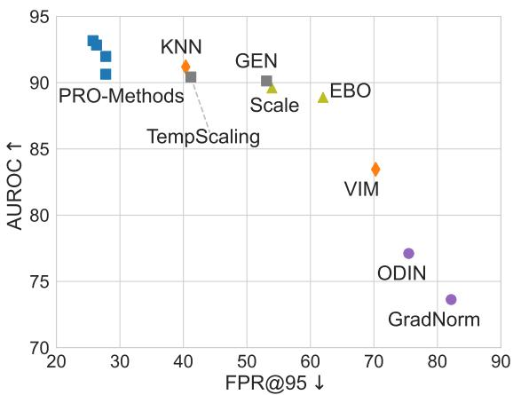
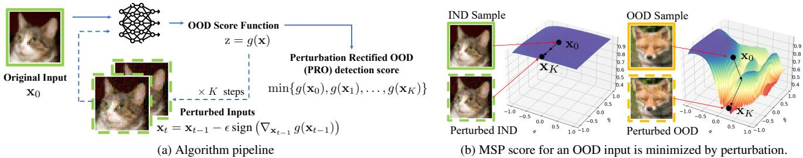
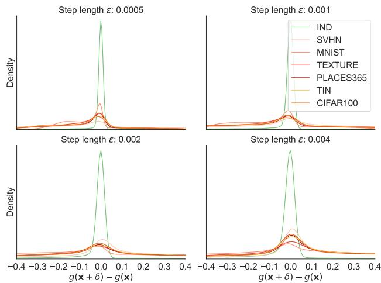
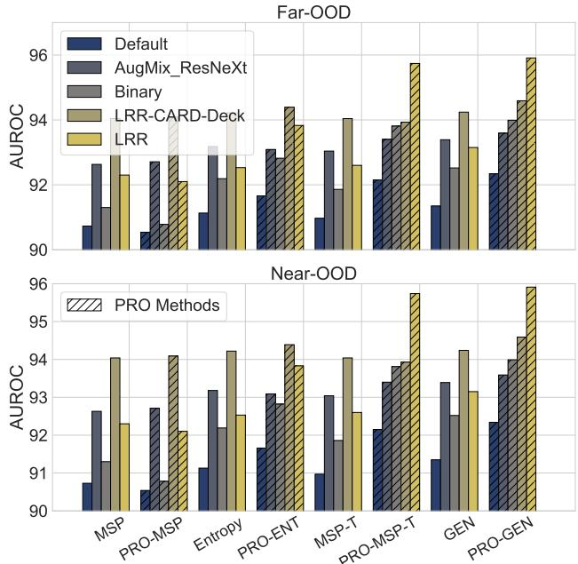
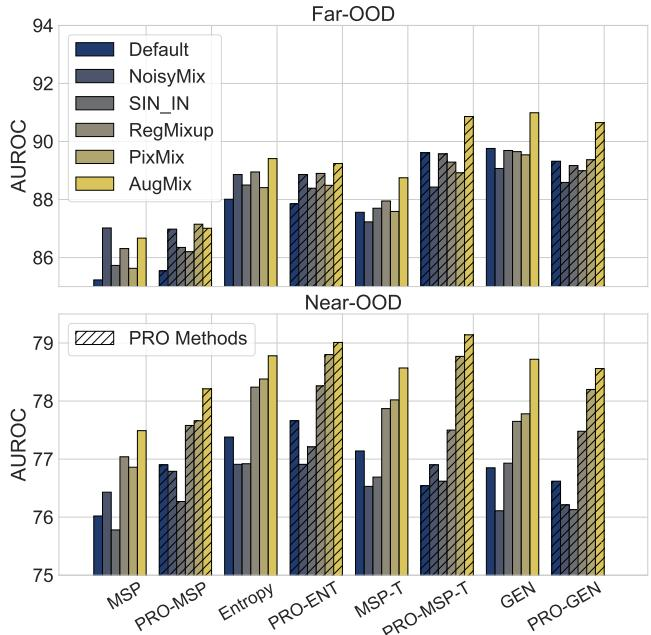
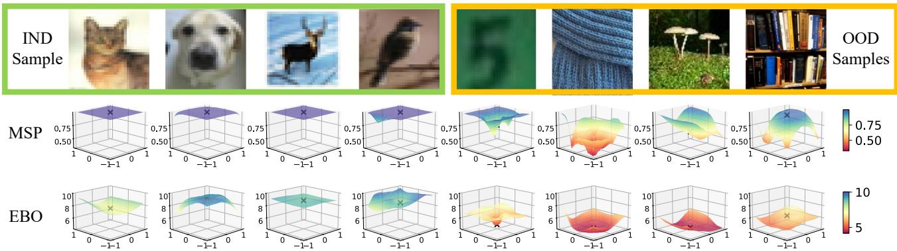
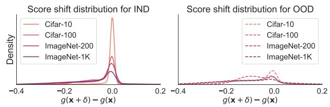

# Leveraging Perturbation Robustness to Enhance Out-of-Distribution Detection

Wenxi Chen1, Raymond A. Yeh2,†, Shaoshuai Mou3, Yan Gu1,†

1School of ME, 2Department of CS, 3School of AAE, Purdue University

{chen4803, rayyeh, mous, yangu}@purdue.edu

## Abstract

Out-of-distribution (OOD) detection is the task of identifying inputs that deviate from the training data distribution. This capability is essential for safely deploying deep computer vision models in open-world environments. In this work, we propose a post-hoc method, Perturbation-Rectified OOD detection (PRO), based on the insight that prediction confidence for OOD inputs is more susceptible to reduction under perturbation than in-distribution (IND) inputs. Based on the observation, we propose an adversarial score function that searches for the local minimum scores near the original inputs by applying gradient descent. This procedure enhances the separability between IND and OOD samples. Importantly, the approach improves OOD detection performance without complex modifications to the underlying model architectures. We conduct extensive experiments using the OpenOOD benchmark [43]. Our ap proach further pushes the limit of softmax-based OOD detection and is the leading post-hoc method for small-scale models. On a CIFAR-10 model with adversarial training, PRO effectively detects near-OOD inputs, achieving a reduction of more than 10% on FPR@95 compared to stateof-the-art methods.1

## 1. Introduction

Deploying deep learning models in open-world environments presents the challenge of handling inputs that deviate from the training data. Out-of-distribution (OOD) inputs, which differ significantly from training data, often lead to incorrect predictions. This occurs because a trained neural network cannot reliably classify inputs from unseen categories. OOD detection aims to identify such anomalous inputs, allowing fallback solutions such as human intervention [44]. In-distribution (IND) data may also be affected by noise, sensor malfunctions, or adversarial attacks [5]. To address these challenges, ongoing research focuses on improving OOD detection methods and enhancing model robustness. Furthermore, prior studies have established connections between OOD detection and adversarial robustness [1, 3, 21, 25, 32]. [25] proposed a framework for detecting both OOD samples and adversarial attacks. [1, 32] demonstrate that adversarial attacks can manipulate OOD samples to mislead OOD detectors. In this work, we introduce a novel OOD detection approach leveraging the robustness strength of adversarially pre-trained models.

  
Figure 1. Near-OOD detection performance tested on CIFAR-10 robust model [8]. Near-OOD includes CIFAR-100 [22] and Tiny-ImageNet [24]. Different markers distinguish the following baseline categories: feature-based methods, such as VIM [41] and KNN [37] (♢); energy [29] and activation modification methods, such as Scale [42] (△); gradient-based methods, such as ODIN [28] and GradNorm [20] (◦); and softmax-based scores (□). We apply PRO on MSP, Entropy [15], Temperature Scaling [13], and GEN [30] forming four PRO methods. Notably, the proposed PRO preprocessing significantly enhances the performance of softmax scores in distinguishing challenging near-OOD data.

Various OOD detection methods for image classification have emerged since the baseline method of Maximum Softmax Probability (MSP) was introduced [15]. One line of research involves using gradient information for data preprocessing, such as ODIN [28], G-ODIN [19], and MDS with preprocessing [25]. These works apply gradient-based perturbations to inputs to enhance prediction confidence. ODIN shows empirical differences in gradient expectations between IND and OOD data. However, evaluations from the OpenOOD benchmark [43] reveal that ODIN reduces MSP performance across various tasks. This reduction happens because ODIN’s preprocessing tends to increase false confidence for near-OOD data, while keeping high IND confidence unaltered. This limits its ability to capture gradient differences in perturbed confidence scores.

  
z = g(x)Figure 2. Algorithm overview for the proposed Perturbation Rectified OOD (PRO) detection. (a) We conduct multi-step projected gradient ⇥ K ⇥ K steps ⇥  descent on the input image during inference to minimize the OOD detection score function. Since the score for OOD data is expected to x0x0 xbe more vulnerable to shifts under perturbations than IND data, this process enhances the separability between IND and OOD scores. (b) ⇥MSP score landscapes for two IND and OOD samples visualized by random projection [26], more examples are provided in Fig. 6.

Motivation. Unlike previous gradient-based methods, our work builds on the observation that OOD confidence scores are more susceptible to reductions under perturbation than IND scores. We refer to this difference in sensitivity to perturbations between IND and OOD inputs as the perturbation 1robustness difference. Conceptually, robustness here is related to the Lipschitz constant that describes the flatness of the score function in input space. Under the same perturbation bound, OOD scores experience greater attenuation than IND scores, making them more separable. This insight suggests that adversarially robust models may be used to en-1hance OOD detection accuracy. Thus, we introduce a new post-hoc OOD method that leverages the model robustness towards corrupted IND inputs.

Our method. We propose Perturbation Rectified OOD detection (PRO) that can be incorporated with softmaxprobability-based OOD detection methods to improve performance. By applying perturbations as a preprocessing step, PRO significantly lowers the confidence scores for OOD inputs relative to IND inputs, thereby increasing the separability between IND and OOD scores.

We evaluate PRO using the comprehensive OpenOOD benchmark [43] across various pre-trained robust DNN backbones on CIFAR [22] and ImageNet [6]. Additionally, we test leading robust models from RobustBench [5] to examine the synergy between OOD detection and adversarial/corruption robustness–two complementary areas critical for the safe deployment of deep learning models. On small-scale models including CIFAR-10 and CIFAR-100 [22], PRO achieves leading OOD detection accuracy compared to existing state-of-the-art methods from benchmark [43] which include IND-feature-based methods, such as, VIM [41] and KNN [37], activation modification methods such as Activation Shaping (ASH) [9], and Scale [42]. Furthermore, PRO works effectively in distinguishing near-OOD data, which is a substantially more challenging setting [45]. Shown in Fig. 1, PRO achieves top performance in near-OOD detection, excelling in both AUROC and FPR@95 metrics. Our contributions are as follows:

• We propose an adversarial score function for OOD detection, based on the observation that IND confidence scores are more robust to perturbations than OOD inputs. See Fig. 2 for an overview. We provide analysis and empirical validation of the observation.

• We leverage adversarial robustness to improve OOD detection. We evaluate the impact of adversarial training on OOD detection performance by utilizing the two most comprehensive benchmarks, OpenOOD and RobustBench. This establishes a new link between these two safety-critical areas in deep learning.

• We demonstrate the effectiveness of the proposed PRO method as a simple, post-hoc enhancement to representative softmax scores. We perform extensive validation experiments on CIFAR-10, CIFAR-100, and ImageNet conducting a comprehensive comparison with various categories of baseline methods.

## 2. Related Work

Studies on OOD detection address several safety-critical areas in deep learning, including anomaly detection, open set recognition, and semantic and covariate domain shift detection [44]. Existing approaches generally involve either training modifications or post-hoc analysis. our review of existing methods focuses primarily on those evaluated in the OpenOOD benchmark [43][45], a comprehensive platform that examines various model architectures and datasets, including CIFAR [22] and ImageNet [6].

Training-modification methods. These techniques require additional training protocols or data for OOD detection. Experiments from benchmark [5, 45] demonstrate that data augmentation methods, such as PixMix [18], AugMix [17] and RegMixup [34], are beneficial for both OOD detection and adversarial robustness.

Representative Post-hoc methods. These methods aim to enhance OOD detection without modifying pre-trained models. One category leverages features from IND data, as demonstrated by VIM [41] and KNN [37], which achieve highly competitive results. Recently, approaches like Scale [42], ReAct [36], and Ash [9] have employed modifications to neural network activations to enhance energybased scores.

Softmax-based scores. Beyond the classic MSP baseline, prediction entropy calculated from softmax probabilities is also regarded as a universal baseline for OOD detection [15]. Temperature scaling [37] provides a straightforward approach to calibrating model uncertainty by scaling output logits. Recently, Liu et al. [30] introduced Generalized Entropy (GEN), demonstrating the most promising results among softmax-based scores.

Gradient-based methods. ODIN [28], MDS [25], and G-ODIN [19] apply gradient-based perturbations as a preprocessing step before inference to improve OOD detection performance. GradNorm [20] and Approximate-mass [12] leverage the gradient norm directly to define an OOD detection score. These approaches share a common intuition that the landscape of score function differs between IND and OOD inputs.

## 3. Preliminaries

OOD detection for image classification. This study addresses OOD detection for image classification. Formally, an image classifier f takes an image x as input and outputs the unnormalized $\hat { \pmb y } \in \mathbb { R } ^ { C }$ across C classes. These classifiers are typically trained by minimizing the crossentropy loss. During training, it is assumed that the images x are drawn from an in-distribution (IND), denoted $P _ { \mathrm { I N D } } ( \mathbf { x } )$ . However, during open-world testing, input data may not follow $P _ { \mathrm { I N D } } ( \mathbf { x } )$ . We refer to this alternative distribution as $P _ { \mathrm { O O D } } ( \bf { x } )$ , representing out-of-distribution (OOD). The goal of ODD detection is to determine whether an image x is sampled from the IND distribution or not.

OOD detector. The task of OOD detection is typically framed as a one-class classification problem, where the model is trained solely on IND data without exposure to OOD examples. This is usually implemented by defining an OOD score function $g ( \mathbf { x } ) \in \mathbb { R }$ , which is then thresholded to classify an input x as IND or OOD. Specifically, $\mathrm { i f } \ g ( \mathbf { x } ) > \tau$ , the input is classified as IND; otherwise, it is considered OOD. A classic choice for the OOD detection score is the Maximum Softmax Probability (MSP)

$$
g _ { \mathsf { M S P } } ( \mathbf { x } ) \triangleq \operatorname* { m a x } _ { y \in \{ 1 , . . . , C \} } \frac { e ^ { f _ { y } ( \mathbf { x } ) / T } } { \sum _ { y ^ { \prime } = 1 } ^ { C } e ^ { f _ { y ^ { \prime } } ( \mathbf { x } ) / T } } .\tag{1}
$$

Intuitively, MSP reflects the model’s prediction confidence. The higher the confidence, the more likely the input is IND data. The temperature T calibrates this confidence, reducing overconfidence when T exceeds 1.

OOD detection metrics. The primary performance metrics for evaluating OOD detectors include: (a) Area Under the Receiver Operating Characteristic Curve, denoted as AU-ROC, and (b) False Positive Rate at a given value q% of the True Positive Rate, denoted as FPR@q. A common choice is FPR@95.

## 4. Approach

In this section, we introduce the proposed PRO approach for OOD detection. Building on the framework reviewed in Sec. 3, our OOD detector also relies on a detection score derived from a pre-trained neural network. However, our method includes three key innovations. First, we introduce an “adversarial score” to enhance an established detection score g in the literature. Second, we advocate for using a pre-trained model that has been trained to be robust against adversarial attacks. Finally, we provide an analysis of the proposed detector score.

## 4.1. Perturbation Rectified OOD (PRO) detection

Observation. Our proposed PRO detector is based on the observation that a score function g is more robust to local additive perturbation, within an ϵ, for IND data than OOD data. More formally, we can state the above observation as an inequality in expectations that

$$
\begin{array} { r } { \mathbb { E } _ { \mathbf { x } \sim P _ { \mathrm { O O D } } ( \mathbf { x } ) } [ \Delta \mathbf { z } ( g , \mathbf { x } ) ] > \mathbb { E } _ { \mathbf { x } \sim P _ { \mathrm { I N D } } ( \mathbf { x } ) } [ \Delta \mathbf { z } ( g , \mathbf { x } ) ] , } \end{array}\tag{2}
$$

where we define the maximum change within an ϵ of the score function g as

$$
\Delta \mathbf { z } ( g , \mathbf { x } ) = \operatorname* { m a x } _ { \| \delta \| _ { \infty } \leq \epsilon } | g ( \mathbf { x } ) - g ( \mathbf { x } + \delta ) | .\tag{3}
$$

Adversarial score function. Based on the observation in Eq. (2), we propose an adversarial score function $g ^ { \star }$ that improves upon a given existing score function $g .$ This adversarial score function computes the minimum g value by considering all possible perturbation $\delta$ with norm less than $\epsilon , i . e . .$

$$
g ^ { \star } ( \mathbf { x } ) = \operatorname* { m i n } _ { \| \delta \| _ { \infty } \leq \epsilon } g ( \mathbf { x } + \delta ) .\tag{4}
$$

To provide some intuition, consider a best-case scenario where IND scores are not affected by perturbation, that ${ \mathrm { i s } } ,$ ${ \cal P } _ { \mathrm { I N D } } ( g ^ { * } ( { \bf x } ) ) = { \cal P } _ { \mathrm { I N D } } ( g ( { \bf x } ) )$ , and OOD scores expectation has been attenuated: $\mathbb { E } _ { P _ { \mathrm { o o d } } } [ g ^ { * } ( x ) ] < \mathbb { E } _ { P _ { \mathrm { o o d } } } [ g ( x ) ]$ ]. In this case, the proposed $g ^ { \star }$ will be no worse than using the given detector score g.

Solving for the adversarial score $g ^ { \star }$ . As g involves a neural network, we solve Eq. (4) using the fast gradient sign method [23]. Given an input image $\mathbf { x } _ { 0 } .$ , we iteratively update the image by

Algorithm 1 Solving for $g ^ { \star } ( \mathbf { x } )$   
1: Input: Step length ϵ and step number K   
2: Initialize Score record ${ \mathcal { S } } = \{ \}$   
3: for $t = 0 , 1 , \ldots , K$ do   
4: Run OOD detection inference $\mathbf { z } = g ( \mathbf { x } _ { t } )$   
5: $S  S \cup \{ \mathbf { z } \}$   
6: Calculate $\delta = - \epsilon$ sign $\left( \nabla _ { \mathbf { x } _ { t } } g ( \mathbf { x } _ { t } ) \right)$   
7: Apply perturbation $\mathbf { x } _ { t + 1 } = \mathbf { x } _ { t } + \delta$   
8: end for   
9: return min

$$
\begin{array} { r } { \mathbf { x } _ { t } = \mathbf { x } _ { t - 1 } - \epsilon \mathrm { s i g n } \left( \nabla _ { \mathbf { x } _ { t - 1 } } g ( \mathbf { x } _ { t - 1 } ) \right) . } \end{array}\tag{5}
$$

Note that as this update does not strictly decrease $g$ at each step, we further compute the minimum across all the intermediate images, $i . e .$

$$
g ^ { * } ( \mathbf { x } ) \approx \operatorname* { m i n } \{ g ( \mathbf { x } _ { 0 } ) , g ( \mathbf { x } _ { 1 } ) , \ldots , g ( \mathbf { x } _ { K } ) \} .\tag{6}
$$

The complete algorithm is provided in Alg. 1.

## 4.2. Adversarial robustness for OOD detection

From our observation in Eq. (2), we further hypothesize that using an adversarially trained neural network will benefit PRO detectors. The hypothesis is based on the finding that adversarially robust networks encourage bounded $\Delta \mathbf { z }$ of IND data, which we now discuss formally.

Claim 1. Consider a model that is trained following the adversarial robustness formulation [21, 31] to have bounded training lossfor IND inputs, with y as true label:

$$
\mathbb { E } _ { \mathbf { x } \sim P _ { I N D } ( \mathbf { x } ) } \left[ \operatorname* { m a x } _ { \| \delta \| _ { p } < \epsilon } \mathcal { L } _ { C E } ( f ( \mathbf { x } + \delta ) , y ) \right] < \mathcal { E } ,\tag{7}
$$

then softmax-based OOD scores, such as MSP, have a lower boundfor IND inputs.

Proof. The cross-entropy loss is equivalent to the negative log-likelihood for a given one-hot ground truth label $y .$ For a trained classifier, assuming the MSP score $p _ { \mathrm { m a x } }$ is the probability for true label, we have:

$$
\mathbb { E } _ { \mathbf { x } \sim P _ { \mathrm { I N D } } ( \mathbf { x } ) } \left[ \operatorname* { m a x } _ { \| \boldsymbol { \delta } \| _ { p } < \epsilon } \left( - \log p _ { \operatorname* { m a x } } ( f ( \mathbf { x } + \boldsymbol { \delta } ) ) \right) \right] < \mathcal { E }\tag{8}
$$

$$
\implies \mathbb { E } _ { \mathbf { x } \sim P _ { \mathrm { I N D } } ( \mathbf { x } ) } \left[ \operatorname* { m i n } _ { \lVert \delta \rVert _ { p } < \epsilon } \log p _ { \operatorname* { m a x } } ( f ( \mathbf { x } + \delta ) ) \right] > - \mathcal { E } .\tag{9}
$$

To establish a lower bound for MSP scores under perturbation, we leverage the convexity of the exponential function and apply Jensen’s inequality:

$$
\mathbb { E } _ { \mathbf { x } \sim P _ { \mathrm { I N D } } ( \mathbf { x } ) } \left[ \operatorname* { m i n } _ { \| \delta \| _ { p } < \epsilon } p _ { \operatorname* { m a x } } ( f ( \mathbf { x } + \delta ) ) \right] > \exp ( - \mathcal { E } ) .\tag{10}
$$

  
Figure 3. Distribution plots of MSP score shift introduced by onestep gradient-based perturbation. OOD data endures more severe score shifts than IND data. The result is tested on a CIFAR-10 model with adversarial training [8].

In other words, a bounded adversarial training loss leads to a lower bound for the perturbed MSP score. Similar derivation can be extended to other softmax-based scores. We also provide the derivation for bounding prediction entropy in the appendix. □

Since OOD data is not encountered during model training, the model is not encouraged to be robust to such data. In other words, OOD scores under perturbation will likely be affected by the introduced perturbation in $g ^ { \star }$ . In the experiment section, we empirically examine this behavior by visualizing the empirical distribution of $g ( \mathbf { x } + \delta ) - g ( \mathbf { x } )$ for IND and OOD input, as shown in Fig. 3. This visualization confirms the validity of Eq. (2).

## 5. Experiment

We conduct the experiments following the evaluation protocol used in OpenOOD [43], a benchmark platform for OOD detection. We implemented PRO across several different OOD scores and tested it on various IND datasets.

## 5.1. Experiment setup

OOD detection methods. To verify the generalization ability of the proposed method PRO, We implement four variants of PRO where perturbations are designed to minimize different softmax score functions. PRO-MSP and PRO-MSP-T stand for applying PRO on MSP functions without or with temperature scaling as defined in Eq. (1). PRO-ENT employs the negative Shannon entropy of output softmax probabilities as the OOD detection score function. Additionally, we also apply PRO on the Generalized Entropy (GEN) [30], which we term PRO-GEN. GEN also operates on softmax probability, using two additional parameters γ and $\begin{array} { r } { M \colon g _ { \mathtt { G E N } } ( \mathbf { x } ) = \sum _ { j = 1 } ^ { M } p _ { j } ^ { \gamma } ( 1 - p _ { j } ) ^ { \gamma } } \end{array}$

OOD detection performance: FPR@95 ↓ / AUROC ↑
<table><tr><td colspan="2" rowspan="2">Method</td><td colspan="2">Near-OOD</td><td colspan="4">Far-OOD</td><td rowspan="2"></td></tr><tr><td>CIFAR100</td><td>TIN</td><td>MNIST</td><td>SVHN</td><td>Texture</td><td>Places365</td></tr><tr><td rowspan="14">Dent Mddel</td><td>MSP[15]</td><td>53.08/87.19</td><td>43.27/88.87</td><td>23.64/92.63</td><td>25.82/91.46</td><td>34.96/89.89</td><td>42.47/88.92</td><td>Average 37.21/89.83</td></tr><tr><td>ODIN[27]</td><td>77.00/82.18</td><td>75.38/83.55</td><td>23.82/95.24</td><td>68.61/84.58</td><td>67.70/86.94</td><td>70.34/85.07</td><td>63.81/86.26</td></tr><tr><td>MDS [25]</td><td>52.81/83.59</td><td>46.99/84.81</td><td>27.30/90.10</td><td>25.96/91.18</td><td>27.94/92.69</td><td>47.67/84.90</td><td>38.11/87.88</td></tr><tr><td>GEN[30]</td><td>58.75/87.21</td><td>48.59/89.20</td><td>23.00/93.83</td><td>28.14/91.97</td><td>40.74/90.14</td><td>47.03/89.46</td><td>41.04/90.30</td></tr><tr><td>EBO[29]</td><td>66.60/86.36</td><td>56.08/88.80</td><td>24.99/94.32</td><td>35.12/91.79</td><td>51.82/89.47</td><td>54.85/89.25</td><td>48.24/90.00</td></tr><tr><td>VIM[41]</td><td>49.19/87.75</td><td>40.48/89.62</td><td>18.35/94.76</td><td>19.29/94.50</td><td>21.16/95.15</td><td>41.44/89.49</td><td>31.65/91.88</td></tr><tr><td>KNN[37]</td><td>37.64/89.73</td><td>30.37/91.56</td><td>20.05/94.26</td><td>22.60/92.67</td><td>24.06/93.16</td><td>30.38/91.77</td><td>27.52/92.19</td></tr><tr><td>ASH[9]</td><td>87.31/74.11</td><td>86.25/76.44</td><td>70.00/83.16</td><td>83.64/73.46</td><td>84.59/77.45</td><td>77.89/79.89</td><td>81.61/77.42</td></tr><tr><td>Scale[42]</td><td>81.79/81.27</td><td>79.12/83.84</td><td>48.69/90.58</td><td>70.55/84.63</td><td>80.39/83.94</td><td>70.51/86.41</td><td>71.84/85.11</td></tr><tr><td>PRO-MSP</td><td>38.22/88.18</td><td>32.20/90.03</td><td>28.73/91.00</td><td>22.34/92.35</td><td>32.85/89.09</td><td>33.94/89.72</td><td>31.38/90.06</td></tr><tr><td>PRO-ENT</td><td>38.40/89.02</td><td>31.64/91.00</td><td>27.44/92.22</td><td>21.56/93.46</td><td>31.90/90.24</td><td>33.12/90.73</td><td>30.68/91.11</td></tr><tr><td>PRO-MSP-T</td><td>41.92/88.94</td><td>32.63/91.31</td><td>24.71/93.41</td><td>20.76/93.96</td><td>36.95/90.02</td><td>34.20/91.22</td><td>31.86/91.48</td></tr><tr><td>PRO-GEN</td><td>37.38/89.50</td><td>30.37/91.90</td><td>24.07/92.91</td><td>19.23/94.44</td><td>34.91/90.27</td><td>31.65/91.72</td><td>29.60/91.79</td></tr><tr><td></td><td>44.92/89.42</td><td>34.62/91.15</td><td>19.68/94.07</td><td>38.49/90.89</td><td>22.50/93.33</td><td>36.89/90.91</td><td>32.85/91.63</td></tr><tr><td rowspan="14">R[8: dt 8]</td><td>MSP[15] ODIN[27]</td><td>75.48/77.85</td><td>75.48/76.37</td><td>26.62/95.09</td><td>84.96/66.60</td><td>66.88/82.95</td><td>82.98/73.76</td><td>68.73/78.77</td></tr><tr><td>MDS [25]</td><td>80.01/67.41</td><td>76.46/69.12</td><td>38.23/85.55</td><td>68.74/74.06</td><td>69.16/78.97</td><td>68.28/74.40</td><td></td></tr><tr><td>GEN[30]</td><td>60.02/88.80</td><td>46.17/91.45</td><td>12.48/96.89</td><td>63.77/89.93</td><td>27.04/94.15</td><td>47.60/91.64</td><td>66.81/74.92</td></tr><tr><td>EBO[29]</td><td>68.19/87.27</td><td>55.80/90.51</td><td>9.77/97.51</td><td>75.87/88.42</td><td>35.12/93.46</td><td>55.03/91.17</td><td>42.85/92.14</td></tr><tr><td></td><td>75.92/81.59</td><td>64.64/85.33</td><td>13.53/97.01</td><td>72.06/85.15</td><td>43.56/91.67</td><td>59.68/87.76</td><td>49.96/91.39</td></tr><tr><td>VIM[41]</td><td>45.46/90.20</td><td>35.28/92.18</td><td>16.86/95.99</td><td>31.48/92.85</td><td>22.33/94.92</td><td>28.81/93.49</td><td>54.90/88.09</td></tr><tr><td>KNN[37]</td><td>63.61/88.03</td><td>44.00/91.51</td><td>16.19/96.01</td><td>52.73/90.85</td><td>27.43/94.17</td><td>39.06/92.59</td><td>30.04/93.27</td></tr><tr><td>ASH[9]</td><td></td><td></td><td></td><td></td><td>25.93/94.62</td><td></td><td>40.50/92.19</td></tr><tr><td>Scale[42]</td><td>59.68/88.22</td><td>48.21/90.97 24.59/91.47</td><td>8.87/97.71</td><td>71.97/88.04</td><td></td><td>51.47/91.09</td><td>44.35/91.77</td></tr><tr><td>PRO-MSP</td><td>30.92/89.82</td><td></td><td>27.78/91.98</td><td>22.87/92.41</td><td>27.13/92.32</td><td>24.86/91.70</td><td>26.36/91.62</td></tr><tr><td>PRO-ENT</td><td>31.08/91.00</td><td>24.46/92.96</td><td>25.74/93.65</td><td>23.67/92.99</td><td>24.52/93.86</td><td>24.21/93.21</td><td>25.61/92.95</td></tr><tr><td>PRO-MSP-T</td><td>30.64/91.50</td><td>21.99/94.18</td><td>13.19/96.39</td><td>12.64/96.76</td><td>20.80/95.01</td><td>20.44/94.82</td><td>19.95/94.78</td></tr><tr><td>PRO-GEN</td><td>29.56/91.85</td><td>21.96/94.48</td><td>13.20/96.44</td><td>12.98/96.92</td><td>20.86/95.16</td><td>20.39/95.13</td><td>19.82/95.00</td></tr></table>

Table 1. OOD detection performance with CIFAR-10 as IND. We report on the baseline model without adversarial training [43] and an adversarial robust model [5, 8]. Table format includes best metric, second best metric, and our methods . Observe that PRO’s leading performance in distinguishing near-OOD data (i.e., CIFAR-100 and TIN), which are more challenging to detect than far-OOD data.

Test Datasets. We briefly introduce the IND datasets and corresponding OOD test sets used in the OpenOOD benchmark. Near-OOD data resemble the training data and thus are more challenging to distinguish, while far-OOD inputs are more obviously different from IND data.

• CIFAR-10 model: The near-OOD datasets are CIFAR-100 and TIN [24], while far-OOD datasets include MNIST [7], SVHN [33], Texture [4], and Places365 [46].

• CIFAR-100 model: Its near-OOD dataset is CIFAR-10 and TIN, and its far-OOD datasets are the same as CIFAR-10’s.

• For Imagenet-1K models, near-OOD datasets include the Semantic Shift Benchmark (SSB) [40] and NINCO [2]. The far-OOD datasets consist of iNaturalist [39], Texture [4], and OpenImage-O [41].

Implementation details. OpenOOD benchmark uses ResNet-18 and ResNet-50 [14] as the backbone models for

CIFAR and ImageNet, respectively. Backbone models for robust models contains WideResNet, details can be found in [5]. A sample validation set is provided for methods that require hyperparameters to search for the optimal setting. The test benchmark searches for the optimal perturbation size ϵ and step number K for the PRO from a hyperparameter list.

Robust models. Since our method stems from the robustness toward perturbation, in addition to models provided in the OpenOOD benchmark, we leverage robust models from Robustbench [5], a benchmark platform for models trained against corruption or adversarial attacks. We mainly refer to the top models that are robust to general corruptions listed in RobustBench’s model zoo2. By incorporating robust models into the OOD detection test, we intend to answer the following questions:

  
Figure 4. AUROC performance on CIFAR-10 tested across baseline model [43] and adversarially robust models (i.e., Aug-Mix ResNeXt, Binary, LRR-CARD-Deck, and LRR) [8, 17]. PRO stably enhance four representative softmax scores, MSP, entropy [15], temperature scaling MSP-T [13], and GEN [30].

• How would adversarial training affect models’ OOD detection performance?

• Will adversarial training improve OOD detection performance of PRO?

Baseline methods. Classic baselines include softmax scores, such as MSP [15], TempScaling [13], Entropy [15], and logits-based scores, such as MLS [16] and EBO [29]. ODIN [27] is also a highly related baseline using perturbation-based preprocessing. GEN [30] has been considered one of the most promising methods using softmax scores.

We also consider the most competitive methods for each dataset evaluated by OpenOOD benchmark [43, 45]. For CIFAR-10 dataset, two feature-based methods, VIM [41] and KNN [37] have leading performance and both require IND data. As for CIFAR-100, MLS and RMDS [35] have the best AUROC performance for near- and far-OOD data, respectively. A recent category of methods uses activation modification and energy scores, including Scale [42], ASH [9], and ReAct [36]. They have the most promising results on ImageNet.

## 5.2. OOD detection performance

## 5.2.1. CIFAR-10

Robust model improves PRO performance. Tab. 1 summarizes the OOD detection performance with CIFAR-10 as IND. We present the comparison between a default model provided by OpenOOD [45] and an adversarial robust model from RobustBench [5]. The robust model is trained with Learning Rate Rewinding (LRR) [8], which has leading robust accuracy under common corruption. The result for default model is averaged over 3 different checkpoints, while the robust model only has one checkpoint. We also present the AUROC performance tested on other models from RobustBench in Fig. 4.

Comparison with SOTA baselines. Recent studies [30, 38] have limited their comparison to IND-free, post-hoc methods, assuming IND-feature-based approaches (e.g., VIM and KNN) gain an extra advantage by using IND data or are not generally applicable. Nevertheless, we see that PRO-enhanced scores, as an IND-free technique, significantly surpass IND-feature-based baselines when tested on robust models. The results also show that PRO has top performance on distinguishing near-OOD data such as CIFAR-100 and TIN for both the default and robust models compared to all baselines.

OOD methods that use activation modification and energy scores (e.g., ReAct, Ash, and Scale) do not seem to perform well on the small-scale model CIFAR-10. Another noteworthy comparison is with ODIN, which also uses gradient-based perturbation. We can see that ODIN suffers from degraded performance compared to the original MSP score.

## 5.2.2. CIFAR-100

PRO is most competitive for near-OOD detection. We present averaged near-OOD and far-OOD performance in Tab. 2, highlighting that PRO variants generally demonstrate competitive performance in the near-OOD setting, which is emphasized by the relatively high AUROC scores. Noteworthy is that the enhancement of applying PRO to softmax scores is more substantial for the robust model.

Comparison with ODIN. One can also notice that ODIN tends to improve MSP in far-OOD settings but suffers from performance degradation for near-OOD, while PRO does not. Intuitively, PRO pushes OOD scores down, thus helping to separate near-OOD with falsely high prediction confidence. Meanwhile, ODIN aims to do the opposite and boost the OOD scores, making near-OOD have higher prediction confidence and harder to distinguish.

## 5.2.3. ImageNet-1K

Our test on ImageNet shows PRO has hindered performance as the model scale increases. Activation modification methods such as Scale [42], ASH [9], and Re-Act [36] work best for ImageNet, outperforming baselines from other categories. Due to the page limit, detailed OOD detection results are provided in the appendix.

Fig. 5 illustrates the performance impact of different adversarial training protocols and data augmentation methods. PixMix [18] and AugMix [17], as provided in the OpenOOD benchmark [45], both improve model robustness and significantly enhance the AUROC result for PRO methods. Additionally, we include two adversarially robust models, NoisyMix [10] and SIN-IN [11]. However, NoisyMix and SIN-IN result in degraded performance of softmax scores, particularly in near-OOD scenarios.

<table><tr><td colspan="3">FPR@95↓/ AUROC ↑</td></tr><tr><td>Method</td><td>Near-OOD</td><td>Far-OOD</td></tr><tr><td rowspan="9">MSP[15] Entropy[15] TempScaling[13] GEN[30] VIM[41] Deut Mdel KNN[37] ODIN[27] EBO[29] MLS[16]</td><td>54.80/80.27</td><td>58.70/77.76</td></tr><tr><td>54.58/81.14</td><td>58.33/78.97</td></tr><tr><td>54.49/80.90</td><td>57.94/78.74</td></tr><tr><td>54.42/81.31</td><td>56.71/79.68</td></tr><tr><td>62.63/74.98 61.22/80.18</td><td>50.74/81.70</td></tr><tr><td></td><td>53.65/82.40</td></tr><tr><td>57.91/79.90</td><td>58.86/79.28</td></tr><tr><td>55.62/80.91</td><td>56.59/79.77</td></tr><tr><td>55.47/81.05</td><td>56.73/79.67</td></tr><tr><td rowspan="6">RMDS[35] Scale[42] PRO-MSP PRO-ENT</td><td>55.46/80.15</td><td>52.81/82.92</td></tr><tr><td>55.68/80.99</td><td>54.09/81.42</td></tr><tr><td>56.10/80.78</td><td>58.53/78.26</td></tr><tr><td>55.19/81.22 PRO-MSP-T</td><td>57.18/79.44</td></tr><tr><td>55.65/81.04</td><td>55.52/79.71</td></tr><tr><td>54.73/81.36</td><td>56.13/79.81</td></tr><tr><td rowspan="8">Rbb-- t 8] GEN[30] VIM[41] KNN[37] ODIN[27] EBO[29]</td><td>MSP[15] 52.94/81.42</td><td>54.10/78.60</td></tr><tr><td>Entropy[15]</td><td>52.94/81.85 54.10/79.10</td></tr><tr><td>TempScaling[13] 52.94/81.42</td><td></td></tr><tr><td>52.96/81.88</td><td>54.10/78.60 54.10/79.16</td></tr><tr><td>85.07/58.13</td><td>73.61/65.85</td></tr><tr><td>69.64/72.18</td><td></td></tr><tr><td>54.07/79.38</td><td>37.41/87.26</td></tr><tr><td>52.95/81.90</td><td>50.53/81.17 54.10/79.16</td></tr><tr><td>MLS[16]</td><td>52.94/81.42</td><td>54.10/78.61</td></tr><tr><td>RMDS[35]</td><td>51.13/82.08</td><td></td></tr><tr><td>Scale[42]</td><td></td><td>49.57/81.50</td></tr><tr><td>PRO-MSP</td><td>77.39/67.26</td><td>58.42/78.90</td></tr><tr><td>PRO-ENT</td><td>52.43/82.09</td><td>53.75/78.48</td></tr><tr><td>PRO-MSP-T</td><td>52.53/82.49</td><td>56.29/78.17</td></tr><tr><td></td><td>53.06/81.93</td><td>56.67/77.53</td></tr><tr><td>PRO-GEN</td><td>52.38/82.50</td><td>55.89/78.42</td></tr><tr><td></td><td></td><td></td></tr></table>

Table 2. OOD detector performance with CIFAR-100 as IND. We listed the averaged metrics in near-OOD and far-OOD, emphasizing PRO is the most powerful post-hoc method for distinguishing near-OOD, especially for models with adversarial training.

The figure also compares softmax baselines with PRO methods, distinguished by the slashed texture. While PRO does not show significant improvement for far-OOD cases on ImageNet, PRO-MSP, PRO-MSP-T, and PRO-ENT exhibit AUROC gains in near-OOD detection. In the following section, we discuss how model scale affects adversarial robustness and the implications for perturbation-based OOD separation.

  
Figure 5. AUROC performance of PRO methods tested on ImageNet. PRO works most well with data augmentation methods PixMix [18] and AugMix [17], while the other two robust models NoisyMix [10] and SIN IN [11] have negative impacts on OOD detections. MSP, temperature scaling, and Entropy can still benefit from PRO to enhance near-OOD detection.

## 5.3. Perturbation robustness analysis

Score function landscape visualization. We adopt the random projection method [26] to provide an intuitive visualization of perturbation robustness. we aim to visualize the landscape of OOD scores functions in input image space. The visualization involves two random perturbation directions $\delta _ { 1 }$ and $\delta _ { 2 }$ . Given an image data x, we plot the contour of function $\mathbf { \boldsymbol { z } } ( \alpha , \beta )$ defined as: $\mathrm { z } ( \alpha , \beta ) = g ( \mathbf { x } + \alpha \delta _ { 1 } + \beta \delta _ { 2 } )$ Note that the landscape in the gradient-based direction would be much sharper compared to other random directions.

Fig. 6 visualizes various IND and OOD images for score function visualization as described in the caption. The smoother, less varied contour of the MSP function for IND inputs suggests greater robustness against perturbations when compared to the more varied MSP contours for OOD inputs. We observe that softmax-based scores such as MSP generally have a more stable landscape than logitbased scores, such as EBO. We hypothesize that this is due to the subtler connection between logits and the crossentropy loss.

Score shift distribution. We use the robustness metric of score shift to empirically validate the inequality in Eq. (2). Fig. 3 indicates the same perturbation would induce a more significant shift for OOD inputs than for IND inputs. It is noteworthy that, under a large perturbation step, a large portion of OOD scores have been increased even when the perturbation is at a negative gradient direction. This supports the necessity of including a minimization step described in our approach to prevent the perturbation from boosting false confidence for OOD inputs.

  
Figure 6. Visualization of OOD score function landscape regarding image perturbation including maximum confidence (MSP) and energy based OOD (EBO) detection score. We select four IND images from CIFAR-10 [22], and four OOD images from SVHN [33], Texture [4], TIN [24], and Place365 [46], deploying random projection to plot the landscape [26]. The contour color indicates the score value, which is proportional to the contour height. The x- and y-axes correspond to α and β in Eq. (5.3), representing perturbation magnitudes in differen directions. Scores for unperturbed images are marked with “×” in contours.

PRO does not depend on adversarial training. We observe that even baseline models without adversarial training exhibit a robustness difference between IND and OOD inputs. This occurs because standard training protocols inherently create smoother score landscapes for IND data, resulting in inherent robustness. The property suggests PRO can be adopted to enhance OOD detection performance for models without adversarial training, as indicated in Tab. 1 and Tab. 2.

Increase of model scale undermines its IND perturbation robustness. Experimental results have shown that PRO works best with CIFAR-10, a small-scale model with a limited class number. The enhancement of the method PRO in softmax scores gradually attenuates as the model scale increases. Fig. 7 provides insights on why PRO has limitations working with large-scale models. It shows the difference in score shift introduced by the same level perturbation for different model scales.

In the left plot of Fig. 7 describing IND score shifts, the distribution centered at 0 suggests that the score is barely altered by perturbation. We highlight the insight that scores for IND inputs suffer from greater shifts as the model’s class numbers increase. In other words, under the same training protocol, large-scale models are more vulnerable to score shift under perturbation, thus limiting the enhancement of adopting PRO methods.

## 6. Conclusion

In this study, we propose a new OOD detection technique of Perturbation Rectified OOD (PRO) detection. The proposed method stems from an observation that OOD detection scores for OOD inputs are more vulnerable to being attenuated by perturbation. We provide analysis and empirical validation to support the observation. A comprehensive comparison with state-of-the-art baselines demonstrates the effectiveness of PRO, especially its leading performance in distinguishing challenging near-OOD inputs. Furthermore, the increased robustness of the perturbation from adversarial training greatly enhances the performance of OOD detection of PRO. We view our proposed approach as a bridge between adversarial robustness and OOD detection. By leveraging the strengths of both domains, we aim to move towards the safer deployment of deep learning models.

  
Figure 7. Applying the same perturbation ϵ = 0.001 leads to different MSP score shifts for different problem scales. The CIFAR-10 model has the best perturbation robustness for IND inputs, other models suffer more IND shift as the class number increases.

Acknowledgments: This work is supported in part by the National Science Foundation under Award #2420724, the Office of Naval Research under Grant N00014-24-1- 2028, and the Army Research Laboratory under Cooperative Agreement Number W911NF-24-2-0163.3 We thank the anonymous CVPR reviewer for improving the tightness of the bound.

## References

[1] Julian Bitterwolf, Alexander Meinke, and Matthias Hein. Certifiably adversarially robust detection of out-ofdistribution data. In NeurIPS, 2020. 1

[2] Julian Bitterwolf, Maximilian Mueller, and Matthias Hein. In or out? fixing ImageNet out-of-distribution detection evaluation. arXiv preprint arXiv:2306.00826, 2023. 5

[3] Jiefeng Chen, Yixuan Li, Xi Wu, Yingyu Liang, and Somesh Jha. Atom: Robustifying out-of-distribution detection using outlier mining. In ECML PKDD, 2021. 1

[4] Mircea Cimpoi, Subhransu Maji, Iasonas Kokkinos, Sammy Mohamed, and Andrea Vedaldi. Describing textures in the wild. In CVPR, 2014. 5, 8

[5] Francesco Croce, Maksym Andriushchenko, Vikash Sehwag, Edoardo Debenedetti, Nicolas Flammarion, Mung Chiang, Prateek Mittal, and Matthias Hein. Robustbench: a standardized adversarial robustness benchmark. In NeurIPS, 2021. 1, 2, 5, 6

[6] Jia Deng, Wei Dong, Richard Socher, Li-Jia Li, Kai Li, and Li Fei-Fei. ImageNet: A large-scale hierarchical image database. In CVPR, 2009. 2

[7] Li Deng. The MNIST database of handwritten digit images for machine learning research. IEEE SPM, 2012. 5

[8] James Diffenderfer, Brian Bartoldson, Shreya Chaganti, Jize Zhang, and Bhavya Kailkhura. A winning hand: Compressing deep networks can improve out-of-distribution robustness. In NeurIPS, 2021. 1, 4, 5, 6, 7

[9] Andrija Djurisic, Nebojsa Bozanic, Arjun Ashok, and Rosanne Liu. Extremely simple activation shaping for outof-distribution detection. In ICLR, 2023. 2, 3, 5, 6

[10] Benjamin Erichson, Soon Hoe Lim, Winnie Xu, Francisco Utrera, Ziang Cao, and Michael Mahoney. Noisymix: Boosting model robustness to common corruptions. In AISTATS, 2024. 7

[11] Robert Geirhos, Patricia Rubisch, Claudio Michaelis, Matthias Bethge, Felix A Wichmann, and Wieland Brendel. Imagenet-trained CNNs are biased towards texture; increasing shape bias improves accuracy and robustness. In ICLR, 2019. 7

[12] Will Grathwohl, Kuan-Chieh Wang, Jorn-Henrik Jacobsen,¨ David Duvenaud, Mohammad Norouzi, and Kevin Swersky. Your classifier is secretly an energy based model and you should treat it like one. In ICLR, 2020. 3

[13] Chuan Guo, Geoff Pleiss, Yu Sun, and Kilian Q Weinberger. On calibration of modern neural networks. In ICML, 2017. 1, 6, 7

[14] Kaiming He, Xiangyu Zhang, Shaoqing Ren, and Jian Sun. Deep residual learning for image recognition. In CVPR, 2016. 5

[15] Dan Hendrycks and Kevin Gimpel. A baseline for detecting misclassified and out-of-distribution examples in neural networks. arXiv preprint arXiv:1610.02136, 2016. 1, 3, 5, 6, 7

[16] Dan Hendrycks, Steven Basart, Mantas Mazeika, Andy Zou, Joe Kwon, Mohammadreza Mostajabi, Jacob Steinhardt, and Dawn Song. Scaling out-of-distribution detection for real-

world settings. arXiv preprint arXiv:1911.11132, 2019. 6, 7

[17] Dan Hendrycks\*, Norman Mu\*, Ekin Dogus Cubuk, Barret Zoph, Justin Gilmer, and Balaji Lakshminarayanan. Aug mix: A simple method to improve robustness and uncertainty under data shift. In ICLR, 2020. 2, 6, 7

[18] Dan Hendrycks, Andy Zou, Mantas Mazeika, Leonard Tang, Bo Li, Dawn Song, and Jacob Steinhardt. Pixmix: Dreamlike pictures comprehensively improve safety measures. In CVPR, 2022. 2, 6, 7

[19] Yen-Chang Hsu, Yilin Shen, Hongxia Jin, and Zsolt Kira. Generalized odin: Detecting out-of-distribution image with out learning from out-of-distribution data. In CVPR, 2020. 1, 3

[20] Rui Huang, Andrew Geng, and Yixuan Li. On the impor tance of gradients for detecting distributional shifts in the wild. In NeurIPS, 2021. 1, 3

[21] Naveen Karunanayake, Ravin Gunawardena, Suranga Seneviratne, and Sanjay Chawla. Out-of-distribution data: An acquaintance of adversarial examples–a survey. arXiv preprint arXiv:2404.05219, 2024. 1, 4

[22] Alex Krizhevsky, Vinod Nair, and Geoffrey Hinton. CIFAR-10 and CIFAR-100 datasets. URl: https://www. cs. toronto. edu/kriz/cifar. html, 2009. 1, 2, 8

[23] Alexey Kurakin, Ian J. Goodfellow, and Samy Bengio. Ad versarial machine learning at scale. In ICLR, 2017. 4

[24] Ya Le and Xuan Yang. Tiny ImageNet visual recognition challenge. CS 231N, 2015. 1, 5, 8

[25] Kimin Lee, Kibok Lee, Honglak Lee, and Jinwoo Shin. A simple unified framework for detecting out-of-distribution samples and adversarial attacks. In NeurIPS, 2018. 1, 3, 5

[26] Hao Li, Zheng Xu, Gavin Taylor, Christoph Studer, and Tom Goldstein. Visualizing the loss landscape of neural nets. In NeurIPS, 2018. 2, 7, 8

[27] Shiyu Liang, Yixuan Li, and Rayadurgam Srikant. Enhancing the reliability of out-of-distribution image detection in neural networks. arXiv preprint arXiv:1706.02690, 2017. 5, 6, 7

[28] Shiyu Liang, Yixuan Li, and R. Srikant. Enhancing the reliability of out-of-distribution image detection in neural networks. In ICLR, 2018. 1, 3

[29] Weitang Liu, Xiaoyun Wang, John Owens, and Yixuan Li. Energy-based out-of-distribution detection. In NeurIPS, 2020. 1, 5, 6, 7

[30] Xixi Liu, Yaroslava Lochman, and Christopher Zach. Gen: Pushing the limits of softmax-based out-of-distribution de tection. In CVPR, 2023. 1, 3, 4, 5, 6, 7

[31] Aleksander Madry, Aleksandar Makelov, Ludwig Schmidt, Dimitris Tsipras, and Adrian Vladu. Towards deep learning models resistant to adversarial attacks. In ICLR, 2018. 4

[32] Alexander Meinke, Julian Bitterwolf, and Matthias Hein. Provably adversarially robust detection of out-of-distribution data (almost) for free. In NeurIPS, 2022. 1

[33] Yuval Netzer, Tao Wang, Adam Coates, Alessandro Bissacco, Baolin Wu, Andrew Y Ng, et al. Reading digits in natural images with unsupervised feature learning. In NeurIPS

workshop on deep learning and unsupervisedfeature learning, 2011. 5, 8

[34] Francesco Pinto, Harry Yang, Ser Nam Lim, Philip Torr, and Puneet Dokania. Using mixup as a regularizer can surprisingly improve accuracy & out-of-distribution robustness. In NeurIPS, 2022. 3

[35] Jie Ren, Stanislav Fort, Jeremiah Liu, Abhijit Guha Roy, Shreyas Padhy, and Balaji Lakshminarayanan. A simple fix to mahalanobis distance for improving near-OOD detection. arXiv preprint arXiv:2106.09022, 2021. 6, 7

[36] Yiyou Sun, Chuan Guo, and Yixuan Li. React: Out-ofdistribution detection with rectified activations. In NeurIPS, 2021. 3, 6

[37] Yiyou Sun, Yifei Ming, Xiaojin Zhu, and Yixuan Li. Out-ofdistribution detection with deep nearest neighbors. In ICML, 2022. 1, 2, 3, 5, 6, 7

[38] Keke Tang, Chao Hou, Weilong Peng, Runnan Chen, Peican Zhu, Wenping Wang, and Zhihong Tian. Cores: Convolutional response-based score for out-of-distribution detection. In CVPR, 2024. 6

[39] Grant Van Horn, Oisin Mac Aodha, Yang Song, Yin Cui, Chen Sun, Alex Shepard, Hartwig Adam, Pietro Perona, and Serge Belongie. The inaturalist species classification and detection dataset. In CVPR, 2018. 5

[40] Sagar Vaze, Kai Han, Andrea Vedaldi, and Andrew Zisserman. Open-set recognition: A good closed-set classifier is all you need. In ICLR, 2022. 5

[41] Haoqi Wang, Zhizhong Li, Litong Feng, and Wayne Zhang. ViM: Out-of-distribution with virtual-logit matching. In CVPR, 2022. 1, 2, 3, 5, 6, 7

[42] Kai Xu, Rongyu Chen, Gianni Franchi, and Angela Yao. Scaling for training time and post-hoc out-of-distribution detection enhancement. In ICLR, 2024. 1, 2, 3, 5, 6, 7

[43] Jingkang Yang, Pengyun Wang, Dejian Zou, Zitang Zhou, Kunyuan Ding, Wenxuan Peng, Haoqi Wang, Guangyao Chen, Bo Li, Yiyou Sun, et al. OpenOOD: Benchmarking generalized out-of-distribution detection. In NeurIPS, 2022. 1, 2, 4, 5, 6

[44] Jingkang Yang, Kaiyang Zhou, Yixuan Li, and Ziwei Liu. Generalized out-of-distribution detection: A survey. IJCV, 2024. 1, 2

[45] Jingyang Zhang, Jingkang Yang, Pengyun Wang, Haoqi Wang, Yueqian Lin, Haoran Zhang, Yiyou Sun, Xuefeng Du, Kaiyang Zhou, Wayne Zhang, et al. OpenOODv1.5: Enhanced benchmark for out-of-distribution detection. arXiv preprint arXiv:2306.09301, 2023. 2, 6

[46] Bolei Zhou, Agata Lapedriza, Aditya Khosla, Aude Oliva, and Antonio Torralba. Places: A 10 million image database for scene recognition. IEEE TPAMI, 2017. 5, 8