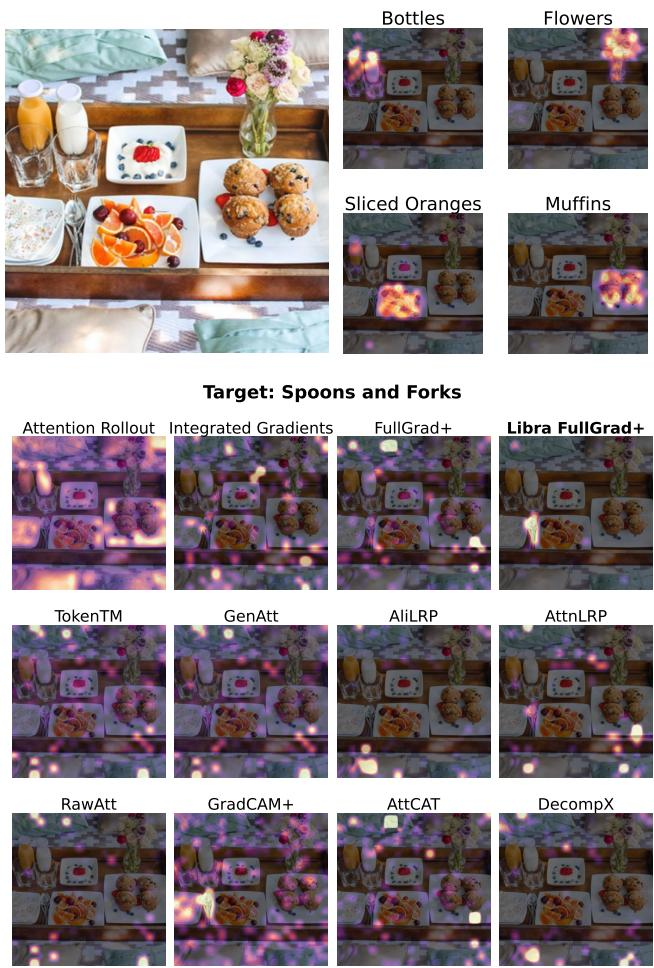
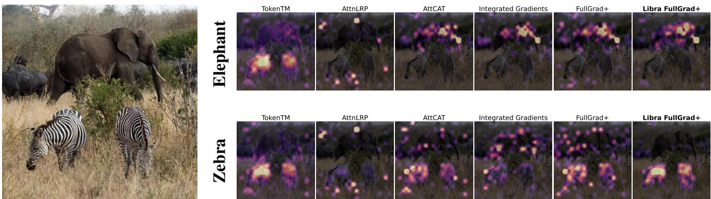

# LibraGrad: Balancing Gradient Flow for Universally Better Vision Transformer Attributions

Faridoun Mehri1 Mahdieh Soleymani Baghshah1 Mohammad Taher Pilehvar2

1Sharif University of Technology, Iran 2Cardiff University, UK

f.meh16@student.sharif.edu soleymani@sharif.edu pilehvarmt@cardiff.ac.uk

## Abstract

Why do gradient-based explanations struggle with Transformers, and how can we improve them? We identify gradientflow imbalances in Transformers that violate FullGradcompleteness, a critical propertyfor attributionfaithfulness that CNNs naturally possess. To address this issue, we introduce LibraGrad—a theoretically grounded post-hoc approach that corrects gradient imbalances through pruning and scaling of backward paths, without changing the forward pass or adding computational overhead. We evaluate LibraGrad using three metric families: Faithfulness, which quantifies prediction changes under perturbations of the most and least relevant features; Completeness Error, which measures attribution conservation relative to model outputs; and Segmentation AP, which assesses alignment with human perception. Extensive experiments across 8 architectures, 4 model sizes, and 5 datasets show that LibraGrad universally enhances gradient-based methods, outperforming existing white-box methods—including Transformerspecific approaches—across all metrics. We demonstrate superior qualitative results through two complementary evaluations: precise text-prompted region highlighting on CLIP models and accurate class discrimination between co-occurring animals on ImageNet-finetuned models—two settings on which existing methods often struggle. Libra-Grad is effective even on the attention-free MLP-Mixer architecture, indicating potential for extension to other modern architectures. Our code is freely available at https: //nightmachinery.github.io/LibraGrad/.

## 1. Introduction

Understanding how deep learning models make decisions is crucial for deploying them in critical applications such as healthcare and autonomous driving. Input attribution methods, which quantify the influence of individual input features on a model’s output [12, 48, 49, 67], help us understand a model’s decision for a single input and also serve

## Libra FullGrad+ (Ours)

  
Figure 1. Qualitative comparison on EVA2-CLIP-Large. Our proposed Libra FullGrad+ generates prompt-specific attribution maps (top) and demonstrates improved localization compared to existing methods when explaining the model output for the “spoons and forks” prompt (bottom). For more qualitative examples, see Fig. 2 and Appendix C.

as building blocks for advanced explanation techniques like CRAFT [31].

In the field of CNN interpretability, gradient-based attribution techniques—particularly Integrated Gradients [78] and FullGrad [76]—established a foundation for model explanation. However, the architectural paradigm shift brought about by Vision Transformers (ViTs) [25, 83] has exposed limitations in these gradient-based methods, with attention-based attribution methods sometimes achieving more success. Hybrid methods, including GenAtt [16], TokenTM [88], and AttCAT [62], attempt to bridge this gap by integrating gradient and attention-based approaches. Nonetheless, significant challenges persist: these methods lack theoretical foundations, struggle to distinguish between classes effectively, produce noisy attribution maps, and often work only with specific model architectures (cf. Appendix E.4).

In this work, we identify the root cause of the failure of gradient-based methods: unbalanced gradient flow during backpropagation leads to unfaithful attribution scores. We demonstrate that while classical CNNs naturally preserve proper gradient flow through their locally affine operations, several components in modern Transformers disrupt this property.

Our solution, LibraGrad, takes a different approach: instead of working around distorted gradients, it prevents the distortion from occurring in the first place by theoretically motivated pruning and scaling of backward paths, leaving the forward pass untouched. Our comprehensive experiments across 8 architectures, 4 model sizes, and 5 datasets show that this not only improves all gradientbased attribution methods but also reveal that specialized attention-gradient hybrids are unnecessary—once gradients flow properly, the general-purpose Libra FullGrad+ achieves superior or comparable performance. We also extend Integrated Gradients (IG) [78] and compose it with other gradient-based methods, and compare the universal improvement aspect of LibraGrad and IG, showing Libra-Grad vastly outperforms IG. Furthermore, we theoretically prove that this is to be expected.

## 2. Background and Related Work

Given a multi-output neural model, let $f : \mathbb { R } ^ { n }  \mathbb { R }$ be a selected output function. For instance, if Model $( x ) \ =$ $( p _ { 1 } , . . . , p _ { k } )$ represents class probabilities, we might choose $f ( x ) = p _ { i }$ to analyze the model’s prediction for the i-th class. An attribution method A generates relevance scores $A ( f ) ( x )$ for each feature $x _ { i }$

## 2.1. Gradient-Based Attribution Methods

Input × Grad. IxG [4, 72, 73] assigns feature relevance by $\operatorname { I x G } \left( f \right) \left( x \right) = x \odot \nabla _ { x } f ( x )$ , where ⊙ denotes elementwise multiplication.

FullGrad. Expanding on Input × Grad, FullGrad [76] includes not only the input features but also the bias terms of each layer in the neural network. The FullGrad attribution map is calculated as:

$$
\mathrm { F u l l G r a d } ( f ) ( x _ { 0 } ) = \mathrm { I x G } \left( f \right) ( x _ { 0 } ) + \sum _ { l = 0 } ^ { L - 1 } \sum _ { b \in B _ { l } } \mathrm { I x G } \left( f _ { b } \right) ( b )
$$

where IxG $( f ) ( x _ { 0 } )$ denotes the Input × Grad for the input $x _ { 0 }$ (the input to the first layer), and IxG $( f _ { b } ) ( b )$ is the Input × Grad attribution map of the sub-network $f _ { b }$ with a bias term b from layer l as the input. Also, $f _ { b }$ is the subnetwork of $f$ starting from the bias term b and going until the end of the model, whereas $B _ { l }$ denotes the set of all bias terms in layer l. FullGrad+ ◦ PLUS (henceforth Full-Grad+) [50] is defined as follows:

$$
\begin{array} { l } { \displaystyle \mathrm { F u l l G r a d + } ( f ) ( \boldsymbol { x } _ { 0 } ) = } \\ { \displaystyle \sum _ { l = 0 } ^ { L - 1 } \mathrm { I x G } \left( f _ { l } \right) ( \boldsymbol { x } _ { l } ) + \sum _ { l = 0 } ^ { L - 1 } \sum _ { b \in B _ { l } } \mathrm { I x G } \left( f _ { b } \right) ( b ) } \end{array}
$$

where IxG $( f _ { l } ) ( x _ { l } )$ is the Input × Grad attribution map of the sub-network $f _ { l }$ with input $x _ { l }$ (the input to the lth layer). FullGrad+ aggregates the input attribution maps of each layer along with the attribution maps of all bias terms in each layer.

Integrated Gradients. IG [78] computes attributions w.r.t. a baseline input x¯ (e.g., zero):

$$
\operatorname { I G } { \big ( } f { \big ) } ( x ) = ( x - { \bar { x } } ) \odot \int _ { \alpha = 0 } ^ { 1 } \nabla _ { x } f { \big ( } { \bar { x } } + \alpha ( x - { \bar { x } } ) { \big ) } d \alpha
$$

In practice, we approximate the integral using a 50-step Riemann summation.

## 2.2. Other Attribution Methods

In addition to the primary gradient-based methods above, we apply LibraGrad to several other generalpurpose gradient methods, including HiResCAM [26], GradCAM ◦ PLUS (henceforth GradCAM+) [42, 50, 68], and XGradCAM+ ◦ PLUS (henceforth XGradCAM+) [33, 50]. We further apply it to hybrid attention-gradient approaches specifically designed for Transformer architectures: GenAtt (also known as GAE) [16], TokenTM [88], and AttCAT [62]. To ensure a comprehensive evaluation, we also compare against attention-based attribution methods RawAtt [15, 17, 35], Attention Rollout [1], and DecompX-NoBias (henceforth DecompX) [53], as well as Transformer-specific Layer-Wise Relevance Propagation (LRP)-based [6] techniques Conservative-LRP (henceforth AliLRP) [3] and AttnLRP [2]. For a detailed overview of related work, see Appendix E.

## 3. Method

Understanding how input features contribute to a model’s output is the central goal of attribution methods. For attributions to be faithful, they must accurately reflect the influence of each input feature on the output. This requires decomposing model outputs into input and bias contributions, formalized as:

Definition 1. A function f is FullGrad-complete (or FGcomplete) if, for all $x \in \mathbb { R } ^ { n }$

$$
f ( \boldsymbol { x } ) = J _ { \boldsymbol { x } } f \cdot \boldsymbol { x } + \sum _ { i } J _ { b _ { i } } f \cdot b _ { i } ,
$$

where $\begin{array} { r } { J _ { x } f = \frac { \partial f } { \partial x } \in \mathbb { R } ^ { m \times n } } \end{array}$ is the Jacobian matrix of f with respect to x, and $\begin{array} { r } { J _ { b _ { i } } f = \frac { \partial f } { \partial b _ { i } } \in \mathbb { R } ^ { m \times d _ { i } } } \end{array}$ are the Jacobian matrices of f with respect to the bias terms $b _ { i }$ . (Cf. Proposition 6 in [76].)

FG-completeness ensures that the sum of the attributions equals the model’s output, leaving no unexplained residual. This is a necessary condition for faithful interpretability, as it guarantees that all factors influencing the output are accounted for in the attribution scores, and no extraneous influence is attributed to the inputs. Throughout this paper, we use the term “balanced gradient flow” interchangeably with FG-completeness. In the following sections, we:

• Establish that classical neural architectures are FGcomplete, thereby explaining the historical success of gradient-based attribution on these models (§3.1).

• Identify non-locally-affine layers in Transformers that break FG-completeness (§3.2).

• Analyze how this causes gradient flow imbalance (§3.3).

• Develop theoretical solutions to restore balanced gradi ents, introducing LibraGrad (§3.4).

• Present practical implementations of LibraGrad for common Transformer components (§3.5).

• Explain the intuition behind a balanced gradient flow using a simple and concrete example (Appendix A.2).

Proofs of theorems and propositions are provided in $\mathsf { A p - }$ pendix A.3.

## 3.1. FG-Completeness of Classical Architectures

We begin by demonstrating that classical convolutional neural networks (CNNs) and multilayer perceptrons (MLPs) satisfy FG-completeness, which explains why gradientbased attribution methods are effective for these architectures. First, we introduce the concept of a locally affine function.

Definition 2. A function $f : \mathbb { R } ^ { n }  \mathbb { R } ^ { m }$ is locally affine at a point $x _ { 0 } \in \mathbb { R } ^ { n }$ if there exists an open neighborhood $U \subset \mathbb { R } ^ { n }$ containing $x _ { 0 }$ , a matrix $W ( x _ { 0 } ) \in \mathbb { R } ^ { m \times n }$ , and a vector $b ( x _ { 0 } ) \in \mathbb { R } ^ { m }$ such that

$$
f ( x ) = W ( x _ { 0 } ) x + b ( x _ { 0 } ) , \quad \forall x \in U .
$$

Many activation functions used in neural networks, such as ReLU, are piecewise linear and therefore locally affine almost everywhere. Our next theorem shows that locally affine functions satisfy FG-completeness.

Theorem 1. Any locally affine function at $x _ { 0 }$ is FGcomplete in a neighborhood of $x _ { 0 } .$

Moreover, we can compose such functions and retain FG-completeness:

Theorem 2. The composition of a finite number of FGcompletefunctions is FG-complete.

Next, we show that FG-completeness is preserved under addition. This property is relevant for neural networks with residual connections, where the output of a layer is added to its input.

Theorem 3. Let $f _ { 1 } , f _ { 2 }$ be FG-complete functions. Then their sum $f = f _ { 1 } + f _ { 2 }$ is FG-complete.

We can now assert that classical neural network architectures are FG-complete:

Corollary 1. Classical neural networks employ several types ofaffine transformations $f ( x ) = W x + b \colon$

1. Linear: $W \in \mathbb { R } ^ { m \times n } , b \in \mathbb { R } ^ { m }$

2. Convolutional: $W$ with spatial weight-sharing, b broadcast per channel

3. Pooling: AveragePool, Global-Average-Pool (special cases of Conv)

4. BatchNorm (eval): $W = d i a g ( \gamma / \sigma ) , b = \beta - \mu \gamma / \sigma$

5. LayerScale: $W = d i a g ( \alpha ) , b = \beta$

Combined with piecewise-linear activations (Theorem 1) and skip connections (Theorem 3), these networks are FGcomplete on $\mathbb { R } ^ { n } \backslash S$ (Theorem 2), where $S$ denotes the union ofboundaries between linear regions

## 3.2. Non-Locally-Affine Layers in Transformers

Despite the FG-completeness of classical architectures, modern Transformer models introduce several non-locallyaffine operations that disrupt this property:

1. Gated Activations: Functions like GELU and SiLU (Swish) [70] involve non-linear gating mechanisms.

2. Attention Mechanisms: Self-attention and crossattention layers perform weighted averaging based on nonlinear attention scores.

3. Multiplicative Feature Fusions: Operations such as self-gating (e.g., SwiGLU [70], MambaOut [92]) involve element-wise multiplication of different feedforward branches.

4. Normalizations: LayerNorm divides by the standard deviation, introducing a division operation.

These operations involve multiplicative (of which division is a special case) interactions and non-linear transformations that break the linearity required for FGcompleteness, leading to imbalanced gradient flow and attribution failures, as we will discuss in the next section.

## 3.3. Analysis of Gradient Flow Imbalance

We now analyze how each non-locally-affine operation affects gradient flow. First, consider the element-wise multiplication of two FG-complete functions:

Proposition 1. Let $f _ { 1 } , f _ { 2 }$ be FG-completefunctions and let $f ( x ) = f _ { 1 } ( x ) \odot f _ { 2 } ( x )$ be their element-wise product with Jacobians:

$$
J _ { x } f = d i a g ( f _ { 2 } ( x ) ) \cdot J _ { x } f _ { 1 } + d i a g ( f _ { 1 } ( x ) ) \cdot J _ { x } f _ { 2 }
$$

$$
J _ { b _ { i } } f = d i a g ( f _ { 2 } ( x ) ) \cdot J _ { b _ { i } } f _ { 1 } + d i a g ( f _ { 1 } ( x ) ) \cdot J _ { b _ { i } } f _ { 2 }
$$

Then f is not FG-complete. Specifically:

$$
J _ { x } f \cdot x + \sum _ { i } J _ { b _ { i } } f \cdot b _ { i } = 2 f ( x )
$$

So far, we’ve assumed both paths are FG-complete before multiplication. What happens when they’re not? While each such case needs its own mathematical proof, multiplication tends to exacerbate any existing gradient flow imbalances rather than restore FG-completeness. Two key examples illustrate this: division (a non-linear multiplicative operation), which we analyze next, and SiLU, which Proposition 4 (in the Appendix) proves to lack FG-completeness.

Proposition 2. Let $f _ { 1 } , f _ { 2 }$ be FG-complete functions with $f _ { 2 }$ non-zero. FullGrad vanishes to exactly zero on their element-wise quotient $f ( x ) = f _ { 1 } ( x ) \oslash f _ { 2 } ( x )$

Proposition 2 demanded FG-completeness of both terms—a condition LayerNorm’s denominator fails to satisfy. Nevertheless, as we show next, this does not spare LayerNorm from vanishing FullGrad attributions.

Proposition 3. For the LayerNorm operation without affine parameters:

$$
L N ( x ) _ { i } = \frac { x _ { i } - \mu } { \sqrt { \sigma ^ { 2 } + \varepsilon } } ,
$$

where $\begin{array} { r } { \mu = \frac { 1 } { N } \sum _ { k = 1 } ^ { N } x _ { k } } \end{array}$ and $\begin{array} { r } { \sigma ^ { 2 } \ = \ \frac { 1 } { N } \sum _ { k = 1 } ^ { N } ( x _ { k } \ - \ \mu ) ^ { 2 } } \end{array}$ FullGrad approaches zero as ε approaches zero:

$$
\operatorname* { l i m } _ { \varepsilon \to 0 } J _ { x } L N \cdot x = 0 .
$$

## 3.4. LibraGrad: Theoretical Foundations

We now develop theoretical solutions to restore balanced gradient flow.

Theorem 4. Let $f _ { 1 } , f _ { 2 }$ be FG-complete functions. Then their element-wise product $f ( x ) = f _ { 1 } ( x ) \odot f _ { 2 } ( x )$ is FGcomplete when its Jacobians are defined with scaling coefficients $a , b \in \mathbb { R }$ where $a + b = 1$

$$
J _ { x } f = a [ d i a g ( f _ { 2 } ( x ) ) \cdot J _ { x } f _ { 1 } ] + b [ d i a g ( f _ { 1 } ( x ) ) \cdot J _ { x } f _ { 2 } ] 
$$

$$
J _ { b _ { i } } f = a [ d i a g ( f _ { 2 } ( x ) ) \cdot J _ { b _ { i } } f _ { 1 } ] + b [ d i a g ( f _ { 1 } ( x ) ) \cdot J _ { b _ { i } } f _ { 2 } ]
$$

The constraint $a + b = 1$ naturally suggests dividing the gradients of each branch by two, $i . e . , a = b = 0 . 5$ . We use the previous theorem to correct the gradients of the Self-Gating module (see Libra Self-Gating in §3.5) where two FG-complete branches are multiplied together. However, other nonlinear modules in Transformers have a nonlinearity multiplied by an FG-complete branch. While the previous theorem cannot handle such modules, a specific choice of $a = 1 , b = 0$ (assuming b is the scaling factor of the nonlinear branch) works effectively, as demonstrated in the next theorem.

Theorem 5. Let $f _ { 1 } , f _ { 2 }$ be arbitrary functions (not necessarily FG-complete), and let $f ( x ) = f _ { 1 } ( x ) \odot f _ { 2 } ( x )$ be their element-wise product. Consider f with scaled Jacobians as defined in Theorem 4. Then:

1. When $a = 0 ,$ , yielding $f ( x ) = [ f _ { 1 } ( x ) ] _ { c s t . } \odot f _ { 2 } ( x )$ where $[ \cdot ] _ { c s t . }$ is the constant operator that zeroes gradients, f is FG-complete $i f f _ { 2 }$ is FG-complete.

2. By symmetry, when $b \ = \ 0 ,$ , f is FG-complete if f1 is FG-complete.

While the above theorem can be viewed as a special case of Theorem 4, it deserves separate consideration. By treating the nonlinear multiplicand as constant, we construct a locally linear approximation of the original nonlinear function that is exact for each particular input. In other words, we create different locally linear approximations of the model for each given input, and these approximations are exact for those specific inputs. (Recall that locally linear functions are FG-complete, per Theorem 1.) The theorem above also extends to matrix multiplication, again reducing to Theorem 1. §3.5 applies this theorem to make Attention, LayerNorm, and Gated Activations FG-complete.

Our approach differs from conventional Taylor linearization. A first-order Taylor expansion approximates a function $f ( x )$ around a point x0 as $f ( x _ { 0 } ) + f ^ { \prime } ( x _ { 0 } ) ( x - x _ { 0 } )$ where the constant term $f ( x _ { 0 } ) - f ^ { \prime } ( x _ { 0 } ) x _ { 0 }$ serves as an implicit bias term. Gradient-based attribution methods typically ignore this bias term entirely, and distributing this bias term’s attribution across input features presents a non-trivial challenge. Our method circumvents this issue by constructing locally-exact linear approximations without introducing such bias terms.

<table><tr><td>Method</td><td>Computation</td><td>Memory</td></tr><tr><td>Input × Grad</td><td>O(1)</td><td> $\mathcal { O } ( \sqrt { \mathrm { L a y e r s } } )$ </td></tr><tr><td>Integrated Gradients</td><td>O(Steps)</td><td> $\mathcal { O } ( \sqrt { \mathrm { L a y e r s } } )$ </td></tr><tr><td>DecompX</td><td>O(Tokens)</td><td>O(Tokens)</td></tr><tr><td>FullGrad+</td><td>O(1)</td><td> $\mathcal { O } ( \sqrt { \mathrm { L a y e r s } } )$ </td></tr><tr><td>Libra FullGrad+</td><td>O(1)</td><td> $\mathcal { O } ( \sqrt { \mathrm { L a y e r s } } )$ </td></tr></table>

Table 1. Computational and memory complexities of attribution methods relative to one forward pass [2, 21, 53, 76, 78].

Summary. When handling multiplicative interactions, we face a choice: ideally, we can scale gradients if both paths are FG-complete (Theorem 4), preserving information from both paths, or—when one path lacks FG-completeness—we can prune paths to restore FG-completeness by relying on just one FG-complete path (Theorem 5).

Corollary 2. Division can be made FG-complete by treating it as element-wise multiplication with a gradient-pruned non-linear reciprocal: $f ( x ) = f _ { 1 } ( x ) \odot [ 1 / f _ { 2 } ( x ) ] _ { c s t . }$ which satisfies FG-completeness, by Theorem 5.

For division operations like those in LayerNorm, Corollary 2 shows how treating the denominator as constant in the backward pass restores proper gradient flow.

These theoretical results suggest a general principle: balanced gradient flow can be achieved through strategic pruning and scaling of backward paths, without modifying the forward computation. Such pruning and scaling can be achieved using the following two gradient manipulation operators:

Constant Operator. The constant operator $[ \cdot ] _ { \mathrm { c s t . } } : \mathbb { R } ^ { m } $ $\mathbb { R } ^ { m }$ satisfies:

$$
[ y ] _ { \mathrm { c s t . } } = y , \quad J _ { x } [ y ] _ { \mathrm { c s t . } } = 0
$$

SwapBackward. The SwapBackward : $( f , g ) \mapsto h$ operator, where $f , g , h : \mathbb { R } ^ { n }  \mathbb { R } ^ { m }$ , is defined by:

$$
h ( x ) = f ( x ) , \quad J _ { x } h = J _ { x } g
$$

Further theoretical insights about these operators, their computational complexity (unchanged compared to standard gradients, Table 1), and practical PyTorch implementations are available in Appendix A.1.

## 3.5. LibraGrad: Practical Implementation

Libra Neural Operations. We now define FG-complete versions of common non-affine operations. Libra Attention, Gated Activations, and LayerNorm use Theorem 5, while Libra Self-Gating uses Theorem 4.

Libra Attention. In attention mechanisms, we discard the gradient of the nonlinear softmax.

$$
\mathrm { L i b r a - A t t e n t i o n } ( Q , K , V ) = [ \mathrm { s o f t m a x } ( Q K ^ { T } ) ] _ { \mathrm { c s t . } } \cdot V
$$

Libra Gated Activation. For gated activations like GELU and SiLU, we discard the non-linear gate’s gradient.

$$
\mathrm { L i b r a - G a t e d A c t i v a t i o n } ( x ) = x \odot [ \mathrm { N o n L i n e a r G a t e } ( x ) ] _ { \mathrm { c s t . } }
$$

Libra LayerNorm. We discard the gradient of the nonlinear denominator in LayerNorm. Note that the expectation $( \mu = \mathbb { E } [ x ] )$ is linear.

$$
\operatorname { L i b r a - L a y e r N o r m } ( x ) = { \frac { x - \mu } { [ { \sqrt { \sigma ^ { 2 } + \varepsilon } } ] _ { \mathrm { c s t . } } } }
$$

Libra Self-Gating. In self-gating operations like SwiGLU, the input flows through dual parallel feedforward paths $( f _ { 1 } , f _ { 2 } )$ and reunifies via element-wise multiplication. To balance the gradient flow between branches, we scale each branch’s gradient by $\begin{array} { l } { { \frac { 1 } { 2 } } } \end{array}$ (Theorem 4).

$$
\operatorname { L i b r a - S e l f G a t e } ( x ) = { \operatorname { S w a p B a c k w a r d } } ( f _ { 1 } \odot f _ { 2 } , { \frac { 1 } { 2 } } ( f _ { 1 } \odot f _ { 2 } ) ) ( x )
$$

Corollary 3. A Transformer architecture attains FGcompleteness when all non-linear components—specifically its attention mechanisms, activation functions, self-gating operations, and LayerNorms—are replaced with their Libra counterparts.

Universal Improvement. While our theoretical discussion focuses on achieving FG-completeness, empirical results demonstrate that LibraGrad’s gradient balancing mechanism universally enhances gradient-based attribution methods.

## 4. Experiments

We evaluate LibraGrad through three complementary metrics: Faithfulness, Completeness Error, and Segmentation. For statistical validity, we report standard deviation upper bounds for empirical results. In tables, we denote the best and second-best results in each column with bold and underline formatting, respectively.

## 4.1. Experimental Setup

Our evaluation spans two dimensions:

• Architectures: Eight model families (ViT [25], EVA2 [28, 29, 77], BEiT2 [7, 60], FlexiViT [11], SigLIP1 [93], CLIP [63], DeiT3 [81, 82], MLP-

  
Figure 2. Cross-method comparison of class discriminativity on ViT-B. Cf . Fig. 1 and Appendix C.

Mixer [80]), using their largest2 ImageNet-1k [24] finetuned variants.

• Model Sizes: All ViT variants: tiny (ViT-T), small (ViT-S), base (ViT-B), and large (ViT-L).

Faithfulness Metrics. We evaluate various attribution methods using faithfulness metrics, which quantify how accurately the attribution scores reflect the importance of input features in the model’s predictions. These widely used metrics [13, 20, 32, 50, 53, 55, 88] measure changes in model behavior as we progressively occlude input features in different orders. Here, we report the Most-Influential-First Deletion (MIF) metric with predicted labels and accuracy measurement, which tracks performance degradation when occluding features by decreasing attribution importance. Full details of this and related metrics (Least-Influential-First Deletion, LIF and Symmetric Relevance Gain, SRG) are provided in Appendix B.2, with comprehensive results on all metrics available in Appendix D.

We evaluate all architectures on the ImageNet [24] dataset—the standard benchmark in the attribution literature [17, 50, 88, 90]. On ViT-B, we also experiment with multiple other datasets: ImageNet-Hard [79], and following [22], MURA (a medical X-ray dataset) [64] and Oxford-IIIT Pet [59]. ImageNet-Hard is a challenging dataset combining images from various existing ImageNet variants: ImageNet-V2 [65], ImageNet-Sketch [85], ImageNet-C [36], ImageNet-R [37], ImageNet-ReaL [10], ImageNet-A [38], and ObjectNet [8]. We randomly select 1000 images from each dataset using a fixed seed.

Completeness Error. We use Completeness Error to verify theoretical guarantees and validate implementation cor-

rectness:

$$
\operatorname { C E } ( f , x , A ) = \left. f ( x ) - \sum _ { i = 1 } ^ { n } A ( f ) ( x ) _ { i } \right\|\tag{1}
$$

Lower CE values indicate better conservation of the model’s output in the attribution scores. As this is just a sanity check, we use only 100 random images from the ImageNet dataset. See Appendix B.1 for further details.

Segmentation. For segmentation, following [50], we opt for ImageNet-S [34], which encompasses 919 distinct classes, using a random subset of 5000 images from the validation set. Since segmentation masks provide ground truth annotations of object boundaries, they serve as an objective reference to evaluate how well feature attribution methods identify the truly relevant image regions that contribute to model predictions. See Appendix B.3 for further details.

FunnyBirds. We further assess FullGrad+ and its Libra enhancement using FunnyBirds [39], a synthetic dataset explicitly developed, along with tailored metrics, to benchmark attribution methods. See Table 3.

## 4.2. Quantitative Results

Our evaluations demonstrate that LibraGrad universally enhances gradient-based attribution methods across all tested models, architectures, and datasets (see Appendix D for comprehensive results). Significant improvements are observed in both faithfulness and segmentation metrics (Tables 6 and Appendix D.2.1), and Libra FullGrad achieves optimal Completeness Error (Table 4). These enhancements remain consistent across different model scales (Appendix D.3) and datasets (Table 2, Appendix D.4), and extend to the attention-free MLP-Mixer (Appendix D.5.1), validating that gradient flow imbalance, not attention mechanisms, is the core issue.

<table><tr><td>Method</td><td>ImageNet</td><td>ImageNet- Hard</td><td>MURA</td><td>Oxford- IIIT Pet</td><td>Avg.</td></tr><tr><td>Random</td><td>26.5</td><td>52.4</td><td>15.1</td><td>13.7</td><td>26.9</td></tr><tr><td>RawAtt</td><td>44.6</td><td>65.9</td><td>24.8</td><td>37.2</td><td>43.1</td></tr><tr><td>Attn. Rollout</td><td>35.4</td><td>62.2</td><td>21.5</td><td>21.2</td><td>35.1</td></tr><tr><td>AliLRP</td><td>33.3</td><td>64.1</td><td>19.2</td><td>19.0</td><td>33.9</td></tr><tr><td>AttnLRP</td><td>38.5</td><td>70.8</td><td>22.8</td><td>30.3</td><td>40.6</td></tr><tr><td>DecompX</td><td>37.8</td><td>67.7</td><td>21.6</td><td>22.5</td><td>37.4</td></tr><tr><td>Int. Gradients</td><td>35.4</td><td>66.6</td><td>23.8</td><td>20.7</td><td>36.6</td></tr><tr><td>Input × Grad</td><td>34.4</td><td>67.6</td><td>25.5</td><td>20.4</td><td>37.0</td></tr><tr><td>w/Libra</td><td>38.6</td><td>68.8</td><td>21.6</td><td>23.5</td><td>38.1</td></tr><tr><td>AttCAT</td><td>46.9</td><td>82.3</td><td>31.1</td><td>37.3</td><td>49.4</td></tr><tr><td>w/Libra</td><td>63.5</td><td>87.3</td><td>40.9</td><td>55.3</td><td>61.8</td></tr><tr><td>GenAtt w/Libra</td><td>58.2</td><td>81.3</td><td>30.0</td><td>44.1</td><td>53.4</td></tr><tr><td>TokenTM</td><td>61.6</td><td>82.8</td><td>30.1</td><td>46.5</td><td>55.2</td></tr><tr><td>w/Libra</td><td>56.8</td><td>79.3</td><td>28.0</td><td>44.0</td><td>52.0</td></tr><tr><td></td><td>59.1</td><td>80.0</td><td>28.0</td><td>45.4</td><td>53.1</td></tr><tr><td>GradCAM+ w/Libra</td><td>45.6</td><td>75.8</td><td>24.0</td><td>32.6</td><td>44.5</td></tr><tr><td></td><td>61.4</td><td>83.4</td><td>34.7</td><td>47.8</td><td>56.8</td></tr><tr><td>HiResCAM w/Libra</td><td>45.4</td><td>74.2</td><td>22.2</td><td>18.0</td><td>39.9</td></tr><tr><td></td><td>56.7</td><td>79.7</td><td>30.1</td><td>39.4</td><td>51.5</td></tr><tr><td>XGradCAM+</td><td>38.6</td><td>72.1</td><td>23.7</td><td>33.2</td><td>41.9</td></tr><tr><td>w/Libra</td><td>63.9</td><td>84.7</td><td>36.6</td><td>52.6</td><td>59.4</td></tr><tr><td>FullGrad+</td><td>44.2</td><td>80.1</td><td>32.8</td><td>35.3</td><td>48.1</td></tr><tr><td>w/ Libra</td><td>63.1</td><td>87.6</td><td>43.2</td><td>57.3</td><td>62.8</td></tr></table>

Table 2. Cross-dataset analysis of Most-Influential-First Deletion (MIF) Accuracy evaluated using predicted labels on ViT-B. All standard deviations were bounded by 0.1 (omitted for brevity).

<table><tr><td>Method</td><td>CSDC</td><td>PC</td><td>DC</td><td>D</td><td>BI</td><td>SD</td><td>TS</td></tr><tr><td>FullGrad+</td><td>61.0</td><td>55.0</td><td>56.8</td><td>44.5</td><td>99.7</td><td>55.4</td><td>84.3</td></tr><tr><td>w/Libra</td><td>92.7</td><td>91.4</td><td>90.2</td><td>91.1</td><td>99.7</td><td></td><td>69.4 97.1</td></tr></table>

Table 3. Evaluation of FullGrad+ and its Libra enhancement on ViT-B using FunnyBirds [39] (metrics defined in their Table 1). FullGrad+ is implemented without biases for this evaluation.

Integrated Gradients. We also extend IG [78] and compose it with other gradient-based methods, and compare the universal improvement aspect of LibraGrad and IG in Appendix D.1, showing that LibraGrad vastly outperforms IG. Due to numerical instability, the practical approximation of IG fails to meet its theoretical promise of completeness relative to the zero baseline (Table 4). Furthermore, we prove that the numerical instability observed is theoretically unavoidable for a fixed-step approximation (Proposition 5 in the Appendix).

General-Purpose Methods Are Enough. Once gradient flow is corrected, the general-purpose FullGrad+ outperforms Transformer-specific methods like GenAtt, TokenTM, and AttCAT across most metrics and models, with only a few exceptions where its performance remains competitive. This suggests that specialized architectures may not require specialized attribution methods when gradient flow is properly balanced.

Ablation Studies. Our ablation study (Table 5) reveals three key insights: First, while gated activations theoretically break FG-completeness (Proposition 4), their practical impact is minimal as they often operate in saturated regimes. Second, LayerNorm’s theoretically predicted vanishing attribution problem is empirically confirmed as the most significant factor. Finally, while bias terms are necessary for theoretical completeness, their practical impact is modest, suggesting that implementations can optionally omit them without severe consequences.

## 4.3. Qualitative Analysis

We evaluate Libra FullGrad+ through two complementary scenarios: (1) text-prompted region attribution using CLIP models, demonstrating precise localization of prompted elements in complex scenes (Fig. 1, Appendix C.1), and (2) class discrimination on COCO [47] images, showing accurate distinction between co-occurring animals (Fig. 2, Appendix C.2). Both reinforce our quantitative findings that proper gradient flow enables general-purpose methods to outperform specialized approaches. Detailed protocols are in Appendix B.4.

## 5. Conclusion

We introduced LibraGrad, correcting gradient flow imbalances via pruning and scaling backward paths. FGcompleteness, formalized here, ensures attributions decompose outputs faithfully. We prove that while classical CNNs were naturally FG-complete (explaining their historical success with gradient-based methods), several operations in modern Transformers break this property. We provide both theoretical proofs for restoring FG-completeness and practical solutions that require no forward-pass modifications. Empirically, LibraGrad universally enhances gradient-based attributions across architectures, model sizes, and datasets, enabling general-purpose methods like FullGrad+ to outperform Transformer-specific approaches. This suggests that specialized architectures may not require specialized attribution methods when gradient flow is properly balanced. Our qualitative results further validate this insight. Future work can explore compositions with other gradient-based methods, applications as a gradient regularizer, and extensions to emerging architectural innovations.

<table><tr><td>Method</td><td>ViT-L↓</td><td>EVA2-S↓</td><td>BEiT2-L↓</td><td>FlexiViT-L ↓</td><td>SigLIP-L ↓</td><td>CLIP-H↓</td><td>DeiT3-H↓</td><td> $A \nu g . \downarrow$ </td></tr><tr><td>Input × Grad</td><td> $1 3 . 6 { \pm } 0 . 3 $ </td><td> $8 . 9 \pm \ : 0 . 2$ </td><td> $9 . 0 \pm \ : 0 . 1$ </td><td> $7 . 1 \pm 0 . 1$ </td><td> $9 . 3 \pm \ : 0 . 1$ </td><td> $1 . 3 { \pm } 0 . 0 $ </td><td> $8 . 6 \pm 0 . 1$ </td><td> $8 . 3 \pm \ : 0 . 2$ </td></tr><tr><td>Integrated Gradients</td><td> $\underline { { 8 . 5 \pm 1 . 5 } }$ </td><td> $4 . 8 \pm \ : 0 . 1$ </td><td> $6 . 7 \pm \ : 0 . 1$ </td><td> $4 . 0 { \pm } 0 . 4 $ </td><td> $5 . 1 \pm \ : 0 . 2$ </td><td> $8 . 2 \pm 0 . 1$ </td><td> $6 . 4 \pm 0 . 5$ </td><td> $6 . 2 \pm \ : 0 . 6$ </td></tr><tr><td>DecompX</td><td> $1 1 . 3 { \pm } 1 . 3 $ </td><td> $9 1 1 . 2 \pm 3 3 . 7$ </td><td> $1 9 9 . 2 \pm 1 0 . 4 $ </td><td> $5 . 5 \pm 0 . 5$ </td><td> $2 4 2 . 1 \pm 2 8 . 7$ </td><td> $1 6 . 7 { \pm } 0 . 8 $ </td><td> $7 . 7 \pm 0 . 6 $ </td><td> $1 9 9 . 1 \pm 1 7 . 2 $ </td></tr><tr><td>AliLRP</td><td> $2 9 . 5 \pm 4 . 1$ </td><td> $1 2 3 3 . 1 \pm 4 6 . 7$ </td><td> $1 3 9 . 4 \pm \ : 6 . 2$ </td><td> $7 . 8 \pm 0 . 3$ </td><td> $6 9 . 0 \pm \ : 8 . 8$ </td><td> $1 5 . 4 \pm 1 . 4$ </td><td> $1 8 . 1 \pm 0 . 7$ </td><td> $2 1 6 . 1 \pm 1 8 . 2 $ </td></tr><tr><td>AttnLRP</td><td> $1 1 . 0 { \pm } 0 . 5 $ </td><td> $2 . 2 \pm \ : 0 . 2$ </td><td> $3 8 . 2 \pm \ : 2 . 1$ </td><td> $4 . 3 \pm 0 . 3$ </td><td> $3 0 . 4 \pm \ : 1 . 7$ </td><td> $2 . 9 \pm 0 . 2$ </td><td> $5 . 9 \pm 0 . 2$ </td><td> $1 3 . 6 \pm \ : 1 . 0$ </td></tr><tr><td>FullGrad</td><td> $1 1 . 4 \pm 0 . 7$ </td><td> $9 . 5 \pm \ : 0 . 5$ </td><td> $1 1 . 8 \pm \ : 0 . 5$ </td><td> $1 9 . 8 { \pm } 0 . 6 $ </td><td> $6 . 7 \pm \ : 0 . 4$ </td><td> $7 . 3 \pm 0 . 7$ </td><td> $1 0 . 6 { \pm } 0 . 3 $ </td><td> $1 1 . 0 \pm \ : 0 . 5$ </td></tr><tr><td>Libra FullGrad</td><td> ${ \bf 0 . 0 \pm 0 . 0 }$ </td><td> ${ \bf 0 . 0 \pm \mathrm { ~ 0 . 0 ~ } }$ </td><td> ${ \bf 0 . 0 \pm \mathrm { ~ 0 . 0 ~ } }$ </td><td> ${ \bf 0 . 0 \pm 0 . 0 }$ </td><td> ${ \bf 0 . 0 \pm \mathrm { ~ 0 . 0 ~ } }$ </td><td> ${ \bf 0 . 0 \pm 0 . 0 }$ </td><td> ${ \bf 0 . 0 \pm 0 . 0 }$ </td><td> ${ \bf 0 . 0 \pm \mathrm { ~ 0 . 0 ~ } }$ </td></tr></table>

Table 4. Completeness Error (lower is better) across models for attribution methods. CE for IG has been computed relative to the zero baseline. Methods without a theoretical basis for completeness (e.g., Attention Rollout) are excluded, as their incompleteness is evident.

<table><tr><td rowspan="2">Method</td><td colspan="2">MIF Deletion (GT)</td><td colspan="2">MIF Deletion (Predicted)</td><td>Segmentation</td></tr><tr><td>Accuracy</td><td>AOPC</td><td>Accuracy</td><td>AOPC</td><td>AP</td></tr><tr><td>Libra FullGrad+</td><td> $7 4 . 1 \pm 0 . 1$ </td><td> $4 5 . 5 \pm 0 . 3 $ </td><td> $7 1 . 7 \pm 0 . 1$ </td><td>50.5 ±0.2</td><td>79.4 ±0.3</td></tr><tr><td>No Att.</td><td> $6 8 . 0 \pm 0 . 1 \ : ( \ : - 8 . 2 \% )$ </td><td>40.8 ±0.3 (-10.5%)</td><td> $6 5 . 2 \pm 0 . 1 \ ( \mathrm { ~ \ } - 9 . 1 \% )$ </td><td> $4 5 . 5 \pm 0 . 2 ( - 1 0 . 0 \% )$ </td><td> $7 2 . 2 \pm 0 . 3 \ ( \mathrm { \hbar \mathrm { \Omega } } - 9 . 1 \% )$ </td></tr><tr><td>No LN</td><td> $5 5 . 3 \pm 0 . 1 \ ( - 2 5 . 3 \% )$ </td><td> $3 0 . 0 \pm 0 . 3 \stackrel { \cdot } { ( - 3 4 . 2 \% ) }$ </td><td> $4 9 . 9 \pm 0 . 1 \ ( - 3 0 . 4 \% )$ </td><td> $3 3 . 3 \pm 0 . 2 \ : ( - 3 4 . 1 \% )$ </td><td>72.1 ±0.3 ( -9.2%)</td></tr><tr><td>No Att. &amp; LN</td><td> $6 3 . 6 \pm 0 . 1 \ ( - 1 4 . 1 \% )$ </td><td> $3 6 . 6 \pm 0 . 2 ( - 1 9 . 7 \% )$ </td><td> $6 1 . 2 \pm 0 . 1 \ ( - 1 4 . 7 \% )$ </td><td>41.1 ±0.2 (-18.6%)</td><td>66.2 ±0.3 (-16.7%)</td></tr><tr><td>No Act.</td><td> $7 4 . 0 \pm 0 . 1 \ : ( \ : - 0 . 1 \% )$ </td><td> $4 5 . 4 \pm 0 . 3 \ : ( \ : - 0 . 3 \% )$ </td><td> $7 1 . 6 \pm 0 . 1 \ : ( \ : - 0 . 3 \% )$ </td><td> $5 0 . 4 \pm 0 . 2 \ : ( \ : . 0 . 4 \% )$ </td><td>79.3 ±0.3 ( -0.2%)</td></tr><tr><td>No Gate</td><td> $6 9 . 8 \pm 0 . 1 \ : ( \ : - 5 . 7 \% )$ </td><td>41.9 ±0.4 (-8.0%)</td><td> $6 7 . 0 \pm 0 . 1 \ : ( \ : - 6 . 6 \% )$ </td><td>46.7 ±0.3 ( -7.5%)</td><td>71.1 ±0.3 (-10.5%)</td></tr><tr><td>No Bias</td><td> $7 3 . 9 \pm 0 . 1 \ ( \mathrm { \Omega } - 0 . 2 \% )$ </td><td> $4 5 . 3 \pm 0 . 3 \ : ( \ : - 0 . 4 \% )$ </td><td> $7 1 . 5 \pm 0 . 1 \ : ( \ : - 0 . 3 \% )$ </td><td> $5 0 . 3 \pm 0 . 2 \ ( \mathrm { ~ \ - 0 . 4 \% } )$ </td><td> $7 9 . 2 \pm 0 . 3 \ ( \mathrm { ~ \ - 0 . 3 \% } )$ </td></tr><tr><td>Normal FullGrad+</td><td> $5 0 . 9 \pm 0 . 1 \ ( - 3 1 . 3 \% )$ </td><td> $2 5 . 7 \pm 0 . 2 \ ( - 4 3 . 5 \% )$ </td><td> $4 8 . 0 \pm 0 . 1 \ ( - 3 3 . 0 \% )$ </td><td> $3 0 . 0 \pm 0 . 2 ( - 4 0 . 7 \% )$ </td><td> $5 1 . 5 \pm 0 . 3 \ : ( - 3 5 . 1 \% )$ </td></tr></table>

Table 5. Ablation study on the EVA2-S model showing the impact of removing individual components from LibraGrad. Abbreviations used: Att. (Attention), LN (LayerNorm), Act. (Gated Activation Functions), Gate (SwiGLU Self-Gating).

<table><tr><td>Method</td><td>ViT-L</td><td>EVA2-S</td><td>BEiT2-L</td><td>FlexiViT-L</td><td>SigLIP-L</td><td>CLIP-H</td><td>DeiT3-H</td><td>Avg.</td></tr><tr><td>Random</td><td> $2 9 . 5 { \pm } 0 . 1 $ </td><td> $2 1 . 2 { \pm } 0 . 1$ </td><td> $1 8 . 3 \pm 0 . 1$ </td><td> $1 9 . 2 \pm 0 . 1$ </td><td> $3 2 . 8 \pm 0 . 1$ </td><td>28.0±0.1</td><td> $2 9 . 0 { \pm } 0 . 1$ </td><td>25.4±0.1</td></tr><tr><td>RawAtt</td><td> $3 9 . 1 \pm 0 . 1$ </td><td> $5 0 . 8 \pm 0 . 1$ </td><td> $2 9 . 5 \pm 0 . 1$ </td><td> $4 1 . 7 \pm 0 . 1$ </td><td></td><td>42.5±0.1</td><td>52.0±0.1</td><td>42.6±0.1</td></tr><tr><td>Attention Rollout</td><td> $3 1 . 4 \pm 0 . 1$ </td><td> $4 1 . 1 { \pm } 0 . 1$ </td><td> $1 9 . 7 \pm 0 . 1$ </td><td> $2 3 . 2 \pm 0 . 1$ </td><td></td><td>41.3±0.1</td><td>31.2±0.1</td><td>31.3 ±0.1</td></tr><tr><td>AliLRP</td><td> $3 3 . 2 \pm 0 . 1$ </td><td> $4 8 . 0 { \pm } 0 . 1 $ </td><td> $2 6 . 2 \pm 0 . 1$ </td><td>24.9±0.1</td><td> $5 5 . 4 \pm 0 . 1$ </td><td>34.4±0.1</td><td>56.3±0.1</td><td>39.8±0.1</td></tr><tr><td>AttnLRP</td><td> $4 1 . 8 \pm 0 . 1$ </td><td> $6 3 . 5 { \pm } 0 . 1 $ </td><td> $3 7 . 7 \pm 0 . 1$ </td><td>21.8±0.1</td><td>62.2±0.1</td><td>46.7±0.1</td><td>40.7±0.1</td><td>44.9±0.1</td></tr><tr><td>DecompX</td><td> $3 8 . 9 \pm 0 . 1$ </td><td> $4 6 . 8 \pm 0 . 1$ </td><td> $3 1 . 7 \pm 0 . 1$ </td><td>35.5 ±0.1</td><td>51.1 ±0.1</td><td>42.4±0.1</td><td>47.2±0.1</td><td>42.0±0.1</td></tr><tr><td>Integrated Gradients</td><td>35.9±0.1</td><td>34.8±0.1</td><td> $2 3 . 2 \pm 0 . 1$ </td><td>22.3 ±0.1</td><td>44.0±0.1</td><td>31.0±0.1</td><td>33.2±0.1</td><td>32.1 ±0.1</td></tr><tr><td>Input × Grad</td><td>33.9±0.1</td><td>32.3 ±0.1</td><td> $2 1 . 8 { \pm } 0 . 1$ </td><td> $1 9 . 9 \pm 0 . 1$ </td><td>40.8±0.1</td><td>31.4±0.1</td><td>35.1 ±0.1</td><td>30.7±0.1</td></tr><tr><td>Libra Input × Grad</td><td>40.5 ±0.1</td><td>64.1 ±0.1</td><td>33.0±0.1</td><td>36.4±0.1</td><td>51.1 ±0.1</td><td>43.1±0.1</td><td>47.7±0.1</td><td>45.1±0.1</td></tr><tr><td>AttCAT</td><td>44.8±0.1</td><td> $5 4 . 1 \pm 0 . 1$ </td><td>33.9±0.1</td><td>41.9±0.1</td><td>45.9±0.1</td><td>39.0±0.1</td><td>44.0±0.1</td><td>43.4±0.1</td></tr><tr><td>Libra AttCAT</td><td> $6 1 . 3 { \pm } 0 . 1 $ </td><td> $6 9 . 5 { \pm } 0 . 1 $ </td><td>48.9±0.1</td><td> $5 8 . 4 \pm 0 . 1$ </td><td>77.4±0.1</td><td>58.5±0.1</td><td>70.5±0.1</td><td>63.5±0.1</td></tr><tr><td>GenAtt</td><td> $5 1 . 8 { \pm } 0 . 1$ </td><td> $4 0 . 7 \pm 0 . 1$ </td><td> $3 0 . 8 \pm 0 . 1$ </td><td> $5 3 . 0 { \pm } 0 . 1 $ </td><td>-</td><td>51.0±0.1</td><td>64.6±0.1</td><td>48.7±0.1</td></tr><tr><td>Libra GenAtt</td><td> $5 5 . 4 \pm 0 . 1$ </td><td> $4 2 . 1 \pm 0 . 1$ </td><td> $3 2 . 9 \pm 0 . 1$ </td><td> $5 4 . 1 \pm 0 . 1$ </td><td></td><td>58.1 ±0.1</td><td>66.5 ±0.1</td><td>51.5±0.1</td></tr><tr><td>TokenTM</td><td> $5 0 . 0 { \pm } 0 . 1$ </td><td>44.7±0.1</td><td> $3 9 . 6 \pm 0 . 1$ </td><td> $4 9 . 3 \pm 0 . 1$ </td><td></td><td>51.9±0.1</td><td>63.3±0.1</td><td>49.8±0.1</td></tr><tr><td>Libra TokenTM</td><td> $5 2 . 5 { \pm } 0 . 1 $ </td><td> $4 6 . 0 { \pm } 0 . 1 $ </td><td> $3 8 . 3 \pm 0 . 1$ </td><td>51.0±0.1</td><td></td><td>57.4 ±0.1</td><td>65.2±0.1</td><td>51.7±0.1</td></tr><tr><td>GradCAM+</td><td> $4 8 . 6 { \pm } 0 . 1 $ </td><td> $4 7 . 1 { \pm } 0 . 1$ </td><td> $3 3 . 4 \pm 0 . 1$ </td><td> $2 8 . 7 \pm 0 . 1$ </td><td> $4 3 . 5 { \pm } 0 . 1 $ </td><td>33.0±0.1</td><td>44.5±0.1</td><td>39.8±0.1</td></tr><tr><td>Libra GradCAM+</td><td> $5 6 . 5 \pm 0 . 1$ </td><td>67.0±0.1</td><td> $3 7 . 5 { \pm } 0 . 1 $ </td><td>33.7±0.1</td><td>47.4±0.1</td><td>36.2±0.1</td><td>48.7±0.1</td><td>46.7±0.1</td></tr><tr><td>HiResCAM</td><td>25.7 ±0.1</td><td> $5 9 . 1 \pm 0 . 1$ </td><td> $3 5 . 8 \pm 0 . 1$ </td><td> $2 3 . 8 \pm 0 . 1$ </td><td> $3 1 . 4 \pm 0 . 1$ </td><td>37.6±0.1</td><td>25.8±0.1</td><td>34.2±0.1</td></tr><tr><td>Libra HiResCAM</td><td>49.0±0.1</td><td>62.6±0.1</td><td>37.2±0.1</td><td>56.5±0.1</td><td> $4 6 . 1 \pm 0 . 1$ </td><td>48.9±0.1</td><td>53.8±0.1</td><td>50.6±0.1</td></tr><tr><td>XGradCAM+</td><td>45.9±0.1</td><td> $5 0 . 2 \pm 0 . 1$ </td><td> $3 0 . 6 \pm 0 . 1$ </td><td> $2 6 . 6 { \pm } 0 . 1 $ </td><td> $5 1 . 4 { \pm } 0 . 1 $ </td><td> $3 9 . 4 \pm 0 . 1$ </td><td>45.1 ±0.1</td><td>41.3±0.1</td></tr><tr><td>Libra XGradCAM+</td><td> $5 8 . 8 \pm 0 . 1$ </td><td> $6 9 . 3 \pm 0 . 1 $ </td><td> $4 5 . 6 \pm 0 . 1$ </td><td> $4 4 . 3 \pm 0 . 1$ </td><td> $6 3 . 6 \pm 0 . 1$ </td><td> $5 7 . 7 \pm 0 . 1$ </td><td>66.1 ±0.1</td><td> $5 7 . 9 { \pm } 0 . 1 $ </td></tr><tr><td>FullGrad+</td><td> $4 5 . 1 \pm 0 . 1$ </td><td> $4 8 . 0 { \pm } 0 . 1 $ </td><td> $2 9 . 0 { \pm } 0 . 1$ </td><td> $3 8 . 9 \pm 0 . 1$ </td><td> $4 3 . 6 { \pm } 0 . 1 $ </td><td> $3 7 . 6 { \pm } 0 . 1 $ </td><td> $4 1 . 9 { \pm } 0 . 1$ </td><td> $4 0 . 6 { \pm } 0 . 1$ </td></tr><tr><td>Libra FullGrad+</td><td> $6 2 . 4 \pm 0 . 1$ </td><td> $7 1 . 7 { \pm } 0 . 1 $ </td><td> ${ \bf 5 0 . 0 \pm 0 . 1 }$ </td><td> ${ \bf 5 9 . 1 \pm 0 . 1 }$ </td><td> $7 3 . 5 { \pm } 0 . 1 $ </td><td>61.1±0.1</td><td> $7 1 . 5 { \pm } 0 . 1 $ </td><td>64.2 ±0.1</td></tr></table>

Table 6. Most-Influential-First Deletion (MIF) Accuracy evaluated using predicted labels across multiple models.

## Acknowledgements

The first author would like to express heartfelt thanks to his family for their steadfast support.

## References

[1] Samira Abnar and Willem Zuidema. Quantifying attention flow in transformers. In Proceedings of the 58th Annual Meeting of the Association for Computational Linguistics, pages 4190–4197, Online, 2020. Association for Computational Linguistics. 2, 115

[2] Reduan Achtibat, Sayed Mohammad Vakilzadeh Hatefi, Maximilian Dreyer, Aakriti Jain, Thomas Wiegand, Sebastian Lapuschkin, and Wojciech Samek. AttnLRP: Attentionaware layer-wise relevance propagation for transformers. In Proceedings of the 41st International Conference on Machine Learning, pages 135–168. PMLR, 2024. 2, 5, 115

[3] Ameen Ali, Thomas Schnake, Oliver Eberle, Gregoire Mon-´ tavon, Klaus-Robert Muller, and Lior Wolf. XAI for trans-¨ formers: Better explanations through conservative propagation. In Proceedings of the 39th International Conference on Machine Learning, pages 435–451. PMLR, 2022. 2, 115

[4] Marco Ancona, Enea Ceolini, Cengiz Oztireli, and¨ Markus H. Gross. Towards better understanding of gradientbased attribution methods for deep neural networks. In International Conference on Learning Representations, 2017. 2, 114

[5] Christopher J. Anders, David Neumann, Talmaj Marinc, Wojciech Samek, Klaus-Robert Muller, and Sebastian La-¨ puschkin. Xai for analyzing and unlearning spurious correlations in imagenet. 2020. 114

[6] Sebastian Bach, Alexander Binder, Gregoire Montavon,´ Frederick Klauschen, Klaus-Robert Muller, and Wojciech¨ Samek. On pixel-wise explanations for non-linear classifier decisions by layer-wise relevance propagation. PLoS ONE, 10, 2015. 2

[7] Hangbo Bao, Li Dong, and Furu Wei. Beit: Bert pre-training of image transformers. ArXiv, abs/2106.08254, 2021. 5

[8] Andrei Barbu, David Mayo, Julian Alverio, William Luo, Christopher Wang, Dan Gutfreund, Joshua B. Tenenbaum, and Boris Katz. Objectnet: A large-scale bias-controlled dataset for pushing the limits of object recognition models. In Neural Information Processing Systems, 2019. 6

[9] Daniel Becking, Maximilian Dreyer, Wojciech Samek, Karsten Muller, and Sebastian Lapuschkin. Ecqx: ¨ Explainability-driven quantization for low-bit and sparse dnns. ArXiv, abs/2109.04236, 2021. 114

[10] Lucas Beyer, Olivier J. H’enaff, Alexander Kolesnikov, Xiaohua Zhai, and Aaron van den Oord. Are we done with¨ imagenet? ArXiv, abs/2006.07159, 2020. 6

[11] Lucas Beyer, Pavel Izmailov, Alexander Kolesnikov, Mathilde Caron, Simon Kornblith, Xiaohua Zhai, Matthias Minderer, Michael Tschannen, Ibrahim M. Alabdulmohsin, and Filip Pavetic. Flexivit: One model for all patch sizes. 2023 IEEE/CVF Conference on Computer Vision and Pattern Recognition (CVPR), pages 14496–14506, 2022. 5

[12] Alexander Binder, Sebastian Bach, Gregoire Montavon,´ Klaus-Robert Muller, and Wojciech Samek. Layer-wise rel-¨ evance propagation for deep neural network architectures. 2016. 1, 114

[13] Stefan Blucher, Johanna Vielhaben, and Nils Strodthoff. De-¨ coupling pixel flipping and occlusion strategy for consistent xai benchmarks. Transactions on Machine Learning Research, 2024. 6, 12

[14] Gino Brunner, Yang Liu, Damian Pascual, Oliver Richter, Massimiliano Ciaramita, and Roger Wattenhofer. On identifiability in transformers. In International Conference on Learning Representations, 2020. 115

[15] Mathilde Caron, Hugo Touvron, Ishan Misra, Herv’e J’egou, Julien Mairal, Piotr Bojanowski, and Armand Joulin. Emerg ing properties in self-supervised vision transformers. 2021 IEEE/CVF International Conference on Computer Vision (ICCV), pages 9630–9640, 2021. 2

[16] Hila Chefer, Shir Gur, and Lior Wolf. Generic attentionmodel explainability for interpreting bi-modal and encoderdecoder transformers. In Proceedings of the IEEE/CVF In ternational Conference on Computer Vision (ICCV), pages 397–406, 2021. 2, 115

[17] Hila Chefer, Shir Gur, and Lior Wolf. Transformer interpretability beyond attention visualization. In Proceedings of the IEEE/CVF Conference on Computer Vision and Pattern Recognition (CVPR), pages 782–791, 2021. 2, 6, 13, 115

[18] Hila Chefer, Idan Schwartz, and Lior Wolf. Optimizing relevance maps of vision transformers improves robustness. ArXiv, abs/2206.01161, 2022. 114

[19] Hila Chefer, Yuval Alaluf, Yael Vinker, Lior Wolf, and Daniel Cohen-Or. Attend-and-excite: Attention-based semantic guidance for text-to-image diffusion models. ArXiv, abs/2301.13826, 2023. 114

[20] Mark Chen, Alec Radford, Rewon Child, Jeffrey Wu, Hee woo Jun, David Luan, and Ilya Sutskever. Generative pretraining from pixels. In Proceedings of the 37th Interna tional Conference on Machine Learning, pages 1691–1703. PMLR, 2020. 6, 12

[21] Tianqi Chen, Bing Xu, Chiyuan Zhang, and Carlos Guestrin. Training deep nets with sublinear memory cost, 2016. 5

[22] Ian Covert, Chanwoo Kim, and Su-In Lee. Learning to estimate shapley values with vision transformers. ArXiv, abs/2206.05282, 2022. 6, 13

[23] Mayukh Deb, Bjorn Deiseroth, Samuel Weinbach, Patrick¨ Schramowski, and Kristian Kersting. Atman: Understanding transformer predictions through memory efficient attention manipulation. CoRR, abs/2301.08110, 2023. 116

[24] Jia Deng, Wei Dong, Richard Socher, Li-Jia Li, Kai Li, and Li Fei-Fei. Imagenet: A large-scale hierarchical image database. In 2009 IEEE Conference on Computer Vision and Pattern Recognition, pages 248–255, 2009. 6, 12

[25] Alexey Dosovitskiy, Lucas Beyer, Alexander Kolesnikov, Dirk Weissenborn, Xiaohua Zhai, Thomas Unterthiner, Mostafa Dehghani, Matthias Minderer, Georg Heigold, Sylvain Gelly, Jakob Uszkoreit, and Neil Houlsby. An image is worth 16x16 words: Transformers for image recognition at scale. In International Conference on Learning Representa tions, 2021. 2, 5

[26] Rachel Lea Draelos and Lawrence Carin. Use hirescam instead of grad-cam for faithful explanations of convolutional neural networks. 2020. 2, 114

[27] Sami Ede, Serop Baghdadlian, Leander Weber, An Thai Nguyen, Dario Zanca, Wojciech Samek, and Sebastian Lapuschkin. Explain to not forget: Defending against catastrophic forgetting with xai. In International Cross-Domain Conference on Machine Learning and Knowledge Extraction, 2022. 114

[28] Yuxin Fang, Wen Wang, Binhui Xie, Quan-Sen Sun, Ledell Yu Wu, Xinggang Wang, Tiejun Huang, Xinlong Wang, and Yue Cao. Eva: Exploring the limits of masked visual representation learning at scale. 2023 IEEE/CVF Conference on Computer Vision and Pattern Recognition (CVPR), pages 19358–19369, 2022. 5

[29] Yuxin Fang, Quan Sun, Xinggang Wang, Tiejun Huang, Xinlong Wang, and Yue Cao. Eva-02: A visual representation for neon genesis. ArXiv, abs/2303.11331, 2023. 5

[30] Mohsen Fayyaz, Soroush Abbasi Koohpayegani, Farnoush Rezaei Jafari, Sunando Sengupta, Hamid Reza Vaezi Joze, Eric Sommerlade, Hamed Pirsiavash, and Juergen Gall. Adaptive token sampling for efficient vision transformers. In European Conference on Computer Vision, 2021. 114

[31] Thomas Fel, Agustin Picard, Louis Bethune, Thibaut´ Boissin, David Vigouroux, Julien Colin, R’emi Cadene, and Thomas Serre. Craft: Concept recursive activation factorization for explainability. 2023 IEEE/CVF Conference on Computer Vision and Pattern Recognition (CVPR), pages 2711– 2721, 2022. 1, 114

[32] Javier Ferrando, Gerard I. Gallego, and Marta R. Costa-´ jussa. Measuring the mixing of contextual information in\` the transformer. In Proceedings of the 2022 Conference on Empirical Methods in Natural Language Processing, pages 8698–8714, Abu Dhabi, United Arab Emirates, 2022. Association for Computational Linguistics. 6, 12, 115

[33] Ruigang Fu, Qingyong Hu, Xiaohu Dong, Yulan Guo, Yinghui Gao, and Biao Li. Axiom-based grad-cam: Towards accurate visualization and explanation of cnns. ArXiv, abs/2008.02312, 2020. 2, 114

[34] Shangqi Gao, Zhong-Yu Li, Ming-Hsuan Yang, Mingg-Ming Cheng, Junwei Han, and Philip H. S. Torr. Large-scale unsupervised semantic segmentation. IEEE Transactions on Pattern Analysis and Machine Intelligence, 45:7457–7476, 2021. 6

[35] Yaru Hao, Li Dong, Furu Wei, and Ke Xu. Self-attention attribution: Interpreting information interactions inside transformer. In AAAI Conference on Artificial Intelligence, 2020. 2

[36] Dan Hendrycks and Thomas Dietterich. Benchmarking neural network robustness to common corruptions and perturbations. Proceedings ofthe International Conference on Learning Representations, 2019. 6

[37] Dan Hendrycks, Steven Basart, Norman Mu, Saurav Kadavath, Frank Wang, Evan Dorundo, Rahul Desai, Tyler Zhu, Samyak Parajuli, Mike Guo, Dawn Song, Jacob Steinhardt, and Justin Gilmer. The many faces of robustness: A critical analysis of out-of-distribution generalization. ICCV, 2021. 6

[38] Dan Hendrycks, Kevin Zhao, Steven Basart, Jacob Steinhardt, and Dawn Song. Natural adversarial examples. CVPR, 2021. 6

[39] Robin Hesse, Simone Schaub-Meyer, and Stefan Roth. FunnyBirds: A synthetic vision dataset for a part-based analy sis of explainable AI methods. In ICCV, pages 3981–3991. IEEE, 2023. 6, 7

[40] Yi Huang and Adams Wai-Kin Kong. Transferable adversarial attack based on integrated gradients. ArXiv, abs/2205.13152, 2022. 114

[41] Brian Kenji Iwana, Ryohei Kuroki, and Seiichi Uchida. Ex plaining convolutional neural networks using softmax gradient layer-wise relevance propagation. 2019 IEEE/CVF International Conference on Computer Vision Workshop (IC-CVW), pages 4176–4185, 2019. 14

[42] Peng-Tao Jiang, Chang-Bin Zhang, Qibin Hou, Ming-Ming Cheng, and Yunchao Wei. Layercam: Exploring hierarchical class activation maps for localization. IEEE Transactions on Image Processing, 30:5875–5888, 2021. 2

[43] Yunji Kim, Jiyoung Lee, Jin-Hwa Kim, Jung-Woo Ha, and Jun-Yan Zhu. Dense text-to-image generation with attention modulation. ArXiv, abs/2308.12964, 2023. 114

[44] Pieter-Jan Kindermans, Kristof Schutt, Klaus-Robert M¨ uller,¨ and Sven Dahne. Investigating the influence of noise and¨ distractors on the interpretation of neural networks. CoRR, abs/1611.07270, 2016. 114

[45] Goro Kobayashi, Tatsuki Kuribayashi, Sho Yokoi, and Kentaro Inui. Attention is not only a weight: Analyzing transformers with vector norms. In Proceedings of the 2020 Conference on Empirical Methods in Natural Language Process ing (EMNLP), pages 7057–7075, Online, 2020. Association for Computational Linguistics. 115

[46] Goro Kobayashi, Tatsuki Kuribayashi, Sho Yokoi, and Kentaro Inui. Incorporating Residual and Normalization Layers into Analysis of Masked Language Models. In Proceedings of the 2021 Conference on Empirical Methods in Natural Language Processing, pages 4547–4568, Online and Punta Cana, Dominican Republic, 2021. Association for Computational Linguistics. 115

[47] Tsung-Yi Lin, Michael Maire, Serge J. Belongie, James Hays, Pietro Perona, Deva Ramanan, Piotr Dollar, and´ C. Lawrence Zitnick. Microsoft coco: Common objects in context. In European Conference on Computer Vision, 2014. 7, 14

[48] QING LYU, Marianna Apidianaki, and Chris Callison-Burch. Towards faithful model explanation in nlp: A survey. ArXiv, abs/2209.11326, 2022. 1, 114

[49] Andreas Madsen, Siva Reddy, and A. P. Sarath Chandar. Post-hoc interpretability for neural nlp: A survey. ACM Computing Surveys, 55:1 – 42, 2021. 1, 114

[50] Faridoun Mehri, Mohsen Fayyaz, Mahdieh Soleymani Baghshah, and Mohammad Taher Pilehvar. SkipPLUS: Skip the first few layers to better explain vision transformers. 2024 IEEE/CVF Conference on Computer Vision and Pattern Recognition Workshops (CVPRW), pages 204–215, 2024. 2, 6, 12, 13, 14, 114

[51] Ali Modarressi, Mohsen Fayyaz, Yadollah Yaghoobzadeh, and Mohammad Taher Pilehvar. GlobEnc: Quantifying

global token attribution by incorporating the whole encoder layer in transformers. In Proceedings of the 2022 Conference of the North American Chapter of the Association for Computational Linguistics: Human Language Technologies, pages 258–271, Seattle, United States, 2022. Association for Computational Linguistics. 115

[52] A. Modarressi, Hosein Mohebbi, and Mohammad Taher Pilehvar. Adapler: Speeding up inference by adaptive length reduction. In Annual Meeting ofthe Associationfor Computational Linguistics, 2022. 114

[53] Ali Modarressi, Mohsen Fayyaz, Ehsan Aghazadeh, Yadollah Yaghoobzadeh, and Mohammad Taher Pilehvar. DecompX: Explaining transformers decisions by propagating token decomposition. In Proceedings of the 61st Annual Meeting of the Association for Computational Linguistics (Volume 1: Long Papers), pages 2649–2664, Toronto, Canada, 2023. Association for Computational Linguistics. 2, 5, 6, 12, 115

[54] Gregoire Montavon, Sebastian Lapuschkin, Alexander´ Binder, Wojciech Samek, and Klaus-Robert Muller. Ex-¨ plaining nonlinear classification decisions with deep taylor decomposition. Pattern Recogn., 65(C):211–222, 2017. 115

[55] Dong Nguyen. Comparing automatic and human evaluation of local explanations for text classification. In Proceedings of the 2018 Conference of the North American Chapter of the Associationfor Computational Linguistics: Human Language Technologies, Volume 1 (Long Papers), pages 1069– 1078, New Orleans, Louisiana, 2018. Association for Computational Linguistics. 6, 12

[56] Fahimeh Hosseini Noohdani, Parsa Hosseini, Arian Yazdan Parast, Hamidreza Yaghoubi Araghi, and Mahdieh Soleymani Baghshah. Decompose-and-compose: A compositional approach to mitigating spurious correlation. In Proceedings of the IEEE/CVF Conference on Computer Vision and Pattern Recognition (CVPR), 2024. 114

[57] Paul Novello, Thomas Fel, and David Vigouroux. Making sense of dependence: Efficient black-box explanations using dependence measure. ArXiv, abs/2206.06219, 2022. 116

[58] Roni Paiss, Hila Chefer, and Lior Wolf. No token left behind: Explainability-aided image classification and generation. In Computer Vision – ECCV 2022, pages 334–350, Cham, 2022. Springer Nature Switzerland. 114

[59] Omkar M. Parkhi, Andrea Vedaldi, Andrew Zisserman, and C. V. Jawahar. Cats and dogs. In IEEE Conference on Computer Vision and Pattern Recognition, 2012. 6

[60] Zhiliang Peng, Li Dong, Hangbo Bao, Qixiang Ye, and Furu Wei. Beit v2: Masked image modeling with vector-quantized visual tokenizers. ArXiv, abs/2208.06366, 2022. 5

[61] Vitali Petsiuk, Abir Das, and Kate Saenko. Rise: Randomized input sampling for explanation of black-box models. ArXiv, abs/1806.07421, 2018. 116

[62] Yao Qiang, Deng Pan, Chengyin Li, Xin Li, Rhongho Jang, and Dongxiao Zhu. AttCAT: Explaining transformers via attentive class activation tokens. In Advances in Neural Information Processing Systems, 2022. 2, 115

[63] Alec Radford, Jong Wook Kim, Chris Hallacy, Aditya Ramesh, Gabriel Goh, Sandhini Agarwal, Girish Sastry,

Amanda Askell, Pamela Mishkin, Jack Clark, Gretchen Krueger, and Ilya Sutskever. Learning transferable visual models from natural language supervision. In Proceedings of the 38th International Conference on Machine Learning, pages 8748–8763. PMLR, 2021. 5

[64] Pranav Rajpurkar, Jeremy A. Irvin, Aarti Bagul, Daisy Yi Ding, Tony Duan, Hershel Mehta, Brandon Yang, Kaylie Zhu, Dillon Laird, Robyn L. Ball, C. Langlotz, Katie S. Sh panskaya, Matthew P. Lungren, and A. Ng. Mura dataset: Towards radiologist-level abnormality detection in musculoskeletal radiographs. ArXiv, abs/1712.06957, 2017. 6

[65] Benjamin Recht, Rebecca Roelofs, Ludwig Schmidt, and Vaishaal Shankar. Do imagenet classifiers generalize to imagenet? In International Conference on Machine Learning, 2019. 6

[66] Marco Tulio Ribeiro, Sameer Singh, and Carlos Guestrin. “why should i trust you?”: Explaining the predictions of any classifier. Proceedings of the 22nd ACM SIGKDD Interna tional Conference on Knowledge Discovery and Data Min ing, 2016. 116

[67] Wojciech Samek, Gregoire Montavon, Sebastian La-´ puschkin, Christopher J. Anders, and Klaus-Robert Muller.¨ Explaining deep neural networks and beyond: A review of methods and applications. Proceedings of the IEEE, 109: 247–278, 2021. 1, 114

[68] Ramprasaath R. Selvaraju, Michael Cogswell, Abhishek Das, Ramakrishna Vedantam, Devi Parikh, and Dhruv Batra. Grad-cam: Visual explanations from deep networks via gradient-based localization. In 2017 IEEE International Conference on Computer Vision (ICCV), pages 618–626, 2017. 2, 114

[69] Ramprasaath R. Selvaraju, Stefan Lee, Yilin Shen, Hongxia Jin, Dhruv Batra, and Devi Parikh. Taking a hint: Leveraging explanations to make vision and language models more grounded. 2019 IEEE/CVF International Conference on Computer Vision (ICCV), pages 2591–2600, 2019. 114

[70] Noam M. Shazeer. Glu variants improve transformer. ArXiv, abs/2002.05202, 2020. 3

[71] Wei Shi, Wentao Zhang, Weishi Zheng, and Ruixuan Wang. Pami: partition input and aggregate outputs for model inter pretation. ArXiv, abs/2302.03318, 2023. 116

[72] Avanti Shrikumar, Peyton Greenside, Anna Shcherbina, and Anshul Kundaje. Not just a black box: Learning important features through propagating activation differences. ArXiv, abs/1605.01713, 2016. 2, 114

[73] Avanti Shrikumar, Peyton Greenside, and Anshul Kundaje. Learning important features through propagating activation differences. In International Conference on Machine Learn ing, 2017. 2, 114

[74] Karen Simonyan, Andrea Vedaldi, and Andrew Zisserman. Deep inside convolutional networks: Visualising image classification models and saliency maps. In 2nd International Conference on Learning Representations, ICLR 2014, Banff, AB, Canada, April 14-16, 2014, Workshop Track Proceed ings, 2014. 114

[75] Jost Tobias Springenberg, Alexey Dosovitskiy, Thomas Brox, and Martin A. Riedmiller. Striving for simplicity: The all convolutional net. CoRR, abs/1412.6806, 2014. 114

[76] Suraj Srinivas and Franc¸ois Fleuret. Full-gradient representation for neural network visualization. In Neural Information Processing Systems, 2019. 2, 3, 5, 114

[77] Quan Sun, Yuxin Fang, Ledell Yu Wu, Xinlong Wang, and Yue Cao. Eva-clip: Improved training techniques for clip at scale. ArXiv, abs/2303.15389, 2023. 5

[78] Mukund Sundararajan, Ankur Taly, and Qiqi Yan. Axiomatic attribution for deep networks. In Proceedings of the 34th International Conference on Machine Learning, pages 3319– 3328. PMLR, 2017. 2, 5, 7, 114

[79] Mohammad Reza Taesiri, Giang Nguyen, Sarra Habchi, Cor-Paul Bezemer, and Anh Nguyen. Imagenet-hard: The hardest images remaining from a study of the power of zoom and spatial biases in image classification. 2023. 6

[80] Ilya O. Tolstikhin, Neil Houlsby, Alexander Kolesnikov, Lucas Beyer, Xiaohua Zhai, Thomas Unterthiner, Jessica Yung, Daniel Keysers, Jakob Uszkoreit, Mario Lucic, and Alexey Dosovitskiy. Mlp-mixer: An all-mlp architecture for vision. In Neural Information Processing Systems, 2021. 6

[81] Hugo Touvron, Matthieu Cord, Matthijs Douze, Francisco Massa, Alexandre Sablayrolles, and Herv’e J’egou. Training data-efficient image transformers & distillation through attention. ArXiv, abs/2012.12877, 2020. 5

[82] Hugo Touvron, Matthieu Cord, and Herv’e J’egou. Deit iii: Revenge of the vit. In European Conference on Computer Vision, 2022. 5

[83] Ashish Vaswani, Noam Shazeer, Niki Parmar, Jakob Uszkoreit, Llion Jones, Aidan N Gomez, Ł ukasz Kaiser, and Illia Polosukhin. Attention is all you need. In Advances in Neural Information Processing Systems. Curran Associates, Inc., 2017. 2

[84] Elena Voita, David Talbot, Fedor Moiseev, Rico Sennrich, and Ivan Titov. Analyzing multi-head self-attention: Specialized heads do the heavy lifting, the rest can be pruned. In Proceedings of the 57th Annual Meeting of the Association for Computational Linguistics, pages 5797–5808, Florence, Italy, 2019. Association for Computational Linguistics. 114

[85] Haohan Wang, Songwei Ge, Zachary Lipton, and Eric P Xing. Learning robust global representations by penalizing local predictive power. In Advances in Neural Information Processing Systems, pages 10506–10518, 2019. 6

[86] Haofan Wang, Zifan Wang, Mengnan Du, Fan Yang, Zijian Zhang, Sirui Ding, Piotr (Peter) Mardziel, and Xia Hu. Score-cam: Score-weighted visual explanations for convolutional neural networks. 2020 IEEE/CVF Conference on Computer Vision and Pattern Recognition Workshops (CVPRW), pages 111–119, 2019. 116

[87] Leander Weber, Sebastian Lapuschkin, Alexander Binder, and Wojciech Samek. Beyond explaining: Opportunities and challenges of xai-based model improvement. Inf. Fusion, 92: 154–176, 2022. 114

[88] Junyi Wu, Bin Duan, Weitai Kang, Hao Tang, and Yan Yan. Token transformation matters: Towards faithful post-hoc explanation for vision transformer. 2024 IEEE/CVF Conference on Computer Vision and Pattern Recognition (CVPR), pages 10926–10935, 2024. 2, 6, 12, 13, 115

[89] Weibin Wu, Yuxin Su, Xixian Chen, Shenglin Zhao, Irwin King, Michael R. Lyu, and Yu-Wing Tai. Boosting the transferability of adversarial samples via attention. 2020 IEEE/CVF Conference on Computer Vision and Pat tern Recognition (CVPR), pages 1158–1167, 2020. 114

[90] Weiyan Xie, Xiao hui Li, Caleb Chen Cao, and Nevin L.Zhang. Vit-cx: Causal explanation of vision transformers. In International Joint Conference on Artificial Intelligence, 2022. 6, 116

[91] Puyudi Yang, Jianbo Chen, Cho-Jui Hsieh, Jane ling Wang, and Michael I. Jordan. Ml-loo: Detecting adversarial exam ples with feature attribution. In AAAI Conference on Artifi cial Intelligence, 2019. 114

[92] Weihao Yu and Xinchao Wang. Mambaout: Do we really need mamba for vision? arXiv preprint arXiv:2405.07992, 2024. 3

[93] Xiaohua Zhai, Basil Mustafa, Alexander Kolesnikov, and Lucas Beyer. Sigmoid loss for language image pre-training. ArXiv, abs/2303.15343, 2023. 5

[94] Jianming Zhang, Zhe L. Lin, Jonathan Brandt, Xiaohui Shen, and Stan Sclaroff. Top-down neural attention by excitation backprop. International Journal of Computer Vision, 126: 1084–1102, 2016. 114

[95] Jianping Zhang, Weibin Wu, Jen tse Huang, Yizhan Huang, Wenxuan Wang, Yuxin Su, and Michael R. Lyu. Improving adversarial transferability via neuron attribution-based attacks. 2022 IEEE/CVF Conference on Computer Vision and Pattern Recognition (CVPR), pages 14973–14982, 2022. 114